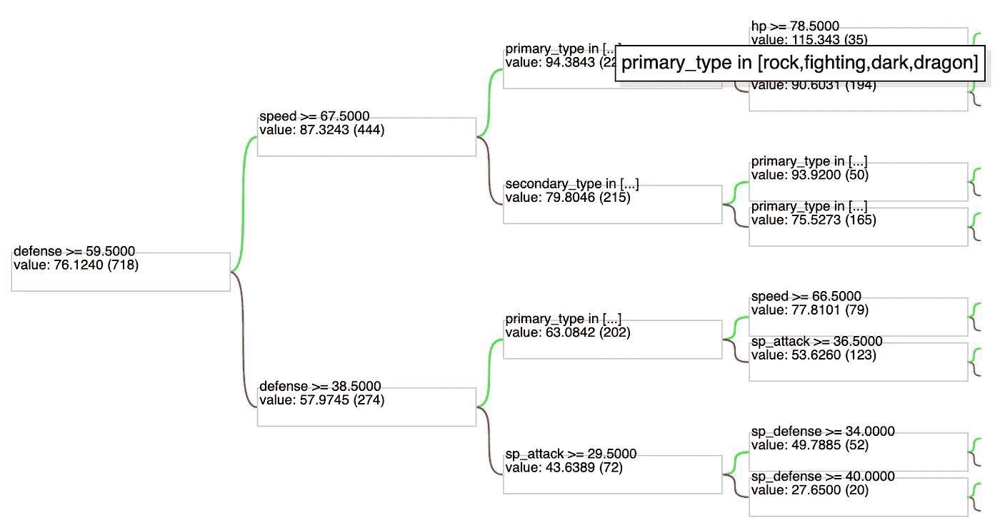
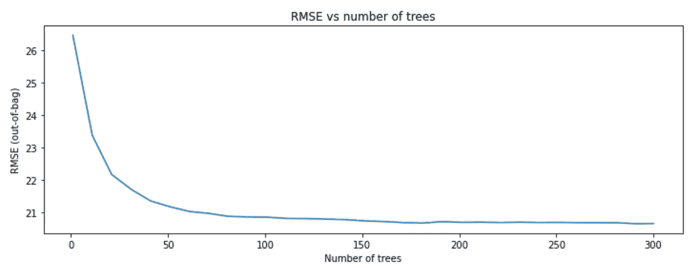

# TensorFlow 决策森林—使用 Keras 训练您最喜欢的基于树的模型

> 原文：<https://towardsdatascience.com/tensorflow-decision-forests-train-your-favorite-tree-based-models-using-keras-875d05a441f?source=collection_archive---------11----------------------->


[维特齐](https://unsplash.com/@veeterzy?utm_source=unsplash&utm_medium=referral&utm_content=creditCopyText)在 [Unsplash](https://unsplash.com/s/photos/forest?utm_source=unsplash&utm_medium=referral&utm_content=creditCopyText) 上拍照

## 是的，你没看错——神经网络和基于树的模型使用相同的 API！

在本文中，我将简要描述什么是决策森林，以及如何使用通常用于神经网络的相同 Keras API 来训练基于树的模型(如随机森林或梯度增强树)。让我们开始吧！

# 什么是决策森林？

我将直奔主题，它不是另一个像 XGBoost、LightGBM 或 CatBoost 这样的花哨算法。**决策树**就是从许多决策树中构建的一系列机器学习算法。这包括许多你最喜欢的，如随机森林和各种口味的梯度增强树。

# 张量流决策森林

到目前为止，机器和深度学习库之间存在明显的分歧。传统的机器学习，用`scikit-learn`。深度学习用 TensorFlow/PyTorch。如果你真的想吹毛求疵，在`scikit-learn`中有一个`neural_network`模块，它包含多层感知器。然而，这更多的是一个有趣的事实，而不是在实践中广泛使用的东西。

结束这个小小的题外话，TensorFlow 决策森林迈出了弥合框架之间差距的第一步。该库的[发行说明](https://blog.tensorflow.org/2021/05/introducing-tensorflow-decision-forests.html)中的以下段落非常简洁地描述了主要思想:

> TF-DF 是用于训练、服务和解释决策森林模型(包括随机森林和梯度提升树)的生产就绪的最先进算法的集合。借助 TensorFlow 和 Keras 的灵活性和可组合性，您现在可以将这些模型用于分类、回归和排名任务。

这听起来很不错，但是为什么要用另一个库来训练相同的模型呢？好问题。在同一个 API 中提供不同类别的模型有一些优点:

*   如果您已经在 TensorFlow 中使用神经网络为某个项目构建了一个架构，现在您可以轻松地用一个完全不同的模型类别进行实验。基于树的模型通常比 NNs 更受青睐(在性能和速度方面)，尤其是在处理结构化表格数据时。
*   您可以使用同一套工具部署各种模型，例如 TensorFlow Serving。
*   您可以使用各种可用于基于树的模型的可解释性工具和技术。
*   使用该库，很容易将神经网络和决策树结合起来，例如，基于树的模型可以使用神经网络的输出。
*   在引擎盖下，TF-DF 是一个包装器，包裹着[ygdrasil 决策森林](http://om/google/yggdrasil-decision-forests)，一个包含许多决策森林算法的 C++框架。
*   模型的 TF-DF 实现不仅可以进行分类和回归，还可以解决排序问题。

# 实践中的决策森林

## 设置

不幸的是，在撰写本文的时候，安装并不像安装和导入库那么简单。截至 2021 年 8 月，无法在 macOS 和 Windows 上安装该库。该库的作者目前正在努力使之成为可能。

同时，使用 TF-DF 最简单的方法是使用 [Google Colab](https://colab.research.google.com) 。我们需要首先安装两个库:`tensorflow_decision_forests`和`wurlitzer`。

注意:如果在 Colab 上安装库有问题，请将 TensorFlow 降级为`tensorflow==2.5.1`。

这样做之后，我们就可以像往常一样导入所需的库了。


迈克尔·里维拉·🇵🇭在 [Unsplash](https://unsplash.com/s/photos/pokemon?utm_source=unsplash&utm_medium=referral&utm_content=creditCopyText) 上拍摄的照片

## 数据

我们将再次使用[神奇宝贝数据集](https://www.kaggle.com/cristobalmitchell/pokedex)。它包含了八代的所有神奇宝贝，包括它们的类型，战斗统计，和一些更多的元信息。[在之前的](/phik-k-get-familiar-with-the-latest-correlation-coefficient-9ba0032b37e7)中，我们已经使用新的相关性指标——𝜙k.探讨了该数据集特征之间的相关性。我们可以按如下方式加载数据。


作者图片

我们只保留一些可能与构建机器学习模型相关的列。至于目标本身，这里有几个选项。我们可以尝试建立一个分类器来识别一个给定的神奇宝贝是否是传奇，或者可能解决一个多类问题来识别给定的神奇宝贝来自哪一代。然而，基于相关性分析，尝试一个回归问题并根据其余的统计数据和信息预测神奇宝贝的`attack`也可能是有趣的。

作为第一步，我们将数据分成训练集和测试集，同时按代分层。

## 训练决策森林模型

TD-DF 的一个非常好且方便的特性是它不需要对数据进行任何预处理。它自动处理数字和分类特征，以及缺失值。我们的数据集在`secondary_type`特性中有缺失值，因为不是所有的神奇宝贝都有两种类型。

为了使用决策森林的模型，我们只需要将熊猫数据帧转换成张量流数据集。在这样做的时候，我们指出哪一列包含目标以及我们正在处理哪种任务。默认是分类，但是对于我们的用例，我们需要切换到回归。

然后，我们实例化了决策森林模型。对于这个例子，我们使用随机森林模型(目前，我们也可以使用梯度增强树或 CART)。我们完成了可选的编译步骤，其中我们添加了一些感兴趣的额外指标——MSE 和 MAPE。然后，我们将模型与训练数据进行拟合。除非另有说明，否则训练将使用数据集中可用的所有特征。

在日志中，我们可以看到一些关于用于训练的特性的有用信息，包括汇总统计、丢失值的百分比等。在日志的后面(为了简洁起见，没有包括)，我们还可以看到用于训练模型的超参数(默认参数)，RMSE(默认度量)在拟合 X 树后如何变化，以及随机得分。


作者图片

## 评估结果

下一步是在测试集上评估拟合模型的性能。为此，我们使用了`evaluate`方法。

什么会返回以下分数:

```
{'loss': 0.0, 'mse': 431.4039611816406, 'mape': 24.62486457824707}
MSE: 431.40
RMSE: 20.77
MAPE: 24.62
```

请注意，如果我们使用`predict`方法创建预测，然后手动计算分数，例如使用`scikit-learn`的函数，结果将是相同的。

注意:我们不会花太多时间来分析模型的性能，因为本文的目标只是展示一个新的库，而不是实现手头任务的最佳性能。

## 解释模型

TF-DF 提供了一些很好的功能来解释模型。在我们拟合一个模型之后，有很多原因可以解释为什么可解释性应该在我们应该分析的事物的顶部。其中一些包括理解模型决策的能力，并可能向利益相关者解释这些决策，或者当我们看到“奇怪”的预测时调试模型。我已经在另一篇文章中广泛讨论了随机森林特性重要性的主题。

我们从随机森林中绘制一个决策树开始。我们可以使用下面的代码片段来做到这一点:



作者图片

我们只绘制了前 3 层，因为`RandomForestModel`的默认设置允许最大深度为 16。非常有趣的是类别被分组在一起。例如，图像顶部的`primary_type`显示了基于 4 个可能组的分割，而不像在`scikit-learn`实现中显示的是单个、一个热码编码的`primary_type`。

对于一个 CART 模型或者检查一个 GBT 模型的第一棵树来说，这样的绘图可能特别有趣。

我们可以更深入地研究特性的重要性，并使用`summary`方法分析模型的结构。然而，输出可能有点多，所以我们将一步一步地访问完全相同的元素。

我们首先检查模型中使用的特性。

```
# inspect the features used in the model
model_rf.make_inspector().features()
```


作者图片

然后，我们前进到特性重要性。TF-DF 提供了几种不同的方法来计算依赖于模型类型的特征重要性。第一个可用于随机森林的是基于`MEAN_MIN_DEPTH`的。树中特征的最小深度对应于节点的深度，该节点分割对该特征的观察，并且最接近树的根。较低的值表示许多观察结果都是基于该特征进行分类的。


作者图片

平均最小深度越小，变量越重要。从上图我们可以看到`HP`(生命值)似乎是最重要的特征，至少在使用这个标准的时候是这样的。

下一个可用的度量是`NUM_AS_ROOT`，它简单地指出了给定特性作为树的根的次数。在这种情况下，越高越好，而`HP`又是最重要的一个。快速的完整性检查显示，在 RF 模型中总共有 300 棵树，这确实是默认的超参数值。


作者图片

最后，还有`NUM_NODES`指标。它显示了给定要素作为节点在树中拆分观测值的次数。自然地，一个特性可以在一个树中多次使用，所以这些并不等于树的总数。使用这个指标，`primary_type`是最重要的特征。


作者图片

我们也可以看一看出袋 RMSE。要获得该值，我们可以使用下面的代码片段:

```
# get the out-of-bag score
model_rf.make_inspector().evaluation()
```

什么会返回以下内容:

```
Evaluation(num_examples=718, accuracy=None, loss=None, rmse=20.664861230679822, ndcg=None, aucs=None)
```

最后，我们还可以深入一点，看看 RMSE 是如何随着训练的树的数量而进化的。为此，我们需要访问培训日志，同样使用`make_inspector`方法。



作者图片

从上面的图片中我们可以看到，大约 100 棵树后，分数稳定下来。

一般来说，训练日志显示了模型的质量，因为模型不断地生长树。我们可以使用这些信息来评估模型大小和模型质量之间的平衡。

在`summary`方法的输出中有更多可用的信息，我强烈建议尝试一下。

# TensorFlow 与 scikit-learn

TensorFlow 决定森林将取代好的，旧的`scikit-learn`？大概不会。支持这种说法的主要原因是:

*   不像`scikit-learn`那么直白，
*   用于调整模型的现成功能较少(考虑网格搜索)，
*   文档远没有那么全面，
*   到目前为止，还没有那么多可用的模型(在[ygdrasil 决策森林](http://om/google/yggdrasil-decision-forests)中有更多可用的，可能很快就会添加)。

我想说，对于那些已经在 TensorFlow 中建立了一个项目，并且希望轻松地将他们当前的神经网络解决方案与完全不同类别的模型进行比较的人来说，决策森林将非常有用。然后，他们可以使用新的库轻松地做到这一点，同时保持他们的整个体系结构几乎相同。

# 外卖食品

*   决策森林是由许多决策树构建而成的算法家族，
*   张量流决策森林允许我们使用熟悉的张量流 API 来训练随机森林或梯度增强树，
*   虽然这个库中提供了很多功能，但是抛弃`scikit-learn`来支持新的库可能还不够。对于那些已经为某个项目建立了 TensorFlow 架构的人来说，这更多的是一个额外的机会。

您可以在我的 [GitHub](https://github.com/erykml/medium_articles/blob/master/Machine%20Learning/decision_forests.ipynb) 上找到本文使用的代码。此外，欢迎任何建设性的反馈。你可以在[推特](https://twitter.com/erykml1?source=post_page---------------------------)或评论中联系我。

喜欢这篇文章吗？成为一个媒介成员，通过无限制的阅读继续学习。如果你使用[这个链接](https://eryk-lewinson.medium.com/membership)成为会员，你将支持我，而不需要额外的费用。提前感谢，再见！

您可能还会对以下内容感兴趣:

[](/phik-k-get-familiar-with-the-latest-correlation-coefficient-9ba0032b37e7) [## 菲克(𝜙k)——熟悉最新的相关系数

### 这在分类变量、序数变量和区间变量之间也是一致的！

towardsdatascience.com](/phik-k-get-familiar-with-the-latest-correlation-coefficient-9ba0032b37e7) [](/9-useful-pandas-methods-you-probably-have-not-heard-about-28ff6c0bceee) [## 你可能没听说过的 9 种有用的熊猫方法

### 它们可以让你的日常工作更容易、更快捷。

towardsdatascience.com](/9-useful-pandas-methods-you-probably-have-not-heard-about-28ff6c0bceee) [](/chefboost-an-alternative-python-library-for-tree-based-models-f46af028a348) [## chef boost——基于树的模型的替代 Python 库

### 与 scikit-learn 的主要区别概述

towardsdatascience.com](/chefboost-an-alternative-python-library-for-tree-based-models-f46af028a348) 

# 参考

*   [https://www.youtube.com/watch?v=5qgk9QJ4rdQ](https://www.youtube.com/watch?v=5qgk9QJ4rdQ)
*   [https://blog . tensor flow . org/2021/05/introducing-tensor flow-decision-forests . html](https://blog.tensorflow.org/2021/05/introducing-tensorflow-decision-forests.html)
*   [https://github.com/tensorflow/decision-forests](https://github.com/tensorflow/decision-forests)