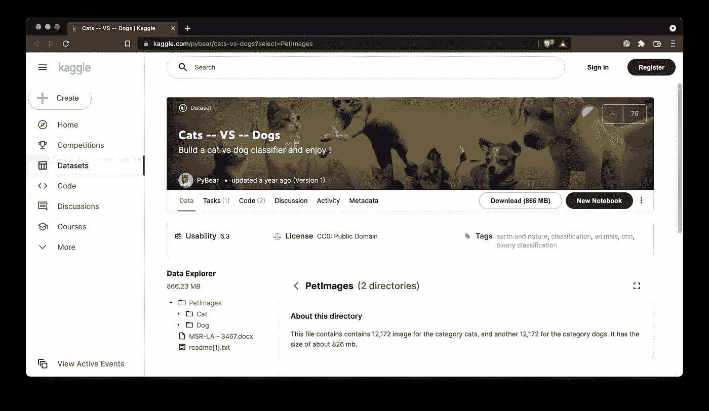
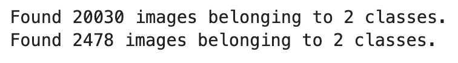
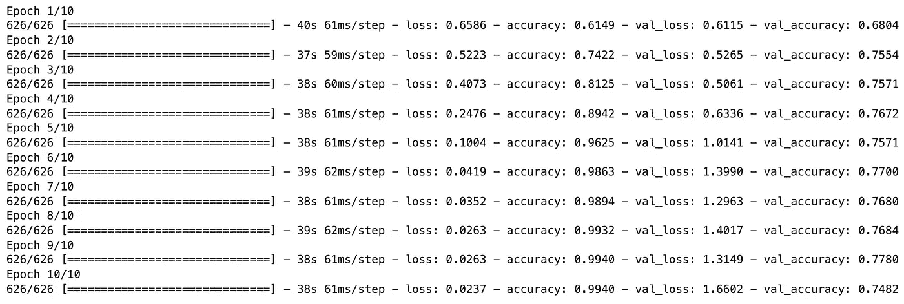
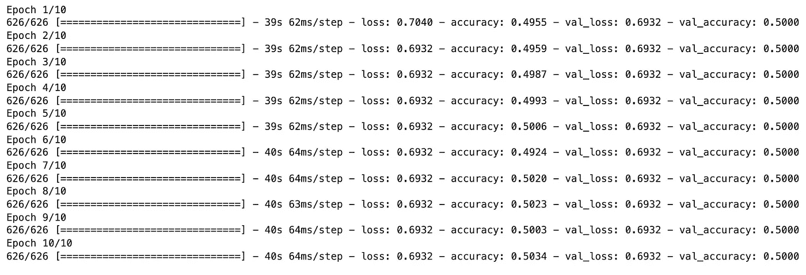
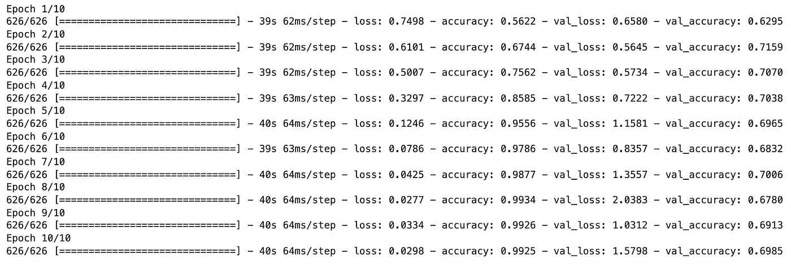

# 用于计算机视觉的 TensorFlow 更复杂的架构能保证更好的模型吗？

> 原文：<https://towardsdatascience.com/tensorflow-for-computer-vision-does-a-more-complex-architecture-guarantee-a-better-model-2bce4ba15928?source=collection_archive---------23----------------------->

## 你的模型架构可能是好的。就是数据质量烂。

Sebastian Kanczok 在 [Unsplash](https://unsplash.com/s/photos/computer-science?utm_source=unsplash&utm_medium=referral&utm_content=creditCopyText) 上的照片

你在[之前的文章](/tensorflow-for-computer-vision-how-to-train-image-classifier-with-convolutional-neural-networks-77f2fd6ed152)中看到了如何用卷积网络训练一个基本的图像分类器。我们不费吹灰之力就获得了约 75%的准确率——只需使用两个卷积层和两个池层，然后是一个全连接层。

那是我们能做的最好的吗？多加几层值得吗？当模型变得太复杂时，会发生什么？这些问题你会在今天的文章中找到答案。我们将添加多个卷积块，看看我们的狗与猫数据集可以处理多少。

不想看书？请观看我的视频:

你可以在 [GitHub](https://github.com/better-data-science/TensorFlow) 上下载源代码。

# 使用的数据集和数据预处理

我们将使用 Kaggle 的[狗与猫数据集](https://www.kaggle.com/pybear/cats-vs-dogs?select=PetImages)。它根据知识共享许可协议获得许可，这意味着您可以免费使用它:

*图片 1——狗和猫的数据集(图片由作者提供)*

数据集相当大-25，000 张图像均匀分布在各个类别之间(12，500 张狗图像和 12，500 张猫图像)。它应该足够大，可以训练一个像样的图像分类器。唯一的问题是——它不是为开箱即用的深度学习而构建的。您可以按照我以前的文章创建一个合适的目录结构，并将其分为训练集、测试集和验证集:

</tensorflow-for-image-classification-top-3-prerequisites-for-deep-learning-projects-34c549c89e42>  

您还应该删除 *train/cat/666.jpg* 和 *train/dog/11702.jpg* 图像，因为它们已损坏，您的模型将无法使用它们进行训练。

接下来让我们看看如何用 TensorFlow 加载图像。

# 如何用 TensorFlow 加载图像数据

您今天将看到的模型将比以前文章中的模型有更多的层。出于可读性的考虑，我们将从 TensorFlow 导入单独的类。如果你要跟进，确保有一个带 GPU 的系统，或者至少使用[谷歌实验室](/google-colab-how-does-it-compare-to-a-gpu-enabled-laptop-851c1e0a2ca9)。

让我们把库导入放在一边:

很多，但是模特会因此看起来格外干净。

我们现在像往常一样加载图像数据——用`ImageDataGenerator`类。我们将把图像矩阵转换到 0–1 的范围，并用三个颜色通道将所有图像的大小调整为 224x224。考虑到内存问题，我们将把批处理大小降低到 32:

下面是您应该看到的输出:

*图像 2 —训练和验证文件夹中的图像数量*

这就是我们所需要的—让我们来破解第一个模型吧！

# 向张量流模型添加层有什么不同吗？

从头开始编写卷积模型总是一项棘手的任务。[网格搜索](/how-to-find-optimal-neural-network-architecture-with-tensorflow-the-easy-way-50575a03d060)最佳架构是不可行的，因为卷积模型需要很长时间来训练，并且有太多移动部件需要检查。实际上，你更有可能使用*迁移学习*。这是我们将在不久的将来探讨的话题。

今天，它是关于理解为什么用模型架构做大是不值得的。我们通过一个简单的模型获得了 75%的准确率，因此这是我们必须超越的基准:

</tensorflow-for-computer-vision-how-to-train-image-classifier-with-convolutional-neural-networks-77f2fd6ed152>  

## 模型 1 —两个卷积模块

我们将宣布第一个模型有点类似于 VGG 架构——两个卷积层后接一个池层。我们不会因为过滤器的数量而疯狂——第一个模块 32 个，第二个模块 64 个。

至于损失和优化器，我们将坚持使用基础知识—分类交叉熵和 Adam。数据集中的类完全平衡，这意味着我们可以只跟踪精度:

以下是 10 个时期后的训练结果:

*图片 3 —第一个模型的训练日志(图片由作者提供)*

看起来我们并没有超过基线，因为验证准确率仍然在 75%左右。如果我们再增加一个卷积块，会发生什么？

## 模型 2 —三个卷积模块

我们将保持模型架构不变，唯一的区别是增加了一个具有 128 个滤波器的卷积模块:

以下是日志:

*图片 4 —第二个模型的训练日志(图片由作者提供)*

哎呀。这个模型完全卡住了。你可以玩弄批量和学习率，但你可能不会走远。第一个体系结构在我们的数据集上效果更好，所以让我们试着调整一下。

## 模型 3 —两个丢失的卷积块

第三种模式的架构与第一种完全相同，唯一的区别是增加了一个全连接层和一个脱落层。让我们看看它是否有所不同:

以下是培训日志:

*图像 5-第三模型训练日志(作者图像)*

太可怕了，我们现在低于 70%！。当你专注于错误的事情时，就会发生这种情况。[上一篇文章](/tensorflow-for-computer-vision-how-to-train-image-classifier-with-convolutional-neural-networks-77f2fd6ed152)中的简单建筑非常好。数据质量的问题限制了模型的预测能力。

# 结论

这就证明了更复杂的模型体系结构不一定会产生更好的模型。也许你能找到一个更适合狗和猫数据集的架构，但这很可能是徒劳的。

您应该将重点转移到提高数据集质量上。当然，有 20K 个训练图像，但我们仍然可以增加多样性。这就是**数据增强**派上用场的地方，你会在下面的文章中了解到这一切。在这之后，您将通过**转移学习**将您的模型带到一个新的高度，这将使手工调整卷积模型看起来像一件愚蠢的事情。

请继续关注即将发表的文章，这两篇文章都是现代数据科学家的必读之作。

*喜欢这篇文章吗？成为* [*中等会员*](https://medium.com/@radecicdario/membership) *无限制地继续学习。如果您使用以下链接，我将收到您部分会员费，您无需支付额外费用。*

<https://medium.com/@radecicdario/membership>  

# 保持联系

*   注册我的[时事通讯](https://mailchi.mp/46a3d2989d9b/bdssubscribe)
*   在 [YouTube](https://www.youtube.com/c/BetterDataScience) 上订阅
*   在[领英](https://www.linkedin.com/in/darioradecic/)上连接