# 面向计算机视觉的张量流——如何在 Python 中从头开始实现卷积

> 原文：<https://towardsdatascience.com/tensorflow-for-computer-vision-how-to-implement-convolutions-from-scratch-in-python-609158c24f82?source=collection_archive---------0----------------------->

## 你需要 10 分钟来实现 Numpy 中的填充卷积

奥其尔-额尔德尼·奥云梅格在 [Unsplash](https://unsplash.com/s/photos/cute-robot?utm_source=unsplash&utm_medium=referral&utm_content=creditCopyText) 拍摄的照片

卷积网络很有趣。你上周看到了与普通人工神经网络相比，它们如何提高模型性能。但是卷积对图像的实际影响是什么呢？这就是你今天要学的。

看完之后，你就知道如何用 Numpy 从头开始写你的卷积函数了。您将对图像应用模糊、锐化和轮廓等滤镜，还将学习*填充*在卷积层中的作用。

工作量很大，我们一切都是从零开始。让我们开始吧。

不想看书？请观看我的视频:

你可以在 [GitHub](https://github.com/better-data-science/TensorFlow) 上下载源代码。

# 卷积是如何工作的

卷积神经网络是一种用于图像分类的特殊类型的神经网络。任何卷积神经网络的核心都是卷积，这是一种高度专业化的检测图像模式的操作。

卷积层要求您指定过滤器(内核)的数量。把这些想象成一些模式检测器。早期的卷积层检测基本模式，如边缘、拐角等。根据数据集，在后面的卷积层检测特殊模式，如狗耳朵或猫爪。

单个过滤器只是一个小矩阵(通常是矩形)。决定行数和列数是您的任务，但是 3x3 或 5x5 是很好的起点。滤波器矩阵内的值是随机初始化的。神经网络的任务是在给定特定数据集的情况下，学习滤波器矩阵的最佳值。

让我们来看一个实际的卷积运算。我们有一个 5x5 的图像和一个 3x3 的滤镜。该过滤器在图像中的每 3x3 组像素上滑动(卷积),并计算逐元素乘法。然后对乘法结果求和:

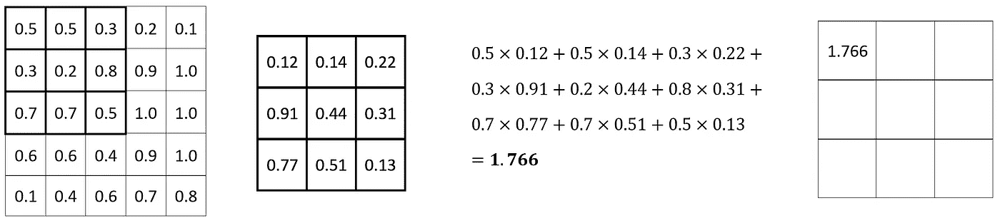

图片 1-卷积运算(1)(图片由作者提供)

对每组 3×3 像素重复该过程。以下是对以下集合的计算:

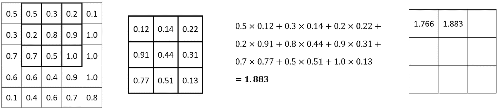

图片 2 —卷积运算(2)(图片由作者提供)

它继续下去，直到达到最后一组 3×3 像素:

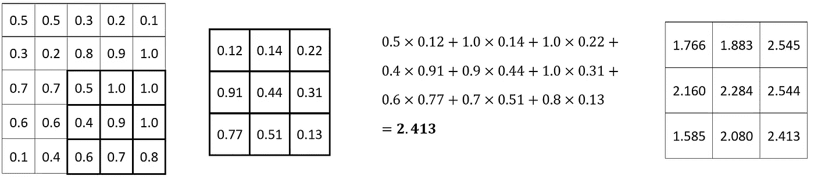

图片 3-卷积运算(3)(图片由作者提供)

简而言之，这是一个卷积！卷积层对于寻找最佳滤波器矩阵是有用的，但是卷积本身仅将滤波器应用于图像。对于不同的图像操作，如模糊和锐化，有大量众所周知的滤波器矩阵。接下来让我们看看如何与他们合作。

# 数据集和图像加载

在本文的其余部分，我们将使用 Kaggle 的[狗和猫的数据集](https://www.kaggle.com/pybear/cats-vs-dogs?select=PetImages)。它是在知识共享许可下授权的，这意味着你可以免费使用它。在[以前的文章](/tensorflow-for-image-classification-top-3-prerequisites-for-deep-learning-projects-34c549c89e42)中有一篇描述了如何预处理它，所以如果你想在相同的图像上继续的话，一定要复制代码。

这不是必要条件，因为您可以对任何图像应用卷积。说真的，从网上下载任何图片，它会为你今天服务得很好。

让我们把库导入放在一边。你需要 Numpy 来计算，需要 PIL 和 Matplotlib 来显示图像:

从这里开始，让我们也声明两个显示图像的函数。第一个绘制一个图像，第二个并排绘制两个图像(1 行 2 列):

现在，您可以加载并显示图像。为了简单起见，我们将它灰度化，并调整为 224x224。这些变换都不是强制性的，但它们使我们的工作变得更容易，因为只有一个颜色通道可以应用卷积:

图片 4 —来自训练集的随机猫图片(图片由作者提供)

这就解决了无聊的事情。我们将所有的卷积过滤器应用到上面的图像。但首先，让我们声明几个过滤器矩阵。

# 声明卷积过滤器

神经网络中卷积层的任务是找到 N 个能够最好地从图像中提取特征的滤波器。你知道有已知的过滤器来做不同的图像操作吗？

嗯，确实有——比如一个用于锐化、模糊和勾勒轮廓的滤镜。我已经从 [setosa.io 网站](https://setosa.io/ev/image-kernels/)复制了过滤器矩阵值，我强烈建议你查看一下，以便更深入地了解。

总之，所有提到的过滤器都是 3x3 矩阵。复制以下代码，将它们存储到变量中:

简单吧？这就是单个过滤器的全部内容。接下来让我们从头开始写一个卷积，并将它们应用到我们的图像中。

# 从头开始实现卷积

对图像应用卷积会使图像变小(假设没有填充)。小多少取决于过滤器的大小。我们所有的都是 3x3 的，但是你可以更大一些。

在图像上滑动或卷积一个 3x3 的过滤器意味着我们将在所有边上丢失一个像素(总共 2 个)。例如，在 224x224 图像上滑动 3x3 滤镜会产生 222x222 图像。同样，在同一幅图像上滑动 5x5 的滤镜会得到 220x220 的图像。

我们将声明一个辅助函数来计算应用卷积后的图像大小。这没什么特别的，但会让我们的生活变得轻松一点。它基本上计算多少个*窗口*的过滤器大小，你可以适应一个图像(假设正方形图像):

这是几个测试的结果:

*   图像尺寸:224，滤镜尺寸:3
*   图像尺寸:224，过滤器尺寸:5

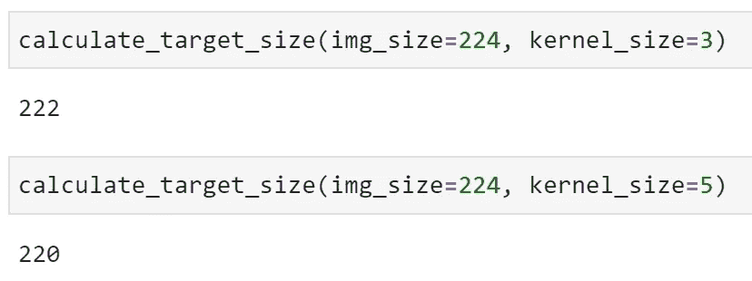

图 5 —使用不同的过滤器尺寸计算目标图像尺寸(图片由作者提供)

像宣传的那样工作。接下来让我们研究一个卷积函数。以下是 3x3 滤镜对单个 3x3 图像子集的作用:

1.  将其提取到单独的矩阵中
2.  在图像子集和过滤器之间进行逐元素乘法
3.  对结果求和

下面是一个 3×3 像素子集的代码实现:

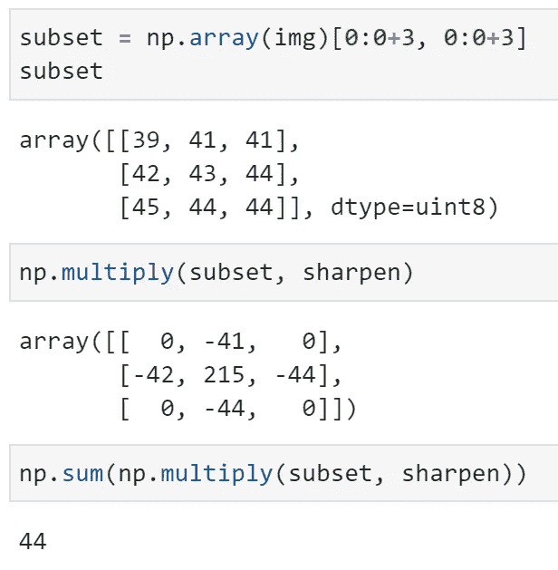

图像 6 —单个 3x3 图像子集上的卷积(图像由作者提供)

这很简单，但是你如何将这种逻辑应用到整个图像中呢？很容易。`convolve()`函数计算目标尺寸并创建具有该形状的零矩阵，遍历图像矩阵的所有行和列，对其进行子集化，并应用卷积。用一句话来说，听起来很多，但是代码应该不会让您太头疼:

让我们测试一下。以下代码片段将**锐化**滤镜应用于我们的图像:

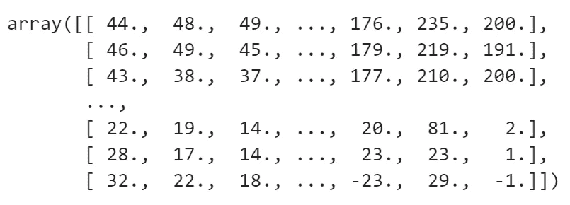

图 7 —以矩阵表示的清晰图像(作者提供的图像)

您可以使用`plot_two_images()`功能来显示变换前后的猫图像:

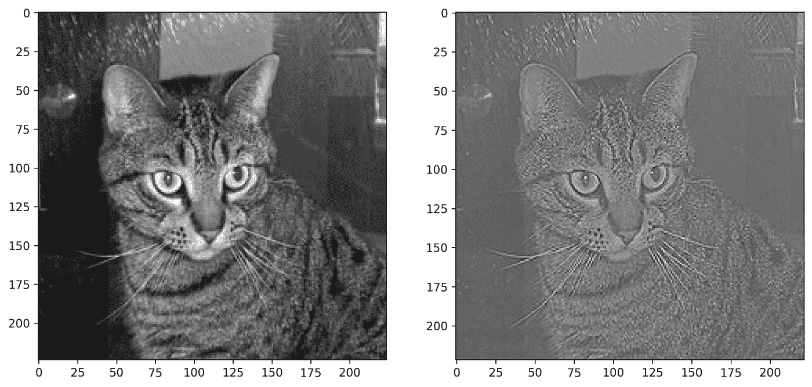

图 8-锐化前后的猫图像(图片由作者提供)

因为右图中的值不在 0 到 255 之间，所以颜色有点偏离。这不是一个大问题，但是您可以通过用零替换所有负值来“修复”它:

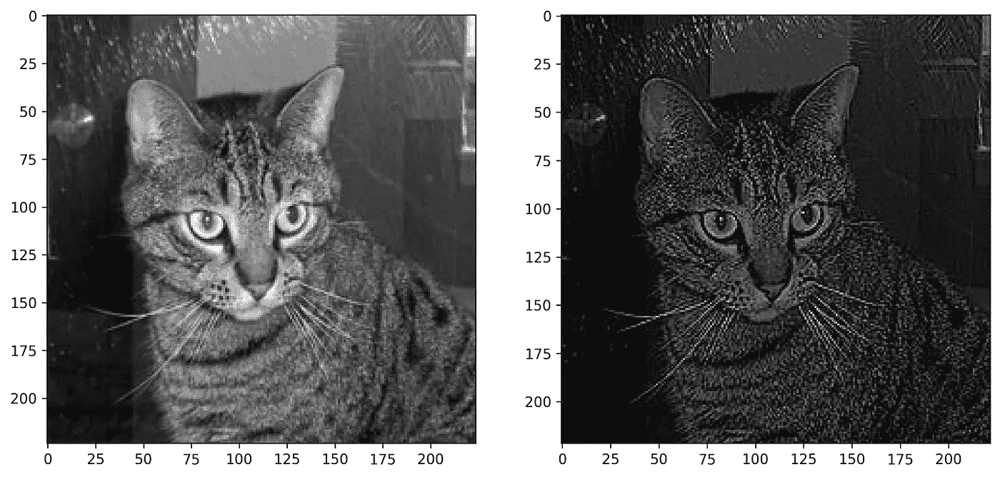

图 9-锐化前后的猫图像(2)(图片由作者提供)

右边的图像看起来很清晰，这一点毋庸置疑。让我们看看**模糊**接下来做什么:

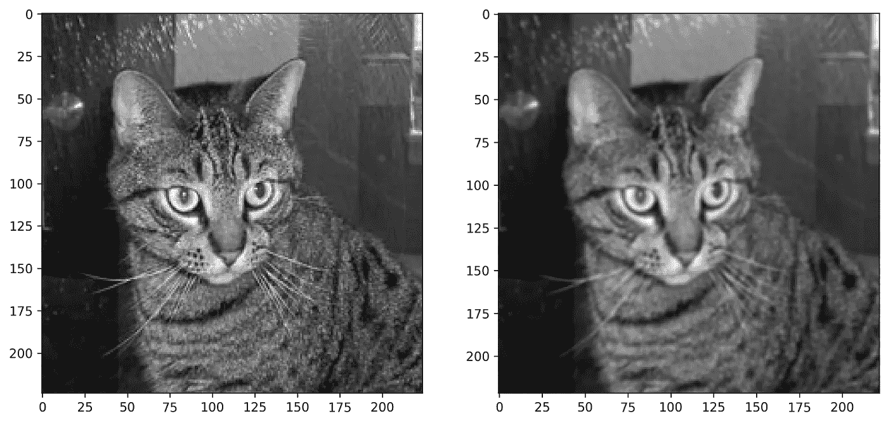

图 10-模糊前后的猫图像(图片由作者提供)

模糊滤镜矩阵没有负值，所以颜色是一样的。再一次，没有争论——模糊过滤器像广告宣传的那样起作用了。

最后，让我们看看**轮廓**滤镜将对我们的图像做什么:

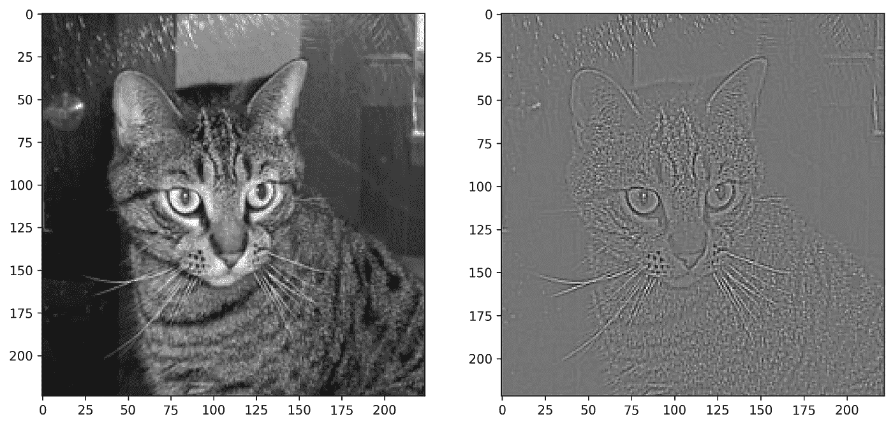

图 11-概述前后的猫图像(作者提供的图像)

它还存在着色问题，因为矩阵中的值大多是负值。使用`negative_to_zero()`获得更清晰的想法:

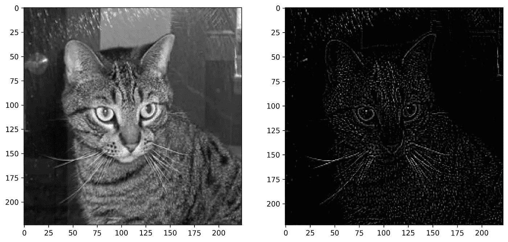

图 12-概述前后的猫图像(2)(图片由作者提供)

你知道唯一的问题是什么吗？卷积图像的形状为 222×222 像素。如果想保持 224x224 像素的原始尺寸怎么办？这就是填充发挥作用的地方。

# 从头开始用填充实现卷积

TensorFlow 的`Conv2D`层允许您为`padding`参数指定`valid`或`same`。第一种(默认)在应用卷积运算之前不添加任何填充。这基本上就是我们在上一节中介绍的内容。

第二种方法根据滤波器大小添加填充，因此源图像和卷积图像具有相同的形状。

填充实际上是图像周围的“黑色”边框。它是黑色的，因为值是零，零代表黑色。黑色边框对计算没有任何副作用，因为它只是与零相乘。

在编写任何代码之前，让我们对这个概念有一个直观的理解。下图显示了当滤镜 K 应用于图像 X 时，图像 X 会发生什么变化。基本上是从 5x5 到 3x3 (Y):

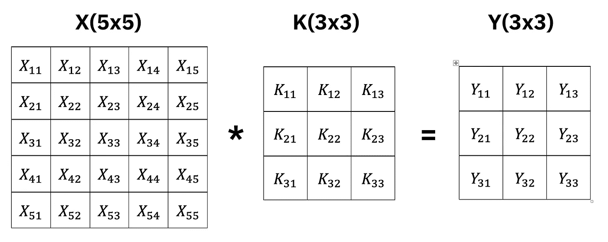

图 13 —对没有填充的图像应用卷积(作者提供的图像)

添加像素宽度的填充会产生 7x7 像素的输入图像(X ),以及 5x5 像素的结果图像(Y ):

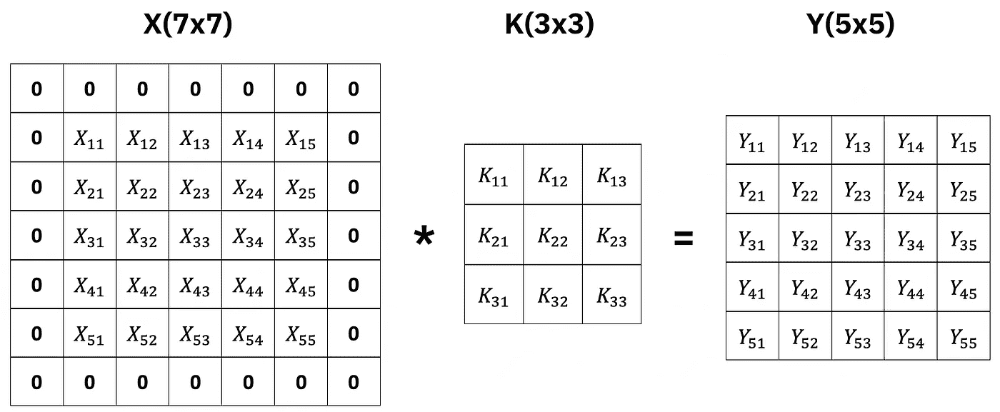

图像 14 —将卷积应用于带有填充的图像(作者提供的图像)

第二个图像中的 Y 与第一个图像中的 X 具有相同的像素数，这正是我们想要的。卷积运算不得不*从图像中取*一些像素，这些最好为零。

在现实世界中，边缘上的像素通常不包含重要的模式，因此丢失它们并不是世界上最糟糕的事情。

开始编码。首先，让我们声明一个函数，它根据内核大小返回单侧填充图像所需的像素数。这只是一个整数除以 2:

下面是内核大小为 3 和 5 的几个例子:

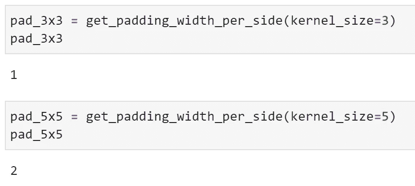

图 15 —计算不同内核大小的填充(图片由作者提供)

这没什么大不了的。我们现在将编写一个函数，为图像添加填充。首先，该函数声明了一个形状为`image.shape + padding * 2`的零矩阵。我们将填充乘以 2，因为我们在所有边上都需要它。然后，该函数对矩阵进行索引，因此填充被忽略，并用实际图像值更改零:

让我们通过为 3x3 过滤器的图像添加填充来测试它:

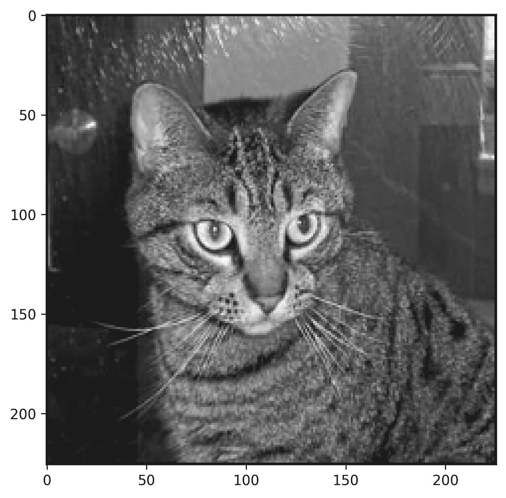

图像 16 —带有像素宽度填充的图像(作者提供的图像)

如果你放大到足够近，你可以看到黑色的边框。如果你想知道，这个图像有一个 226x226 像素的形状。以下是它以矩阵形式显示时的样子:

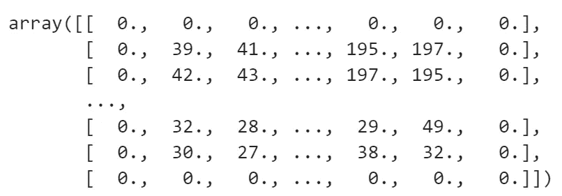

图 17 —以矩阵形式显示的单像素填充图像(图片由作者提供)

你可以看到原始图像被零包围，这就是我们想要的。让我们看看 5x5 内核是否也是如此:

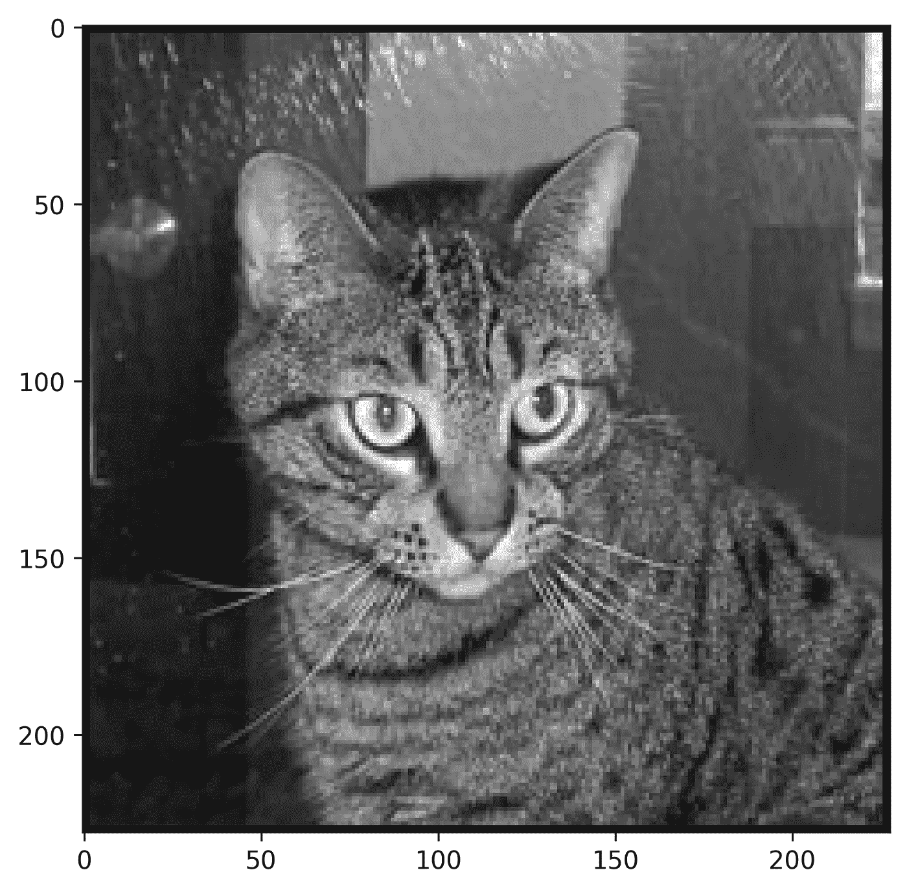

图像 18 —带有两个像素宽填充的图像(作者提供的图像)

现在你可以清楚地看到这张 228x228 的图片上的黑色边框。让我们看看它打印成矩阵后的样子:

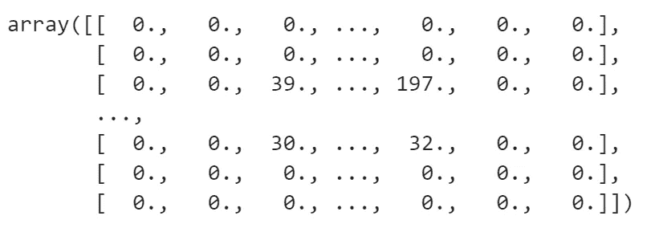

图 19 —以矩阵形式显示的两像素填充图像(图片由作者提供)

它看起来应该是这样的——两边都有两个像素填充。让我们对我们的单像素填充图像应用锐化滤镜，看看是否有任何问题:

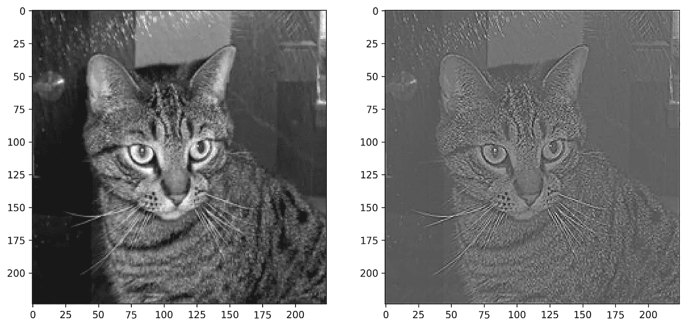

图像 20 —应用锐化滤镜前后的填充图像(作者提供的图像)

工作没有任何问题。卷积图像的形状为 224x224 像素，这正是我们想要的。

简而言之就是卷积和填充。我们今天讲了很多，接下来让我们简单回顾一下。

# 结论

回旋比听起来容易。整个事情可以归结为在整个图像上滑动滤镜。如果你抛开所有的矩阵术语，它会简化成小学数学——乘法和加法。没什么特别的事。

我们可以通过引入**步长**使事情变得更加复杂——但是这些对于卷积和池来说都是常见的。我将把它们留到下一篇文章中，这篇文章将讨论池化——一种通常遵循卷积层的精简操作。

敬请期待。我会在下周的前半周发布。

*喜欢这篇文章吗？成为* [*中等会员*](https://medium.com/@radecicdario/membership) *继续无限制学习。如果你使用下面的链接，我会收到你的一部分会员费，不需要你额外付费。*

<https://medium.com/@radecicdario/membership>  

# 保持联系

*   注册我的[简讯](https://mailchi.mp/46a3d2989d9b/bdssubscribe)
*   订阅 [YouTube](https://www.youtube.com/c/BetterDataScience)
*   在 [LinkedIn](https://www.linkedin.com/in/darioradecic/) 上连接