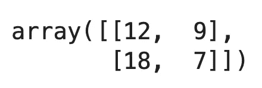

# 面向计算机视觉的 TensorFlow 如何在 Python 中从头开始实现池化

> 原文：<https://towardsdatascience.com/tensorflow-for-computer-vision-how-to-implement-pooling-from-scratch-in-python-379cd7717de9?source=collection_archive---------12----------------------->

## 您将需要 10 分钟来用 Python 和 Numpy 实现池化

杰姆·萨哈冈在 [Unsplash](https://unsplash.com/s/photos/robot?utm_source=unsplash&utm_medium=referral&utm_content=creditCopyText) 上的照片

[之前的 TensorFlow 文章](/tensorflow-for-computer-vision-how-to-implement-convolutions-from-scratch-in-python-609158c24f82)向您展示了如何在 Numpy 中从头开始编写卷积。现在是讨论池化的时候了，池化是一种通常遵循卷积层的缩减操作。你想知道一个秘密吗？从零开始实施并不是火箭科学。

看完之后，你就会知道什么是池化和大步，以及如何在 Numpy 中从头开始写。你会先有一个直观的认识，然后在 Python 中应用。完成后，您将对真实图像应用池化，并将结果与 TensorFlow 的池化图层进行比较，以查看我们是否做错了什么。剧透:我们没有。

您今天将看到的代码并没有针对速度进行优化，而是为了最大程度地提高可读性和易于理解。

不想看书？请观看我的视频:

# 池的工作原理

汇集操作通常遵循卷积层。它的任务是通过保留相关的内容并丢弃其余的内容来降低来自卷积层的结果的维度。

过程很简单——定义一个 *n x n* 区域和步幅大小。该区域代表一个在图像上滑动的小矩阵，并与单个池一起工作。一个*池*只是卷积输出上的一个小矩阵的一个花哨的词，最常见的是，最大值被保存在其中。*区域大小的一个好的起始值是 2x2* 。

步幅表示区域在完成一步后向右移动的像素数。当该区域到达第一行块的末尾时，它向下移动一个步长，并重复该过程。*步幅的一个好的起始值是 2* 。选择小于 2 的步幅没有多大意义，您很快就会看到这一点。

最常见的池类型是*最大池*，这意味着只保留一个区域的最高值。你有时会遇到*平均池*，但不会经常遇到。Max pooling 是一个很好的起点，因为它保留了最活跃的像素(具有最高值的像素)并丢弃了其余的像素。另一方面，求平均值会使值变得均匀。大多数时候你都不想这样。

在我们讨论池如何工作的时候，让我们看看当您对一个小的 4x4 矩阵应用 max pooling 时会发生什么。我们将使用 2x2 的区域大小和 1:

*图片 1 —区域大小为 2x2、步长大小为 1 的最大池(图片由作者提供)*

从输入矩阵中提取了总共 9 个池，并且仅保留每个池中的最大值。结果，池在高度和宽度上减少了一个像素的维度。这就是为什么选择小于 2 的步幅是没有意义的，因为池只是减少了维度。

让我们再次应用池化操作，但这次步长为 2 个像素:

*图 2 —区域大小为 2x2、步长大小为 2 的最大池(图片由作者提供)*

好多了——我们现在只有四个池可以使用，并且去掉了一半的高度和宽度像素。

接下来，让我们看看如何在 Python 中从头开始实现池逻辑。

# Python 和 Numpy 中从头开始的 MaxPooling

现在有趣的部分开始了。让我们从导入 Numpy 并声明上一节中的矩阵开始:

*图 3——虚拟卷积输出矩阵(图片由作者提供)*

为了便于理解，我将把这一部分分成两部分。第一个展示了如何从矩阵中提取池。

## 从矩阵中提取池

首先，您必须选择两个参数的值— *池大小、*和*步幅大小*。您已经知道它们代表什么，我们将分别坚持使用 2x2 和 2 这两个常用值。要提取单个池，您必须:

*   以步长 2 迭代所有行。
*   以步长 2 迭代所有列。
*   通过对输入矩阵进行切片来获得单个池。
*   确保它具有正确的形状，在我们的例子中是 2x2。

在代码中，它归结为以下内容:

*图片 4 —提取的池大小为 2x2、步幅大小为 2 的池(图片由作者提供)*

很简单，对吧？总共有四个池，就像我们在上一节中一样。让我们看看，如果我们将步幅减小到 1，而其他一切保持不变，会发生什么:

*图片 5 —提取的池大小为 2x2、步幅大小为 1 的池(图片由作者提供)*

正如所料，我们这里有九个游泳池。我们的池逻辑有效！接下来让我们把它包装成一个函数:

并做最后的测试来再次检查:

*图片 6 —测试 get_pools()函数(图片由作者提供)*

已经证实——我们的功能如预期那样工作。问题仍然存在——我们现在如何实现最大池算法？

## 从头开始实施最大池

那么，我们现在必须从每个池中取最大值吗？嗯，比那要复杂一点。以下是您需要执行的任务列表:

*   获取池的总数—这只是我们的池阵列的长度。
*   执行合并操作后，计算目标形状-图像大小。它是以整数形式转换的池数量的平方根来计算的。例如，如果池的数量是 16，我们需要一个 4x4 的矩阵—16 的平方根是 4。
*   遍历所有池，获取最大值并将其添加到列表中。
*   以调整到目标大小的 Numpy 数组的形式返回列表。

听起来很多，但归结起来只有 7 行代码(不包括注释):

好了，让我们在四个池的阵列上测试一下:

*图片 7 —最大汇集结果(作者图片)*

非常管用！接下来让我们在一个真实的图像上测试我们的函数，看看是否有什么问题。

# 在真实图像上从头开始最大化池

首先，导入 PIL 和 Matplotlib 以方便图像可视化。我们还将声明两个显示图像的函数——第一个显示一个图像，第二个并排显示两个图像:

在本文的其余部分，我们将使用来自 Kaggle 的[狗和猫的数据集](https://www.kaggle.com/pybear/cats-vs-dogs?select=PetImages)。它是在知识共享许可下授权的，这意味着你可以免费使用它。在[之前的文章](/tensorflow-for-image-classification-top-3-prerequisites-for-deep-learning-projects-34c549c89e42)中有一篇描述了如何对其进行预处理，所以如果你想在相同的图像上跟随，一定要复制代码。

这不是必要条件，因为您可以将池应用于任何图像。说真的，从网上下载任何图片，它会为你今天服务得很好。实际上，池化几乎总是遵循卷积层，但是我们将把它直接应用于图像，以使事情变得非常简单。

下面的代码片段从训练集中加载一个样本猫图像，对其进行灰度化，并将其大小调整为 224x224 像素。转换不是强制性的，但会使我们的工作更容易，因为只有一个颜色通道可以应用池化:

*图片 8 —来自训练集的随机猫图片(图片由作者提供)*

我们现在可以提取单个池。记得首先将图像转换成 Numpy 数组。我们将保持池大小和步幅大小参数为 2:

*图片 9——从猫图片中提取的个体池(图片由作者提供)*

让我们看看总共有多少个池:

*图 10 —单个水池的数量及其形状*

我们总共有 12，544 个池，每个池都是一个小的 2x2 矩阵。这个形状很有意义，因为 12，544 的平方根是 112。简而言之，我们的 cat 图像在池化操作之后的大小将是 112x112 像素。

除了应用最大池外，没有什么可做的了:

*图片 11 —最大汇集后的矩阵格式的猫图片(图片由作者提供)*

我们稍后将显示合并的图像，但让我们先验证形状确实是 112x112 像素:

*图片 12——汇集的猫图像的形状(图片由作者提供)*

一切看起来都没问题，所以让我们并排显示合并前后的猫图像:

*图 13 —最大共用前后的猫图像(作者提供的图像)*

请记住，右边的图像与左边的图像以相同的尺寸显示，尽管它要小一些。检查两幅图像的 X 轴和 Y 轴标签以进行验证。

总结一下 max pooling 操作大幅减少了像素的数量，但是我们还是可以很容易的把它归为一只猫。减少卷积层中的像素数量将减少网络中的参数数量，从而减少模型复杂性和训练时间。

还有一个问题需要回答— **我们如何知道我们做的一切都是正确的？**下面一节回答的就是这个。

# 验证 TensorFlow 的最大池化

您可以将 TensorFlow 的 max pooling 图层直接应用于图像，而无需先训练模型。这是检验我们在前面的章节中是否做对了所有事情的最好方法。首先，导入 TensorFlow 并声明仅具有单个最大池层的顺序模型:

在通过模型之前，你必须重塑猫的形象。TensorFlow 需要一个四维输入，因此除了图像的高度和宽度之外，您还需要添加两个额外的维度:

*图片 14 — TensorFlow 批准的图片形状(图片由作者提供)*

现在有趣的部分来了——你可以使用 TensorFlow 的`predict()`功能，而无需先训练模型。只需传入单个图像，并将结果重新整形为 112x112 的矩阵:

*图 15 —使用 TensorFlow 应用最大池后的猫图像(图片由作者提供)*

矩阵看起来很熟悉，但我们不要急于下结论。您可以使用 Numpy 的`array_equal()`函数来测试两个数组中的所有元素是否都相同。下面的代码片段使用它来比较我们的从头开始池化结果和 TensorFlow 的输出:

*图 16 —检查数组相等性(作者提供的图片)*

谁能说得清——合用毕竟不是一个黑盒子。输出是相同的，这意味着我们从头开始的实现是完全有效的。这是否意味着你应该在日常的计算机视觉任务中使用它？绝对不是，而且有一个很好的理由。

# 结论

您现在知道如何在 Python 和 Numpy 中从头开始实现[卷积](/tensorflow-for-computer-vision-how-to-implement-convolutions-from-scratch-in-python-609158c24f82)和池化。这是一个很大的成就，但这并不意味着你应该从头开始编写你的深度学习框架。TensorFlow 是高度优化的，而我们从头开始的实现不是。我的目标是编写一个可理解的代码，这伴随着许多循环和耗时的操作。简而言之，我们的方法为了可读性牺牲了效率。

不要为现实世界项目中的从头实现而烦恼。这些是为了更好地理解相对简单的概念。

请继续关注下一篇文章，在这篇文章中，我们将使用 TensorFlow 实现一个更健壮、更精确的图像分类器。

*喜欢这篇文章吗？成为* [*中等会员*](https://medium.com/@radecicdario/membership) *继续无限制学习。如果你使用下面的链接，我会收到你的一部分会员费，不需要你额外付费。*

 [## 通过我的推荐链接加入 Medium-Dario rade ci

### 作为一个媒体会员，你的会员费的一部分会给你阅读的作家，你可以完全接触到每一个故事…

medium.com](https://medium.com/@radecicdario/membership) 

# 保持联系

*   注册我的[简讯](https://mailchi.mp/46a3d2989d9b/bdssubscribe)
*   订阅 [YouTube](https://www.youtube.com/c/BetterDataScience)
*   在 [LinkedIn](https://www.linkedin.com/in/darioradecic/) 上连接