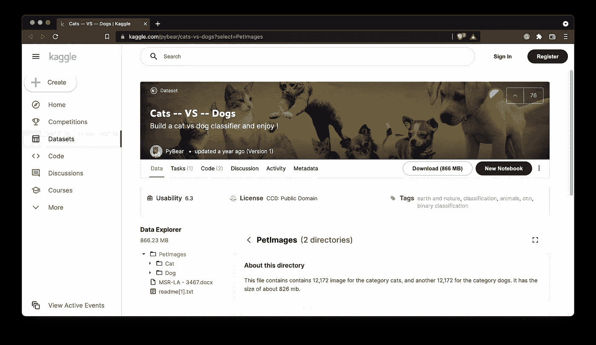
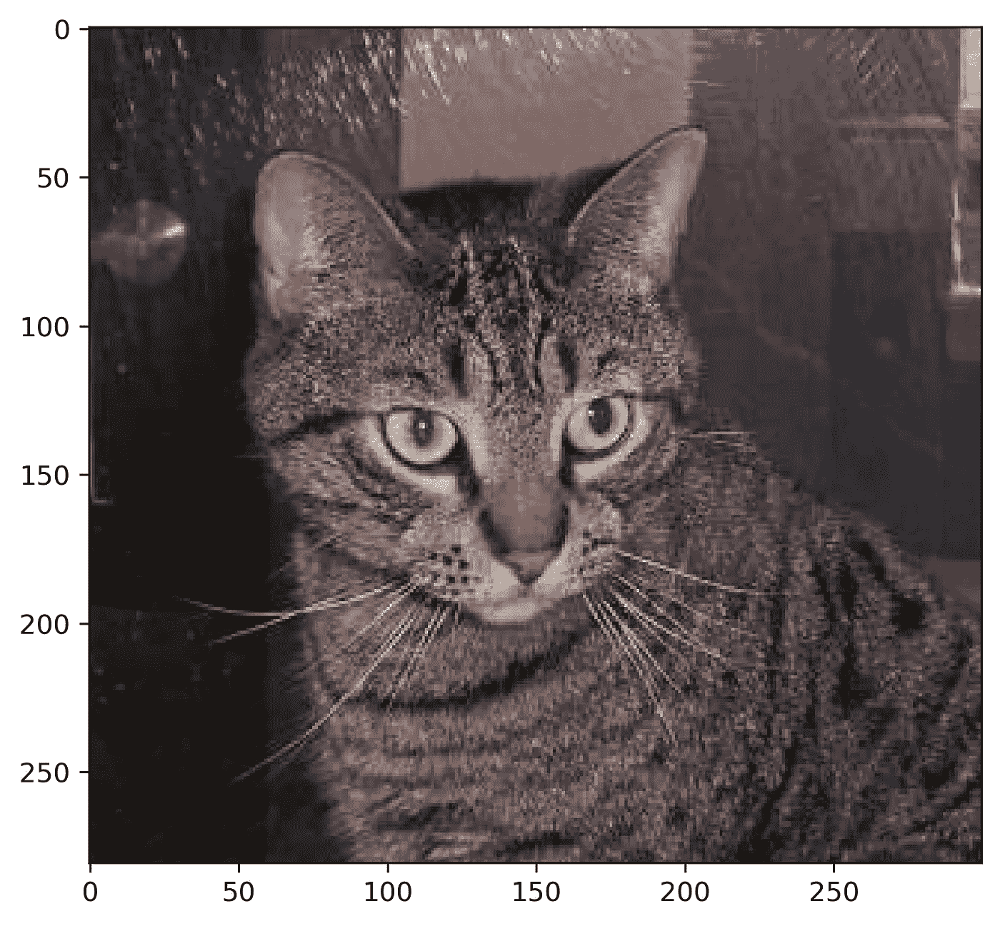
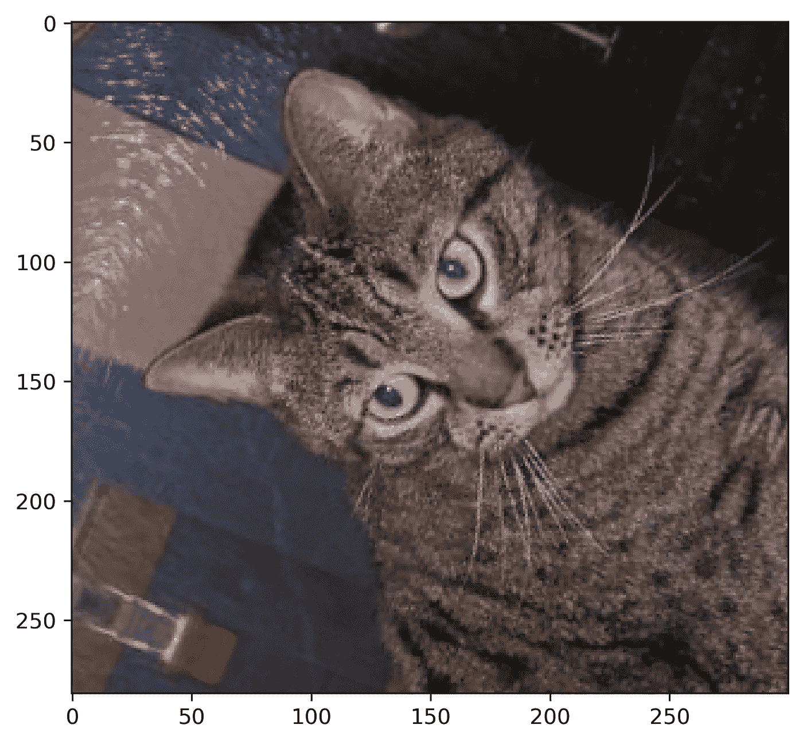
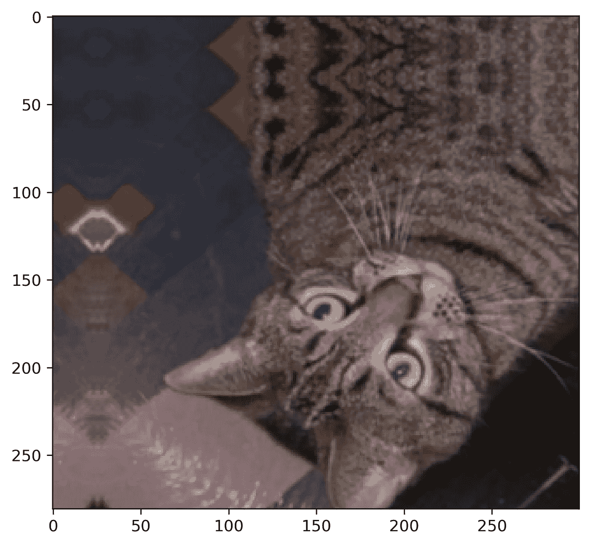
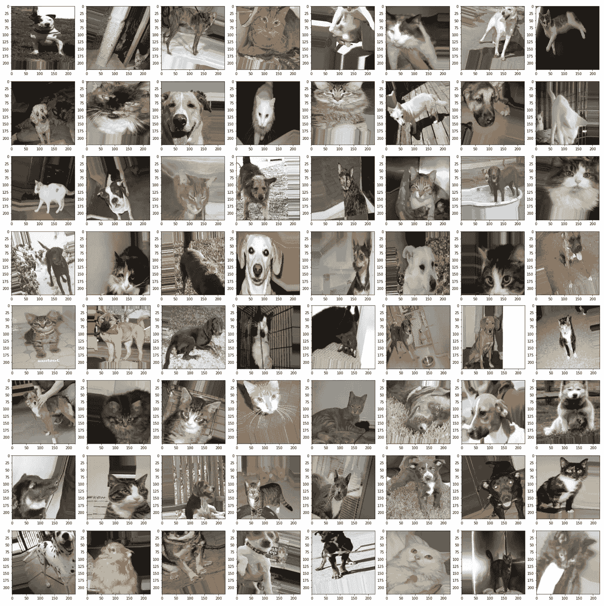

# 用于计算机视觉的张量流——如何通过数据扩充提高模型精度

> 原文：<https://towardsdatascience.com/tensorflow-for-computer-vision-how-to-increase-model-accuracy-with-data-augmentation-27e553dff5eb?source=collection_archive---------30----------------------->

## **小数据集？没问题——通过数据扩充来扩展它，提高模型的预测能力**


照片由 [Jorge César](https://unsplash.com/@jorgecesar?utm_source=unsplash&utm_medium=referral&utm_content=creditCopyText) 在 [Unsplash](https://unsplash.com/s/photos/polaroid?utm_source=unsplash&utm_medium=referral&utm_content=creditCopyText) 上拍摄

[上周](https://betterdatascience.com/does-a-more-complex-architecture-guarantee-a-better-model/)，你看到更复杂的模型并不能提高预测能力。事实上，我们最终得到了一个更差的图像分类器！你能做些什么来提高准确度？嗯，有几件事，但是**数据扩充**是一个很好的起点。

今天，您将了解关于 TensorFlow 数据增强的所有内容，它对影像数据集的作用，它为什么能提高预测性能，以及如何在自定义数据集上使用它。所以，事不宜迟，让我们直入主题吧！

不想看书？请观看我的视频:

你可以在 [GitHub](https://github.com/better-data-science/TensorFlow) 上下载源代码。

# 入门-数据和库导入

我们将使用 Kaggle 的[狗和猫的数据集](https://www.kaggle.com/pybear/cats-vs-dogs?select=PetImages)。它根据知识共享许可协议获得许可，这意味着您可以免费使用它:



图片 1-狗和猫的数据集(图片由作者提供)

数据集相当大-25，000 张图像均匀分布在各个类别之间(12，500 张狗图像和 12，500 张猫图像)。它应该足够大，可以训练一个像样的图像分类器。唯一的问题是——它不是为开箱即用的深度学习而构建的。您可以按照我以前的文章创建一个合适的目录结构，并将其分为训练集、测试集和验证集:

[](https://betterdatascience.com/top-3-prerequisites-for-deep-learning-projects) [## 用于图像分类的 TensorFlow 深度学习项目的三大先决条件|更好的数据…

### 想训练一个用于图像分类的神经网络？确保做到这一点首先识别图像中的对象是一个…

betterdatascience.com](https://betterdatascience.com/top-3-prerequisites-for-deep-learning-projects) 

您还应该删除 *train/cat/666.jpg* 和 *train/dog/11702.jpg* 图像，因为它们已损坏，您的模型将无法使用它们进行训练。

完成后，您可以继续导入库。今天我们只需要几个——Numpy、TensorFlow、Matplotlib 和 PIL。下面的代码片段将它们全部导入，并声明了一个用于显示图像的函数:

```
import numpy as np
import tensorflow as tf
from tensorflow.keras import layers
import matplotlib.pyplot as plt
from PIL import Image def plot_image(img: np.array):
    plt.figure(figsize=(6, 6))
    plt.imshow(img, cmap='gray');
```

我们现在将使用该函数从训练集中加载一个样本图像:

```
img = Image.open('data/train/cat/1.jpg')
img = np.array(img)
plot_image(img=img)
```



图片 2 —来自训练集的样本图片(图片由作者提供)

这就是我们开始数据扩充所需的全部内容，接下来让我们开始吧。

# 使用 TensorFlow 进行数据扩充

简而言之，数据扩充是一种通过修改现有数据来增加数据量的技术。通过这样做，预测模型会比以前暴露更多的数据，并且在理论上，应该学会更好地建模。至少，如果您首先有一个像样的数据集，您应该期望准确性(或任何其他指标)有几个百分点的提高。

TensorFlow 的数据扩充通过对图像数据集随机应用不同的变换来工作。这些变换包括水平/垂直翻转、旋转、缩放、宽度/高度移动、剪切等。有关可用选项的完整列表，请参考[官方文档](https://www.tensorflow.org/api_docs/python/tf/keras/preprocessing/image/ImageDataGenerator)。

首先，我们将声明一个模型，该模型将图像的大小调整为 224x224 像素，并将其基础矩阵的大小调整为 0–1 范围。为数据扩充声明一个模型并不是一种常见的做法，但是您将能够通过这种方式看到到底发生了什么:

```
resize_and_scale = tf.keras.Sequential([
    layers.Resizing(224, 224),
    layers.Rescaling(1./255)
])res = resize_and_scale(img)
plot_image(img=res)
```


图 3-调整大小和比例后的猫图像(图片由作者提供)

这里没有发生什么，但是您可以通过比较*图像 2* 和*图像 3* 上的轴记号来验证是否应用了变换。您还可以打印转换前后图像矩阵的最小值和最大值，但是我将由您来决定。

让我们通过添加随机水平翻转和随机旋转来增加趣味。根据`mode`参数，`RandomFlip`层水平、垂直或同时水平和垂直翻转图像。一个`RandomRotation`层以某种因子旋转图像。例如，如果因子设置为 0.2，则旋转角度计算为 0.2 * 2PI:

```
augmentation = tf.keras.Sequential([
    layers.RandomFlip(mode='horizontal'),
    layers.RandomRotation(factor=0.2)
])res = augmentation(img)
plot_image(img=res)
```



图 4 —翻转和旋转后的猫图像(图片由作者提供)

这仍然是同一个图像，但肯定增加了更多的变化。我们将通过缩放和平移让事情变得更加有趣。一个`RandomZoom`层顾名思义——基于一个因子缩放图像。例如，系数 0.2 表示 20%。一个`RandomTranslation`层垂直或水平移动图像，这取决于两个相应的因素。`height_factor`参数代表垂直移动，`width_factor`代表水平移动:

```
augmentation = tf.keras.Sequential([
    layers.RandomFlip(mode='horizontal_and_vertical'),
    layers.RandomRotation(factor=0.2),
    layers.RandomZoom(height_factor=0.2, width_factor=0.2),
    layers.RandomTranslation(height_factor=0.2, width_factor=0.2)
])res = augmentation(img)
plot_image(img=res)
```



图 5 —翻转、旋转、缩放和平移后的猫图像(图片由作者提供)

随着我们添加更多的变换，图像变得越来越奇怪，但我们仍然可以将它们归类为一只猫。您看到的变换是随机的，为了验证这一说法，我们可以绘制一个 3x3 的图，显示 9 个随机变换的结果:

```
plt.figure(figsize=(10, 10))for i in range(9):
    img_aug = augmentation(img)
    ax = plt.subplot(3, 3, i + 1)
    plt.imshow(img_aug)
    plt.axis('off')
```


图 6–9 应用于同一张图像的随机变换(图片由作者提供)

有些有意义，有些没有意义——但图像本身并不难分类。接下来，我们来看看如何用 TensorFlow 的`ImageDataGenerator`处理数据增强。

# 使用 TensorFlow 的 ImageDataGenerator 进行数据扩充

您现在知道了单个转换对图像的影响，但是将数据扩充作为单独的`Sequential`模型来编写并不常见。通常情况下，您会在用 TensorFlow 的`ImageDataGenerator`类加载图像数据时应用这些变换。

**记住** —你应该只增加训练数据。

以这种方式进行数据扩充更容易。下面的代码段对定型集应用了重缩放、旋转、平移、剪切、缩放和水平翻转，并且只对验证集进行了重缩放。`fill_mode`参数告诉 TensorFlow 如何处理图像边界外的点，这些点是某些变换的副作用。

```
train_datagen = tf.keras.preprocessing.image.ImageDataGenerator(
    rescale=1/255.0,
    rotation_range=20,
    width_shift_range=0.2,
    height_shift_range=0.2,
    shear_range=0.2,
    zoom_range=0.2,
    horizontal_flip=True,
    fill_mode='nearest'
)valid_datagen = tf.keras.preprocessing.image.ImageDataGenerator(
    rescale=1/255.0
)
```

我们怎么知道这是否有效？简单地说——我们将可视化一批图像。首先，我们必须调用`flow_from_directory()`函数来指定批量大小，以及其他参数:

```
train_data = train_datagen.flow_from_directory(
    directory='data/train/',
    target_size=(224, 224),
    class_mode='categorical',
    batch_size=64,
    seed=42
)
```

`train_data`现在是一个 Python 生成器对象，所以对它调用`next()`会返回第一批。下面是如何提取它并打印出其元素的形状:

```
first_batch = train_data.next()
first_batch[0].shape, first_batch[1].shape
```


图 7——第一批的形状(图片由作者提供)

简而言之，我们有 64 个图像，每个图像宽 224 像素，高 224 像素，有 3 个颜色通道。第二个元素代表标签。我们有 64 个这样的独热编码格式(猫= [1，0]，狗= [0，1])。

使用以下函数在 8x8 网格中可视化一批 64 个图像:

```
def visualize_batch(batch):
    n = 64
    num_row, num_col = 8, 8
    fig, axes = plt.subplots(num_row, num_col, figsize=(3 * num_col, 3 * num_row))

    for i in range(n):
        img = np.array(batch[0][i] * 255, dtype='uint8')
        ax = axes[i // num_col, i % num_col]
        ax.imshow(img)

    plt.tight_layout()
    plt.show() visualize_batch(batch=first_batch)
```



图片 8 —一批 64 张图片(图片由作者提供)

我们肯定有一些奇怪的问题，但总的来说，数据扩充通过增加我们数据集的多样性做了一件体面的工作。最后一步，我们将加载训练和验证图像:

```
train_data = train_datagen.flow_from_directory(
    directory='data/train/',
    target_size=(224, 224),
    class_mode='categorical',
    batch_size=64,
    seed=42
)valid_data = valid_datagen.flow_from_directory(
    directory='data/validation/',
    target_size=(224, 224),
    class_mode='categorical',
    batch_size=64,
    seed=42
)
```

这就是我们训练模型所需要的。手指交叉它胜过[以前的一个](https://betterdatascience.com/train-image-classifier-with-convolutional-neural-networks/)！

# 模型训练-使用 TensorFlow 进行数据增强能否提高准确性？

我们将使用与第一次用卷积网络训练一个[图像分类器](https://betterdatascience.com/train-image-classifier-with-convolutional-neural-networks/)时相同的模型架构。它在验证集上达到了大约 75%的准确率。数据扩充应该有望把事情提高一个档次。

这是模型训练代码，它有两个卷积/池模块，后面是一个密集层和一个输出层:

```
model = tf.keras.Sequential([
    layers.Conv2D(filters=32, kernel_size=(3, 3), input_shape=(224, 224, 3), activation='relu'),
    layers.MaxPool2D(pool_size=(2, 2), padding='same'),
    layers.Conv2D(filters=32, kernel_size=(3, 3), activation='relu'),
    layers.MaxPool2D(pool_size=(2, 2), padding='same'),
    layers.Flatten(),
    layers.Dense(128, activation='relu'),
    layers.Dense(2, activation='softmax')
])model.compile(
    loss=tf.keras.losses.categorical_crossentropy,
    optimizer=tf.keras.optimizers.Adam(),
    metrics=[tf.keras.metrics.BinaryAccuracy(name='accuracy')]
)history = model.fit(
    train_data,
    validation_data=valid_data,
    epochs=10
)
```

**注意**:我正面临一些 GPU 问题，所以模型是在 CPU 上训练的，因此训练时间很长。我的 RTX 3060Ti 通常在 22 秒内完成一个纪元。


图 9-模型训练结果(图片由作者提供)

数据增强将验证准确性提高了近 3%!这无疑是朝着正确方向迈出的一步，但我们可以进一步改进。怎么会？用**转移学习**。您将在接下来的文章中了解到所有相关内容。

# 结论

这就是你要做的——如何轻松地从你的模型中获得额外的百分之几的准确度。在构建图像分类器时，数据扩充是一个强大的工具，但要小心使用。如果垂直翻转图像没有意义，就不要这样做。例如，水平和垂直翻转交通标志不会帮助您进行分类。这些通常是从上到下，从左到右读的。这同样适用于任何其他转型。

我对即将发布的迁移学习文章感到兴奋，因为它是用有限的数据构建高精度模型的首选方法。敬请关注，了解所有相关信息！

*喜欢这篇文章吗？成为* [*中等会员*](https://medium.com/@radecicdario/membership) *继续无限制学习。如果你使用下面的链接，我会收到你的一部分会员费，不需要你额外付费。*

[](https://medium.com/@radecicdario/membership) [## 通过我的推荐链接加入 Medium-Dario rade ci

### 作为一个媒体会员，你的会员费的一部分会给你阅读的作家，你可以完全接触到每一个故事…

medium.com](https://medium.com/@radecicdario/membership) 

# 保持联系

*   注册我的[简讯](https://mailchi.mp/46a3d2989d9b/bdssubscribe)
*   订阅 [YouTube](https://www.youtube.com/c/BetterDataScience)
*   在 [LinkedIn](https://www.linkedin.com/in/darioradecic/) 上连接

*原载于 2021 年 12 月 16 日 https://betterdatascience.com**的* [*。*](https://betterdatascience.com/tensorflow-for-computer-vision-how-to-increase-model-accuracy-with-data-augmentation/)