# 计算机视觉的张量流——如何用人工神经网络训练图像分类器

> 原文：<https://towardsdatascience.com/tensorflow-for-computer-vision-how-to-train-image-classifier-with-artificial-neural-networks-304bc82f3dd?source=collection_archive---------10----------------------->

## 没有卷积的图像分类？这就是为什么这是个坏主意

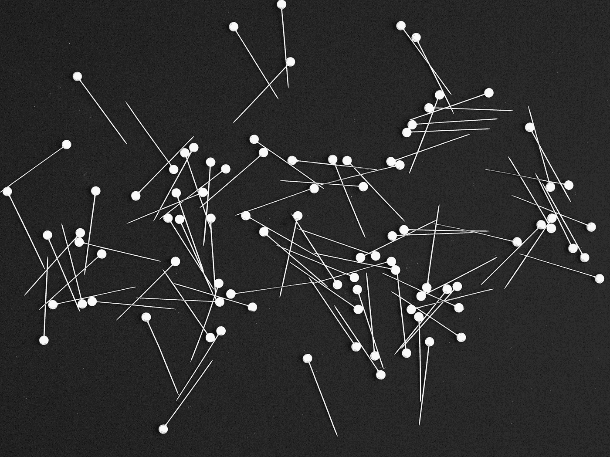

[万用眼](https://unsplash.com/@universaleye?utm_source=unsplash&utm_medium=referral&utm_content=creditCopyText)在 [Unsplash](https://unsplash.com/?utm_source=unsplash&utm_medium=referral&utm_content=creditCopyText) 上拍照

人工神经网络不是为图像分类而设计的。但是他们能有多可怕呢？这就是我们今天要知道的。我们将只使用`Dense`层在 20，000 张图像上训练一个图像分类模型。因此，没有回旋和其他花哨的东西，我们将把它们留到即将到来的文章。

不言而喻，但你真的不应该使用香草人工神经网络来分类图像。图像是二维的，如果将它们展平，你会失去使图像可识别的模式。尽管如此，它还是有趣且可行的，并且会让你洞察到这种方法的所有错误。

不想看书？请观看我的视频:

你可以在 [GitHub](https://github.com/better-data-science/TensorFlow) 上下载源代码。

# 使用的数据集和数据准备

我们将使用 Kaggle 的[狗和猫的数据集](https://www.kaggle.com/pybear/cats-vs-dogs?select=PetImages)。它根据知识共享许可协议获得许可，这意味着您可以免费使用它:

图片 1-狗和猫的数据集(图片由作者提供)

数据集相当大-25，000 张图像均匀分布在各个类别之间(12，500 张狗图像和 12，500 张猫图像)。它应该足够大，可以训练一个像样的图像分类器，但不能用人工神经网络。

唯一的问题是——它的结构不适合开箱即用的深度学习。您可以按照我以前的文章创建一个合适的目录结构，并将其分为训练集、测试集和验证集:

</tensorflow-for-image-classification-top-3-prerequisites-for-deep-learning-projects-34c549c89e42>  

# 缩小、灰度化和平面化图像

让我们把库导入放在一边。我们需要相当多的软件，所以确保安装了 Numpy、Pandas、TensorFlow、PIL 和 Scikit-Learn:

您不能将图像直接传递给`Dense`层。单幅图像是三维的——高度、宽度、颜色通道——`Dense`层需要一维输入。

让我们看一个例子。下面的代码加载并显示训练集中的猫图像:

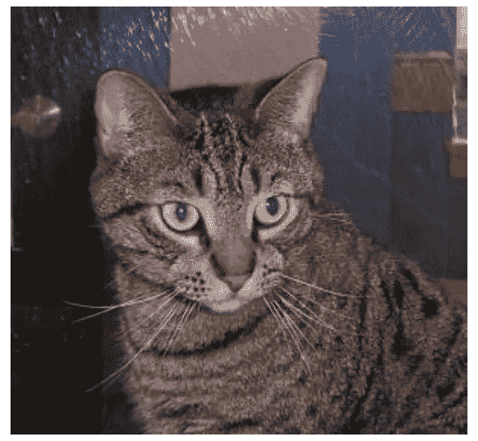

图片 2 —示例猫图片(图片由作者提供)

图像宽 281 像素，高 300 像素，有三个颜色通道(`np.array(src_img).shape` )。总的来说，它有 252，900 个像素，展平后转化为 252，900 个要素。这是很多的，所以让我们在可能的地方节省一些资源。

如果有意义，你应该**灰度化**你的图像数据集。如果你可以对非彩色图像进行分类，那么神经网络也应该可以。您可以使用以下代码片段将图像转换为灰度:

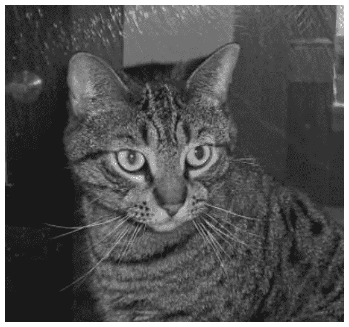

图 3 —灰度猫图像(图片由作者提供)

很明显，它仍然是一只猫，所以颜色在这个数据集中没有起很大的作用。灰度图像宽 281 像素，高 300 像素，但只有一个颜色通道。这意味着我们从 252，900 像素增加到了 84，300 像素。仍然很多，但绝对是朝着正确方向迈出的一步。

正如在[上一篇文章](/tensorflow-for-image-classification-top-3-prerequisites-for-deep-learning-projects-34c549c89e42)中所讨论的，数据集中的图像没有相同的大小。这对于神经网络模型来说是一个问题，因为它每次都期望相同数量的输入特征。我们可以将每张图片调整到相同的宽度和高度。这就是我们引入精简的地方，以进一步减少输入特性的数量。

以下代码片段调整了我们的图像大小，使其宽度和高度都为 96 像素:

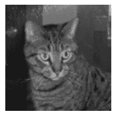

图片 4 —调整大小的猫图片(图片由作者提供)

图像有点小和模糊，当然，但它仍然是一只猫。我们已经减少到 9216 个特征，如果你还记得的话。我们已经将功能数量减少了 27，这是一件大事。

作为最后一步，我们需要平坦的形象。您可以使用 Numpy 的`ravel()`函数来实现:

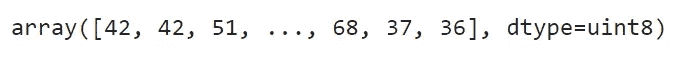

图片 5 —扁平的猫图片(作者图片)

这就是计算机如何看待一只猫——它只是一个 9216 像素的阵列，范围从 0 到 255。问题就在这里——神经网络更喜欢 0 到 1 之间的范围。将整个数组除以 255.0 即可:

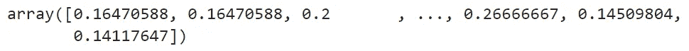

图片 6 —展平和缩放的猫图像(图片由作者提供)

最后一步，我们将编写一个`process_image()`函数，将上述所有变换应用到一张图片上:

让我们在一个随机的狗图像上测试它，然后反转最后一步来直观地表示图像:

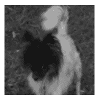

图片 7 —变形的狗图片(图片由作者提供)

就是这样——这个功能像广告宣传的那样工作。接下来，让我们将它应用于整个数据集。

# 将图像转换为表格数据，用于深度学习

我们将编写另一个函数——`process_folder()`——它遍历给定的文件夹，并对任何 JPG 文件使用`process_image()`函数。然后，它将所有图像组合成一个熊猫数据帧，并添加一个类作为附加列(猫或狗):

让我们将它应用于培训、测试和验证文件夹。您需要为每个文件夹调用它两次，一次为猫，一次为狗，然后连接集合。我们还会将数据集转储到 pickle 文件中:

下面是`train_set`的样子:

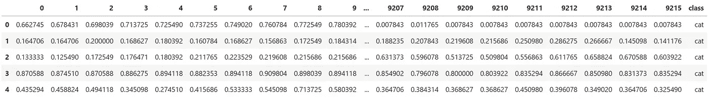

图片 8 —训练集的头(图片由作者提供)

数据集包含所有猫的图像，后面是所有狗的图像。这对于训练集和验证集来说并不理想，因为神经网络会按照这个顺序*看到*它们。您可以使用 Scikit-Learn 中的`shuffle`函数来随机化排序:

现在看起来是这样的:

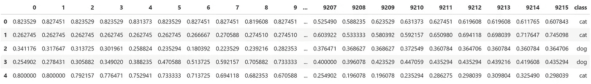

图片 9-混洗训练集的头(图片由作者提供)

快到了。下一步是将要素从目标中分离出来，就像您通常对任何表格数据集所做的那样。我们将对所有三个子集进行拆分:

最后，你必须分解目标变量。有两个不同的类(cat 和 dog)，因此每个实例的目标变量应该包含两个元素。例如，下面是应用于`y_train`的`factorize()`函数的作用:

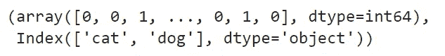

图 10-应用于 y_train 的因式分解函数(图片由作者提供)

标签被转换成整数——0 代表猫，1 代表狗。您可以使用 TensorFlow 中的`to_categorical()`函数，并传入分解的整数表示数组以及不同类的数量(2):

因此，`y_train`现在看起来是这样的:

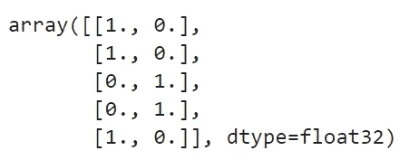

图 11 —分类格式的目标变量(作者图片)

从概率的角度来看，第一张图片有 100%的概率是一只猫，有 0%的概率是一只狗。这些都是真标签，所以*概率*可以是 0 也可以是 1。

我们现在终于拥有了训练神经网络模型所需的一切。

# 用人工神经网络(ANN)训练图像分类模型

我已经随机选择了层数和每层的节点数。你可以随意调整网络。您不应该更改以下内容:

*   **输出层** —它需要两个节点，因为我们有两个不同的类。我们不能再使用 *sigmoid* 激活功能，所以选择 *softmax* 。
*   **损失函数** —二元交叉熵不会削减它。使用分类交叉熵。

其他一切都完全取决于你:

以下是我经过 100 个纪元后得到的结果:

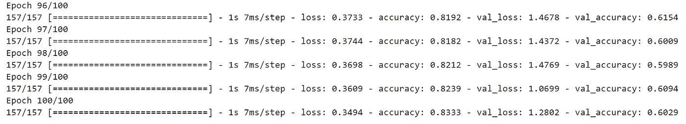

图 12—100 个时期后的人工神经网络结果(图片由作者提供)

60%的准确率只是比猜测好一点点，但没有什么值得大书特书的。不过，让我们检查一下在培训期间指标发生了什么变化。

以下代码片段绘制了 100 个时期中每个时期的训练损失与验证损失的关系:

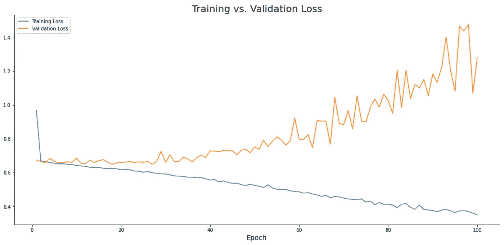

图 13——培训损失与验证损失(图片由作者提供)

该模型正在很好地学习训练数据，但未能推广。随着我们对模型进行更多时期的训练，验证损失继续增加，这表明模型不稳定且不可用。

让我们来看看精确度的对比:

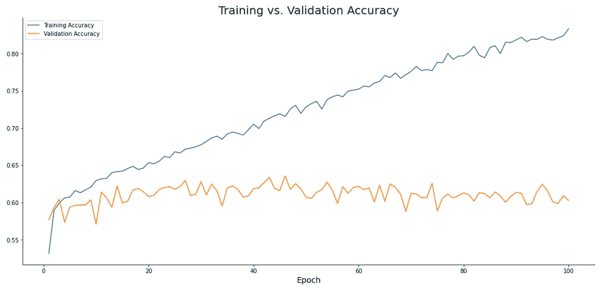

图 14——训练准确度与验证准确度(图片由作者提供)

类似图片。验证准确性稳定在 60%左右，而模型过度拟合训练数据。

对于具有 20K 训练图像的两类数据集，60%的准确率几乎是它所能得到的最差的。原因很简单— `Dense`图层不是为捕捉复杂的二维图像数据而设计的。你需要一个*概念*层来做好这项工作。

# 结论

现在你知道了——如何用人工神经网络训练图像分类模型，以及为什么你不应该这样做。这就像穿着人字拖爬山——也许你能做到，但最好不要。

您将在下面的文章中了解卷积神经网络是如何工作的，并且您将看到它们带来的改进。我会在周五发布那篇文章，敬请关注。

*喜欢这篇文章吗？成为* [*中等会员*](https://medium.com/@radecicdario/membership) *继续无限制学习。如果你使用下面的链接，我会收到你的一部分会员费，不需要你额外付费。*

<https://medium.com/@radecicdario/membership>  

# 保持联系

*   注册我的[简讯](https://mailchi.mp/46a3d2989d9b/bdssubscribe)
*   在 YouTube[上订阅](https://www.youtube.com/c/BetterDataScience)
*   在 [LinkedIn](https://www.linkedin.com/in/darioradecic/) 上连接