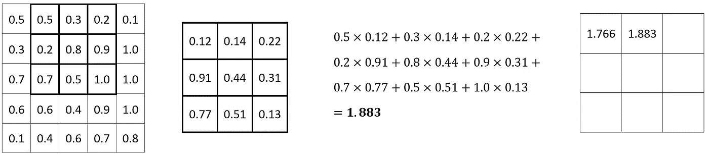
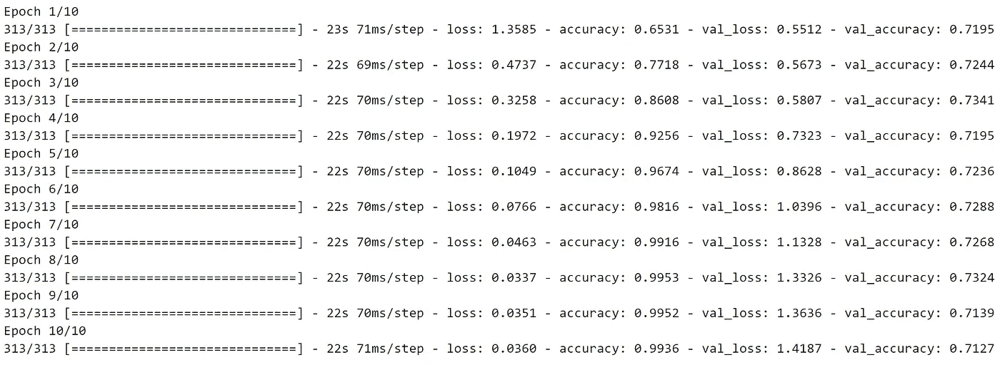

# 用于计算机视觉的张量流——如何用卷积神经网络训练图像分类器

> 原文：<https://towardsdatascience.com/tensorflow-for-computer-vision-how-to-train-image-classifier-with-convolutional-neural-networks-77f2fd6ed152?source=collection_archive---------9----------------------->

## 结合卷积和池，如果你想要一个体面的从零开始的图像分类器

马库斯·斯皮斯克在 [Unsplash](https://unsplash.com?utm_source=medium&utm_medium=referral) 上的照片

上周[你看到了](/tensorflow-for-computer-vision-how-to-train-image-classifier-with-artificial-neural-networks-304bc82f3dd)普通的人工神经网络在图像分类方面很糟糕。这是意料之中的，因为他们不知道像素之间的 2D 关系。这就是卷积的用武之地——一种在图像数据中寻找模式的常用方法。

想听好消息吗？今天，您将学习卷积层和池层背后的基础知识，并且您还将训练和评估您的第一个*真实*图像分类器。这会是一个漫长的过程。推荐一杯浓咖啡。

像往常一样，我们将保持理论轻，动手部分强。如果你不想看，请随意观看我的视频:

你可以在 [GitHub](https://github.com/better-data-science/TensorFlow) 上下载源代码。

# 卷积和池的介绍

在略读卷积和池理论之前，我们不能讨论卷积神经网络。两者都比你想象的简单，但是在图像分类方面能力极强。

## 回旋

卷积神经网络是一种用于图像分类的特殊类型的神经网络。任何卷积神经网络的核心都是*卷积*，这是一种高度专业化的检测图像模式的操作。

卷积层要求您指定过滤器的数量。把这些想象成一些模式检测器。早期的卷积层检测基本模式，如边缘、拐角等。根据数据集，在后面的卷积层检测特殊模式，如狗耳朵或猫爪。

单个过滤器只是一个小矩阵(通常是矩形)。决定行数和列数是您的任务，但是 3x3 或 5x5 是很好的起点。滤波器矩阵内的值是随机初始化的。神经网络的任务是在给定特定数据集的情况下，学习滤波器矩阵的最佳值。

让我们来看一个实际的卷积运算。我们有一个 5x5 的图像和一个 3x3 的滤镜。滤波器*在图像中的每 3x3 组像素上滑动*(卷积)，并计算逐元素乘法。然后对乘法结果求和:

图片 1-卷积运算(1)(图片由作者提供)

-对每组 3×3 像素重复该过程。以下是对以下集合的计算:

图片 2 —卷积运算(2)(图片由作者提供)

重复该过程，直到达到最终的 3×3 像素组:

图片 3-卷积运算(3)(图片由作者提供)

从这里，你可以展平结果，把它传递到另一个卷积层，或者，最常见的，把它传递到一个**池**层。

## 联营

汇集操作通常遵循卷积。它的任务是通过保留相关的内容并丢弃其余的内容来降低来自卷积层的结果的维度。

这个过程很简单——你定义一个*n×n*区域和步幅大小。 *n x n* 区域代表一个小矩阵，在其上执行池化。步幅表示完成一个单步后，池操作向右(或底部)移动的像素数。

最常见的池类型是*最大池*，最常见的区域大小是 2x2，最常见的步幅大小是 2。这意味着我们每次查看一个 2x2 像素的小矩阵，并且只保留最大值。这里有一个例子:

图 4-最大池化操作(作者图片)

很简单，不是吗？不用取最大值。另一种常见的池类型是*平均池*，它顾名思义。Max Pooling 使用得更频繁，所以我们将在整篇文章中坚持使用它。

总而言之，max pooling 通过仅保留具有最高值的像素(最活跃的像素)而忽略其他所有像素，减少了参数的数量。

您现在知道了这两个操作背后的基础知识，接下来让我们实现它们。在下一篇文章中，我们将更深入地探讨卷积和池的工作原理。

# 使用的数据集和数据预处理

我们将使用 Kaggle 的[狗和猫的数据集](https://www.kaggle.com/pybear/cats-vs-dogs?select=PetImages)。它根据知识共享许可协议获得许可，这意味着您可以免费使用它:

图 5 —狗和猫的数据集(图片由作者提供)

数据集相当大-25，000 张图像均匀分布在各个类别之间(12，500 张狗图像和 12，500 张猫图像)。它应该足够大，可以训练一个像样的图像分类器。唯一的问题是——它不是为开箱即用的深度学习而构建的。您可以按照我以前的文章创建一个合适的目录结构，并将其分为训练集、测试集和验证集:

</tensorflow-for-image-classification-top-3-prerequisites-for-deep-learning-projects-34c549c89e42>  

继续之前，请**删除**以下图像:

*   `data/train/cat/666.jpg`
*   `data/train/dog/11702.jpg`

这些在训练过程中会导致错误，因为它们被破坏了，所以最好把它们一起去掉。

# 如何归一化图像数据

让我们把库导入放在一边。今天你不需要太多:

那么，我们的图像数据集有什么问题呢？让我们加载一些图像并进行检查。使用以下代码从 cat 文件夹加载随机图像:

图片 6 —样本猫图片(图片由作者提供)

上面的猫图像高 281 像素，宽 300 像素，有三个颜色通道。这同样适用于随机的狗图像吗？

图片 7 —狗的图片样本(图片由作者提供)

狗图像高 375 像素，宽 500 像素，有 3 个颜色通道。它比第一个图像大，神经网络不会喜欢这样。它期望相同大小的图像(数组)。我们可以在向模型提供数据时调整它们的大小。

有一个更紧急的问题需要解决。像素值范围从 0 到 255 ( `np.array(img2)`):

图像 8 —转换为数组的图像(作者提供的图像)

神经网络更喜欢 0 到 1 之间的范围。通过将每个元素除以 255.0，可以将图像转换到该范围:

图像 9 —转换为数组并规范化的图像(作者提供的图像)

您可以使用数据加载器自动完成这一步。

# TensorFlow 数据加载器

TensorFlow 的`ImageDataGenerator`类用于指定如何生成图像数据。你可以用它做很多事情，但是我们今天只讨论重新缩放:

您可以使用这些生成器从目录中加载图像数据。您必须指定:

*   **目录路径**——图像存储的地方。
*   **目标尺寸** —所有图像将被调整到的尺寸。224x224 适合神经网络。
*   **类别模式** —将其设置为*分类*，因为我们有两个不同的图像类别。
*   **批量大小** —表示一次显示给神经网络的图像数量。
*   **Seed**——获得与我相同的图像。

下面是您应该看到的输出:

图片 10 —在培训目录中找到的图片数量(图片由作者提供)

训练文件夹中有 20，030 个图像，分为两类。`train_data`变量是一个 Python 生成器对象，这意味着您可以轻松访问一批图像:

每批包含图像和标签。让我们检查一下这些的形状:

图 11 —批量图像和标签的形状(作者提供的图像)

单个批次包含 64 个图像，每个图像宽和高为 224 像素，具有 3 个颜色通道。对应的标签有 64 个。每一个都是一个包含两个元素的数组——一幅图像是一只猫(索引 0)和一只狗(索引 1)的概率。

让我们更进一步，将单个批次可视化。

# 可视化一批图像

你应该总是可视化你的数据。这是发现数据加载器问题的最好方法。请记住，这些图像之前被重新缩放到 0-1 的范围。为了将它们可视化，您必须将像素值乘以 255，并将结果转换为整数。

代码的其余部分不言自明:

图片 12 —一批图片(图片由作者提供)

由于长宽比的变化，其中一些看起来有点奇怪，但这应该不是问题。所有图像现在都是 224 像素高和宽，这意味着我们准备好训练模型了。

# 用张量流训练卷积神经网络

首先，让我们重置我们的训练数据加载器，并为验证集添加一个加载器:

在训练卷积神经网络模型时，请记住以下几点:

*   **训练归结为实验**——没有办法知道你需要多少卷积层，也没有办法知道理想的特征数量和内核大小。
*   **卷积层之后通常是一个池层**，正如本文前面所讨论的。
*   **展平层** —它应该跟在最后一个卷积/合并层之后。
*   **密集层** —像平常一样添加。密集层在这里做实际的分类。
*   **输出层** —由 softmax 功能激活的 2 个节点。
*   **损失** —通过分类交叉熵函数追踪损失。

让我们训练几个模特。第一个具有 16 个过滤器的单个卷积层和 3x3 的内核大小，随后是最大池层:

图 13 —模型 1 培训日志(图片由作者提供)

甚至一个简单的卷积模型也胜过一个只有全连接层的模型。将过滤器的数量增加一倍会有影响吗？

图 14 —模型 2 培训日志(图片由作者提供)

可能吧，但是模型看起来不像在学习。让我们添加第二个卷积层:

图 15 —模型 3 培训日志(图片由作者提供)

这就做到了——验证集的准确率为 75%。你可以自由地自己做进一步的实验。以下部分使用`model_3`对测试集进行预测。

# 对新图像进行预测

事情是这样的——您必须对测试集应用相同的预处理操作。这一步我忘记了很多次，结果导致了怪异和不确定的预测(预测概率相差很小)。

出于这个原因，我们将声明一个函数，它将给定图像的大小调整为 224x224，并将其缩放到 0–1 的范围:

现在让我们将它用于测试集中的单个图像:

图片 16-每类的预测概率(图片由作者提供)

该模型几乎 100%确定这是一只猫的图像(0 =猫，1 =狗)。您可以使用`argmax()`函数来获取数组值最高的索引。它返回 0，意味着模型认为它是一只猫。

让我们对整个图像文件夹进行预测。有更聪明的方法来处理这个问题，但是这个方法是故意显式的。我们遍历文件夹，对单个图像进行预测，然后跟踪有多少图像被正确分类:

以下是对猫的研究结果:

图 17 —猫的模型精确度(图片由作者提供)

这是给狗的:

图 18 —狗的模型精确度(图片由作者提供)

总的来说，我们有一个比只使用密集层时[更精确的模型。这只是冰山一角，因为我们还没有探索数据增强和迁移学习。](/tensorflow-for-computer-vision-how-to-train-image-classifier-with-artificial-neural-networks-304bc82f3dd)

你不会相信这些会增加多少精确度。

*喜欢这篇文章吗？成为* [*中等会员*](https://medium.com/@radecicdario/membership) *继续无限制学习。如果你使用下面的链接，我会收到你的一部分会员费，不需要你额外付费。*

<https://medium.com/@radecicdario/membership>  

# 保持联系

*   注册我的[简讯](https://mailchi.mp/46a3d2989d9b/bdssubscribe)
*   在 YouTube[上订阅](https://www.youtube.com/c/BetterDataScience)
*   在 [LinkedIn](https://www.linkedin.com/in/darioradecic/) 上连接