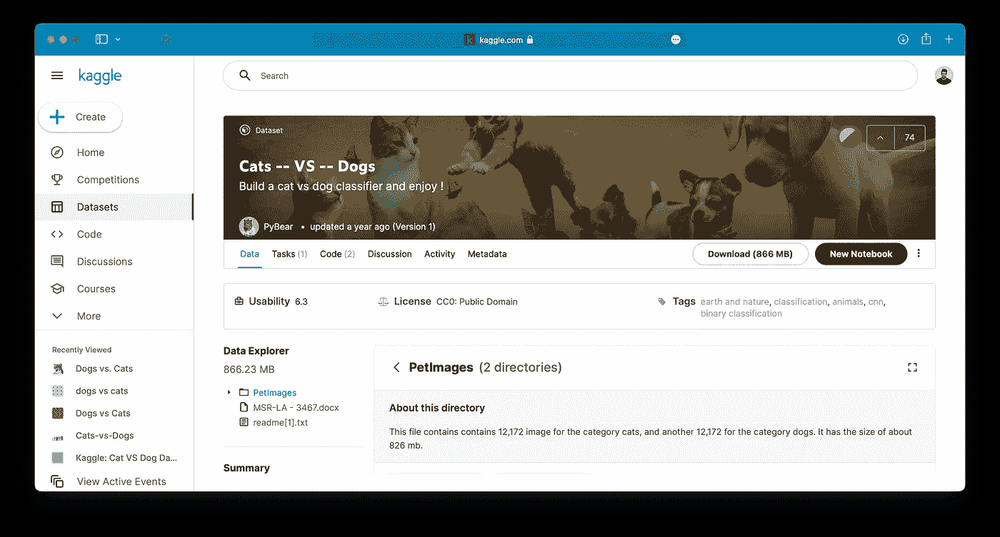
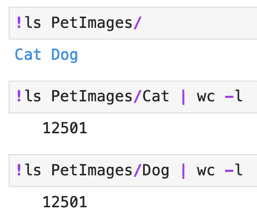
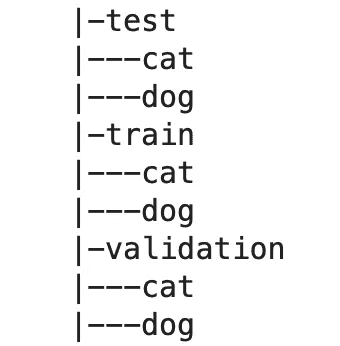
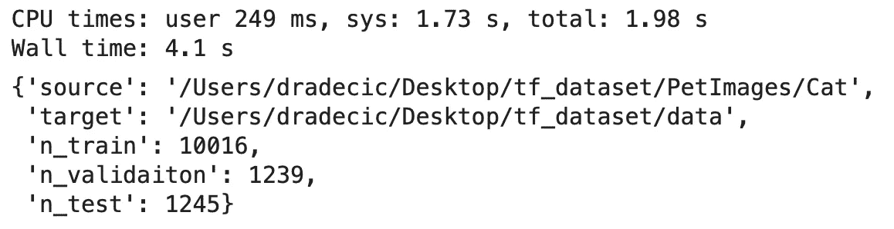
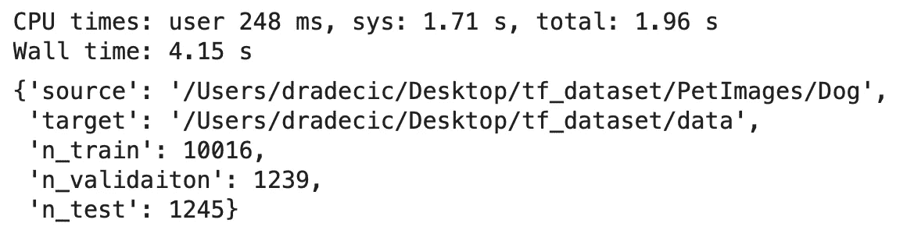
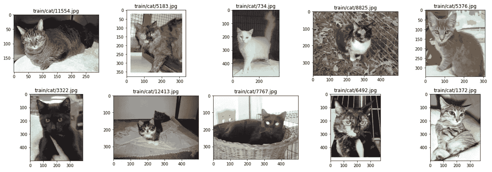
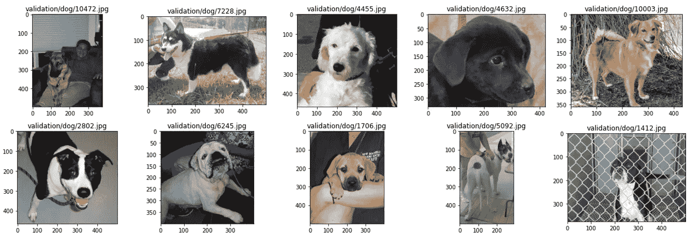

# 用于图像分类的 TensorFlow 深度学习项目的三大先决条件

> 原文：<https://towardsdatascience.com/tensorflow-for-image-classification-top-3-prerequisites-for-deep-learning-projects-34c549c89e42?source=collection_archive---------10----------------------->

## 想训练一个用于图像分类的神经网络？请确保首先执行此操作

穆罕默德·拉赫马尼在 [Unsplash](https://unsplash.com/?utm_source=unsplash&utm_medium=referral&utm_content=creditCopyText) 上的照片

对人类来说，识别图像中的物体是一件轻而易举的事情。对于电脑来说，就没那么多了。什么使狗成为狗？更重要的是，计算机如何学习这些模式？其中一个最性感的 C 字就是答案。不，不是*演算*，是*传统神经网络*！

今天，您将尝试深度学习在图像数据方面提供的一切。我们将讨论深度学习的基本图像数据准备，包括创建目录结构、训练/测试/验证分割和数据可视化。请继续关注更多深度学习文章，因为我计划在接下来的几周和几个月中涵盖几乎所有与计算机视觉相关的内容。

不想看书？请观看我的视频:

你可以在 [GitHub](https://github.com/better-data-science/TensorFlow) 上下载源代码。

# 介绍我们将使用的图像数据和数据集

图像数据明显不同于表格数据。表格数据由多列组成，每一列描述您试图预测的内容。但是在某种程度上，图像和表格数据是相同的。我来详细说明一下。

假设你有一张 224x224 的彩色图像。这意味着每个通道总共有 50，176 个像素，或者总共有 150，528 个像素(结合红色、绿色和蓝色通道)。理论上，您可以将图像展平，将其转换为表格格式——有 150，528 列。委婉地说，用那种方式做图像分类是疯狂的。

您可以将图像转换为灰度，这将产生 50，176 列(像素)。这是一个很好的起点，尤其是如果你不需要颜色来分类的话。狗就是狗，当以灰度显示时，我不会把它和微波炉混淆。

此外，您可以对这 50，176 列应用降维算法，只保留与*相关的*。这是一个很好的方法，但是有一个残酷的缺陷——你会丢失所有的 2D 信息。

人类在图像中识别狗的能力可以归结为识别模式。一行 224 像素没有任何意义，但是 50 行 224 像素可以在中间的某个地方包含一个狗头。它是高度和宽度的组合，使得图案易于辨认。

我们将在接下来的文章中更深入地探讨，但仅此一点就应该让你体会到图像数据的复杂性和大脑从中发现模式的能力。

所有这些关于狗的讨论让我想到了我们将要使用的数据集。这是一个来自 Kaggle 的[狗与猫的数据集](https://www.kaggle.com/pybear/cats-vs-dogs?select=PetImages)，你可以免费下载使用。它根据知识共享许可协议获得许可，这意味着您可以免费使用它:

图 1——狗。对比猫数据集(图片由作者提供)

这是一个相当大的数据集-25，000 张图像平均分布在各个类别之间(12，500 张狗图像和 12，500 张猫图像)。数据集应该足够大，以便从头开始训练一个像样的图像分类器。

如果您正在跟进，请下载它，并在您的机器上的某个地方解压`PetImages`文件夹。它应该是这样的:

图 2 —源图像目录结构(作者提供的图像)

它的结构不是最优的，所以您将在下一节中学习如何解决这个问题。

# 为深度学习项目创建目录结构

`PetImages`文件夹有两个子文件夹——`Cat`和`Dog`。这些图像没有分成训练集、测试集和验证集。如果你想正确地训练模型，这是一个必要条件。

在解决分割问题之前，让我们创建一个合适的目录结构。我们将有一个包含三个子文件夹的`data`文件夹— `train`、`validation`和`test`。每个子文件夹都有两个子文件夹— `dog`和`cat`。这些代表类名，所以要确保它们是正确的。这是深度学习项目的一种常见模式，你应该根据不同的类创建尽可能多的文件夹。

让我们从库导入开始。所有这些都内置在 Python 中，除了`matplotlib`:

接下来，我们将声明几个变量。我们将使用`pathlib`模块进行路径管理。我发现[比`os`模块更加用户友好。为根数据目录和三个子文件夹中的每一个声明变量。最后，最后三个变量表示每个子集的数据比率:](/still-using-the-os-module-in-python-this-alternative-is-remarkably-better-7d728ce22fb7)

最后，让我们声明一个创建目录结构的函数。如果子集目录不存在，它将创建它们，并在每个目录中创建`dog`和`cat`子目录。完成后，该函数还会打印目录树:

图 3 —目录树表示(作者提供的图片)

就这样，我们接下来可以拆分数据。

# 图像数据训练/测试/验证分割

训练影像分类模型时，建议使用三个子集:

*   **训练集** —模型被训练的最大子集。
*   **验证集** —用于培训期间评估的独立集。
*   **测试组** —用于执行最终模型评估。

这几组之间的比例由你决定。数据集中有 25，000 幅图像，因此 80:10:10 的分割应该很好。

我们将编写一个函数来分割数据集。它声明了一个介于 0 和 1 之间的随机数:

*   如果该数字为 0.80 或更低，图像将进入训练集。
*   如果该数字介于 0.80 和 0.90 之间，图像将进入验证集。
*   如果该数字大于 0.90，图像将进入测试集。

您可以使用`shutil`模块将图像从源复制到目标:

该函数返回一个字典，显示有多少图像被复制到哪里。它还将随机种子设置为 42，因此您将获得相同的分割。让我们运行猫图像的函数，并计算执行时间:

图 4 —培训/测试/验证分割(1)(作者提供的图片)

这不是一个完美的 80:10:10 的比例，但也够接近了。让我们为*好孩子*做同样的事情:

图 5 —培训/测试/验证分割(2)(作者提供的图片)

现在，您已经将图像分成了三个子集，因此您已经准备好开始训练模型了。我们今天不会这么做。我们要做的是另一个先决条件——数据集可视化。

# 可视化图像数据

在训练神经网络模型之前，应该始终将图像数据可视化。否则你怎么知道图像是否有问题？

出于这个原因，我们将声明一个从给定目录中随机绘制 10 个图像子集的函数。图像显示在 2 行 5 列的网格中。每个图像的相对路径都显示为标题。

代码如下:

让我们使用函数来可视化训练猫图像的随机子集:

图片 6 —猫图片的随机子集(图片由作者提供)

干净利落。这些图像在大小上有很大差异，神经网络不喜欢这样。您将在下面的文章中看到如何更改大小。让我们对狗做同样的事情:

图片 7 —狗图片的随机子集(图片由作者提供)

该功能按预期工作。每次重新运行单元时，您将获得 10 个不同的图像，请记住这一点。如果您想显示不同数量的图像，欢迎您更改`n`、`num_row`和`num_col`变量。

# 结论

现在，您已经有了图像分类的基本数据准备和可视化。现在，您已经具备了开始训练图像分类模型所需的一切。我们将在下一篇文章中这样做——但首先使用常规的前馈神经网络。这不是一条可以走的路，原因有很多，重要的是你要知道为什么。

请继续关注那篇文章，以及很多很多即将发表的文章。

喜欢这篇文章吗？成为 [*中等会员*](https://medium.com/@radecicdario/membership) *继续无限制学习。如果你使用下面的链接，我会收到你的一部分会员费，不需要你额外付费。*

 [## 通过我的推荐链接加入 Medium-Dario rade ci

### 作为一个媒体会员，你的会员费的一部分会给你阅读的作家，你可以完全接触到每一个故事…

medium.com](https://medium.com/@radecicdario/membership) 

# 保持联系

*   注册我的[简讯](https://mailchi.mp/46a3d2989d9b/bdssubscribe)
*   在 YouTube[上订阅](https://www.youtube.com/c/BetterDataScience)
*   在 [LinkedIn](https://www.linkedin.com/in/darioradecic/) 上连接