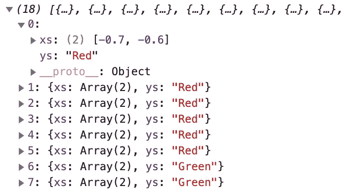

# TensorFlow.js 蓝图 App

> 原文：<https://towardsdatascience.com/tensorflow-js-blueprint-app-e39654b2b44a?source=collection_archive---------26----------------------->

## 数据分类任务的 TensorFlow.js 代码流的端到端示例。这个应用程序是用 React 构建的，但是相同的代码可以在任何 JS 工具包/框架中重用。


作者:安德烈·巴拉诺夫斯基

我认为用结构良好的 TensorFlow.js 代码逻辑创建一个简单的 React 应用程序来进行数据分类会有所帮助。主要的想法是，想用 TensorFlow.js 编写逻辑代码和构建模型的人应该能够轻松地从我的示例应用程序中复制粘贴。出于这个原因，我使用了一个简单的数据集，但是代码结构也包含了处理复杂数据集的所有逻辑。

我使用的数据在下面的图片中是可视化的。有 3 组数据点——红色、蓝色和绿色。数据是二维的。该模型应该从这些数据中学习，如何划分组，以及新的点何时到来，它应该能够对其进行分类并将其分配到正确的组。即使只有非常少的数据点可用于训练，模型仍然能够学习正确的表示。这是这个例子的要点——保持简单和可重复。

示例应用程序可在 [GitHub](https://github.com/katanaml/sample-apps/tree/master/08) repo 上获得。要在您的计算机上运行它，请按照下列步骤操作:

1.  纱线安装
2.  纱线起点

主要逻辑在 src/App.js 文件中实现。让我们从那里开始。在 React 中，您在同一个 JS 文件中编写 UI 和 JS 逻辑，这很方便。

# 培养

App.js 中有一个函数，叫做 *handleRunTraining* 。该功能从“运行训练”按钮调用，该按钮在 React JSX 的同一文件中定义。这个函数做几件事:

*   准备培训和验证数据
*   打印准备好的培训数据
*   运行模型训练

## 数据准备

为了准备训练和验证数据，我们调用 *prepareData* 函数。该功能在 *dataHelper* 组件中定义。

大多数具有 TensorFlow.js 功能的示例将从 CSV 文件中获取数据。我想我应该把数据放到一个普通的 JS 数组中。当数据来自 API 调用时，它也很可能在数组结构中。这是一个更现实的场景，它将帮助我的示例代码更加通用和可重用。我定义了 3 组点——红色、绿色和蓝色:


训练数据，作者:Andrej Baranovskij

这些点用 *(x，y)* 坐标定义。为了使 ML 模型训练有效，我们需要归一化成对的 *(x，y)* 坐标。默认情况下，值分布在 150 到 950 之间，这使得很难获得有效的训练结果。当数据被标准化时(值被带到相似的范围)，模型训练是更优的。在我们的例子中， *(x，y)* 轴的值从 0 到 1000。这意味着我们可以通过以下等式来归一化所有数据点:

```
data.forEach(function (item, index) {
    item.xs[0] = (item.xs[0] / (1000 / 2)) - 1;
    item.xs[1] = (item.xs[1] / (1000 / 2)) - 1;
})
```

第一个点的标准化数据如下所示(值将介于-1 和 1 之间):



标准化数据，作者:Andrej Baranovskij

我们将使用 TensorFlow.js *fitDataset* 方法进行模型训练。此方法不接受 JS 数组，数据必须是 TensorFlow.js 数据集的形式。有一个效用函数，将 JS 数组转换成 TensorFlow.js 数据集— *tf.data.array()* 。这个函数接受 JS 数组作为参数，数组应该带有 *xs* 和 *ys* 属性。

您应该在发送数据进行训练之前对其进行混洗，这将增加精确模型训练的机会。可以从与将 JS 数组转换为数据集相同的函数中应用混排:

```
const dataShuffled = tf.data.array(data).shuffle(3);
```

我们的样本数据集很小，但我们仍然会抽取其中的 20%进行验证。在训练过程中，通过 *fitDataset* 方法进行验证。验证的想法——它应该在每次训练迭代后对训练期间看不到的数据检查模型的准确性。这有助于理解在训练期间是否没有过度拟合，如果模型对验证数据也表现良好，这意味着模型训练运行良好。您还应该有一个测试数据集，用于在训练完成后评估模型。这是将数据集分为训练和验证的方法:

```
const dataTraining = dataShuffled.take(training_size);
const dataValidation = dataShuffled.skip(training_size);
```

目标属性包含分类值(*红色、绿色、蓝色*)。例如，我们应该将这些值编码成 *0，1，0* 的形式。这种编码可以通过映射函数来完成。在同一个调用中，我们可以指定一个批处理值，以指示一次将有多少行被提供给训练循环:

```
const convertedDataTraining =
    dataTraining.map(({ xs, ys }) => {
        const labels = [
            ys == "Red" ? 1 : 0,
            ys == "Green" ? 1 : 0,
            ys == "Blue" ? 1 : 0
        ]
        return { xs: Object.values(xs), ys: Object.values(labels) };
    }).batch(1);
```

相同的映射应该应用于验证数据集。

## 模特培训

训练在 *runTraining* 功能中执行，该功能在 *modelTraining* 组件中定义。

首先要做的是建立一个模型。通过构建模型，我的意思是用顺序 API 组装一组 TensorFlow.js 层，并用优化器、损失和指标编译模型。模型层架构取决于您想要解决的任务和数据，以及损失的优化器的选择。

我们有 3 个目标值，这意味着最后一层应该有一个 *softmax* 激活，并带有 3 个单位/神经元:

```
function buildModel(numOfFeatures) {
    const model = tf.sequential(); model.add(tf.layers.dense({
        inputShape: [numOfFeatures],
        units: 12,
        activation: 'relu'
    }));
    model.add(tf.layers.dense({
        units: 3,
        activation: 'softmax'
    })); model.compile({ optimizer: tf.train.adam(0.01), 
        loss: 'categoricalCrossentropy', 
        metrics: 'accuracy' }); return model;
}
```

一旦模型建立起来，我们就可以训练它。我正在使用 *fitDataset* 方法，还有一个 *fit* 方法。我更喜欢使用 *fitDataset* ，因为它适用于 TensorFlow.js 数据集，这是一种更通用的将数据输入训练过程的方法。方法 *fitDataset* 在使用 WebGL 后端训练时也提供了更好的性能，这要感谢更好的内存管理。不需要设置批量值，因为在准备数据时已经设置好了。执行培训:

```
const history = await model.fitDataset(
   convertedDataTraining,
   {
       epochs: 100,
       validationData: convertedDataValidation,
       callbacks: {onEpochEnd: (epoch, logs) => {
           console.log("Epoch: " + epoch + 
              " Loss: " + logs.loss + 
              " Accuracy: " + logs.acc + 
              " Validation loss: " + logs.val_loss + 
              " Validation accuracy: " + logs.val_acc);
       }
   }});
```

模型训练完成后，我们可以将其保存在浏览器索引数据库中:

```
await model.save('indexeddb://basic-model');
```

# 推理

推断调用是在 App.js 的 *handleRunInference* 方法中完成的。该方法做的第一件事是加载保存的模型:

```
const model = await tf.loadLayersModel('indexeddb://basic-model');
```

接下来，我们定义一个新的数据点，我们将把它发送给*预测*方法进行分类，并分配给三个组(*红色、绿色、蓝色*)中的一个。我们以与训练/验证数据相同的方式标准化数据点值:

```
let data = [500, 850];
data[0] = (data[0] / (1000 / 2)) - 1;
data[1] = (data[1] / (1000 / 2)) - 1;
```

TensorFlow.js 函数*预测*用张量运算。我们从数据点中创建一个张量，并调用函数来对该点所属的组进行分类:

```
const input = tf.tensor2d(data, [1, data.length]);
const prediction = model.predict(input);
```

最后一位—我们读取预测结果，找出概率最高的一组，得到它的名字:

```
const pIndex = tf.argMax(prediction, 1).dataSync();
const classNames = ["Red", "Green", "Blue"];
const probability = prediction.dataSync()[pIndex];
const result = classNames[pIndex];
```

在我们的测试中，数据点以 99%的概率属于一个*蓝色*组。

最后一位—调用 dispose 函数来清理为预测结果分配的内存:

```
prediction.dispose();
```

# 结论

在这篇文章中，我描述了如何将来自 API 的数据准备到 TensorFlow.js *Dataset* 结构中，如何对数据进行混洗、规范化、一次性编码和批处理。接下来，我继续进行模型训练，并解释了为什么在 TensorFlow.js 中推荐使用 *fitDataset* 来训练神经网络。最后，您看到了如何进行推理并获得结果。这个应用程序是用 React 构建的，但是相同的代码可以在任何 JS 工具包/框架中重用。

## 源代码

*   GitHub 回购

# 油管（国外视频网站）

在 Youtube 上查看我的解释