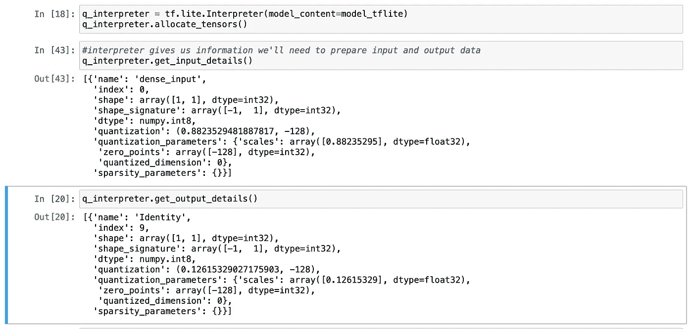

# Arduino 上的张量流

> 原文：<https://towardsdatascience.com/tensorflow-on-arduino-b336f08fa0e9?source=collection_archive---------20----------------------->

## 训练 TensorFlow 模型并将其部署到 Arduino

(图片由作者提供)

我将训练一个玩具算法，并将其部署在一台 [Arduino Nano 33 BLE Sense](https://store.arduino.cc/usa/nano-33-ble-sense) 上进行推理。我正在寻求使用最少的组件构建和测试一个 shell，并在以后进行增强。

我将使用[auto pgg 数据集](http://archive.ics.uci.edu/ml/machine-learning-databases/auto-mpg/)，训练一个模型，该模型将使用一个特征，马力，来预测车辆的每加仑英里数。我们将使用 Arduino 串行监视器与模型进行交互。

# 训练模型

[训练笔记本](https://github.com/paulbruffett/ArduinoMPGModel/blob/master/train_mpg_quant.ipynb)跟着一起走。

我不会在数据准备上花太多时间，这是一个相当简单的数据集，需要注意的是，因为我想调用它并从串行监视器获得预测，我们将只使用一个特性，马力。

因此，我们在这里丢弃了空值，分割了数据，得到了我们的标签(MPG)和我们的一个特征(马力)。

接下来，我建立我的模型。我只需要一个输入(马力)，我正在建立一个非常简单的模型，只有一个隐藏层。我也只有一个输出神经元来预测 MPG。

最后，我将保存模型，以便以后进行转换。

# 模型转换

现在我们将转换模型。在我们的 GPU 上，该模型使用 float32 数字来捕获重量和偏差，在我们的微控制器上运行非常慢，如果有的话。我们将在训练后量化模型，在训练时可以使用较小的权重和激活，这是一个单独的主题。

为了在有限的微控制器硬件上运行，我们需要转换成整数。这通常对准确性影响很小。有几个转换模型的选项；

*   float32 到 float16，这可以将模型的大小减少一半，并显著加快某些硬件上的推理速度，这意味着参数是 float16，推理是在 float32 下执行的
*   int8 参数，模型在可用时使用混合计算
*   int8 参数和激活，仅执行整数运算

一个方便的决策树和更多细节[在这里](https://www.tensorflow.org/lite/performance/post_training_quantization)。

我们想量化到后者，int8 一切与强制整数只运算。为此，我们必须生成一个有代表性的数据集。这是必需的，因为为了有效地转换 8 位值，需要线性转换为实数。对于权重，这可以自动完成，因为 TensorFlow 可以根据训练值计算每层的范围。对于激活来说，这更加困难，因为从参数来看，每一层的输出范围并不明显。如果任意选择的范围过小，值将被最小值或最大值截断，如果范围过大，精度将会损失。

TensorFlow 使用代表性数据集来执行激活的计算并转换它们。

在这里，我们将测试数据集转换成张量，并在我们的 representative_dataset 函数中使用它，调用时会产生一条记录。

我们实际上在这里保存了两个模型，一个只是转换为 TFLite 格式，但保持权重和激活为 float32，因此我们可以看到它如何影响准确性。然后，该模型与量化一起保存，只强制 int(因为如果没有指定，它可以退回到 float32 进行不支持的操作)。提供代表性数据集，转换并保存模型。

加载并显示输入和输出细节显示量化标度和零点。当调用模型时，我们将使用这些来适当地准备输入和输出。这可以在我们评估量子化模型时看到。

在这里，我们捕获上面显示的输入和输出细节，然后在将测试数据转换为整数之前，使用刻度和零点来调整测试数据。在执行推理之后，我们对模型的输出进行同样的操作。

# 尺寸和精度

现在我们已经得到了模型的训练、转换和一些样本的精度，那么模型的大小和对精度的影响会有多大的不同呢？

就精确度而言，我们可以看到它是最小的，TFLite 和未转换的模型是相同的，这是我们所期望的，因为没有发生量子化。对于未量化的模型，量化的模型精度最低，MSE 为 23.871 至 24.809。因为这是一个非常小且不复杂的模型，量化也没有减少模型的大小，只节省了 228 字节。对于具有更多层和神经元的模型，将节省更多空间。

现在我将使用 [xxd](https://ss64.com/osx/xxd.html) 将模型从 TFLite 转换为文件的十六进制转储，允许我们将模型直接复制并粘贴到 Arduino 程序中。

这个十六进制转储的输出可以直接复制到 Arduino 程序的 model.ccp 文件中。内容和 g_model_len 都必须相加匹配，如下图；

# Arduino 程序

包含 [mpgModel.ino](https://github.com/paulbruffett/ArduinoMPGModel/blob/master/mpgModel.ino) 的[回购](https://github.com/paulbruffett/ArduinoMPGModel)。

现在我们有了模型，让我们一步一步地在控制器上调用它。

所有有趣的事情都发生在 autoTest.ino 中。这建立了我们的环境，并通过捕获输入和调用模型进行循环。首先，我们需要导入我们需要的操作。

这个模型不需要太多的操作，其他模型会有嵌套的名称空间，并调用特定的架构，如 max pooling 和 conv 层。kTensorArenaSize 是分配给模型的内存量。到目前为止，除了试错法之外，还没有一种非常好的方法来估计这一点；减少数量，直到模型崩溃。

## 模型设置

现在我们需要分配模型的内存，配置指针并检查模式版本。

TensorFlow lite 提供了报告和日志挂钩，我们将设置它，在检查中使用它来确保模式版本与模型匹配。我们分配内存并获取指针。

## 调用模型

更有趣的是在我们的循环中调用模型。

我们获取输入，并将其解析为浮点数。就像我们评估模型时一样，我们必须缩放和更新零点，同时将浮点输入转换为整数。然后将此作为输入提供给模型。模型(解释器)在输入时被调用，我们确保一切正常。

输出从其输出张量中捕获并存储，但在转换回浮点数之前，必须用更新的零点进行缩放。

然后，我们打印预测以及一系列可选信息，显示我们的输入是如何修改的，以及量化前后的输出是什么样子。