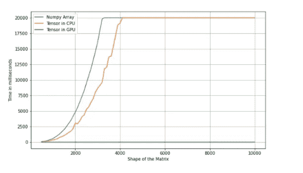

# 张量和阵列

> 原文：<https://towardsdatascience.com/tensors-and-arrays-2611d48676d5?source=collection_archive---------16----------------------->

## 有什么区别？


照片由 [Aditya Chinchure](https://unsplash.com/@adityachinchure?utm_source=medium&utm_medium=referral) 在 [Unsplash](https://unsplash.com?utm_source=medium&utm_medium=referral) 拍摄

所以我正在 Coursera 上学习深度学习专业。课程讲师吴恩达一直在滔滔不绝地讲述 Numpy 数组，以至于我可以在脑海中描绘出它的样子。

突然，他说，“这是一个张量”。我看了看输出…停了。然后想…“老兄，这只是一个该死的数组…你为什么不直接说这是一个数组。显摆！”。我真的认为他只是在向我炫耀他丰富的知识，阐述深度学习术语，但每当他提到张量时，我背上的汗毛就开始竖起，这迫使我研究两者之间的差异。

## 数组

为了掌握数组，我们最好访问 Python 中的 NumPy 库。NumPy ( *Numerical Python* )库是一个开源的 Python 库，是在 Python 中处理数字数据的事实上的标准。因此，NumPy 是许多数据科学工作中非常重要的一部分，并在其他库中广泛使用，如 Pandas、SciPy、Matplotlib 和 Scikit-Learn。

我建议我们引用 NumPy 的原因是数组数据结构是 NumPy 库的核心。根据 NumPy 文档，数组可以被描述为"*值的网格，它包含关于原始数据、如何定位元素以及如何解释元素的信息。它有一个元素网格，可以通过各种方式在*<https://numpy.org/doc/stable/user/quickstart.html#quickstart-indexing-slicing-and-iterating>**中进行索引。元素都是同一类型，称为数组* `*dtype*` *。*”。*

```
*import **numpy** as **np** array = np.array([
[[1,2,3],    [4,5,6],    [7,8,9]],
[[11,12,13], [14,15,16], [17,18,19]],
[[21,22,23], [24,25,26], [27,28,29]]
])
**print**(f"Data type: {type(array)}\nShape:{array.shape}\nArray:\n{array}")Data type: <class 'numpy.ndarray'>
Shape: (3, 3, 3) 
Array: [
[[ 1  2  3]   [ 4  5  6]   [ 7  8  9]]
[[11 12 13]   [14 15 16]   [17 18 19]]
[[21 22 23]   [24 25 26]   [27 28 29]]
]*
```

*这与标准的 Python 列表不同，因为 Python 列表可以在单个列表中包含不同的数据类型，而 NumPy 数组中的所有元素必须是同质的。其他差异因素包括，数组比 Python list 更快、更紧凑、占用内存更少、更方便，因此允许代码进一步优化。*

## *张量*

*同样，我们将通过[张量流](https://www.tensorflow.org/)来探索张量。TensorFlow 文档声明" *TensorFlow 是一个用于机器学习的端到端开源平台。它有一个全面、灵活的工具、库和社区资源的生态系统，让研究人员推动最先进的 ML，开发者轻松构建和部署 ML 驱动的应用*。*

*好吧，这里没有太多关于张量的内容，但是这个框架的总体目标是让机器学习变得容易理解。*

*文档将张量描述为多维数组——你能明白为什么我对我们的老师吴恩达感到失望了吗？它基本上和 NumPy 数组是一样的，不是吗？让我们先把前面的数组转换成张量。*

```
*import **tensorflow** as **tf**tensor = tf.convert_to_tensor(array, dtype=tf.int32)
**print**(f"Data type: {type(tensor)}\nShape: {tensor.shape}\nTensor:\n{tensor}")Data type: <class 'tensorflow.python.framework.ops.EagerTensor'>
Shape: (3, 3, 3)
Tensor: [
[[ 1  2  3]   [ 4  5  6]   [ 7  8  9]]   
[[11 12 13]   [14 15 16]   [17 18 19]]   
[[21 22 23]   [24 25 26]   [27 28 29]]
]*
```

*等一下。这个数据类型到底是什么？在这一点上，我感到困惑，但也很想找到答案。*

*凭借一些快速的谷歌搜索技巧，绝非巧合，我偶然看到了著名的杰森·布朗利先生的博客—[machine learning mastery](https://machinelearningmastery.com/)——以下是他所说的话*

> *“张量是向量和矩阵的推广，很容易理解为多维数组。向量是一维或一阶张量，矩阵是二维或二阶张量— [机器学习张量介绍](https://machinelearningmastery.com/introduction-to-tensors-for-machine-learning/#:~:text=A%20tensor%20is%20a%20generalization,is%20known%20as%20a%20tensor.)*

*这仍然没有告诉我为什么我宁愿使用张量而不是数组。幸运的是，我看到了一篇由[Apoorv Yadav](https://medium.com/u/c9429ff63e49?source=post_page-----2611d48676d5--------------------------------)—[*NumPy 数组与 Tensors*](https://medium.com/thenoobengineer/numpy-arrays-vs-tensors-c58ea54f0e59) 有什么不同吗—他进行了我们下面要进行的测试，并给出了两个声明性语句:*

1.  *如果你打算使用 GPU，张量是一个更合适的选择，因为它可以驻留在加速器内存中。*
2.  *张量是不可变的*

*实际上，我只需要知道。*

## *实验*

*为了重现 Apoorv 所做的实验，我们首先必须用 step 100 创建一个从[500，500]到[10000，10000]的不同形状，然后开始变魔术(代码如下)…*

*运行代码后，以下是可视化格式的输出…*

**

*上面运行代码的输出*

*正如你所看到的，存储在 GPU 中的张量比它的对手要快得多。*

> *张量与 NumPy 的 ndarrays 类似，只是张量可以在 GPU 或其他专门的硬件上运行以加速计算— [Pytorch 文档](https://pytorch.org/tutorials/beginner/blitz/tensor_tutorial.html#sphx-glr-beginner-blitz-tensor-tutorial-py)*

*除此之外，我还发现了一个很好的 [StackExchange](https://math.stackexchange.com/questions/1134809/are-there-any-differences-between-tensors-and-multidimensional-arrays) 的讨论，它比关于张量和多维数组在更技术性方面的区别更深入。我想总的要点是，如果你对某事不确定，并且它困扰着你，那么你最好跟随你的好奇心——现在我知道了数组和张量之间的区别，这是一个很大的宽慰。*

*我希望你觉得这很有用。在 [LinkedIn](https://www.linkedin.com/in/kurtispykes/) 或 [Twitter](https://twitter.com/KurtisPykes) 上与我联系。*

## *参考*

*<https://machinelearningmastery.com/introduction-to-tensors-for-machine-learning/#:~:text=A%20tensor%20is%20a%20generalization,is%20known%20as%20a%20tensor>  <https://medium.com/thenoobengineer/numpy-arrays-vs-tensors-c58ea54f0e59>  <https://math.stackexchange.com/questions/1134809/are-there-any-differences-between-tensors-and-multidimensional-arrays>  <https://numpy.org/doc/stable/user/absolute_beginners.html>   *