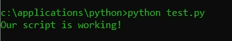

# 面向绝对初学者的终端/控制台/命令行

> 原文：<https://towardsdatascience.com/terminals-consoles-command-line-for-absolute-beginners-de7853c7f5e8?source=collection_archive---------25----------------------->

## 命令行使用简介

这家伙甚至把他的终端矩阵涂成绿色(图片由[克里斯蒂娜·莫里路](https://www.pexels.com/@divinetechygirl)在[像素](https://www.pexels.com/photo/photography-of-person-typing-1181675/)上拍摄)

你可能以前见过类似矩阵的终端屏幕。也许是电影里的某个家伙，穿着黑色连帽衫，坐在灯光昏暗的房间里，咕哝着“我在”黑五角大楼之类的话。

可悲的是，现实并没有那么酷。另一方面，使用终端的能力是我们工具箱中的一个无价工具。无论你是做开发还是做数据科学家；很多 [**软件**](https://mikehuls.medium.com/dramatically-improve-your-database-inserts-with-a-simple-upgrade-6dfa672f1424) 我们 [**日常使用**](https://mikehuls.medium.com/version-control-your-database-part-1-creating-migrations-and-seeding-992d86c90170)**依赖于终端。一些常见的例子包括:**

*   **使用 pip 安装 Python 包或创建虚拟环境**
*   **用 Docker 构建图像和运行容器**
*   **使用 git**
*   **执行程序**
*   **构建您的代码**

**如果你是一名开发人员或数据科学家，并且想要专业化，编写生产就绪的代码，那么你将需要能够使用终端来完成一些任务。在这篇文章中，我将解释终端是什么，它是做什么的，它为什么存在，以及你如何使用它来使你的生活更容易。最后，你会明白什么是终端，它是如何工作的。您将能够浏览您的文件系统，执行程序，甚至创建文件！**

# **开始之前**

**如果您对本文中的任何术语不熟悉，请查阅本文****以获得编程中大多数事情的概述。另外:在这篇文章中，我使用了终端这个词。也可以使用*控制台*或*命令行*；它们是同义词。最后，我将使用与 Windows 相关的例子，但原理在 MacOS 或 Linux 中是相同的。******

# ******什么是终端？******

******你的电脑使用命令。如果你点击 Windows 资源管理器，电脑会收到一个命令，告诉它打开资源管理器。然后它打开程序并在屏幕上显示。你屏幕上的按钮，你看到的文件夹和你的桌面只是这些命令的一个*界面*。如果你可以双击 chrome，你就不用写命令了。******

************

******最著名的码头(图片由 [Markus Spiske](https://unsplash.com/@markusspiske) 在 [Unsplash](https://unsplash.com/photos/iar-afB0QQw) 上拍摄)******

******不过，有时你需要使用没有桌面界面的电脑。想象一下运行数据库的服务器。终端允许你控制计算机，而不需要界面来帮助你制定命令；你可以直接输入它们。打开终端后，我们将看到一个示例。******

## ******打开终端******

******有接口的计算机总是有一个终端。让我们看看它是什么样子的！在你的系统中搜索“终端”，我相信你会找到答案→点击它(在 Windows 中它被称为*命令提示符*，在其他系统中它很可能被称为*终端*。看到刚刚弹出的那个有白色文本和闪烁下划线的大黑盒子了吗？那是你的终端。别担心，在这里打东西不会弄坏你的笔记本电脑。让我们看看它能做什么。******

# ******使用终端******

******在终端中，你可以写命令让计算机执行。它允许你做任何你通常可以用界面做的事情(甚至更多)。除了点击按钮启动 chrome，你还可以发出命令`start chrome`(如果你已经安装了 Chrome)。你甚至可以调用`start chrome https://mikehuls.medium.com`来打开特定的[页面](https://mikehuls.medium.com)。******

## ******航行******

******在 Windows 资源管理器中，您可以双击文件夹来打开该文件夹并查看其内容。也可以在终端中从一个文件夹导航到另一个文件夹:******

*   ******`cd`更改目录******
*   ******`dir`显示文件夹内容(在 MacOS 和 Linux 中为`ls`******

******现在我们将测试这两个命令:打开一个终端并执行以下命令:******

*   ******使用`cd c:/`进入根目录(或在 MacOS/Linux 上`cd /`)******
*   ******用`dir`检查内容(MacOS/Linux `ls`)******
*   ******选择其中一个目录(例如*用户*并输入`cd chosenfoldername`******
*   ******用`dir` (MacOS/Linux `ls`)再次检查内容******

******您刚刚从根文件夹导航到一个子文件夹！但是如果我们想回去呢？在 windows 资源管理器中有一个方便的后退按钮。我们可以使用`cd ..`来‘上升’一级。在`c:/this/is/a/folder`中调用该命令将导航到`c:/this/is/a`。******

******最后一件事是，我们可以一次浏览多个文件夹。如果你在根目录中，你可以简单地调用`cd c:/a/very/deep/path`。在一个命令中导航 4 个文件夹！请注意，这与在 Windows 资源管理器工具栏中键入路径是一样的。******

************

******典型的终端用户(图片由[像素](https://www.pexels.com/photo/green-and-white-lights-5473951/)上的 [cottonbro](https://www.pexels.com/@cottonbro) 提供)******

## ******执行程序******

******好了，我们已经知道了在资源管理器中双击一个文件夹和执行 cd 是一样的，但是如何执行一个程序呢？首先我们需要一个程序来执行。让我们从 [**python 网站**](https://www.python.org/downloads/) 安装 Python。******

****一旦安装完毕，你应该能够执行`python — version`。这已经是执行程序的例子了。我们已经执行了 python，并要求它还给我们它的版本。让我们更进一步。让我们用 Python 创建一个小脚本，并在终端中执行它。****

1.  ****在`c:/applications/python/test.py`创建一个文件****
2.  ****用文本编辑器(Sublime / Notepad++ / vscode 或者只是记事本)打开它，赋予它以下内容:
    `print(“Our script is working!”)`。一定要保存好。****
3.  ****使用
    `cd c:/applications/python`导航到包含脚本的文件夹****
4.  ****执行`dir`(或`ls`，如果你在 MacOS 或 Linux 上)应该会显示我们新创建的`test.py`文件****
5.  ****执行`python test.py`。这个命令告诉机器用 Python 执行我们的文件。我们应该看到回报(“我们的脚本正在工作！”)在终端！(我们也可以从另一个位置调用这个脚本，但是我们必须指定完整的路径:`python c:/applications/python/test.py`)。****

********

****从我们的终端运行 python 脚本(图片由作者提供)****

****我们已经成功地从我们的终端执行了一个 python 程序！****

## ****额外收获:在 windows 中创建文件****

****在上面的代码中，我们手动创建了 python 文件(test.py)。呸。我不想用鼠标！让我们学习如何编写简单的文件(更复杂的文件肯定需要文本编辑器)。****

****查看“echo”命令。它只是通过在终端中打印文本来回应您刚刚键入的内容:`echo Hello I’m just echoing you`。现在来看看这个命令:`echo print(“created this from the cmd”) > test2.py`。它告诉你的笔记本电脑`echo`打印(“从 cmd 创建的”)并把它放到一个名为 test2.py 的文件中(这就是>的作用)。如果你现在`dir`你会发现你的目录中有另一个文件。用`python test2.py`执行它，看看它做什么！****

## ****系统路径****

****很高兴知道:机器如何知道只使用 Python 命令来执行 Python？这是由我们的路径变量解决的；Windows 中的一种设置，列出当提供某个键时要调用的可执行文件(即程序)。****

****如果我们调用`python test.py`，windows 会检查 path 变量中是否有一个名为“python”的键，然后将参数(test.py)传递给它找到的可执行文件(很可能类似于`C:\Program Files\Python39\python.exe`)。Python 安装程序在安装时创建了这个路径变量。****

********

****由于我们现在只使用键盘，这个小家伙可以休息一下了(图片由 [Pixabay](https://www.pexels.com/@pixabay) 在 [Pexels](https://www.pexels.com/photo/animal-cute-little-mouse-301448/) 上提供)****

# ****结论****

****我希望 a 能让航站楼少一点恐怖，让你的生活轻松一点！我希望这篇文章是清楚的，但如果你有建议/澄清，请评论，以便我可以做出改进。同时，看看我的其他关于各种编程相关主题的文章，比如:****

*   ****[适合绝对初学者的 Docker](https://mikehuls.medium.com/docker-for-absolute-beginners-what-is-docker-and-how-to-use-it-examples-3d3b11efd830)****
*   ****[Docker 为绝对初学者编写](https://mikehuls.medium.com/docker-compose-for-absolute-beginners-how-does-it-work-and-how-to-use-it-examples-733ca24c5e6c)****
*   ****[把你的代码变成一个真正的程序:使用 Docker 打包、运行和分发脚本](https://mikehuls.medium.com/turn-your-code-into-a-real-program-packaging-running-and-distributing-scripts-using-docker-9ccf444e423f)****
*   ****[Python 为什么慢，如何加速](https://mikehuls.medium.com/why-is-python-so-slow-and-how-to-speed-it-up-485b5a84154e)****
*   ****[Python 中的高级多任务处理:应用线程池和进程池并进行基准测试](https://mikehuls.medium.com/advanced-multi-tasking-in-python-applying-and-benchmarking-threadpools-and-processpools-90452e0f7d40)****
*   ****[写你自己的 C 扩展来加速 Python x100](https://mikehuls.medium.com/write-your-own-c-extension-to-speed-up-python-x100-626bb9d166e7)****
*   ****【Cython 入门:如何在 Python 中执行>每秒 17 亿次计算****
*   ****[使用 FastAPI 用 5 行代码创建一个快速自动记录、可维护且易于使用的 Python API](https://mikehuls.medium.com/create-a-fast-auto-documented-maintainable-and-easy-to-use-python-api-in-5-lines-of-code-with-4e574c00f70e)****

****编码快乐！****

****—迈克****

****页（page 的缩写）学生:比如我正在做的事情？[跟我来](https://mikehuls.medium.com/membership)！****

**** [## 通过我的推荐链接加入 Medium—Mike Huls

### 作为一个媒体会员，你的会员费的一部分会给你阅读的作家，你可以完全接触到每一个故事…

mikehuls.medium.com](https://mikehuls.medium.com/membership)****