# 地形 101

> 原文：<https://towardsdatascience.com/terraform-101-d51437a3170?source=collection_archive---------14----------------------->

## 地形基本概念的简单指南


阿迪·戈尔茨坦在 [Unsplash](https://unsplash.com/s/photos/code?utm_source=unsplash&utm_medium=referral&utm_content=creditCopyText) 上的照片

如果您是一名 DevOps 工程师或在日常工作中必须处理 DevOps 相关工作的人，我相信您一定听说过基础设施即代码(IaC)的概念。简单地说，IaC 是从天上掉下来的东西，用来帮助每天都在奋斗的 DevOps 工程师。IaC 是一种使用机器可读的定义文件来管理和配置整个 IT 基础架构的方法。使用编程脚本，有助于整个 IT 基础设施的自动化。IaC 有很多好处。它允许在配置基础设施时更快地执行，有助于降低与实施基础设施相关的成本和风险，具有对变更的完全可追溯性，等等。

目前市场上有几种 IaC 工具。今天我要解释一下 Terraform，它引起了许多 IT 工程师的注意。

根据官方的地形文件，

> Terraform 是一个安全有效地构建、更改和版本控制基础设施的工具。Terraform 可以管理现有的和受欢迎的服务提供商以及定制的内部解决方案。

它是由[哈希公司](https://www.terraform.io/)开发的开源 IaC 工具。它看起来很像 CloudFormation，用于自动化 AWS 基础设施。你也可以在其他云服务上使用 Terraform。Terraform 创建一个执行计划，解释它将如何达到所需的状态，然后实施它来构建指定的基础架构。Terraform 可以决定随着配置的变化而改变的内容，并建立可以实施的逐步执行计划。

# 基本原则

## 语言

*   *输入变量* —用作 Terraform 模块的参数，因此用户可以自定义行为而无需编辑源代码
*   *模块* —充当一起使用的多个资源的容器。这是一种打包和重用资源配置的方法。
*   *资源* —记录声明资源的语法
*   *数据源* —允许提取或计算数据，用于地形配置中的其他地方
*   *输出值* —地形模块的返回值
*   *局部值*——为表达式指定一个简称的便利特性

## 命令

*   **terraform init** —初始化包含所有配置文件的工作目录
*   **terraform validate** —验证目录中的配置文件
*   **地形计划** —创建执行计划，以达到基础设施的预期状态
*   **terraform apply** —按照计划中的定义对基础设施进行更改
*   **地形破坏** —删除所有旧的基础设施资源

# 我们开始吧！


照片由 [Jukan Tateisi](https://unsplash.com/@tateisimikito?utm_source=unsplash&utm_medium=referral&utm_content=creditCopyText) 在 [Unsplash](https://unsplash.com/s/photos/start?utm_source=unsplash&utm_medium=referral&utm_content=creditCopyText) 上拍摄

## 1.设置 AWS 凭据

对于本教程，我将使用 AWS 平台。为了连接我们的 AWS 帐户和 Terraform 代码，我们需要设置 AWS 用户凭证。确保您使用的用户凭据能够访问您要调配的资源。获得具有适当权限的 IAM 用户的 AWS 访问密钥和秘密访问密钥，并将其保存在安全的地方。我们将在教程的后面需要它。

## 2.安装地形

由于我使用的是 Linux，我将在本教程中提供在 Linux 发行版中安装 Terraform 的必要命令。对于其他操作系统，请访问[此网页](https://learn.hashicorp.com/terraform/getting-started/install.html)安装 Terraform。

添加哈希公司 [GPG 键](https://apt.releases.hashicorp.com/gpg) —

```
curl -fsSL https://apt.releases.hashicorp.com/gpg | sudo apt-key add -
```

添加官方的 HashiCorp Linux 库—

```
sudo apt-add-repository “deb [arch=amd64] https://apt.releases.hashicorp.com $(lsb_release -cs) main”
```

更新和安装—

```
sudo apt-get update && sudo apt-get install terraform
```

验证安装—

```
terraform -help
```

## 3.编写您的第一个地形脚本

因为我们正在处理 AWS，所以我们需要提供之前检索的凭证来连接我们各自的 AWS 资源。要在命令行工作区中设置 AWS 凭证，

```
export AWS_ACCESS_KEY_ID=(access key)
export AWS_SECRET_ACCESS_KEY=(secret access key)
```

Terraform 可以在多个平台或提供商上构建基础设施，如 AWS、Azure、Google Cloud、DigitalOcean 等。通常，使用 Terraform 的第一步是设置您想要使用的提供者。创建一个名为 aws.tf 的文件，并将下面的代码插入其中。

作为第一步，我们将学习如何在 AWS 中部署一个简单的 EC2 实例。Terraform 有关于他们的语言、语法、资源等的详细说明文件。下面提到的是部署 t2.micro 实例所需的代码。

注意，这只是创建 ec2 实例的简单代码片段。您可以指定许多属性，例如可用性区域、安全组、EBS 信息、私钥值等。这些属性可以在各个 hashicorp 文档的官方资源页面上找到。

**(请注意，我对每个资源使用单独的文件，因为这样便于管理和理解。您可以将 aws.tf 文件和 ec2.tf 文件内容复制并粘贴到一个名为 main.tf 的文件中，并获得相同的输出。)**

在终端中，转到您创建 ec2.tf 和 aws.tf 的文件夹，运行 **terraform init** 命令。

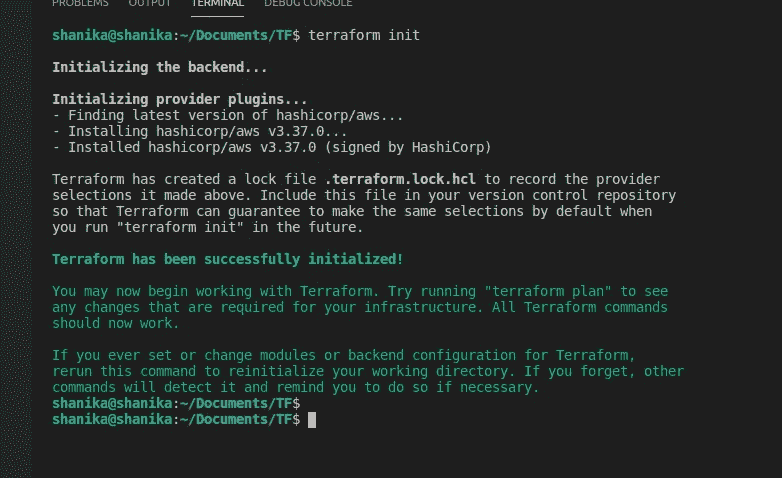

**terraform init** 命令创建一个工作目录，其中可以找到 terraform 配置文件。在创建新的 Terraform 配置或从版本控制中克隆现有配置后，您必须首先运行此命令。多次使用该命令是合适的。

你可以运行 **terraform validate** 来确保你的代码是有效的。如果语法中有任何错误或缺少数据，将会显示。


我们的代码被初始化和验证。我们可以运行**地形计划**来查看执行计划。这是在执行更改之前仔细检查它们的一个极好的方法。如果不指定任何 VPC、子网 id，此配置将在默认 VPC 中创建具有各自默认值的资源。

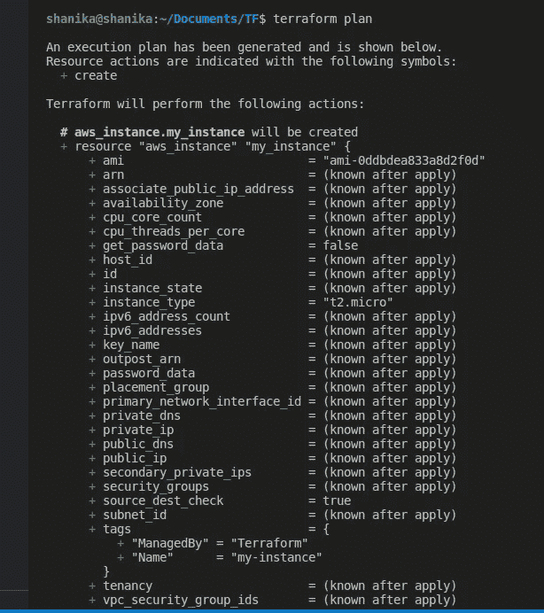

要实际创建资源，运行 **terraform apply** 。

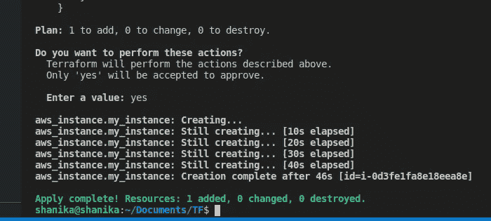

如您所见，在 Terraform 的帮助下，我们已经成功创建了第一个 ec2 实例。如果您导航到您的 AWS 控制台，您会看到类似这样的内容。

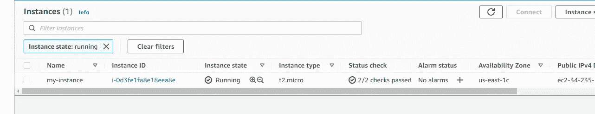

假设您需要更改实例中的某些内容。您可以编辑 ec2.tf 文件并再次运行**地形计划**。它将向您显示将要创建、修改或删除的内容。如果我想添加一个新的 Env 标签，这就是执行计划的样子。

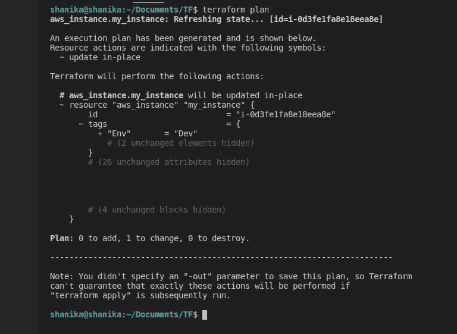

## 4.如何编写模块

现在你对 Terraform 的工作原理有了一点了解，在这一节中，我将解释如何编写和使用 Terraform 模块。

假设您在一家处理多个 AWS 资源的公司工作。例如，开发环境有 5 个实例，QA 环境有另外 5 个实例，等等。我们可以创建模块并重用作为模板的代码，而不是编写相同的 terraform 资源块。

在当前工作目录中，创建一个名为“模块”的文件夹。在其中创建两个名为“开发实例”和“质量保证实例”的文件夹。我将在教程的最后留下这个项目的 GitHub 链接。您可以在该存储库中找到文件结构和所有这些文件。

为了将模块彼此分开，我在 dev-instance 模块中指定了一个名为“Dev”的标记，在 qa-instance 模块中指定了一个名为“QA”的标记。因此，当我们使用这些模块时，这些标签将被添加到各自的资源中。我还在两个模块中更改了根 ebs 卷的大小。


dev-实例模块 main.tf 文件

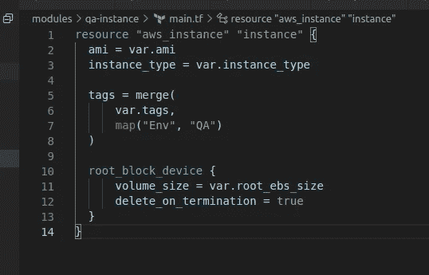

QA-实例模块 main.tf 文件

当我们使用模块时，ec2.tf 文件应该这样改变。与上一节不同，现在我们使用模块块来创建资源。如果你使用一个模块块，必须提供该模块的源代码。在我们的例子中，它是我们先前在本地定义的模块。可以提供 Github、Bitbucket、HTTP URLs、Terraform Registry 等不同的源码类型。

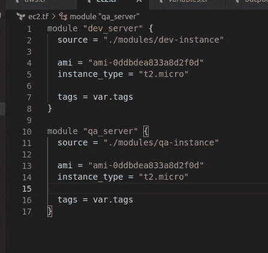

ec2.tf 文件

如您所见，我在这个脚本中使用了变量。变量在一个名为 variables.tf 的单独文件中定义。您可以使用自己提供的唯一名称在脚本中的任何地方使用它们。Eg- var.ami_id，var.instance_type。您可以在模块定义中提供一个默认的 AMI ID，在 variables.tf 文件中作为一个变量，或者像我在这里所做的那样手动应用一个 ID。

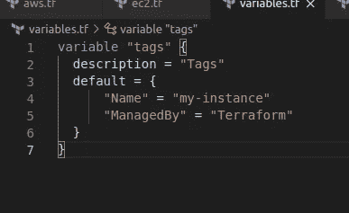

variables.tf 文件

outputs.tf 文件如下所示。模块导出的每个输出值都必须使用 output 块声明。如果您转到模块输出文件，我已经在每个模块中声明了两个输出，它们将返回实例 ID 和实例的公共 IP。现在我们正在使用模块，我们可以通过各自的模块名调用输出值，如下所示。

语法- **模块**。<模块名称>。<模块中提到的输出名称>

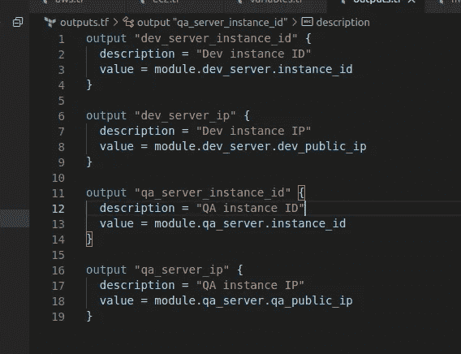

outputs.tf 文件

是时候创造这些资源了。你必须运行 **terraform init** 来初始化新创建的模块。

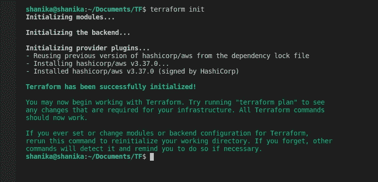

运行 **terraform validate** 来检查我们的脚本配置是否有效。如果有效，运行**地形计划**查看执行计划。

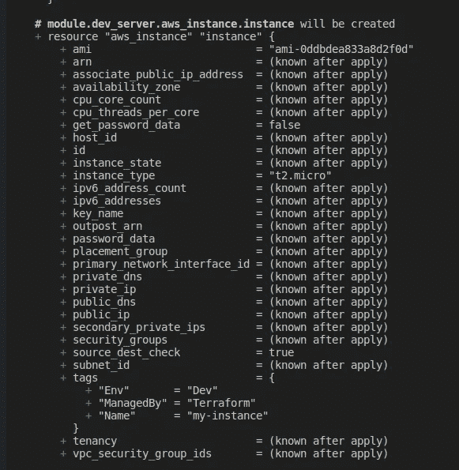

module.dev_server 的环境标记为“dev ”,而 module.qa_server 的环境标记为“qa ”,这是我们在模块中单独指定的。

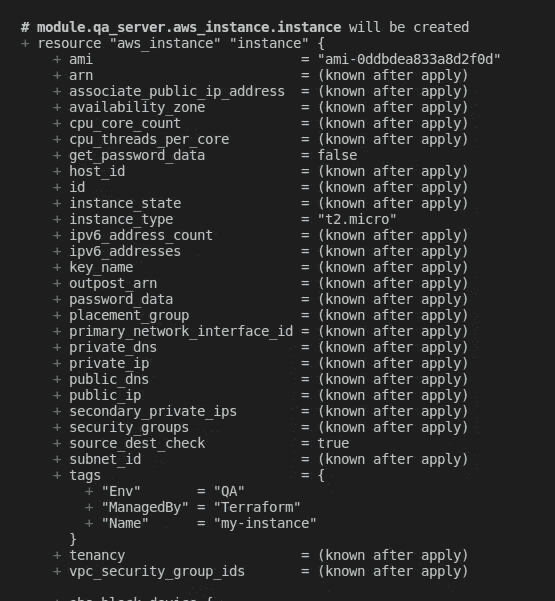

当您有一个 outputs.tf 文件时，您将在 terraform 计划中看到返回值，如下所示。

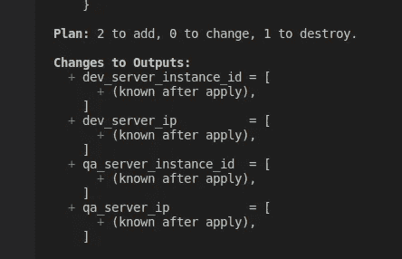

当您完成 Terraform 的实验后，请确保清理环境，以防止不必要的成本。只需运行 **terraform destroy** ，它也会显示你要销毁的资源。如果你确定，输入 **yes** 指定的资源将被销毁。

Github 链接—[https://github.com/Shani1116/terraform-101](https://github.com/Shani1116/terraform-101)

恭喜😻最后，你现在对使用 Terraform 有了一个基本的了解。但是我们才刚刚开始触及表面。以后我会发表更多与 Terraform 相关的博文。我错过了什么？请在评论中告诉我，我会添加进去的。保持联系，获取更多精彩内容！