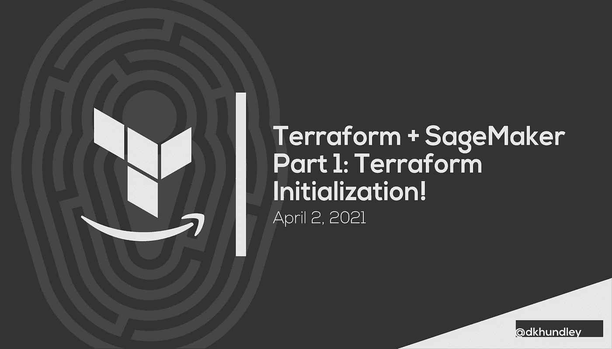
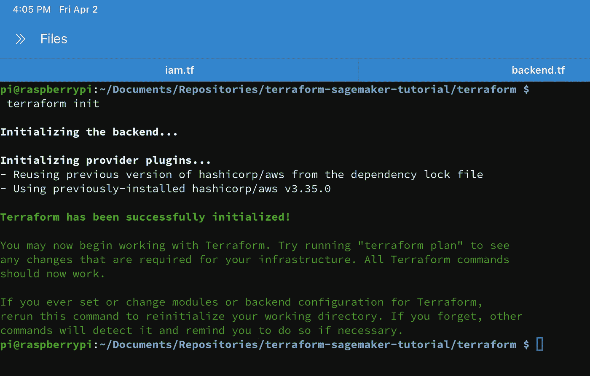
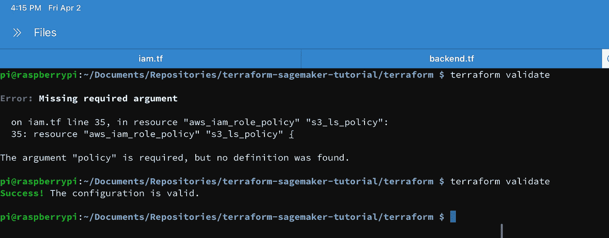
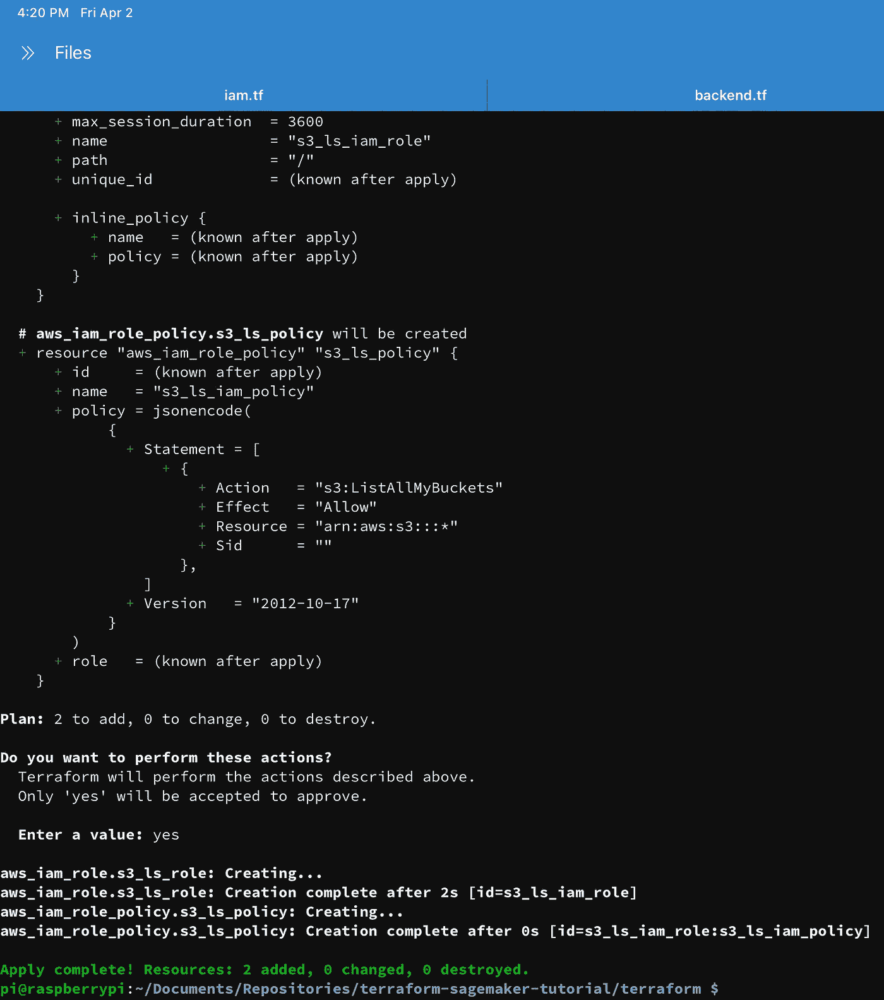
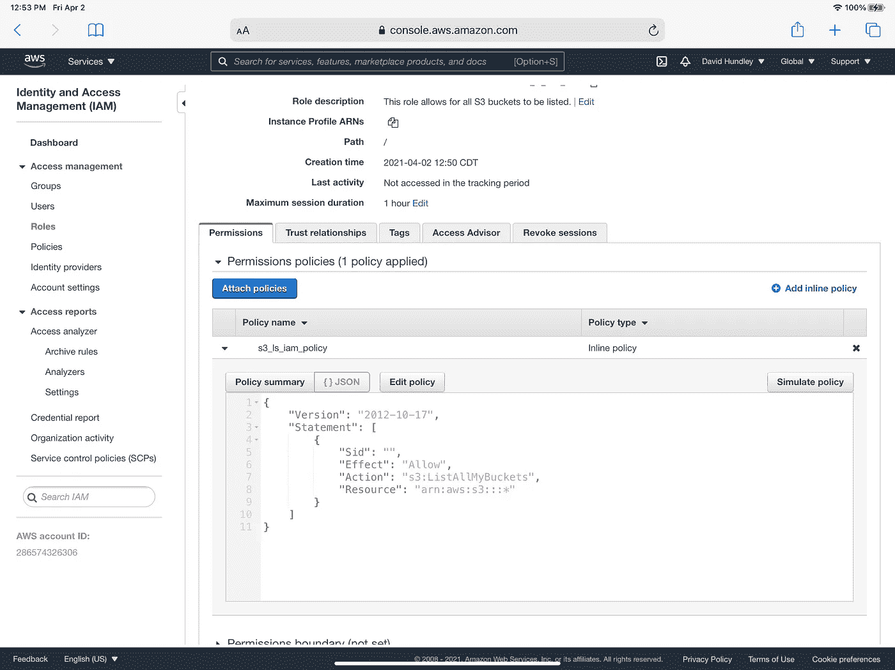
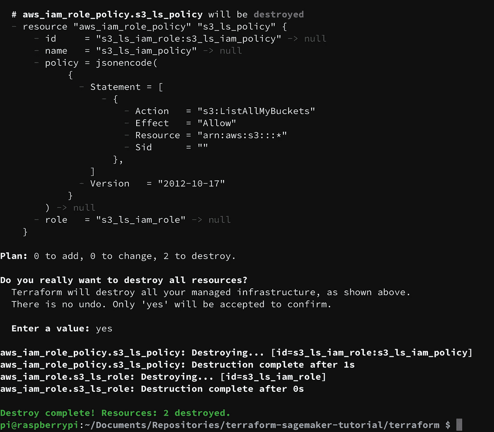

# Terraform + SageMaker 第 1 部分:Terraform 初始化

> 原文：<https://towardsdatascience.com/terraform-sagemaker-part-1-terraform-initialization-a6470611ea92?source=collection_archive---------8----------------------->



## Terraform + SageMaker

## 帮助您开始使用 Terraform 在 AWS SageMaker 上创建资源

大家好。今天，我们开始了一个关于使用 Terraform 在 AWS SageMaker 上创建资源的新系列。我想你可能很熟悉 SageMaker 是什么，即使只是非常一般的水平。简单来说，SageMaker 就是 AWS 的机器学习服务。多年来，AWS 在这一特定服务上投入了大量精力，显然是为了应对数据科学/机器学习实践在所有行业中的爆炸式增长。跟上这种增长有点困难！甚至我也很乐意承认我对 SageMaker Studio 这样的新东西不太熟悉，但我很高兴能在这个新系列的帖子中与大家一起了解更多。

即使你对 SageMaker 有一个大概的了解，你也可能不知道 Terraform 是什么。说实话，我自己也不知道 Terraform，直到我工作的公司采用了它。Terraform 是 HashiCorp 创建的“基础设施代码”产品，用于将基础设施资源部署到各种平台上。它本身并不是一个 AWS 产品，但它被设计成可以很好地与 AWS 交互。

很自然地，我希望你问自己这样一个问题，“为什么是 Terraform？”我们将在下一节中介绍这一点，在接下来的几节中，我们将开始使用 Terraform 在 AWS 上创建您的第一个资源。显而易见，在第一篇文章中，我们不会触及 SageMaker，但是我们为后面的文章打下了基础。相信我，你不会想错过这篇文章的！

至此，让我们开始讨论为什么我们要使用 Terraform。

# 为什么是 Terraform？

当您与 AWS 控制台交互来做诸如创建 S3 桶、提供 EC2 实例或几乎所有其他事情时，您基本上是在发出软件命令来创建资源。AWS 控制台可以很好地指导您理解如何正确地提供给定的资源。但是控制台并不适合一次性创建或销毁大量资源。因为 AWS 控制台基本上是执行软件命令来创建这些基础设施资源，所以我们可以创建软件脚本来自动化这些资源的创建，就像我们自动化软件所能做的任何事情一样。

因此，如果你像我一样是一个初学者，你可能不希望在不使用 AWS 资源时让它们一直运行。如果设置正确，Terraform 可以帮助您快速设置或在几秒钟内吹走您的资源。想想在控制台界面中设置一个 S3 存储桶需要多长时间。有了 Terraform，我可以在比一个人在控制台上创建一个 S3 桶更短的时间内创建一个完整的资源库。不错！

如果你参加过任何 AWS 认证，你可能还记得 AWS 有自己的名为云形成的服务，可以让你做到这一点。你可能会合理地问，为什么我们要使用地形而不是云的形成。不要误解我，云形成是一项伟大的服务，但 Terraform 提供了云形成的许多其他好处。其中一些包括以下内容:

*   **平台不可知**:虽然我们在这个系列中只使用 AWS，但是 Terraform 也可以在其他平台上提供资源，包括谷歌云平台、微软 Azure 等等。您不一定能够在其他平台上使用您的 AWS Terraform 脚本，但是因为 Terraform 是它自己的脚本语言，所以这些知识可以很好地移植到其他平台上。
*   **状态管理** : Terraform 提供了一些非常健壮的选项来维护你的资源状态。我们将在下一节中详细讨论这一点，但如果您使用 HashiCorp 的更高级的产品，如 Terraform Cloud 或 Terraform Enterprise，您确实可以使用这种状态管理做一些非常高级的事情。说到高级的东西…
*   **前哨政策**:这是我们不会在本系列中讨论的高级主题和高级功能之一，但是前哨政策基本上执行所有 Terraform provisioners 必须遵守的某些规则。假设您为一家大型公司工作，该公司需要为部署的每项资源指定一组特定的标记。创建一个前哨政策可以帮助以非常简化的方式实现这一点！

好处太多了，无法一一列举。虽然上面提到的那些高级特性不是免费的，但是我们可以免费使用标准的 Terraform 命令行操作。当然，您在 AWS 上提供的资源可能不是免费的，但是发出我们将在本系列中学习的 Terraform 命令是没有成本的。

在我们开始初始化 Terraform 之前，让我们简单地谈谈状态管理。

# 地形状态管理

当我们在自己选择的平台上创建资源时——在我们的例子中是 AWS——terra form 以一个 **Terraform 状态文件**的形式管理它所提供的资源。Terraform 状态文件通常是一个以`.tfstate`后缀结尾的文件，它保存了迄今为止您使用 Terraform 脚本提供的所有信息。如果您对这些脚本中的任何一个进行调整，Terraform CLI 命令将分析`tfstate`文件，以查看它需要采取什么操作。例如，如果资源不在`tfstate`文件中，那么 Terraform 将为您创建新的资源。如果资源存在，但有一些轻微的配置更改，Terraform 将适当地更新资源，并使用新的配置信息更新`tfstate`文件。

正如你可能猜到的，这个`tfstate`文件有一些“陷阱”。首先，如果你在一个团队中合作，使用同一个`tfstate`文件来提供各种资源，那么你就冒着基本上踩到对方的脚趾并破坏你的`tfstate`文件的风险。这是一个非常重要的考虑因素，但是由于本系列将更多地关注单用户使用，所以我不打算在本系列中讨论状态管理的这一方面。当在多人之间工作时，这仍然是一个需要考虑的非常重要的话题，所以我建议你[查看 Terraform 的网站](https://www.terraform.io/docs/language/state/index.html)以了解更多关于状态锁定以避免腐败的信息。

我们将在本帖中讨论的更重要的“问题”与`tfstate`文件本身的性质有关。正如您可能猜到的那样，`tfstate`文件可能包含非常敏感的信息，因为它基本上告诉了世界您向任何平台提供了什么。它甚至可能包含您不想公开的敏感元数据。幸运的是，Terraform 提供了许多解决方案来保证你的`tfstate`文件的安全。如果我希望你能从这一段中得到什么，那就是:**不要把你的** `**tfstate**` **文件发布到任何公共场所，尤其是 GitHub** 。坏演员就在那里，如果可能的话，他们会利用这一点。但是不用担心！在这篇文章中，我们将采取的一个行动是建立一个 S3 桶来存放你的`tfstate`文件，并且能够从你的本地机器上与它远程交互。

好了，现在我们准备好进入岗位了！让我们从设置我们需要的东西开始，以便能够正确地使用 Terraform。

# 让我们准备好使用 Terraform

为了使用 Terraform，我们需要具备以下条件:

*   安装 Terraform CLI
*   在本地机器上设置凭证以与 AWS 交互
*   为状态管理设置 S3 时段

让我们在下面的小节中快速讨论一下如何做这些事情。

## 安装 Terraform CLI

第一点非常简单明了。安装 Terraform CLI 的方法有很多，我将带您去查看 [Terraform 的官方文档](https://learn.hashicorp.com/tutorials/terraform/install-cli)。如果你一直在关注我最近的其他帖子，我实际上是在一台带有树莓 Pi“计算附件”的 iPad 上完成这篇帖子的我不仅在我的 iPad 上写这篇文章，而且我使用 Textastic 应用程序编写了 Terraform 脚本，然后将它们传输到我的 Raspberry Pi，以实际执行 Terraform 命令。太酷了！

## 在本地机器上设置 AWS 凭证

因为我们将与位于远程 S3 存储桶中的`tfstate`文件进行交互，所以您需要正确设置您的本地凭证，以便与您的 AWS 帐户进行交互。如果您之前已经设置了 AWS CLI，那么您可能已经准备好了。如果你以前没有做过，这里有官方的 AWS 文档告诉你如何设置这些证书。与`tfstate`文件一样，**请注意不要在公共场合分享这些凭证**。同样，坏演员会利用他们，他们会运行你的 AWS 法案。请像对待您的社会安全号码一样对待这些凭证。

## 为状态管理创建 S3 存储桶

至于为州管理层设置 S3 存储桶，我们在这里真的没有什么特别要做的。因为我们使用您的 AWS 凭证与 AWS 交互，所以您不必将它设为公共存储桶。事实上，我强烈建议不要将水桶公开。(也欢迎您使用预先存在的桶。)使用 AWS 控制台创建一个 bucket 非常简单，但是为了以防万一，这里有关于如何做的文档。一旦你的 S3 桶被创建，我们就准备继续前进。在下一节中，您将看到 Terraform 如何使用这个桶。

# 编写您的第一个 Terraform 文件

好吧，希望前期工作过程是相当无痛的！我们现在准备开始利用 Terraform 来创建我们的第一个资源。为了保持事情超级简单，我们将创建的唯一东西是一个超级基本的 IAM 角色，它只能列出 S3 桶。我选择教这个的原因是因为 a)它非常简单，b)我的角色在 AWS 上是免费的。所以如果你忘记删除角色，没什么大不了的。

(补充说明:我保证我们在本帖中所做的不会让你暴露任何漏洞。这不是什么秘密的“特洛伊木马”会让你的 AWS 账户对黑客开放。如果操作得当，我们正在创建的这个 IAM 角色基本上什么都不能做。我还会教你如何用 Terraform 删除资源，这样你就可以保证你的账户里不会留下任何你不想要的东西。)

如果你想看我在这篇文章中使用的精确的 Terraform 文件，[点击这里查看我的 GitHub 库](https://github.com/dkhundley/terraform-sagemaker-tutorial)。尽管这确实包含了我正在使用的 S3 bucket 的纯文本名称，但是您不能对它做任何事情，因为您没有我的 AWS 凭证。如果你选择克隆我的回购协议，你将需要更新 Terraform 后端件，以匹配您自己的相应桶。

在这篇文章中，我们不会过多地探究 Terraform 文件是如何构造的，但我们会在这里介绍一些基础知识。首先，Terraform 希望在以`.tf`后缀结尾的文件中提供资源。从技术上讲，你可以把所有你想要的东西都塞进一个单独的`.tf`文件中。如果你熟悉 Kubernetes YAMLs，这里的概念是一样的。尽管从技术上讲，你可以把所有的东西都塞进一个`.tf`文件中，但是逻辑上把它们分成你认为合适的独立文件总是有意义的。(我个人喜欢将单个 AWS 资源与直接关联的 IAM 策略/角色捆绑到它自己的文件中。)

当初始化 Terraform 以便在给定平台上使用时，Terraform 将始终寻找一个`provider`块。在这种情况下，我们使用 AWS，并将资源部署到地区`us-east-1`。(您可以根据自己的喜好更改区域，这没关系。)它将寻找的另一件事是看你是否愿意利用远程后端进行状态管理。鉴于我们已经设置了 AWS 凭证和 bucket，实际的 Terraform 文件非常简单。以下是我的脚本:

```
terraform {
  backend "s3" {
    bucket = "dkhundley-terraform-test"
    key    = "terraform-sagemaker-tutorial.tfstate"
    region = "us-east-1"
  }
}provider "aws" {
  region = "us-east-1"
}
```

这个脚本基本上是这样说的:我想将 Terraform 资源部署到 AWS(美国东部 1 区)，我想在这个给定的 bucket 中使用一个带有这个键的远程`tfstate`文件。你想叫它什么都可以。所以本质上，如果你想效仿我的做法，你唯一需要改变的就是 S3 桶的名字。

好了，这就是我们需要做的后端设置！现在，让我们快速展示我们将使用 Terraform 创建的 IAM 角色的脚本:

```
## DATA BLOCKS
## ----------------------------------------------------------------# Creating the data that will be used by the IAM policy
data "aws_iam_policy_document" "s3_ls_policy_data" {
  statement {
    actions = [
      "s3:ListAllMyBuckets"
    ]resources = [
      "arn:aws:s3:::*"
    ]
  }
}# Creating the assume role policy data
data "aws_iam_policy_document" "s3_ls_assume_role_data" {
  statement {
    actions = ["sts:AssumeRole"]principals {
      type        = "Service"
      identifiers = ["s3.amazonaws.com"]
    }
  }
}## RESOURCE BLOCKS
## ----------------------------------------------------------------# Creating the IAM policy using the data block from above
resource "aws_iam_role_policy" "s3_ls_policy" {
  name   = "s3_ls_iam_policy"
  policy = data.aws_iam_policy_document.s3_ls_policy_data.json
  role   = aws_iam_role.s3_ls_role.id
}# Creating the IAM role associated to the resources above
resource "aws_iam_role" "s3_ls_role" {
  name               = "s3_ls_iam_role"
  description        = "This role allows for all S3 buckets to be listed."
  assume_role_policy = data.aws_iam_policy_document.s3_ls_assume_role_data.json
}
```

同样，我们不会深入探究所有这些语法的含义。在高层次上，我想提出几件事:

*   **资源块**:这些是“橡胶遇到道路”的代码块，实际上提供了所需的资源。第一组引号中的字符串定义了 Terraform 定义的资源类型，因此您必须使用它们的精确语法。第二组引号中的字符串是您想要为资源指定的任意名称。因为 Terraform 允许您在 Terraform 代码的其他部分引用该资源，所以为您的资源取一个您能记住的名称总是一个好主意。
*   **数据块**:这些数据块通常用于为您计划提供的资源提供额外的配置。在这种情况下，数据块提供了应该如何设置 IAM 策略的配置。
*   **注释**:就像 Python 一样，用`#`符号开始一段代码将允许你用适当的注释来注释你的脚本。你可以看到我在上面用它们来描述每个代码块在做什么。

Terraform 提供了一个非常强大的文档库，说明如何在 AWS 上提供几乎所有的资源。(由于 AWS 不断推出新内容，Terraform 可能无法在第一天支持新的 AWS 服务，但他们非常擅长在新的 Terraform 版本中更新他们的内容。)要查看这方面的示例，[下面是我引用的文档](https://registry.terraform.io/providers/hashicorp/aws/latest/docs/resources/iam_role)来创建 IAM 角色本身。

如果你像我一样构造你的代码，你现在应该有两个 Terraform 文件:

*   后端. tf
*   iam.tf

我们将在后面的文章中讨论可重用的地形变量。现在，这个简单的设置将很好地让我们开始。现在让我们实际看看 Terraform CLI 是如何配置这些资源的。

# 使用 Terraform CLI 进行资源调配

现在是时候进入有趣的部分了！有趣是因为我们将在最后一节看到劳动成果很快变成现实。为了快速总结我们将在这些小节中做什么，让我们快速说出下面这些项目符号中的主题:

*   执行一个`terraform init`
*   验证和格式化您的`tf`文件
*   使用 Terraform 在 AWS 上创建资源
*   用 Terraform 破坏你的 AWS 资源

## 执行一个"`terraform init"`

如上所述，Terraform 将首先寻找`provider`和`backend`，以了解它应该如何正确地与您的 AWS 帐户进行交互。为了开始“交流”,你首先需要执行`terraform init`命令。它还将下载将资源部署到 AWS 所需的适当插件。如果该命令成功运行，您应该会看到以下内容:



作者截图

初始化到此为止！让我们继续验证和格式化您的文件。

## 验证和格式化您的“tf”文件

这些步骤实际上并不是必需的，但是它们有助于让您在尝试读取/调试代码时更加轻松。通过运行`terraform validate`命令，Terraform 将确保您的 Terraform 文件一切就绪，而无需实际提供任何东西。如果你把事情搞砸了，Terraform 会告诉你出了什么问题。为了让你看清楚这是什么样子，我将在我的 Terraform 中注释掉一个必需的部分。让我们看看当我运行我的`terraform validate`命令时会发生什么…



作者截图

如您所见，我第一次运行`validate`命令输出时，非常清楚地指出了我哪里出错了以及如何修复。当我第二次运行`terraform validate`命令时，Terraform 给我开了绿灯，我的东西看起来不错！

后一个命令根本不是必需的，但仍然很好。通过运行`terraform fmt`命令，Terraform 将查看您的`tf`文件，并尽可能使一切变得美好。这包括排列您的所有资源参数，使`=`符号全部对齐。同样，完全不是必需的，但我个人认为它很有帮助。

## 使用 Terraform 创建 AWS 资源

随着您的 Terraform 文件得到验证，我们终于可以使用它们在 AWS 上提供我们的资源了！现在，如果您想在正式创建资源之前了解它们将如何变化，运行`terraform plan`命令是个好主意。这个命令将清楚地说明事情将如何变化。这里有一个例子，说明这对于我们的小 IAM 角色创建意味着什么:


作者截图

如果一切对您来说都很好，那么您可以通过运行`terraform apply`命令来创建这些资源。通过不带任何标志运行这个命令，Terraform 将向您显示一个类似于`terraform plan`的输出，除了它还会提示您通过输入`yes`来确认更改。进入`yes`后，Terraform 会相应地创建资源，并相应地记录创建成功。



作者截图

这就对了。您在 AWS 上使用 Terraform 创建的第一批资源！如果您进入 IAM 控制台，您现在应该能够看到我们在其中创建的 IAM 角色。非常酷！！！



作者截图

当然，如果你不想保留这个资源，我可以理解，所以让我们以破坏我们刚刚创建的东西来结束这篇文章。

## 用 Terraform 摧毁你的 AWS 资源

正如你可能猜到的那样，用 Terraform 破坏资源和创造资源一样简单。我们不跑`terraform apply`，而是跑`terraform destroy`。同样，Terraform 会提示您通过输入`yes`确认销毁这些资源，然后 Terraform 会继续销毁我们刚刚创建的 IAM 角色。



作者截图

噗！这些资源现在都没有了。

今天的帖子到此结束！我希望你不要太失望，我们今天实际上没有得到任何与 SageMaker 相关的东西，但我向你保证，这个基础帖子将为我们提供很好的服务，因为我们会在后续的帖子中继续。感谢你坚持读完这篇长文！下一集见。😃