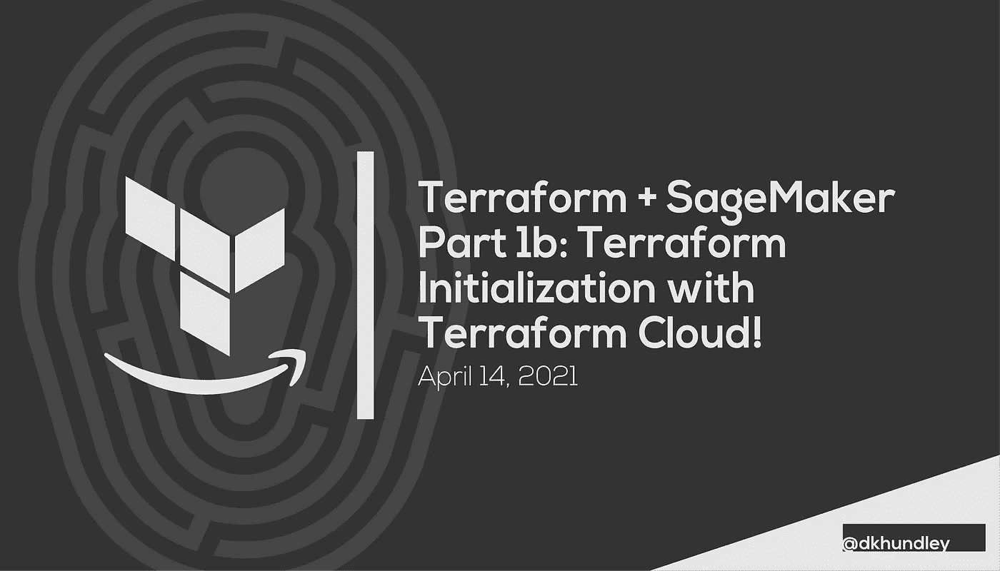
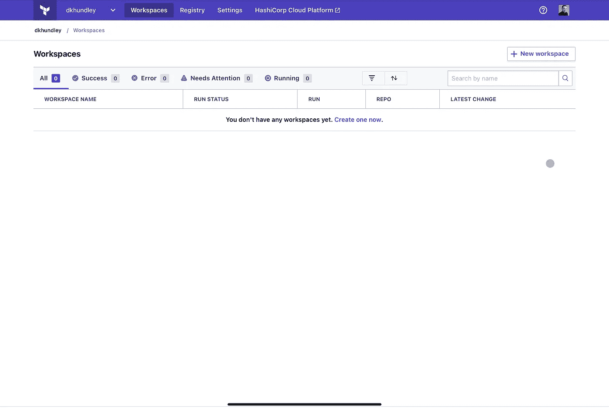
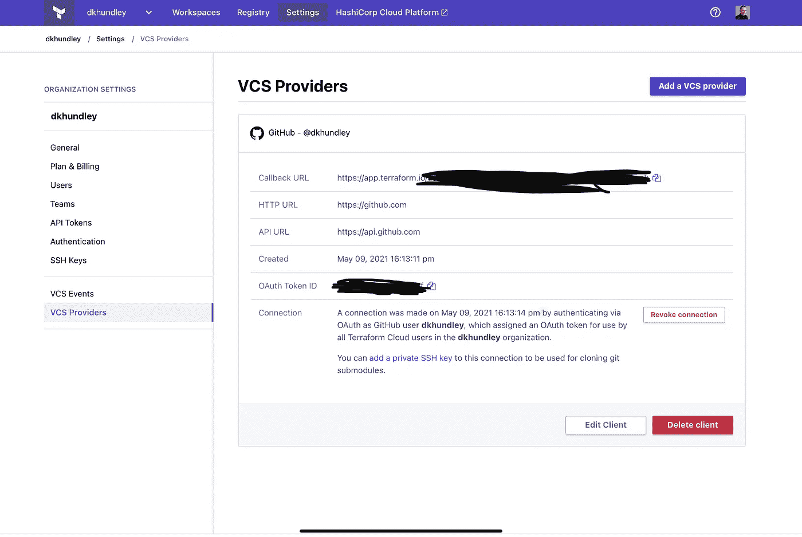
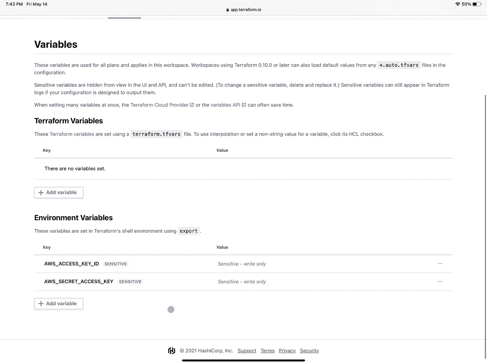
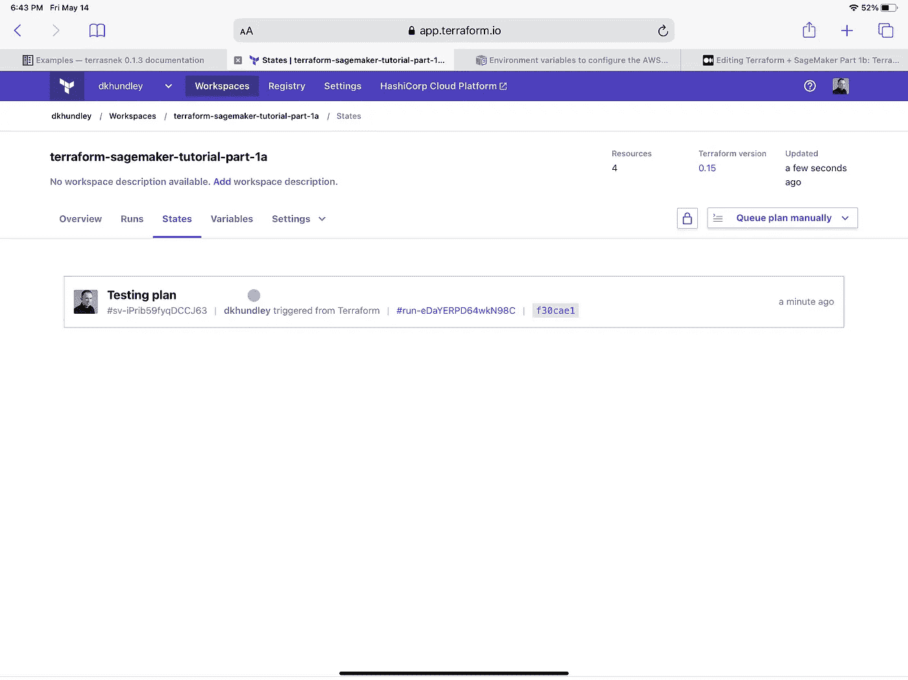
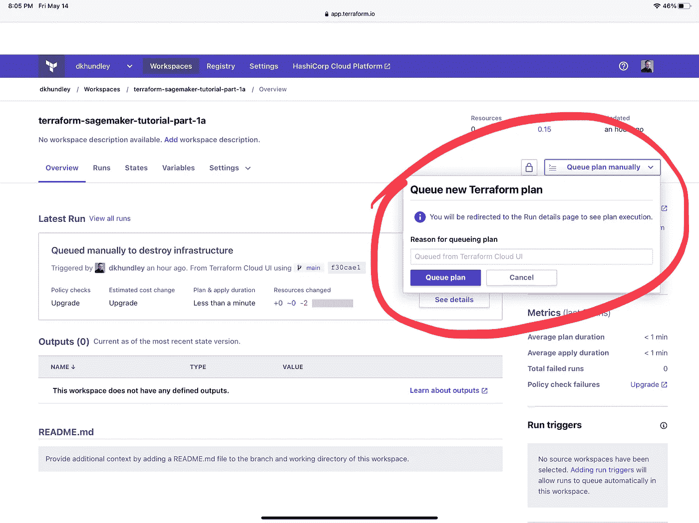
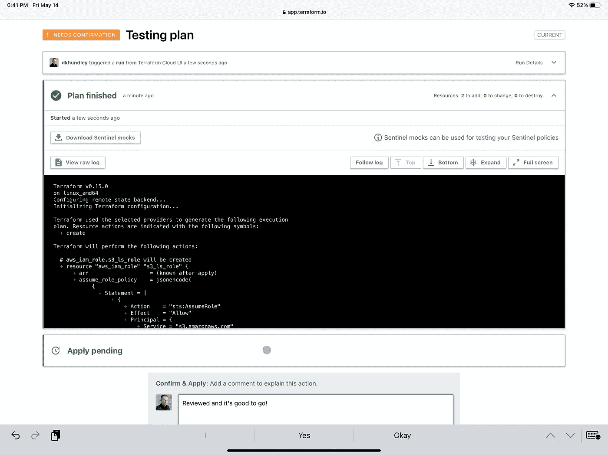
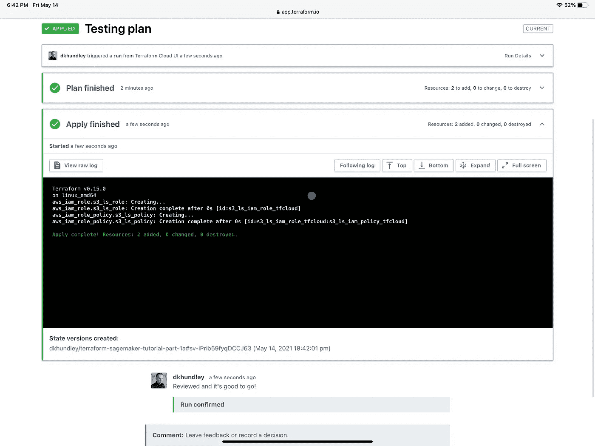
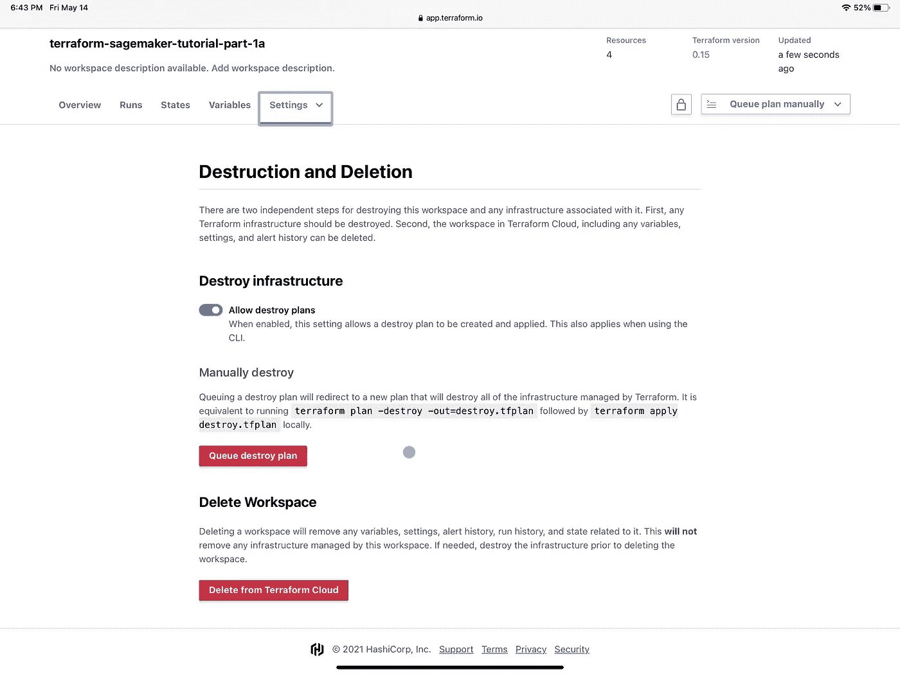
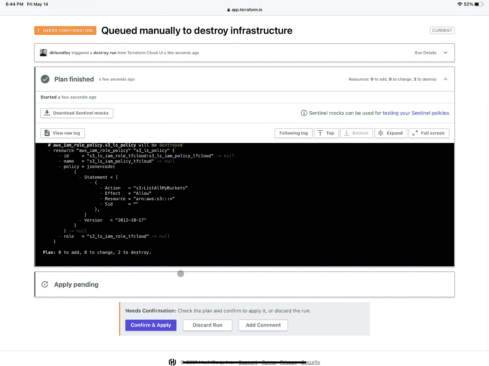

# Terraform + SageMaker 第 1b 部分:使用 Terraform 云初始化 Terraform

> 原文：<https://towardsdatascience.com/terraform-sagemaker-part-1b-terraform-initialization-with-terraform-cloud-954c85ee83cd?source=collection_archive---------17----------------------->



## Terraform + SageMaker

## 帮助您开始使用 Terraform 在 AWS SageMaker 上创建资源(现在使用 Terraform Cloud！)

大家好！我们又回来了，这是一篇不可否认的意料之外的帖子，有一点有趣的背景故事。你可能还记得我们最初的帖子中的[，我们通过直接在你的本地机器上运行 Terraform 命令，并将`.tfstate`文件存储在 AWS S3 后端，得到了对 Terraform 的介绍。这篇文章中的所有内容仍然是 100%有效的，因为它解释了很多关于 Terraform 的概念，如果你是 Terraform 的新手，我肯定会鼓励你回去看看。](/terraform-sagemaker-part-1-terraform-initialization-a6470611ea92)

我为什么利用 Terraform Cloud 写这篇新文章背后的真相与我的两个小女孩有关。你可能知道，我有一个有趣的个人开发设置，我使用 iPad Pro 作为我的主要机器，并且知道 iPad 在软件开发方面有其局限性，我使用 Raspberry Pi 作为“计算附件”来安装或运行任何不能在 iPad 上运行的软件包。下面是一张普通设置的图片，我已经写了一个[完整的独立系列文章](https://towardsdatascience.com/tagged/ipad-raspberry-pi)，告诉你如果你愿意，你可以如何模仿同样的设置。


作者捕获的图像

我 3 岁和 4 岁的女儿喜欢我的覆盆子酱。我说的爱，是指他们只是觉得看起来很酷。😂他们还太小，不明白我用它做什么，但他们好奇的小心灵仍然喜欢玩它。愚蠢的是，我买的保护树莓皮的盒子没有用螺丝固定在一起。这一切都很好地扣到位，所以如果你曾经需要得到的 Pi 板很快，那么这种情况下是完美的设计。

嗯……那个无螺丝的盒子设计对儿童来说并不安全。众所周知，我的女儿们会拿着我的覆盆子酱在家里跑来跑去，当然，她们也会把它掉在地上。上周，他们摔得很重，以至于弯曲并损坏了容纳 Pi 操作系统和数据的 microSD 卡，这基本上使我的 Raspberry Pi 变得毫无用处，直到我可以获得一个新的 microSD 卡并将其正确加载。谢天谢地，树莓派本身完全没问题，我也吸取了教训:一个带螺丝的树莓派盒子今天被送到了我家！

总之，这篇文章是对以下问题的直接回答:**如果我的本地机器上没有 Terraform 工具，我该如何运行 Terraform？**(或者，更具体地说，在我的情况下，当我的女儿们“破坏”我的树莓派时，我如何继续使用 Terraform？)你可能从这篇文章的标题就能猜到，答案是 Terraform Cloud！在本帖中，我们将介绍如何使用 Terraform 云而不是本地 Terraform，但我认为有必要重申，本帖并不是对我们在原帖中所介绍内容的直接替代。如果你喜欢在本地运行 Terraform 命令，欢迎你跳过这篇文章，继续使用这个模式。

在我们的 Terraform + SageMaker 系列的其余部分，您将能够互换使用本地 Terraform 或 Terraform 云。如果你更喜欢使用 Terraform Cloud，我会再次鼓励你查看我们的原始帖子[，因为它为那些刚刚开始使用 Terraform 的人提供了很多一般知识。这篇文章假设你熟悉原始文章的内容。](/terraform-sagemaker-part-1-terraform-initialization-a6470611ea92)

好了，在我们进入如何设置 Terraform Cloud 之前，让我们简单地谈谈使用 Terraform Cloud 的一些好处。

# 为什么选择 Terraform Cloud？

尽管在本地机器上使用 Terraform 很棒，但如果管理不当，还是有一些可伸缩性问题需要特别小心。这些问题包括以下内容:

*   **TF state 文件**的后端位置:Terraform 允许跨多种选项灵活地存储`tfstate`文件，这既是一件好事，也是一件坏事。好处是选项的灵活性，但坏处是如果您的团队决定使用不同的后端存储选项，您的组织可能会到处都是`tfstate`文件。
*   **不小心覆盖了 tfstate 文件**:我要举手承认这是我从亲身经历中学到的，谢天谢地只是在沙盒环境下！在 Terraform 配置中手动设置后台，如果使用相同的后台选项，你必须确保你的`tfstate`键是不同的。例如，如果你和一个朋友都使用同一个 AWS S3 桶作为后端，并且都将`tfstate`键设置为`my-terraform-backend.tfstate`，那么你将覆盖彼此的工作。这也意味着您可能会意外破坏其他人的基础设施。这是一个巨大的风险！
*   **跟踪你的 Terraform 模块**:我知道我们还没有涉及到模块，但是正如你可能猜到的，拥有可重用的 Terraform 模块对以快速、一致的方式建立和运行类似的基础设施大有帮助。将我们所有的 Terraform 模块放在本地是完全可能的，但同样，如果您的开发团队没有一致地管理这些模块的位置，您将面临蔓延问题的风险。

这些只是几个问题中的几个。作为缓解所有这些问题的手段，HashiCorp 开发了 Terraform Cloud 和更高级别的 Terraform Enterprise。其中一些功能包括:

*   直接 VCS(如 GitHub、GitLab 等。)整合
*   远程地形运行
*   在 Terraform Cloud 中安全存储`tfstate`文件
*   公共或私有模块注册表
*   前哨政策

Terraform Cloud 有不同的产品，根据成本的不同，其功能越来越多。(你可以在这里阅读所有这些产品[。)出于我们的目的，我们将坚持基础级别的自由选项，因为这个 Terraform + SageMaker 系列假设你是一个单独的演员，因此不必担心团队成员。需要注意的是，如果您打算在您的组织中扩展 Terraform，我强烈建议您考虑 Terraform Cloud 或 Terraform Enterprise 的更高层产品。](https://www.hashicorp.com/products/terraform/pricing)

现在让我们开始实际使用 Terraform 云吧！😃

# 设置您的 Terraform 云帐户

自然，我们使用 Terraform Cloud 的第一步是建立一个 Terraform Cloud 帐户。您可以通过导航到[主 Terraform 云网站](https://www.terraform.io/cloud)并点击“创建帐户”按钮来完成此操作。由于 Terraform Cloud 帐户注册非常直观，所以我不打算在这里详细介绍这些步骤。它会问你一些事情，比如你的电子邮件和你想给你的组织取什么名字，你可以填写任何适合你的东西。我个人将我的组织命名为`dkhundley`,因为这是一个很好的品牌！😂

完成注册后，您应该会看到如下所示的屏幕:



作者截图

让我们继续连接您的 VCS 提供商。

## 连接您的 VCS 提供商

正如上面简要提到的，Terraform Cloud 的一个巨大优势是与 GitHub 或 GitLab 等 VCS 提供商直接集成。它允许 Terraform Cloud 查看您的 VCS 存储库，以便在对存储库进行某些更改时采取适当的措施。例如，您可以这样设置，当您将新的 Terraform 代码推送到`main`分支时，Terraform Cloud 可以自动检测这些新的更改，并以自动化的方式将这些更改应用到您的基础架构中。非常酷！

为了使用此功能，我们首先必须确保您的 VCS 提供商已正确连接到您的 Terraform Cloud 帐户。出于我们的目的，我将使用 GitHub 来完成这项工作，但是当然也欢迎您使用您选择的 VCS 提供商！

为了简洁起见，我不打算在这里复制所有这些步骤，而是将你引向 HashiCorp 关于这个主题的官方文档。如果您已经成功设置了您的 VCS 提供商，您现在应该会看到您的提供商如下所示:



作者截图

好吧！现在让我们开始创建您的第一个连接到您的源代码库的 Terraform Cloud workspace！

# 创建 Terraform 云工作空间

(在进入本节之前请注意:具有讽刺意味的是，当在移动浏览器上工作时，这在 UI 中不起作用，包括我心爱的 iPad 上的浏览器。有某种错误阻止了 UI 正确创建工作区。我已经通知了哈希公司，他们正在积极调查此事。谢谢你，哈希公司！我使用了一种叫做`terrasnek`的 Python 客户端形式的解决方法，虽然它很好地创建了我的工作空间，但是我们不打算在这里讨论它，因为 UI 要简单得多。)

好了，连接了您的 VCS 提供商后，我们现在可以开始创建我们的第一个工作区了！在工作区，我们将让 Terraform Cloud 监听我们的存储库中的特定更改，并相应地发布更改。为了简单起见，我们将监听主`main`分支，并手动启动等效的`plan`和`apply`命令。

要实际创建您的工作空间，请使用用户界面步骤…

*   选择你的工作流程(在我们的例子中是 VCS)
*   连接到您的 VCS，它提供了一个非常灵活的 UI，可以从您在上一节中创建的 VCS 提供商那里选择精确的存储库
*   配置您的设置
*   创建工作空间！

如果这些步骤看起来有点…简短，我道歉。如上所述，我无法让 UI 正常工作，因为我用的是 iPad，但我以前在普通电脑上做过，记得 UI 非常直观。

无论如何，一旦你创建了你的工作空间，你至少还需要做一件事。您可能还记得在最初的帖子中，您需要确保 Terraform 拥有适当的凭证，以便适当地执行基础设施创建。这意味着使用我们与 IAM 角色一起生成的相同的`AWS_ACCESS_KEY_ID`和`AWS_SECRET_ACCESS_KEY`。如果你需要复习如何做到这一点，[点击这里查看官方 AWS 文档](https://docs.aws.amazon.com/sdk-for-java/v1/developer-guide/setup-credentials.html)。

有了这些 AWS IDs，就可以在 workspace overview UI 中的“Variables”选项卡上导航。在这个 UI 中，您可以选择输入两种变量:“地形变量”和“环境变量”我们将跳过“地形变量”部分，因为我们将在未来的帖子中使用一个实际的`.tfvars`文件，而“环境变量”部分是你放置各自的`AWS_ACCESS_KEY_ID`和`AWS_SECRET_KEY_ID`的地方。当你点击“敏感”复选框时，千万不要害羞！这是我的屏幕在这一步之后的样子:



作者截图

# 快速地形代码审查

您可能还记得最初的帖子，我们测试了一些基本的 Terraform 命令，创建了一个非常简单的 IAM，访问权限非常有限。我们将使用同样的代码，只做了两处小的改动。有两个 Terraform 配置文件:一个用于后端，另一个用于 IAM 角色。下面是`iam.tf`的代码:

```
## DATA BLOCKS
## ----------------------------------------------------------------# Creating the data that will be used by the IAM policy
data "aws_iam_policy_document" "s3_ls_policy_data" {
  statement {
    actions = [
      "s3:ListAllMyBuckets"
    ]resources = [
      "arn:aws:s3:::*"
    ]
  }
}# Creating the assume role policy data
data "aws_iam_policy_document" "s3_ls_assume_role_data" {
  statement {
    actions = ["sts:AssumeRole"]principals {
      type        = "Service"
      identifiers = ["s3.amazonaws.com"]
    }
  }
}## RESOURCE BLOCKS
## ----------------------------------------------------------------# Creating the IAM policy using the data block from above
resource "aws_iam_role_policy" "s3_ls_policy" {
  name   = "s3_ls_iam_policy"
  policy = data.aws_iam_policy_document.s3_ls_policy_data.json
  role   = aws_iam_role.s3_ls_role.id
}# Creating the IAM role associated to the resources above
resource "aws_iam_role" "s3_ls_role" {
  name               = "s3_ls_iam_role_tfcloud"
  description        = "This role allows for all S3 buckets to be listed."
  assume_role_policy = data.aws_iam_policy_document.s3_ls_assume_role_data.json
}
```

和`backend.tf`代码:

```
# terraform {
#   backend "s3" {
#     bucket = "dkhundley-terraform-test"
#     key    = "terraform-sagemaker-tutorial.tfstate"
#     region = "us-east-1"
#   }
# }provider "aws" {
  region = "us-east-1"
}
```

跟原帖有两个变化:一大一小。小的改动是将 IAM 角色名称从`s3_ls_iam_role`改为`s3_ls_iam_tfcloud`，这只是为了保证我们的输出来自这个“新的”Terraform 代码。最大的变化是我注释掉了包含 S3 后端的`terraform`块。请记住，Terraform Cloud 提供了一个功能，它会以一种安全的方式为您存储`tfstate`文件。如果没有后端，默认情况下会这样做。然而，如果我把 S3 后端块留在那里，那么后端就会去那里。(这并不是一件坏事，但如果你更喜欢让 Terraform Cloud 存储你的`tfstate`文件，这并不可取。)

我向前跳了一点，但只是为了向您展示我的`tfstate`文件现在确实在 Terraform Cloud 中，请查看我在让 Terraform Cloud 创建我的资源后拍摄的这张截图:



作者截图

好了，现在让我们继续使用 Terraform Cloud 在 AWS 中构建这些东西吧！

# 使用手动 UI 命令创建资源

这是有趣的开始，主要是因为它很容易做，看起来非常光滑。在您的工作区内，您会看到屏幕右上方有一个按钮，上面写着“手动排队计划”如果你点击它，它会打开一个子用户界面，如下所示:



作者截图

为了启动计划阶段(或者如果您还记得 CLI 中的`terraform plan`，您需要做的就是填写可选的“原因”字段，然后单击紫色的“队列计划”按钮。这将开始计划阶段，您应该会看到一个屏幕，其中提供了计划输出以及一个 UI 选项，用于批准实际部署的计划。(也就是 CLI 中的`terraform apply`)



作者截图

一旦 Terraform Cloud 在 AWS 上创建了您的资源，您将会看到一个屏幕，上面有令人非常满意的绿色，表明您成功了！



作者截图

# 用用户界面破坏资源

这通常不是人们想要做的事情，因为在生产环境中这是一个非常危险的举动，所以 destroy 命令(您可能还记得 CLI 中的`terraform destroy`)不像 plan / apply 命令那样明显。在您的工作区用户界面中，切换“设置”下拉菜单并选择“销毁和删除”选项。这将打开一个如下所示的用户界面:



作者截图

对于一般不熟悉 Terraform 的人来说，这些术语可能会有点混乱，所以请允许我在这里快速阐述一下区别:

*   **摧毁基础设施**:这相当于 CLI 中的`terraform destroy`命令。这个命令查看在`tfstate`文件中记录的所有资源，并执行一个计划来删除 AWS 上的那些资源。在我们的具体示例中，这意味着我们在上面创建的 IAM 角色消失了。
*   **删除工作区**:这是 Terraform cloud 独有的，基本上相当于从 S3 后端删除你的`tfstate`文件。(显然，Terraform Cloud 上需要删除的内容更多，因为它有变量、设置和其他小设置。)虽然删除您的工作区将会删除您的`tfstate`文件，但是它不会删除您用那个`tfstate`文件构建的资源。对我们来说，这意味着在前面部分创建的 IAM 角色即使在`tfstate`文件消失后仍然有效。

自然，我们希望前一个选项，因为它会像我们期望的那样删除 IAM 角色和策略。通过点击“队列销毁”计划按钮来切换销毁，这将为您提供一个类似于您之前看到的屏幕:



作者截图

是的，这与我们最初想要创建资源时的屏幕非常相似。同样，触发这些资源的正式删除是通过单击“确认并应用”按钮来执行的。Terraform 将应用这些删除，然后噗！你的 IAM 角色没了。

# 包扎

这基本上总结了我想用 Terraform Cloud 展示的所有内容。同样，非常欢迎您继续使用带有 S3 后端的 Terraform CLI 的本地命令。这只是为您提供了如何以另一种方式实现的见解，更不用说我们只是触及了 Terraform Cloud 通过 CLI 提供的所有功能的表面。这些功能包括…

*   前哨政策
*   自动应用
*   团队和组管理
*   团队成员的自动通知选项
*   还有更多！

(我现在感觉自己就像是 Terraform Cloud / Enterprise 的推销员，所以我要说:不，我没有得到 HashiCorp 的认可。😂)

感谢你查看这个帖子！在下一部中，我们将开始应用这些新的地形技能，让我们的手在 SageMaker 中变脏。期待到时候见到你。