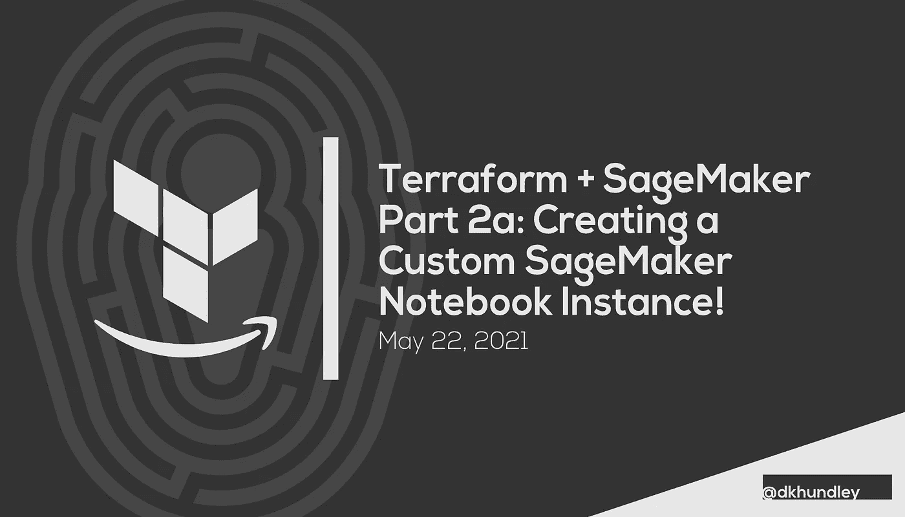
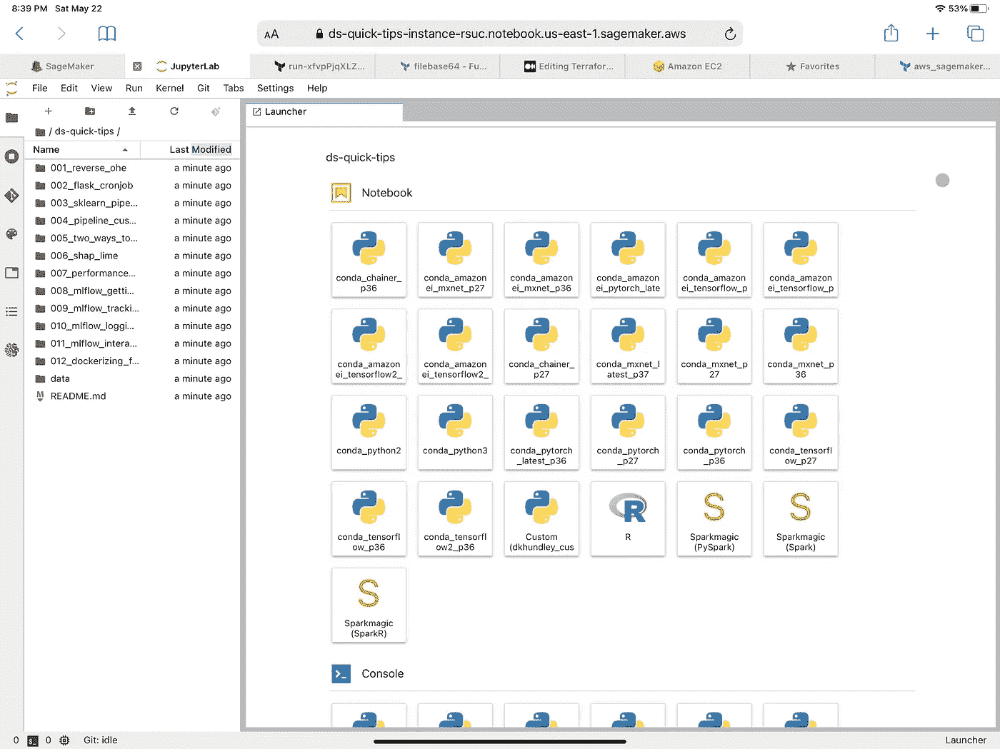
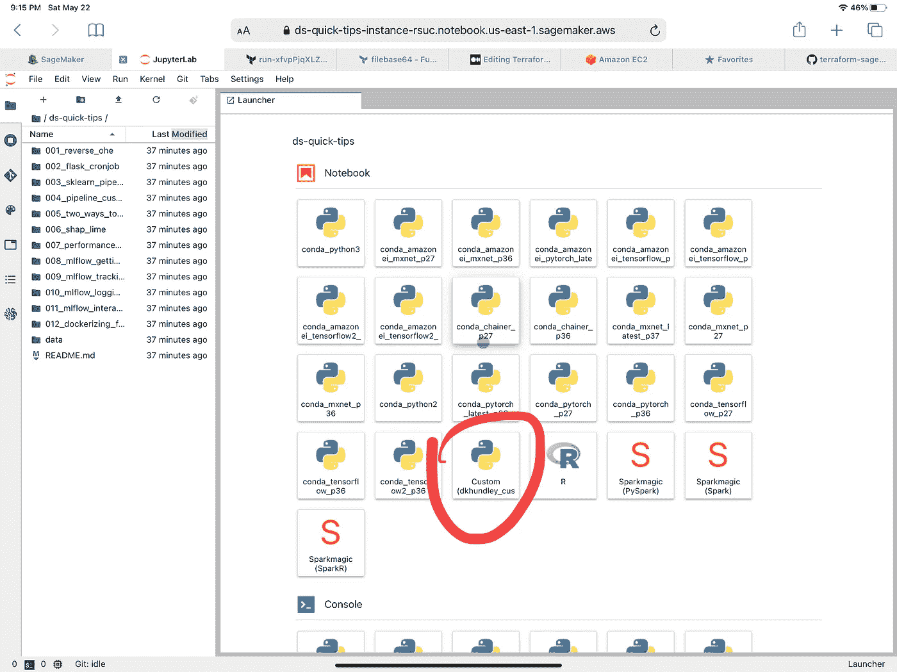
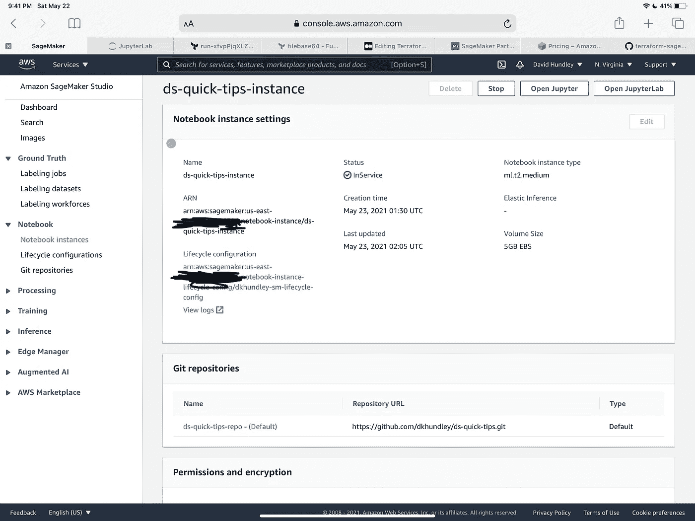
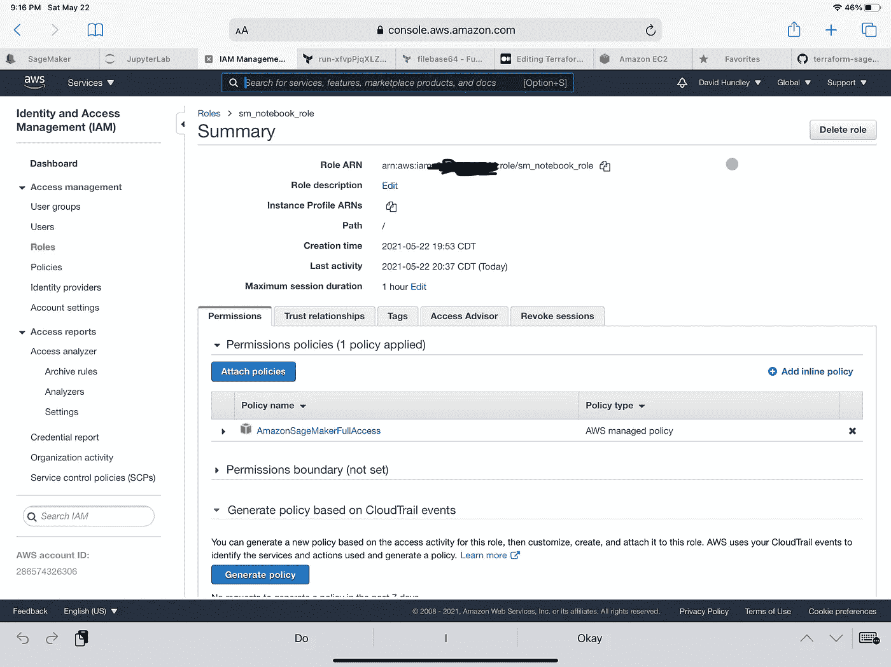

# Terraform + SageMaker 第 2a 部分:创建定制的 SageMaker 笔记本实例

> 原文：<https://towardsdatascience.com/terraform-sagemaker-part-2a-creating-a-custom-sagemaker-notebook-instance-1d68c90b192b?source=collection_archive---------19----------------------->

## Terraform + SageMaker

## 使用 Terraform 创建您自己定制的 SageMaker 笔记本实例

大家好！我们带着 [Terraform + SageMaker 系列](https://towardsdatascience.com/tagged/terraform-sagemaker)又回来了。现在我知道了，我知道了…如果你一直在关注，你会知道我们实际上还没有对 SageMaker 本身做任何事情。我希望你能原谅我，因为我真的想为这个系列中所有即将到来的帖子提供一些平台。也许我可以用一些好消息来补偿你:我们今天实际上要潜入 SageMaker！

具体来说，我们将创建一个定制的 SageMaker 笔记本实例。那些可能想知道 SageMaker 笔记本和标准 Jupyter 笔记本之间有什么区别的人，简短的回答基本上是一点 AWS 风味。当你真正打开 SageMaker 笔记本用户界面时，你可能甚至无法区分 SageMaker 和标准 JupyterLab。事实上，让我给你看一张图片:

作者截图

现在，如果您只是要启动一个 SageMaker 实例，您将得到标准的、普通的 Jupyter 环境，AWS 以纯默认设置启动。虽然您肯定可以毫无问题地立即开始工作，但是如果我们可以自动化一些额外的好东西呢？比如，如果我们可以创建自己的内核，并预装一套定制的编码库，会怎么样？或者，如果当我们打开 SageMaker 实例时，我们的 GitHub repo 就在那里，可以立即开始工作了，该怎么办？

好了，朋友们，正如你们所猜测的，我们将在这篇文章中涵盖所有这些内容！我们将介绍如何制作您自己的理想 SageMaker 笔记本实例，借助 Terraform 的魔力，我们可以通过几个简单的 Terraform 命令快速构建或销毁它，而不是繁琐的 UI。

在继续之前还有一件事，你可能很好奇为什么这篇文章被标为“2a”。这是因为我们将通过在 Terraform 脚本中硬编码我们的所有值来关注使事情变得简单一点。在下一篇文章(2b)中，我们将把相同的代码转换成一个 Terraform 模块，以便任何人都可以重用！对于那些刚接触 Terraform 的人来说，这是一个更长的话题，所以我认为它值得单独发布。

好了，让我们先来谈谈 SageMaker 的概念，这样我们在实际编写 Terraform 代码时就有了一个立足点。

(哦，如果你想继续关注 GitHub，[点击这里查看我的知识库](https://github.com/dkhundley/terraform-sagemaker-tutorial/tree/main/Part%202a%20-%20Creating%20a%20SageMaker%20Notebook)。)

# SageMaker 如何在引擎盖下工作

事实上，我可以将这一部分命名为“大多数 AWS 服务如何在幕后工作”，但我们将坚持使用 SageMaker，因为这是我们将使用的主要服务。您可能知道，AWS 提供了另一项名为 EC2(弹性计算云)的服务，主要提供驻留在云中的通用虚拟计算机。这些 EC2 虚拟计算机——或者更广为人知的“实例”——为用户提供了大量的灵活性，但是它们可能超出了您想要管理的范围，尤其是如果您不是 Linux 专家的话。

AWS 知道他们的客户希望将 EC2 实例用于更具体的目的，而不必做所有幕后的“脏工作”,因此创建了一系列不同的“托管服务”,这些服务是为非常具体的目的定制的。正如你所猜测的，SageMaker 是一种托管服务，当然是面向机器学习的。

也就是说，SageMaker 中所有需要某种计算能力的东西都由某种计算实例支持。(你不会看到它被称为 EC2 实例本身，但你肯定会看到到处都提到“计算实例”。)同样，这些实例可以由虚拟卷备份。对于 SageMaker 笔记本实例，它们由 EBS(弹性块存储)卷进行备份。

我提出这个问题的原因是，如果你来自类似 Google Colab 的地方，要理解这个概念真的会有点困惑。在那样的环境下，你只要打开笔记本就可以走了。SageMaker 就不是这样了，这不是一件坏事。SageMaker 实际上是为更私人的公司级使用而设计的。像 Google Colab 这样的环境更多的是一个学习的空间。

# 构建我们的定制笔记本实例

好了，现在你已经有了 SageMaker 一般如何工作的概念性知识，让我们继续构建我们的定制 SageMaker 笔记本实例。如前所述，基本的 SageMaker notebook 实例化只是提供了一个带有 AWS 默认内核的白板。默认内核很好，但是我个人遇到了一个问题，那些内核没有我需要的 Python 库。当然，您可以手动将库安装到 notebook 实例上，但是这些安装不会持久化。因此，如果您在晚上关闭一个笔记本实例，并在第二天早上重新启动它，您将不得不再次执行这些手动安装。呸。

为此，我们的定制 SageMaker 笔记本实例将提供三个不错的特性:

*   **GitHub 存储库集成**:启动 SageMaker notebook 实例时，你不会看到一片空白，你会看到你在 GitHub 存储库中的所有工作已经准备就绪，可以立即开始工作。
*   **自定义持久内核**:实际上我自己在写这篇文章的时候才知道:有一种方法可以在 SageMaker notebook 实例附带的 EBS 卷上创建和持久化你自己的自定义内核。这样，当您加载 SageMaker notebook 实例时，您的内核将准备好所有的库，不需要手动安装。
*   **空闲时自动停止**:所以……我不知道为什么 SageMaker 不提供这个默认选项。就像普通计算机一样，SageMaker 实例可以启动和停止。正如您可能猜到的，当您的 SageMaker 实例停止时，AWS 不会向您收取计算时间的费用。但是…默认情况下没有“自动停止”。如果您让 SageMaker 笔记本实例在默认设置下运行，它将永久运行。它会记在你的账上！(*ba-dum tss*) SageMaker 没有提供在空闲时设置自动停止的“本地”方法，但具有讽刺意味的是，他们提供了在 GitHub 中如何做到这一点的代码。我认为你不添加这个是疯了，所以我们肯定会在这篇文章中添加空闲时自动停止。

后两项功能是通过一种叫做 **SageMaker 笔记本生命周期配置**的东西实现的，我们将在下一部分重点讨论这一点。让我们快速介绍一下使用 Terraform 制作成品所需的一切:

*   **SageMaker 笔记本实例**:如你所料！
*   **SageMaker IAM 角色和策略附件**:与所有 AWS 服务一样，我们的 SageMaker notebook 实例需要一个 IAM 角色和适当的 IAM 策略。为了方便起见，我们将使用 AWS 默认的 SageMaker 策略，该策略允许资源访问 SageMaker 的所有内容。(注意:如果你工作的组织遵循“最小特权”原则，这肯定不是一个优选的实践，我完全同意这一点。我只是为了让我们的学习简单一些。)
*   **SageMaker 笔记本生命周期配置**:我们将在下一节详细介绍这一点，但简而言之，它将允许我们使用上面提到的一些好功能。
*   **SageMaker Git 存储库**:这或多或少是生命周期配置之外的一个额外的小配置，专门用于指向您希望在 SageMaker notebook 实例中加载哪个 Git 存储库。在我们的例子中，我将简单地使用我的流行的`ds-quick-tips`库，但是如果您愿意，可以随意替换您自己的库！

# 创建 SageMaker 笔记本生命周期配置

当启用我们的一些高级功能时，这个漂亮的功能将为我们做很多繁重的工作。基本上，一个生命周期配置由两个 shell 脚本组成，您可以随意填充它们。第一个 shell 脚本是`on-create.sh`脚本，它在第一次创建 SageMaker notebook 实例时执行它的操作。第二个 shell 脚本是`on-start.sh`脚本，每次 SageMaker 实例从“停止”状态启动时都会执行这个脚本。AWS 实际上提供了很多关于你可以在 GitHub 上用生命周期配置[做什么的例子，很明显，我是从那里得到这篇文章的想法的。让我们在接下来的小节中介绍如何填充各自的脚本。](https://github.com/aws-samples/amazon-sagemaker-notebook-instance-lifecycle-config-samples)

## “创建时”脚本

[在这个脚本](https://raw.githubusercontent.com/dkhundley/terraform-sagemaker-tutorial/main/Part%202a%20-%20Creating%20a%20SageMaker%20Notebook/scripts/on-create.sh)中，我们将创建一个装载了我们想要的 Python 库的自定义内核。在幕后，AWS 正在利用 Anaconda (Miniconda)来创建我们的内核。在 Miniconda 中，我们将使用一个标准的`[requirements.txt](https://github.com/dkhundley/terraform-sagemaker-tutorial/blob/main/Part%202a%20-%20Creating%20a%20SageMaker%20Notebook/scripts/requirements.txt)` [文件](https://github.com/dkhundley/terraform-sagemaker-tutorial/blob/main/Part%202a%20-%20Creating%20a%20SageMaker%20Notebook/scripts/requirements.txt)来安装几个库，根据我的个人经验，我 100%确定这些库不在 AWS 默认内核中。这两个库是:

*   `pyathena`:这个让我超级困惑，因为 Athena 是 AWS 服务。我个人曾经需要它来使用 Athena 将 S3 的数据输入到 SageMaker 笔记本中，效果非常好。(老实说，我不知道我是否会在这个系列中涉及到它，但我只知道它确实有效！)
*   `catboost`:这是一个类似 Scikit-Learn 的机器学习算法库。我可以理解为什么 AWS 可能会排除它，因为它不是特定于 AWS 的，但我很惊讶它没有像 Scikit-Learn 一样被广泛采用，因为人们发现使用它的算法比使用其他流行的库要成功得多。

一旦构建了内核，它就被持久化到连接到 SageMaker notebook 实例的 EBS 卷中，因此即使您定期停止和启动 notebook 实例，也能够非常快速地加载这个内核，而不会出现任何问题。

## “开始时”脚本

在这个脚本中，我们将做两件不同的事情。第一步是使我们从“On Create”脚本创建自定义 Miniconda 内核可用。第二个是实现空闲时自动停止功能。自动停止功能基本上是由另一个 Python 脚本启用的，并且是完全透明的，我不太清楚那个脚本是如何工作的。这是我从前面提到的 AWS 的 GitHub 生命周期配置库提供的例子库中提取的，但我至少可以分享它的工作原理！我将空闲时间设置为 300 秒(5 分钟)，如果你愿意，可以适当延长。

# 构建我们的地形脚本

我知道这篇文章开始变得冗长，我不想过多地谈论 Terraform 脚本实际上是如何创建的。更重要的是，你要从概念上理解所有的东西是如何组合在一起的，这一点我们已经在本文中讨论过了。我建议你[点击这里](https://github.com/dkhundley/terraform-sagemaker-tutorial/tree/main/Part%202a%20-%20Creating%20a%20SageMaker%20Notebook/terraform)查看我的 GitHub repo，而不是在这里粘贴所有代码。我确实希望至少涉及到以下脚本的注释，所以我们将以快速的方式完成。我们走吧！

## 一般

*   您会注意到，我将 Terraform 配置分成了五个不同的文件，每个文件都代表了我们将要构建的资源的逻辑分离。这纯粹是出于组织的目的，您完全可以将它们放入一个单独的 Terraform 脚本中。
*   我将 Terraform Cloud 用于我的个人部署，这就是为什么在`main.tf`中描述的后端相当轻的原因。

## SageMaker 笔记本实例

*   如果您不太熟悉 EC2，您可能不知道那个`instance_type`字段是什么，也不知道如何正确地填充它。AWS 提供了一系列面向 ML 的实例，每一个都有不同的好处。有些提供更多的 RAM，更多的 CPU，甚至 GPU。当然，这些都是有成本的，您可以查看这些实例的完整列表以及相关的定价[在这里](https://aws.amazon.com/sagemaker/pricing/)。出于学习的目的，我选择了一个较小的实例类型`ml.t2.medium.`

## IAM 角色

*   如上所述，我们将使用默认的`AmazonSageMakerFullAccess`策略来附加到我们的 IAM 角色。这是一个 AWS 管理的政策，所以它的 ARN 在你的帐户和我的帐户中是一样的。
*   `assume_role_policy`是 Terraform 需要的，所以不要以为你能像我一样愚蠢的逃脱！

## 生命周期配置

*   你可能想知道`filebase64()`是什么。与其他编程语言一样，Terraform 也提供了自己的一些基本功能。这个特定的函数实际上执行两个活动:从文件加载脚本，然后对该脚本进行 base64 编码，这是我们的生命周期脚本所需要的。(顺便说一下，Terraform 确实在单独的变体中提供了那些功能:`file()`和`base64encode()`)。

# 让您的笔记本实例变得栩栩如生！

唷！走到这一步，路漫漫其修远兮，是时候看看自己的劳动成果了。无论您是在本地使用[terra form](/terraform-sagemaker-part-1-terraform-initialization-a6470611ea92)还是使用 [Terraform Cloud](/terraform-sagemaker-part-1b-terraform-initialization-with-terraform-cloud-954c85ee83cd) (这是我所走的路线)，继续并应用适当的命令来实现您的定制 SageMaker 笔记本实例。(警告:创建和启动笔记本实例大约需要 10 分钟。这并不意味着有什么问题。不幸的是，AWS 需要很长时间来供应任何计算实例。)

如果您使用 JupyterLab 选项打开您的笔记本实例，您将看到类似下面的屏幕截图。两件事表明我们的部署是成功的，GitHub 库的内容列在左边的导航界面中，b)我自己的自定义内核用红圈标出。

作者截图

现在让我们来看一下 SageMaker notebook 实例本身的一般设置。您将看到类似下面的截图。请注意，它恰当地指向了我们创建的生命周期配置，并用我们的 Terraform 脚本附加了该配置，但它并没有恰当地从 GitHub 附加我的`ds-quick-tips`存储库。

作者截图

最后，让我们把 AWS 的最后一关交给 IAM。在这里，您可以看到我们专门为 SageMaker 笔记本实例创建的 IAM 角色，以及授予实例在 SageMaker 中做任何事情的完全访问权限的 AWS 管理的策略。

作者截图

朋友们，这篇文章到此结束！这是一篇很长的文章，但我希望你会发现它对你自己的工作有价值。在下一篇文章中，我们将把同样的代码模块化，这样人们就可以很容易地使用它，并适当地交换他们自己的值。这样，如果你有两个数据科学家想要他们自己的笔记本实例在不同的 GitHub 存储库上工作，你可以用 Terraform 模块很容易地构建这些笔记本实例！感谢你坚持到这篇文章的最后。下一集再见！