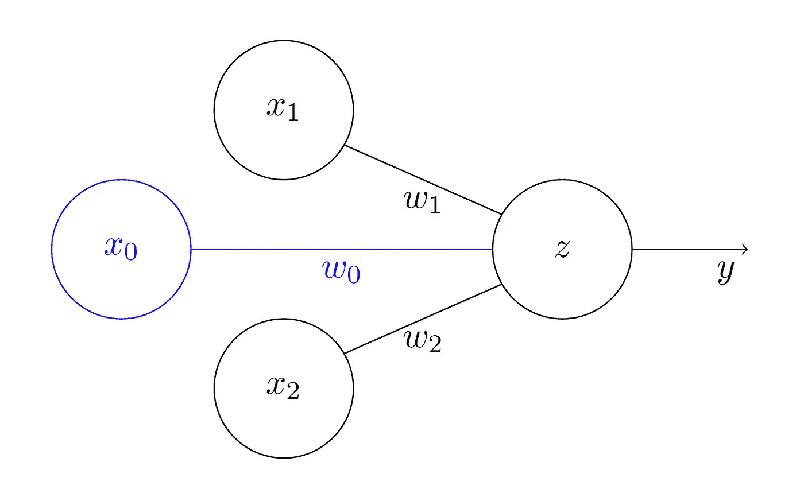
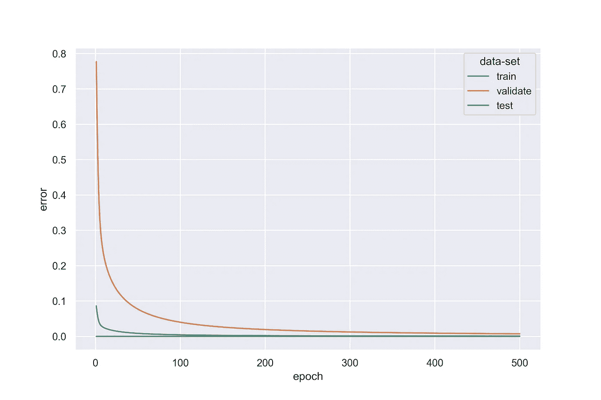
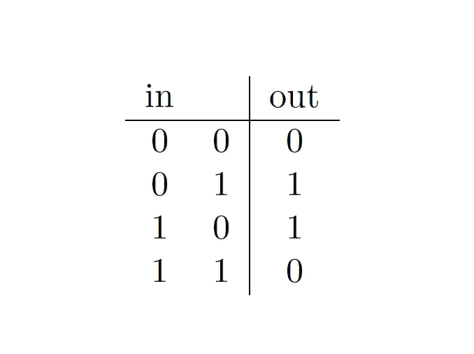
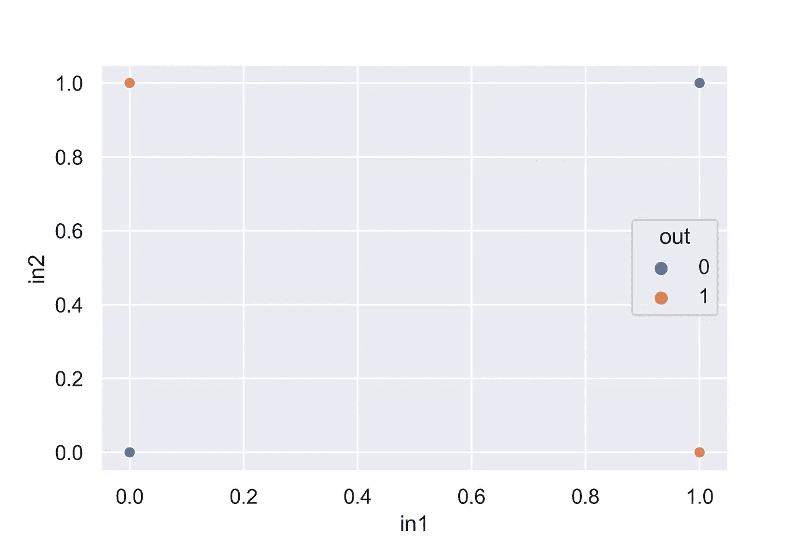

# 非常敏锐:感知器和异或

> 原文：<https://towardsdatascience.com/terribly-perceptive-the-perceptron-the-xor-a20bda86b765?source=collection_archive---------24----------------------->

罗斯·斯通在 Unsplash 上的图片。

## 一个看似无关痛痒的问题如何迎来第一个 AI 冬天(以及如何构建自己的感知机)

虽然是后现代比例的元，但你不太可能被这样或那样的机器学习算法引导到这篇文章。无论我们是否意识到，人工智能几乎已经渗透到我们生活的方方面面——从推荐电影到检测信用卡欺诈。在过去的十年里，对 ML 和数据科学的宣传达到了创纪录的水平，价格过高的在线课程现在甚至被主要的学术机构所宣传。对于一个局外人(或初学者)来说，似乎 ML 并不比围绕它的宣传更古老，但他们可能错了。宽泛且可能有些委婉的术语“*机器学习*”囊括了大量应用统计工具，其中许多工具实际上已经相当古老。更具体地说，*神经网络*也比大多数人想象的要古老:这些神经机制的数学近似在 20 世纪 50 年代首次被设计出来。

那么，为什么现在要大肆宣传呢？这是一个好问题——这个问题的答案是多方面的。然而；这不是我在这里关心的问题。在这里，我想探究为什么我们应该管理我们对未来 ML 的期望，看一个对一些人来说似乎很古老的案例研究:感知机*和*异或*的问题。*

除了听起来像夏洛克·福尔摩斯的短篇小说或 J.K .罗琳的小说之外，这是一个看似无害的问题如何使整个 ML 领域陷入停滞的例子。虽然时间是一个序列，历史是押韵的，但季节确实是循环的，1969 年由明斯基和帕普特开创的“AI winter”不太可能是最后一个。

*(代码在*[*GitHub*](https://github.com/BenTenmann/perceptron)*)*

# 感知器

## 基本原则

什么是*感知器*？感知器通常被认为是第一个正式的神经网络，由 Frank Rosenblatt 在 1958 年提出。它的结构和底层数学相对简单，所以让我们花些时间来探索它们。

*感知器*由两层组成:输入层和输出层(图 1)。输入层可以接受 *N* 个单元——即一个 *N* 维向量——输出层可以返回一个 *T* 维激活向量。数学上，*感知器*也就比一些相对简单的线性代数和向量微积分强不了多少。

一个简单的感知器，具有两个输入 x *1* 和 x2，以及一个激活为 y 的输出单元 z。每个输入分别具有一个相关的权重 w1 和 w2。此外，我将阈值(或**偏差**)视为另一个输入 x0(始终= -1)，其权重为 w0。图片作者。

例如，让我们想象我们是一个音乐家——准确地说是一个吉他手。我们是弹吉他的新手，想学一些歌曲来打动我们喜欢的人。我们知道他们喜欢雷鬼音乐，并从[的某个网站](https://www.ultimate-guitar.com)下载了 1024 张吉他弹夹，但是作为我们平常凌乱的自己，包括数量未知的重金属歌曲。

虽然我们很脏，但我们也很聪明。我们意识到，仅使用制表符来区分风格的一种方法是，在歌曲的随机选取的部分中，找出向上还是向下的笔划占优势。雷鬼以其悠闲和圆润的态度，部分地以断续、向上的吉他弹奏为特征，而金属的沉重和刺耳的风格要求持续和连续的向下弹奏。此外，金属通常有非常快的部分，需要用向上和向下的相同组合来弹奏。

根据这些认识，我们将笔画分配给[如下:向下= 1；向上= -1。然后我们分配流派:金属= 1；雷鬼= 0。我们从每个标签中取出 10 个笔画的片段，给我们 1024 个 10 维向量。](https://www.thestrokes.com)

向量 *x* 从歌曲的随机选择部分中捕获 10 个吉他笔画。在上述情况下， *x* 是对 Metallica 的*木偶大师*的令人心痛的介绍。现在，找到雷鬼歌曲的一个简单的解决方案可能是我们简单地对向量求和并过滤所有返回值为> 0 的 *x^* 。

但是这对我们来说太简单了，还有什么时候我们会发现简单感知器的用处呢？所以让我们从建立一些序言开始:

现在让我们检查一些基础数学。如图 1 所示，输入层的每个单元 *xi* 与输出单元 *z* 用权重 *wi* 连接。 *z* 的值是所有输入单元的*加权和*，即输入向量 *x* 与权重向量 *w* 的点积:

网络的最终输出是传递/激活函数 *f(z)* 的结果 *y* ，也称为输出单元的激活。激活函数有几个选项——比如 ReLU 和 tanh——尽管像这样的简单二元分类问题的经典选择是*逻辑*激活函数:

这部分是因为它为我们提供了介于 1 和 0 之间的值。让我们在 Python 脚本中定义这个函数:

此外，与阶跃函数不同，它有一个明确的非零梯度，为我们提供了一个清晰的导数表达式:

我们也可以在 Python 脚本中定义:

你可能想知道我们需要导数做什么。亲爱的读者，不要着急，一切都会好起来的。

那么我们如何训练网络呢？基本上，神经网络(NN)通过迭代改变其权重来学习，以优化其输出。有两种类型的优化:最小化输出相对于某个目标值的误差，或者最大化网络输出的“价值”。更直观和更广泛使用的方法是通过使用一些误差(或损失)函数 *E* 来最小化误差。我们将使用简单的二次损失函数:

其中 *n* 为输出单元总数， *t* 为训练信号，即输入数据(reggea = 0 或 metal = 1)的地面真实结果， *y* 为网络根据输入数据做出的预测。由于我们的输出将是一个标量( *n=1* )，我们可以忽略求和。让我们用 Python 来定义它:

那么，我们如何有效地最小化这个误差函数的输出呢？这就是我们对 y 的导数发挥作用的地方。这种方法叫做*梯度下降*，可以类比为夜间下山:在某一台阶上你可以知道哪条路是向下的，但你看不到山谷。因此，要到达山谷，你必须不断向最下坡的方向前进。

用数学术语来说，我们最终沿着*误差面*的梯度下降。*误差面*是不同权重下误差函数的输出。请看图 2 中的玩具示例:我们有一个二维输入向量和两个相关权重，*w1*和*w2*。当我们改变权重时，感知器的误差也会改变。我们改变权重，以便达到误差表面的*全局最小值*。

梯度下降通过对误差函数 w.r.t .取给定权重 *w_i* 的导数并将其一部分加到所述权重上来工作。让我们来定义这些表达式:

其中*ε*是步长，即一个超参数，我们可以选择它来定义梯度下降的速率(也称为学习速率)。这里，Python 中导数的表达式:

恭喜你！我们现在已经建立了感知器所需的所有必要的基础数学。如果到目前为止你已经能够跟随，接下来的步骤将仅仅是程序性的。

图 2:与门的误差面。横轴是网络权重(忽略偏差权重)，纵轴是网络误差。

## 术语和技术术语

在我们实现感知器之前，让我们先了解一些基本术语:

*   **迭代** —迭代是将单个数据点呈现给模型
*   **时期** —是将训练集中的所有数据点呈现给模型
*   **训练集** —是用于训练模型(即调整权重)的总数据集的用户定义子集；通常是数据集的 70-90%
*   **验证集** —用于验证训练期间每个时期测量的误差，并与训练集并行呈现给模型。由此集合产生的误差信号不用于更新模型权重。它通常约占总数据集的 10%
*   **测试集** —用于测试模型训练后的质量；通常大约占总数据集的 10%
*   **在线学习**—每次迭代都会更新模型权重

最后，提到一些你们可能已经注意到的东西是很重要的:神秘的 *x_0* 和 *w_0* (或“bias”)，在图 1 中以蓝色显示。偏置单元是层中的一个附加单元，它总是“开”，即总是取值= -1，并具有与其连接相关的权重。这对模型的有效收敛至关重要。

我在这里提到它是为了避免在实现部分产生混淆，在实现部分，您将看到 11 维的输入和权重向量。既然我们已经完成了所有的 *i* 点和 *t* 点，让我们开始实现吧！

## 履行

设置好所有功能后，我们需要构建周围的基础设施。我们可以从生成 10-d 二进制输入向量列表和初始化一些模型参数(包括权重向量)开始:

这里，我从以 0 和 1 为界的均匀分布中随机选择初始权重。但是，您也可以将所有权重初始化为 1，例如。由于它是一个感知器，你不需要担心误差曲面中的局部极小值——它们不存在。

接下来，我们将数据集分为训练集、验证集和测试集，并为模型设置训练(+验证)循环:

现在应该很清楚，这可以很容易地优化，但是；我写这篇文章的目的是为了最大限度地提高可读性。

我们现在可以看到用户定义的(=500)个时期内训练和验证数据集的误差变化。正如我们在图 3 中所看到的，随着时间的推移，训练集和验证集的网络误差都降低了，这表明该模型概括得很好。不出所料，验证集比训练集返回更高的错误，但也随着时期的增加而收敛到零。

图 3:网络训练和验证误差随时代的变化。误差是给定历元的平均(每个输入向量)二次损失。最终的、经过训练的权重向量被应用于测试集；因此，它只有一个合成误差。图片作者。

最后，我们需要测试网络:

同样，在图 3 中，我们可以看到测试集的表现也非常好。(该行是一个奇异误差值，因为测试集只应用于最终权重向量一次。)

我们现在有一个经过全面训练、验证和测试的感知器！

# 异或运算

## 什么是异或？

对于那些不熟悉布尔逻辑的人来说，异或门是一种逻辑门，当且仅当两个输入中的一个为 on 时，它才为 on:

那么这和感知器有什么关系呢？事实证明，你可以把感知器想象成一个门，它接受二维输入向量并输出二进制分类(开/关)。或者，你可以这样从几何角度考虑它:

异或门的几何视图。图片作者。

## 有什么大惊小怪的？

那么问题出在哪里？为什么这个简单的问题会分解感知器？为了回答这个问题，让我们简单回顾一下感知器实际上**是什么**——**:**

**感知器的核心是权重向量 *w* 和输入向量 *x* 之间的点积，输入向量由某个激活函数 *f(z)=y* 转换而来。**

********

**用代数方法写出点积，我们得到:**

****

**对于具有 2 个输入单元和一个偏置单元(x_0 = -1)的感知器。这看起来很像一个线性方程，不是吗？事实上，正是如此。从技术上讲，感知器只不过是一个广义的多元线性回归。**

**因此，感知器解决分类问题的方式是通过在 N 维特征空间中找到 N-1 维超平面。这个超平面创建了两个子空间，每个子空间定义一个类。**

**希望 XOR 的问题现在变得明显了。回头参考异或门的几何表示。现在试着画一条直线，有效地把两个类(out = 0 / 1)分成两个子空间。别担心，我有时间！**

**完成了吗？你做得怎么样？没那么容易，是吗？事实证明，这实际上是不可能的。这是因为这个问题是**非线性可分的**——也就是说，你不能画一个超平面来在特征空间中创建两个干净的子空间。要做到这一点，我们需要建立一个**多层感知机** (MLP)，但这是另一天的主题。**

**如果你想使用我们上面构建的示例感知器自己测试这种不收敛，你需要做的就是改变你计算 *t* 的方式。重新定义 *t* 如下:**

****

**其中 *N* 是输入向量 *x* 的维数。**

***快乐编码！***