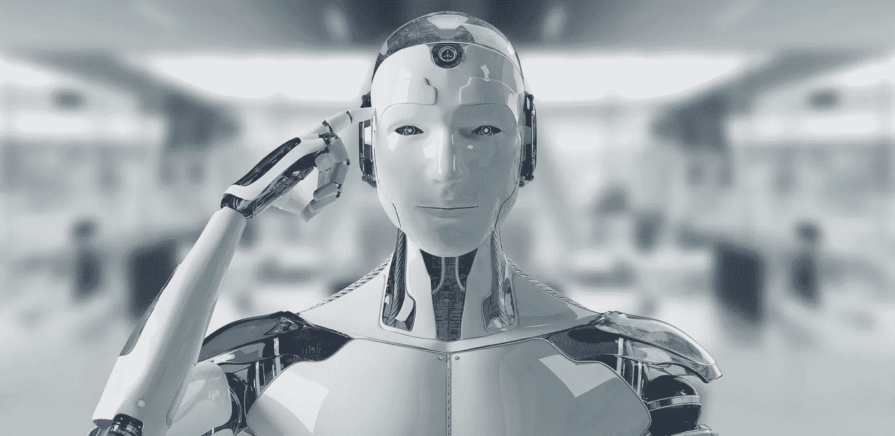

# 2021 年特斯拉人工智能日回顾——第四部分:为什么特斯拉在 2022 年不会有自主人形机器人

> 原文：<https://towardsdatascience.com/tesla-ai-day-2021-review-part-4-why-tesla-wont-have-an-autonomous-humanoid-robot-in-2022-76dff743f885?source=collection_archive---------18----------------------->

## 马斯克倾向于过度承诺，但这一次他做得太过分了

由 [Sdecoret](https://stock.adobe.com/es/contributor/201258068/sdecoret?load_type=author&prev_url=detail) 在 [Adobe Stock](https://stock.adobe.com/es/) 上拍摄的照片

本文是 4 部分系列的最后一部分:

> 1.[完全自动驾驶汽车的承诺](/tesla-ai-day-2021-review-part-1-the-promise-of-fully-self-driving-cars-8e469265509b)
> 
> 2.[训练数据。汽车是如何学习的？](/tesla-ai-day-2021-review-part-2-training-data-how-does-a-car-learn-e8863ba3f5b0)
> 
> 3.[项目道场。特斯拉的新型超级计算机](/tesla-ai-day-2021-review-part-3-project-dojo-teslas-new-supercomputer-715d102dbb29)
> 
> **4。为什么特斯拉 2022 年不会有自主人形机器人**

埃隆·马斯克毫不犹豫地承诺，他的众多公司之一特斯拉将在 2022 年底前拥有通用人形机器人的原型。但他无法实现这个承诺。

艾日演示的技术细节让大多数观众都很难理解。媒体没有太多回应工程的惊人壮举和人工智能算法和数据集的真正飞跃。相反，他们关注的是[这个](https://youtu.be/j0z4FweCy4M?t=7529)。他们称之为 Optimus，它将是一个通用的人形机器人，集成了最好的人工智能软件和最好的机器人硬件。

马斯克解释了特斯拉的垂直整合特性如何允许他们将自动驾驶汽车所用的技术转移和整合到人形车身中。

然后他说:“我们可能会在明年的某个时候有一个原型。”

这就是为什么智能自主机器人的承诺是埃隆·马斯克对特斯拉做出的所有承诺中最疯狂的，以及为什么他们不太可能按时实现它的原因。

# 完全自动驾驶技术的雄心

特斯拉诞生于 2003 年。埃隆·马斯克是该公司的联合创始人和首批投资者之一。凭借其远见卓识，他看到了电池供电电动汽车的潜力，以及最终让普通大众买得起的可能性。

众所周知，马斯克喜欢迎接大挑战:可重复使用的火箭和去火星，电动和自动驾驶汽车，人工智能和神经技术……特斯拉也不例外。将赌注押在一家以改革汽车行业为目标的新生汽车公司身上，可谓雄心勃勃。

作为电动机、电池研究和自动驾驶的先驱，将特斯拉视为一家汽车公司是合理的。但马斯克不这么认为，正如他在活动中所说:“特斯拉可以说是世界上最大的机器人公司。”它制造汽车，但它做的远不止这些。其中一个关键部分是自动驾驶系统，这是 FSD 汽车的基石。

马斯克第一次提到自动驾驶汽车是在 2013 年，当时他比较了飞机和汽车，并认为“[我们应该在汽车中安装【自动驾驶】。](https://www.bloomberg.com/news/articles/2013-05-07/tesla-ceo-talking-with-google-about-autopilot-systems)“2014 年，自动驾驶只允许“[半自动驾驶和停车功能](https://www.wsj.com/articles/tesla-aims-to-leapfrog-rivals-1412980889)”，尽管这是 FSD 的明确前身，但还远远没有实现。但在 2015 年 3 月，就在特斯拉[透露](https://www.wired.com/2015/10/tesla-self-driving-over-air-update-live/)其承诺制造完全自动驾驶汽车的几个月前，马斯克[贬低了](https://youtu.be/xQhb3C2hQoE?t=3062)挑战的难度:

> “我认为我们不必担心自动驾驶汽车，因为这是一种狭义的人工智能。这并不是我认为很难的事情。 *[…]* 我几乎把它视为一个已经解决的问题。”

低估问题的复杂性是人工智能中反复出现的模式。当开国元勋们试图预测我们何时能实现人工智能时，他们也落入了这个陷阱(AGI)。马文·明斯基，可以说是其中最著名的一位，确信这在一代人的时间内是可以实现的

FSD 比看起来要困难得多，每次最后期限没有达到，马斯克就开始移动目标——尽管他总是[向](https://www.inverse.com/article/50434-tesla-elon-musk-doubles-down-on-full-self-driving-for-next-year#:~:text=I%20don%E2%80%99t%20wanna%20sound%20overconfident%2C%20but%20I%20would%20be%20very%20surprised%20if%20any%20of%20the%20car%20companies%20exceeded%20Tesla%20in%20self-driving%2C%20in%20getting%20to%20full%20self-driving.)保证特斯拉在 FSD 技术的竞赛中领先于其竞争对手。

2016 年 10 月，马斯克[表示](https://electrek.co/2016/10/20/tesla-enhanced-autopilot-full-self-driving-capability/#:~:text=%E2%80%9CI%20feel%20pretty%20good%20about%20the%20goal%20of%20a%20demonstration%20drive%20of%20full%20autonomy%20all%20the%20way%20from%20LA%20to%20New%20York.)他预计“完全自动驾驶能力”将于 2017 年底准备就绪:“我对从洛杉矶到纽约的完全自动驾驶示范驾驶的目标感觉非常好。”2018 年 11 月，他[说](https://www.inverse.com/article/50434-tesla-elon-musk-doubles-down-on-full-self-driving-for-next-year#:~:text=%E2%80%9CI%20think%20we%E2%80%99ll%20get%20to%20full%20self-driving%20next%20year%2C%20as%20a%20generalized%20solution.%E2%80%9D)“我认为我们明年会实现完全自动驾驶，作为一种广义的解决方案。”2020 年 1 月，他[说](https://jalopnik.com/elon-musk-full-self-driving-may-be-feature-complete-1841338970#:~:text=early%20access%20to%20a-,%E2%80%9Cfeature%20complete%E2%80%9D,-version%20of%20the) FSD 将在年底“功能完整”——这意味着该系统拥有所有功能，但不能保证它能很好地工作。

每次预测都不尽人意。即使在今天，尽管几千辆特斯拉[已经实现了测试版 FSD](https://electrek.co/2021/05/26/elon-musk-updates-tesla-full-self-driving-beta-v9-timeline-fsd-subscription/#:~:text=Tesla%20is%20currently%20testing%20the%20%E2%80%9Cfeature%20complete%E2%80%9D%20version%20of%20its%20Full%20Self-Driving%20(FSD)%20package%20in%20beta%20with%20a%20few%20thousand%20customers%20and%20employees%20through%20its%20early%20access%20program.) ，自动驾驶仍然有重要的局限性。驾驶员必须手握方向盘——否则，自动驾驶仪会关闭——而且系统[似乎并不是在所有情况下都工作](https://theconversation.com/why-the-feds-are-investigating-teslas-autopilot-and-what-that-means-for-the-future-of-self-driving-cars-166307)。

实现完全自治比看起来要困难得多。马斯克直到亲身经历才承认这个事实。几个月前，他在这条推文中公开承认了挑战的难度:

他指出了 FSD 如此艰难的确切原因；现实世界的人工智能。

# 现实是艾的致命弱点

人工智能最初是为了利用当时计算机新发现的能力来解决智能问题。尽管最终目标是制造与我们相似的机器，但我们总是有着根本的不同:我们是真实的，生活在现实世界中，而人工智能生活在虚拟世界中，虚拟世界是现实的简单版本。他们不知道这个世界是什么样子。

AlphaZero 就是一个很好的例子。如果你和它下棋，它总是赢。尽管 AlphaZero 拥有压倒性的优势，但它不知道什么是卒，不知道主教会斜着走，也不知道目标是将死对手的王。它只知道 1 和 0。

这些人工智能和人类之间的差异如此之大，以至于它不断成为对当前人工智能范式最严厉的批评之一。物理学家 Ragnar Fjelland [认为](https://www.nature.com/articles/s41599-020-0494-4)“只要计算机不成长，不属于一种文化，不在世界上活动，它们就永远不会获得类似人类的智能。”

但并不是所有的 AI 系统都像 AlphaZero 一样。消防处的车不是虚拟的。这是马斯克所指的现实世界人工智能分支的一部分。泰斯拉有身体，生活在世界上，感知它，并与它互动。因为真实世界的人工智能需要考虑到它周围的世界，这比虚拟人工智能要难得多；现实很复杂。

制造一辆能够感知静止或移动、远近物体并根据位置、方向、速度以及自身和其他智能体的整体决策做出相应反应的汽车*极其复杂。*

擎天柱也是一样。Elon Musk 承诺将在 2022 年的“某个时候”进入原型阶段。像 FSD 汽车一样，机器人也需要感知现实世界并与之互动，但有一个关键的区别:表现“人类”比驾驶汽车难多了。

我来给你总结一下这一切。

虚拟人工智能在一些狭窄的任务中表现出显著的智能(AlphaZero， [GPT-3](https://en.wikipedia.org/wiki/GPT-3) )现在是最先进的。现实世界中能够感知周围环境并做出反应的人工智能(FSD 汽车)很难实现。但是设计、创造和部署像我们一样能够与世界互动的真实世界的类人人工智能(Optimus)是我们能够应对的最难的人工智能挑战。

# 特斯拉 AI 日:一个友好的跳舞机器人

在过去一个小时的技术演示后，一个机器人走上舞台，[开始随着一些 dubstep 音乐的节奏快速跳舞。它不是为了重新获得与会者的关注，而是为了介绍特斯拉的通用人形机器人 Optimus。在“机器人”离开屏幕后，马斯克拿起麦克风，为了防止有人有疑问，他明确表示:“那不是真的，”他说。但是“[它]将是真实的。”](https://youtu.be/j0z4FweCy4M?t=7573)

在明显的宣传噱头——T2[非常](https://www.newscientist.com/article/2287792-tesla-is-building-an-ai-humanoid-robot-called-optimus-says-elon-musk/) [好](https://www.theverge.com/2021/8/19/22633514/tesla-robot-prototype-elon-musk-humanoid-ai-day)——之后，他继续就擎天柱的重要性和规格做了一个高层次的介绍。他认为，特斯拉非常适合从事这个项目，因为它非常关注自主性、超级计算、“识别世界的神经网络”，以及现实世界中的人工智能——传感器和执行器。

他不想透露太多关于这个项目的情况。(可能不是因为害怕竞争对手窃取创意，而是因为他们还没有做任何事情。)我们知道的是，Optimus 将是 5'8 ' '和 125lb (~1.72m 和~57kg)，其主要目的将是“消除危险、重复和无聊的任务。”马斯克还在笑声中补充道，人们可以跑得比它快，而且“很可能压倒它。”

为了创造 Optimus，他们将利用为自动驾驶汽车开发的所有技术:自动驾驶摄像头、FSD 硬件、模拟、超级计算机训练……这种性质的机器人将能够用自然语言接受命令——非常像我们与人类交谈——并且在没有明确正式指令的情况下执行命令。

它将能够遵循这样的命令:“拿起那个螺栓，用那个扳手把它固定在车上，”或者“去商店给我买下面的杂货。”但是，更有影响力的是，它也可以遵循这个顺序:“去找一个灰色玄武岩石的样本，把它带到地下室。在你去的路上，拍一张地球的照片。”马斯克没有明确说任何关于火星的事情，但 100 名擎天柱将是完美的火星劳动力。

一个可能没有被注意到的关键细节是擎天柱有一个很好的人形的理由。“世界是人类建造的，为了人类。”我们创造世界是为了最好地满足我们的需求。无论他们希望机器人代替我们完成什么任务，最好的选择是让它尽可能地与我们相似。

现在，让我告诉你为什么这个项目，在即将成为现实的情况下，可能会是很长一段时间内人工智能和机器人学最相关的项目之一:世界上没有任何政府或公司能够立即创造出一个人形自主机器人，绝不可能。如果特斯拉(或其他任何人)实现了这一点——即使是在 5-10 年后——这将是该领域自诞生以来最重要的里程碑之一。

有充分的理由说明为什么没有其他人制造过——或者承诺过很快制造——这种机器人。这很难。这很难，有几个原因，分别来看，足以证明这个目标是人工智能历史上最雄心勃勃的。

# 为什么特斯拉不能兑现它的承诺

我想澄清的是，特斯拉并没有承诺要制造一个忠实模仿人类的机器人。他们从未提及意识，或 AGI 水平的智力，或我们相同的感觉运动能力。但即使排除所有这些因素，他们的旅程也面临着一些令人生畏的挑战。

为了说明这一点，我将使用一个火星任务的例子。让我们想象擎天柱收到了寻找灰色玄武岩石样本并带回地下室的命令。我将回答两个问题:擎天柱需要具备哪些特性才能成功完成这项任务，与 FSD 汽车相比，他将面临哪些挑战。

## 我们生活在一个多模态的世界

尽管 FSD 汽车是现实世界人工智能的一种形式，但它们感知世界的方式存在重要的限制。马斯克将特斯拉汽车定性为“半感知”，但他夸大了它们的能力。首先，FSD 汽车只能“看到”这个世界，而不能听到、闻到或触摸到。第二，他们的主要目的是“避开一切”，这意味着他们不需要与任何东西进行身体上的互动，除了他们车轮下的道路。

这个世界不仅仅是看到和避开物体。世界是多模态的。这意味着事件和物体产生不同种类的信息:电磁的(视觉)，机械的(听觉)，化学的(嗅觉，味觉)…一辆 FSD 汽车只能捕获所有信息的一小部分；可见光光谱——其余的就像不存在一样。

相反，人类可以感知颜色、质地、味道、气味、温度、压力……我们的大脑是多感官的。我们的感知系统捕捉世界的多模态本质，我们的大脑[将其整合](https://en.wikipedia.org/wiki/Multisensory_integration)为现实的单一表示。当你吃苹果时，你可以看到它略带红色的色调，尝到它的甜味，闻到它的香味，感觉到它柔软的触感。所有的一切都同时存在。

擎天柱不是用来品尝或闻的，但至少，它需要视觉、触觉和触觉(压力)传感器、本体感受——感知四肢相对于身体其他部分的运动和位置的能力——以及了解其身体可以采取行动的程度的表征。简而言之，从感觉上来说，它需要比 FSD 车更“人性化”。

如果我们命令机器人从地板上拿一块石头来检查它，它将需要检测和识别它。它需要靠近它，伸出手臂/手去够它。它需要用手指接触岩石，并将其从地面上提起——施加足够的压力将它夹在手指之间，但不要太大，以免它断裂。与此同时，它能感觉到自己的手、胳膊、腿和头相对于岩石和地面的位置。

对人形自主机器人的感知要求很难与 FSD 汽车相比。我们通常不会意识到我们的感知系统有多复杂，因为我们认为它们是理所当然的。设计它们是另一回事。

## 这个世界努力吸引我们的注意力

一辆 FSD 车不需要人类意义上的关注。汽车侧面摄像头感知到的一切都在内置的视觉神经网络中进行处理。车不主动决定去哪里参加。相比之下，人类的感知系统带来了太多的信息。大脑利用注意力来决定哪些事件或物体得到偏爱。擎天柱也需要以同样的方式在感知空间中导航。

多模态感知和注意力的结合将使擎天柱对世界的复杂性有一个非常好的感觉，同时，允许它只根据最关键和最紧迫的信息做出决定。

但是擎天柱怎么知道哪些感知需要偏好呢？它如何决定向左或向右寻找岩石？当走回地下室时，它如何决定将注意力集中在岩石、手或脚上？注意力的神经机制非常复杂，而且[还没有被完全理解](https://www.pnas.org/content/116/52/26187)。泰斯拉如何设计出一个人造大脑，能够正确地分配对无数不同感知的注意力？

在 FSD 汽车的例子中，搜索算法是注意力的替代方法。目标通常是非常明确的——从这一点到那一点——因此遵循一系列可能的行动步骤是简单明了的。在没有明确目标的情况下，这变得越来越困难。

## 计划、决定、行动

当选项是转动方向盘、加速或刹车，目标是“到达目的地，不要撞车”时，规划接下来要做什么就“容易”了。但是当选择几乎是无限的时候，就没那么多了。这是擎天柱在火星表面寻找灰色玄武岩时决策过程的一部分:

> “我应该走多少步，往哪个方向走？这块岩石是灰色、蓝色还是紫色的？我应该找块小点的石头吗？或许更大一点？我应该盯着石头不让它从我手上掉下来，还是应该把眼睛放在脚上以免被另一块石头绊倒？我是应该走得慢一点，这样我会用更少的能量，还是应该走得快一点，这样我能更快到达地下室？…"

即使是最简单的顺序也揭示了我们无时无刻不在不知不觉中做出的难以置信的大量选择。像煮咖啡这样简单的事情——我们每天早上都会做——被认为是对 AGI 水平智力的测试。我们人类[根据成功的可能性和它们将提供的价值来评估](https://www.sciencedirect.com/topics/computer-science/human-decision-making#:~:text=Human%20decision%20making%20is%20often%20studied%20as%20the%20outcome%20of%20a%20careful%20evaluation%20of%20alternative%20options%20in%20terms%20of%20the%20likelihood%20and%20the%20value%20of%20outcomes%20associated%20with%20these%20options.)我们可以选择的方案。当目标不明确和不确定时，计算变得不那么精确，因此我们进入了直觉的领域。但是机器人能有直觉吗？

然后就是如何执行计划的问题。汽车只能在 2D 的道路范围内前进或后退。人形机器人的自由度数量要大很多个数量级。一个 3D 环境，它可以走/跑/跳的方向或幅度没有限制，以及一个灵活的身体——头、躯干、四肢和手指可以以无数种组合相对于世界和彼此移动——所有这些都需要一定程度的工程，只有进化才能实现。

波士顿动力公司在过去的三十年里一直试图制造能够在复杂地形中移动的机器人，或者像动物或人类一样奔跑和跳跃的机器人。到目前为止，他们最好的是类似人类的机器人，T4 可以进行致命的跳跃——尽管有点笨拙。

机器人保持平衡并补偿运动的惯性，但它们缺乏特斯拉想要的擎天柱的智能。波士顿动力公司在三十年内完成了擎天柱在一年内成功实现特斯拉承诺所需掌握的一个方面。

## 是什么让我们成为人类——更高的认知

到目前为止，我已经描述了擎天柱的感觉运动特征(包括注意力和决策的相关过程)，但它还需要其他特征来完成上述任务。三个最重要的是语言、因果推理和常识推理。

就语言而言，这种必要性是显而易见的，因为我们想要给擎天柱口头命令，而不需要明确的指示。我之前提到的 GPT-3 是最成功的语言模型之一。它已经掌握了语言的形式和结构，以至于它可以写诗，写散文，回答问题，甚至谈论自己。看起来我们在语言技能方面已经完成了。

但事实并非如此。[专家发现](https://www.technologyreview.com/2020/08/22/1007539/gpt3-openai-language-generator-artificial-intelligence-ai-opinion/)GPT-3 的重要缺陷，主要原因是它缺乏与现实世界的联系——这是虚拟人工智能的一大弱点。它无法获得语用学和语境信息。如果我说:“去找一块灰色的玄武岩，”擎天柱需要知道什么是岩石，灰色是什么意思，以及如何区分玄武岩和火山渣。我们知道如何在现实世界的人工智能中灌输这样的语言能力吗？[还没有](/ai-wont-master-human-language-anytime-soon-3e7e3561f943)。

因果推理是理解某些事件有助于产生其他事件的能力。例如，如果天空中有云并开始下雨，我们知道是云导致了雨，而不是相反。如果擎天柱在寻找灰色的玄武岩，知道这些岩石是由火山形成的会很有用。它可以寻找地平线上最近的火山，而不是试图通过搜索地面来找到岩石。

常识推理存在于日常生活中。我们不断应用所有人共享的知识。如果我们在做饭，我们知道锅是热的，我们不应该碰它。如果下雨，我们在外面会淋湿的，除非我们带把伞。如果一辆车开得很快，我们不应该过马路。

如果擎天柱在地下找到一个深洞，那里有很多灰色的玄武岩，它应该能够意识到一旦它下去了，爬上去会有多么困难，所以在其他地方找到岩石可能是一个更好的选择。这种情况是完全可能的，需要结合因果推理和常识推理来识别风险。

推理在人工智能中有着非常特殊的地位，因为知识是符号人工智能的主要智能来源——这是机器学习接管之前的领先范式——现在几乎完全被人工智能社区所摒弃。尽管如此，[一些人认为](https://arxiv.org/ftp/arxiv/papers/2002/2002.06177.pdf)如果我们希望人工智能超越当前深度学习的瓶颈，它将需要结合基于知识和基于数据的方法。

Optimus 可能需要符号人工智能和深度学习之间的折衷解决方案，但还没有办法成功创建这些混合系统——尽管一些人正在[研究它们](https://openreview.net/forum?id=rJgMlhRctm)。

通过这个故事，我试图带领读者经历一次旅程，强调创造一个自主的人形机器人比 FSD 汽车要困难得多 FSD 汽车已经很难制造了。

现实世界的 AI 一般都很难。但是与通用的人形机器人相比，FSD 汽车简直是小儿科。擎天柱需要增强的感知和注意力，精确的决策和运动系统，形式和意义上的语言掌握，以及类似人类的推理——我相信它还需要人类认知的其他方面，我在这里没有提到。

埃隆·马斯克认为特斯拉将在 2022 年底前推出原型解决方案，但鉴于他未兑现的承诺，以及建造这种机器人的明显复杂性，他似乎不太可能实现自己的承诺。

最终实现的那一天将是值得庆祝的一天。但就目前而言，无论是特斯拉还是其他任何公司都无法很快解决这个永恒的挑战，因此，如果他们停止做出消失在空气中的承诺，对每个人来说都会更好。

*如果你喜欢这篇文章，可以考虑订阅我的免费周报*<https://mindsoftomorrow.ck.page>**！每周都有关于人工智能的新闻、研究和见解！**

**您也可以直接支持我的工作，使用我的推荐链接* [*这里*](https://albertoromgar.medium.com/membership) *成为媒介会员，获得无限权限！:)**