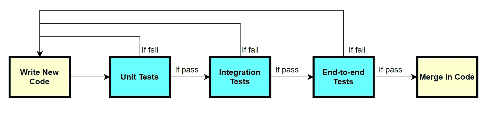
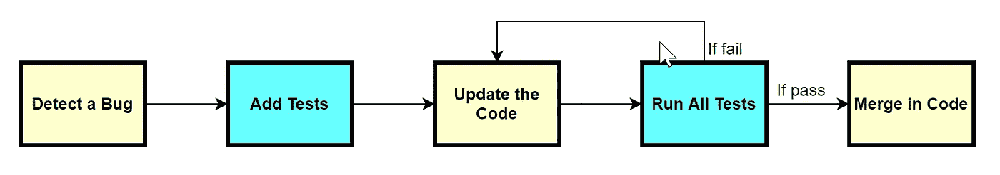

# 测试机器学习库的最佳实践

> 原文：<https://towardsdatascience.com/testing-best-practices-for-machine-learning-libraries-41b7d0362c95?source=collection_archive---------6----------------------->

## [实践教程](https://towardsdatascience.com/tagged/hands-on-tutorials)

## 用 pytest 开发更好的库


来自 [unsplash](https://unsplash.com/photos/w7ZyuGYNpRQ) 的[凯文·Ku](https://unsplash.com/@ikukevk)的照片

> **免责声明:**在测试、开发和设计过程中，你不可能将所有的东西都适用于提议的结构、运用常识和你的判断。

如今，许多 python 库都是由 ML 研究人员和从业者构建的。在我的公司也是如此，我们维护着几个内部库，并且在每个 sprint 中都发布一个新版本。每当我们想要添加一个新的特性，修复一个现有的 bug，或者重构代码库时，都会涉及到测试。在这个高度迭代的过程中，我们发现拥有一个好的测试框架可以节省我们很多时间。

作为一名不是软件工程背景的数据科学家，我想在这篇文章中分享一些我发现的测试最佳实践。

我们目前使用 [pytest](https://docs.pytest.org/en/stable/) 来测试我们所有的内部库。所以我们先从 pytest 的一些基础知识开始吧！

# pytest 基础

在深入研究测试策略之前，需要了解 pytest 的一些基本概念。请注意，本节涵盖并且仅涵盖理解我们的测试策略所需的知识范围。更多信息，请参考 pytest 的[官方文档](https://docs.pytest.org/en/stable/)。

## 1.文件夹结构

对于我们的每个内部库，我们有一个单独的 **tests** 文件夹专门用于测试。要与 pytest 一起使用，tests 文件夹将具有以下结构:

试验

| — conftest.py

| —测试名称. py

| —测试 _ 某些 _ 其他 _ 名称. py

…

我们可以看到，有一个 **conftest.py** 和几个 **test_*。py** 文件。在 conftest.py 中，您可以设置测试配置并存储测试函数所使用的测试用例。在 pytest 中，配置和测试用例被称为**夹具**。测试 _*。py 文件是实际测试函数所在的地方。记住，**这个命名约定是强制性的**。否则 pytest 将无法定位夹具和测试功能。

接下来我们将看看这两种类型文件的内容，以便更好地理解什么是 fixtures，什么是测试函数。

## 2.内容

简单来说，conftest.py 是一个 pytest fixtures 的集合，由不同 test_*的测试函数使用。py 文件。在编写任何装置之前，请记住

```
**"""
conftest.py
"""****import** pytest
```

## 2.1 配置夹具

首先让我们看一个配置夹具的例子，spark 配置夹具。

```
**"""
conftest.py
"""**@pytest.fixture(scope**=**"session")**def** spark_session(request): """ fixture for creating a spark context Args: request: pytest.FixtureRequest object """ spark **=** ( SparkSession .builder .master("local[4]") .appName("testing-something") .getOrCreate() ) request.addfinalizer(**lambda**: spark.sparkContext.stop()) **return** spark
```

您应该注意到这段代码中的三点:

1.  pytest fixture 实际上只是一个由 **pytest.fixture** 装饰器包装的函数，它返回将用于测试的 spark 实例。
2.  它有一个可选的 **scope** 参数，指定 fixture 将持续多长时间。它默认为“function ”,因此将为每个测试函数创建 fixture，在我们的例子中是 spark 实例。因为这是一个开销很大的操作，而且 spark 实例可以被不同的测试函数重用，所以我们将范围指定为“session”，这意味着它将在整个测试会话中保持不变。
3.  我们的函数接受一个请求参数，这是一个 pytest 内置的 fixture。我们用它来在测试会话终止后停止 spark 实例，这是通过 return 语句之前的行来完成的。如果您的配置不需要拆卸步骤，您可以简单地从函数签名中删除请求。

## 2.2 测试用例夹具

接下来让我们看看更广泛使用的测试用例夹具。假设我们的测试用例是一个熊猫数据帧。

```
**"""
conftest.py
"""**@pytest.fixture**def** text_language_df(): **return** pd.DataFrame({ "text": ['hello', 'hola', 'bonjour'], "language": ["english", "spanish", "french"] })
```

就是这样！这就像返回您想要使用的测试用例一样简单。这里我们省略了 scope 参数，所以它默认为“function”。

接下来我们就来看看测试的内容 _*。py 文件，希望您能看到 pytest 的神奇之处。

## 3.测试内容 _*。巴拉圭

现在，假设我们想测试我们的语言检测函数，它接收一个文本字符串，并返回最可能使用的语言。

因此，在我们的**test _ language _ detection . py**中，我们将有这样的代码片段:

```
**"""
test_language_detection.py
"""**# import the detect_language function here**def** test_detect_language(text_language_df): **for** i **in** range(len(text_language_df)): **assert** detect_language(text_language_df.text[i]) **==** text_language_df.language[i]
```

您应该注意到这段代码中的两点:

1.  测试函数的名称以“test”开头。这是测试函数在被调用时对 pytest 可见所必需的。利用该属性的一个技巧是在您现在想要跳过的测试函数的名称前添加一个下划线。
2.  **text_language_df** 是您在 conftest.py 中声明的 fixture，无需任何导入或额外开销，您可以在任何 test_*的任何测试函数中使用它。py 文件。你可以把它当作一个正常的熊猫数据框。

现在你会明白为什么我们说 conftest.py 是“不同 test_*的测试函数使用的 pytest fixtures 的集合”。py 文件”。这些设备被定义一次，并在任何地方使用。

事实上，pytest 还允许您在每个 test_*中创建 pytest fixtures。py 文件。我们发现最好放置仅用于这一个测试的夹具 _*。py 文件，这样 conftest.py 就不会被夹具淹没。

## 4.pytest CLI

pytest 在 CLI 中调用。最直接的方法是打电话

```
$ pytest tests/or$ pytest tests/test_language_detection.py tests/test_something.pyor$ pytest tests/test_language_detection.py::test_detect_language tests/test_something.py
```

有关指定测试/选择测试的更多信息，请参考[官方文档](https://docs.pytest.org/en/stable/usage.html#specifying-tests-selecting-tests)。

# 常见测试策略

在这一节中，我们将讨论我们在测试内部库时开发的通用测试策略。**这些策略背后的核心思想是支持更快的迭代。**

## 0.测试分类

我们为内部库运行的所有测试可以根据不同的粒度大致分为三类:

*   **单元测试**关注不依赖于其他未测试组件的特定方法或功能；
*   集成测试处理涉及几个单元的复杂流程和交互。他们几乎总是依赖一些模拟的功能来加快迭代；
*   **端到端测试，**与前面的类别相反，不要利用被模仿的功能。他们测试整个特性，所有的依赖项都存在并设置好了。

## 1.测试工作流程

在我们的库开发过程中，我们发现两种类型的工作流非常常见，即新代码的测试工作流和错误修复代码的测试工作流。

## 1.1 新代码的测试工作流程



作者图片

对于添加新代码，如果适用的话，您需要实现三个级别的测试。代码必须通过所有三个级别的测试。在较高级别上失败将从最低级别重新启动代码。

## 1.2 错误修复代码的测试工作流程



*作者图片*

对于添加修复错误的代码，我们强烈建议在对现有代码进行更改之前添加测试。您应该预料到添加的测试会在 bug 修复之前失败，并在 bug 修复之后通过。通过这种方式，测试可以作为**回归测试**来防止我们在将来再次意外重现相同的错误。另一个要点是，在合并代码之前，始终运行并通过所有测试。如果没有可用的 CI/CD 工具，您必须手动实施此规则。

接下来，我们将看看两个测试策略，它们用于缩短测试等待时间和加快测试更新。

## 2.参数化测试用例

在前一节中，我们展示了如何在 conftest.py 中创建一个测试用例夹具，然后在我们的测试函数中重用它。测试用例夹具是一个 pandas 数据框架，由一系列测试用例组成。使用 dataframes **(实际上是任何集合数据结构，如 list、tuple、set)** 的一个缺点是，当 dataframe 中的一个测试用例失败时，整个测试函数将被标记为失败。很难找出哪一个测试用例没有实现这个功能。更不方便的是，如果测试函数在计算上很昂贵，如果其中一个测试用例失败，你将无法在一次运行中得到所有测试用例的测试结果。您必须首先修复失败的测试用例，重新运行 pytest，并在另一个失败发生时重复这个例程。

幸运的是，pytest 提供了几种参数化测试用例的方法，因此每个测试用例都被单独处理，您可以在一次运行中获得它们的所有结果。

## 对于由一个测试功能使用的测试用例

这是通过**@ pytest . mark . parameterize**装饰器完成的，它直接应用于**测试函数**。让我们看看语言检测测试示例是如何工作的。

```
**"""
test_language_detection.py
"""**@pytest.mark.parametrize( "text,expected", [ ('hello', 'english'), ('hola', 'spanish'), ('bonjour', 'french') ])**def** test_detect_language(text, expected): **assert** detect_language(text) **==** expected
```

这是不言自明的。在一次运行中，测试函数将被调用三次，这样我们可以分别得到每个测试用例的结果。

关于测试函数参数化的更多信息，请参考[官方文档](https://docs.pytest.org/en/stable/parametrize.html#pytest-mark-parametrize-parametrizing-test-functions)。

## 对于由多个测试功能使用的测试用例

在这种情况下，我们不是对测试功能进行参数化，而是对**夹具功能**进行参数化。

```
**"""
conftest.py
"""****import** pytest**from** collections **import** namedtupleTestCase **=** namedtuple("TestCase", ["text", "expected"])@pytest.fixture( params**=**[ TestCase("hello", "english"), TestCase("hola", "spanish"), TestCase("bonjour", "french") ])**def** test_case(request): **return** request.param
```

然后在测试功能中，我们可以使用参数化夹具，如下所示:

```
**"""
test_language_detection.py
"""****def** test_detect_language(test_case): **assert** detect_language(test_case.text) **==** test_case.expected
```

您应该注意到这段代码中的两点:

1.  内置的请求夹具负责协调参数化。乍一看，这有点违反直觉，但是您可以将它简单地视为参数化的“语法”。
2.  **pytest.fixture** 中的 **params** 参数接受一个列表。这里我们将列表中的每一项定义为一个命名元组，以避免硬编码的索引或字符串。使用命名元组使我们能够在测试函数的后面将测试用例的输入和输出称为 test_case.text 和 test_case.expected。相反，如果您有形式为["hello "，" english"]的项目，那么您必须在测试函数中将它们称为 test_case[0]和 test_case[1]，这不是一个好的编程实践

关于参数化夹具的更多信息，请参考[官方文档](https://docs.pytest.org/en/stable/fixture.html#fixture-parametrize)。

测试用例参数化的另一个隐含的好处是，它可以很容易地用新的测试用例更新现有的测试。我们发现这在 bug 修复代码的测试工作流程中非常有用。比如，假设有用户向我们反映 detect_language 函数错误地将“nǐ hǎo”赋给了“越南语”，应该是“汉语”。按照错误修复代码的测试工作流程，我们首先添加回归测试。由于测试用例已经被参数化，如果我们使用@ pytest . mark . parameterize，这可以通过简单地添加一个元组 **("nǐ hǎo "，" chinese")** 到列表中来完成，或者如果我们正在参数化 fixture 函数，添加一个**测试用例(" nǐ hǎo "，" chinese")** 。如果测试用例没有被参数化，要达到同样的效果会困难得多。

## 3.模仿复杂的类

当从我们的内部库为一个类编写测试时，我们遇到的一个常见情况是这个类的一些抽象方法还没有实现。这些抽象方法旨在供我们的最终用户，即数据科学家，基于他们的用例来实现。实现的缺失阻止了我们实例化和测试这个类。我们找到的解决方法是子类化这个类，显式地实现抽象方法，但是让方法体为空。

例如，假设我们想要测试一个**分类器**类，它有三个抽象方法:load_dataset、load_model、compute_metrics。由于我们的测试范围是确保分类器实例对于一般用例来说能够正确运行，所以我们不想引入任何特定的数据集或模型。我们创建了一个新类 **MockedClassifier** ，它继承了 Classifier 并显式实现了这些抽象方法。

```
**"""
test_classifier.py
"""****class** MockedClassifier(Classifier): **def** load_dataset(self, *args, **kwargs): **pass** **def** load_model(self, *args, **kwargs): **pass** **def** compute_metrics(self, *args, **kwargs): **pass**
```

然后我们可以用 MockedClassifier 代替分类器来测试它的功能。例如，测试它的实例化

```
**"""
test_classifier.py
"""****def** test_instantiation(): trainer **=** MockedClassifier("init args here")
```

模仿有用的另一种情况是当您想要测试的类有一些与测试范围无关的计算开销大的操作时。您可以对其进行子类化，并用更简单的操作覆盖昂贵的操作。举个例子，

```
**"""
test_class_with_expensive_operation.py
"""****class** MockedClass(ClassWithExpensiveOP): **def** some_expensive_operation(self, *args, **kwargs): # code for lighter operation here
```

# 高级 pytest

在最后一节中，我们将介绍一些从过去的经验中发现有用的高级 pytest 技术。

## 1.从命令行传入参数

有时我们可能想从命令行传递一些参数来控制测试行为。例如，假设我们想测试从某个文件路径加载一个文件。文件路径因平台而异。为了使我们的测试可移植，我们可以从命令行传入一个平台参数，并基于它设置文件路径。

要添加命令行参数，

```
**"""
conftest.py
"""****import** pytest**def** pytest_addoption(parser): parser.addoption( "--platform", action**=**"store", default**=**"platform_0", choices**=**["platform_0", "platform_1", "platform_2"], help**=**"The name of the platform you are on")@pytest.fixture**def** platform(pytestconfig): **return** pytestconfig.getoption("platform")
```

现在我们可以打电话了

```
$ pytest tests/ --platform platform_2
```

平台夹具将存储我们从命令行输入的平台信息。如果没有给出明确的平台，则默认为“platform_0”。

接下来，我们添加文件路径设备，这是由我们所在的平台决定的。

```
**"""
conftest.py
"""**@pytest.fixture**def** filepath(platform): **if** platform **==** "platform_0": **return** "the file path on platform_0" **elif** platform **==** "platform_1": **return** "the file path on platform_1" **elif** platform **==** "platform_2": **return** "the file path on "platform_2""
```

最后，我们可以用这个 filepath fixture 测试加载。

```
**"""
test_file_load.py
"""****def** test_load_file(filepath): with open(filepath, "r") as f: f.read()
```

## 2.临时目录和文件

我们的一些库代码在运行时会写入磁盘文件。例如，在测试我们的实验跟踪库时，它会写日志、度量等。到磁盘文件。pytest 提供了几个针对这个用例的临时目录和文件装置。他们已经有了非常全面的文档[这里](https://docs.pytest.org/en/stable/tmpdir.html)。

## 3.嘲笑者.间谍

当测试一些类时，我们希望确保不仅结果是预期的，而且函数调用的数量也是预期的。为了实现这个强大的功能，我们需要安装 [**pytest-mock**](https://github.com/pytest-dev/pytest-mock/) ，这是一个 pytest 插件，提供了一个 **mocker** fixture。目前我们只使用它的 **spy** 实用程序，一个简单例子的清晰文档可以在[这里](https://github.com/pytest-dev/pytest-mock/#spy)找到。

## 4.夹具分解

处理夹具的一种方法是将夹具放在多个 test_*之间共享。py 文件，将特定于测试模块的夹具留在那里。这种方法的一个潜在缺点是，它会产生非常大的 conftest.py，这很难导航，并且可能导致合并冲突，即使人们正在处理不同的测试模块。

从这个意义上说，当 conftest.py 变得太大，以至于低效的导航和协作的负面影响超过了集中化的好处时，它应该被拆分成多个 fixture 文件。例如，一个夹具文件用于数据集夹具，一个夹具文件用于配置夹具，等等。

事实上，pytest 提供了一种方法来做到这一点，而不会牺牲不同测试模块之间共享夹具的好处。将 conftest.py 分成几个 fixture 文件后，您可以将它们作为插件包含回 conftest.py 中。

更具体地说，假设我们有一个 dataset_fixtures.py 和一个 config_fixtures.py，如下所示:

```
**"""
dataset_fixtures.py
"""****import** pytest@pytest.fixture**def** dataset_fixture_0(): # some code here@pytest.fixture**def** dataset_fixture_1(): # some code here**"""
config_fixtures.py
"""****import** pytest@pytest.fixture**def** config_fixture_0(): # some code here@pytest.fixture**def** config_fixture_1(): # some code here
```

然后，要将它们重新包含到 conftest.py 中，只需添加一行

```
**"""
conftest.py
"""****import** pytestpytest_plugins **=** ["dataset_fixtures", "config_fixtures"]# code for fixtures in conftest.py here
```

就是这样！这些测试实践很容易执行，但是它们被证明在我们的开发周期中非常方便。希望它们能帮助你以更快更健壮的方式开发 python 库:)