# 面向数据科学家的测试

> 原文：<https://towardsdatascience.com/testing-for-data-scientists-1223fcad4ac2?source=collection_archive---------26----------------------->

## *使用 pytest 和假设进行单元测试*


由 [Sarah Kilian](https://unsplash.com/@rojekilian?utm_source=unsplash&utm_medium=referral&utm_content=creditCopyText) 在 [Unsplash](https://unsplash.com/s/photos/accident?utm_source=unsplash&utm_medium=referral&utm_content=creditCopyText) 上拍摄的照片

软件测试对于软件开发至关重要。推荐软件工程师使用测试驱动开发(TDD)，这是一种先开发测试用例，再开发软件的软件开发过程。对于数据科学家来说，首先编写测试并不总是容易和合理的。然而，软件测试是如此重要。每个数据科学家都应该知道如何进行单元测试，并在他们的数据科学工作流程中使用单元测试。许多数据科学家已经在使用断言，这是测试驱动开发非常重要的第一步。本文将从断言开始，重点关注两个工具— `pytest`和`hypothesis` 。还有其他可用的测试工具，比如 Python 内置库`unittest` 。`unittest`与`pytest` 有相似的功能，但我认为`pytest`对数据科学家来说更友好，包含更多有用的功能。

# 建立

要安装`pytest`和`hypothesis` ，运行`conda install pytest hypothesis -c defaults -c conda-forge` 。

为了使用`pytest`和`hypothesis` ，我们需要分离主脚本和测试脚本。在下面的例子中，我们用于数据访问、处理和建模的主脚本将被称为`stock_example.py` 。我们的测试脚本将被称为`test_stock_example.py` 。在实践中，数据访问、处理和建模通常在单独的文件中，并且可能有多个测试文件。此外，建议将测试文件保存在`tests`目录下。我们的文件结构如下所示:

```
. 
⊢ stock_exmple.py 
⊢ tests 
    ⌙ test_stock_example.py
```

# 测试数据访问和输入数据

数据科学家可以从任何地方获得数据:从内部来源、供应商和不同的 API。我们的数据管道和模型依赖于成功获取正确的数据。如果我们无法获得数据，或者如果供应商更改了数据模式或格式，我们希望能够在测试脚本中发现这些问题。

在我们的示例中，我们使用 yahoo finance API ( `pip install yfinance` )来获取股票数据，并尝试优化投资组合中的股票分配。在`stock_example.py` 中，我写了一个函数`stock_data`，从给定的报价器中获取调整后的收盘价，并返回一个熊猫数据帧(见下图，左图)。为了测试这个函数，在`test_stock_example.py`文件中(见下图，右图)，我们定义了两只股票和时间框架，并从函数`stock_data` 中获得一个数据帧`df_func`。`df_truth`是我们期望函数返回的值。那么`df_func`必须与`df_truth` 相同。比较两个数据帧时，建议使用功能`assert_frame_equal`。如果两个数据帧不相同，那么`assert_frame_equal`会告诉我们差异的确切位置。

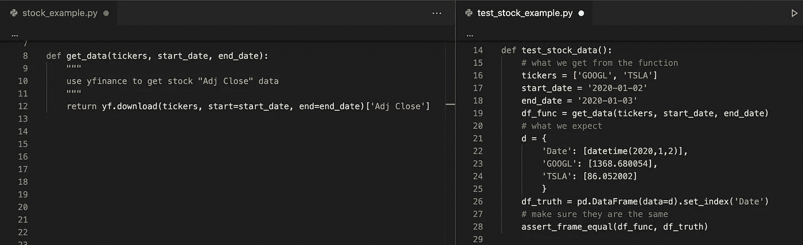

现在，如果我们运行`pytest`或`python -m pytest`(如果 pytest 没有在 PYTHONPATH 中添加当前目录)，那么我们可以看到我们通过了测试。我们从函数中得到的数据帧确实是我们期望看到的数据帧。这个简单的测试将告诉我们，通过 API 访问数据是否有问题，或者数据格式是否发生了变化。

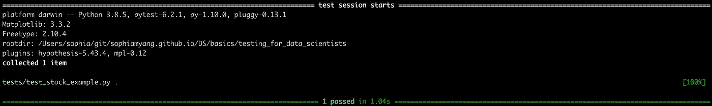

## 另一个例子和夹具

如果您的测试用例很大，并且您不想检查两个数据框是否相同，那么您可以在测试脚本中使用断言来检查数据框的形状、重复项、列名、缺失值等。例如，在下面的例子中，我们从三个报价机和一个更长的时间段获得数据。我们检查了数据框的形状、所有单元格中没有空值、所有单元格值都大于零以及列名。

注意，在这个例子中，我使用了一个装饰器`@pytest.fixture`来定义一个 fixture 函数`load_data` 。在这个函数中，我们加载数据并返回一个数据帧。fixture 的默认范围是`scope='function'`，fixture 将被每个函数调用。我们可以提供更大范围的夹具，如`class` 、`module` 、`package` 、`session` 。范围更大的 Fixture 函数(例如`@pytest.fixture(scope="module")` )将允许我们只加载一次数据，并在不同的测试函数中使用它。然后我们可以使用这个夹具作为测试函数中的一个参数。这里，我在测试函数`test_load_data`中传递了 fixture `load_data`，并定义了`df = load_data`来获取这个数据帧。然后我可以像我之前提到的那样做我的断言和检查。

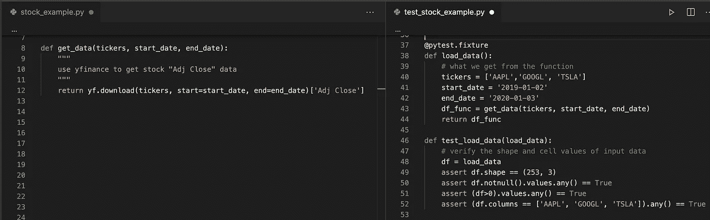

`python -m pytest`显示我们通过了两项测试。

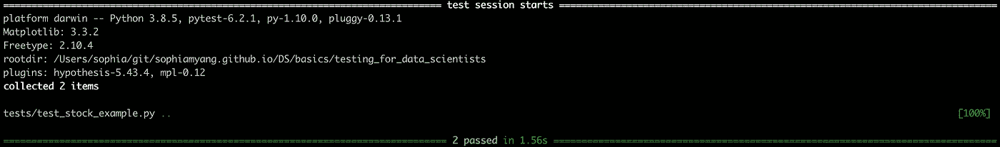

# 试验田

数据科学家经常生成可视化报告或仪表板，他们可能不希望可视化图像被意外更改。`pytest-mpl`允许我们测试我们的`matplotlib`图像是否改变。首先，我们需要安装`pytest-mpl` :

```
conda install pytest-mpl -c defaults -c conda-forge
```

接下来，在我们的主文件`stock_example.py`(见下图，左图)中，我们添加了一个函数`stock_plot` ，它为多只股票生成线图。在测试文件`test_stock_example.py`(见下图，右面板)中，我们添加了一个测试函数`test_stock_plot`，它调用并测试`stock_plot`函数。同样，我们在测试函数`test_stock_plot`中传递夹具`load_data`来获得这个数据帧。注意，我们还添加了一个装饰器`@pytest.mark.mpl_image_compare(remove_text=True)`来指示我们想要比较图像的位置。

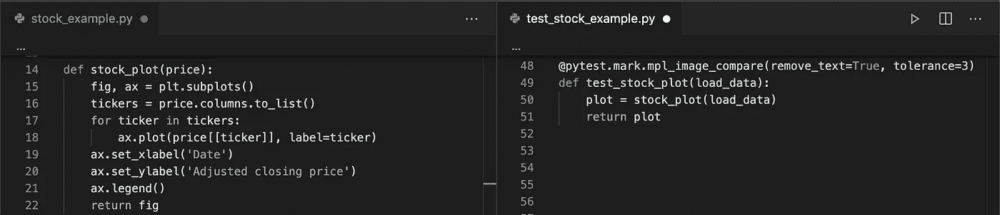

在我们运行`pytest` 之前，我们需要运行下面的代码来生成一个基线图像，以便与未来的图像进行比较。图像将保存在测试/基线目录下。不要忘记看看生成的基线图像，以验证它是正确的。

```
python -m pytest -k test_stock_example --mpl -generate -path = tests /baseline
```

然后我们运行`pytest`并将新图像与基线图像进行比较。`--mpl`标志启用 matplotlib 图形与参考文件的比较。


# 测试数据处理

数据处理有时花费最多的时间，也最容易出错。在这个例子中，我计算了每日回报率，并把夏普比率简化为两个函数:`calculate_daily_returns`和`neg_sharpe_ratio`(见下图，左图)。理想情况下，您应该测试所有的功能。为了简单起见，由于`neg_sharpe_ratio`使用`calculate_daily_returns` ，我只测试了`neg_sharpe_ratio` 。

## 用参数表示

在我们的测试脚本中，我使用`@pytest.mark.parameterize`装饰器测试了三个案例。当我们测试多个案例/输入时，我们可以多次写出测试作为多个测试，并在一个单独的测试中测试每个输入，但这将是大量的重复。测试多个案例的一个更好的方法是将您的案例写在一个列表中，并使用`parameterize`遍历并测试您的案例。

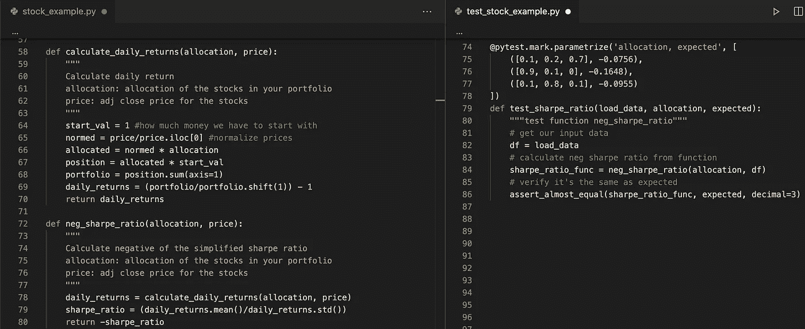

虽然我们只写了一个测试函数，但是由于我们有三个测试用例，实际上我们又通过了三个测试。

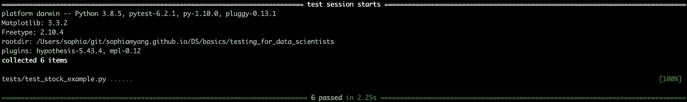

在数据处理步骤中，您可以进行许多测试。例如，如果您正在运行统计模型并关心统计属性，您可能会测试分布、正态性、异常值等。

# 试验模型

在我们的模型中，我们展示了一个使用夏普比率优化股票投资组合的非常简单的例子。我写了一个函数`optimize_sharpe_ratio`来计算给定历史价格数据的投资组合中股票的最佳配置。对模型最直接的测试是测试模型的准确性。由于我们的模型非常简单，我们假设准确率为 100%,并测试我们的模型是否输出正确的股票分配。同样，我们使用`@pytest.mark.parameterize`来测试我们的测试函数`test_optimization` 中的两个例子，给定报价机和时间段，我们期望看到一定数量的股票分配。

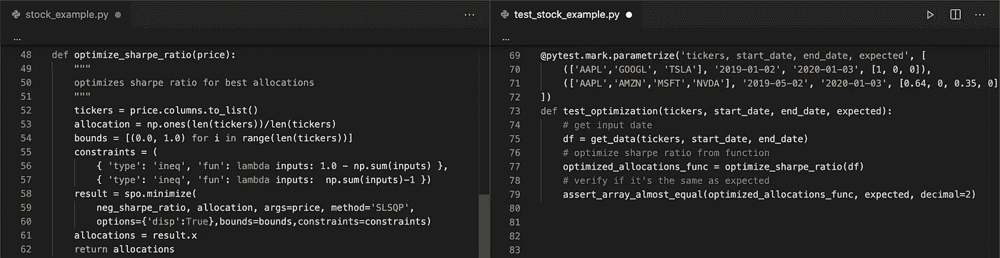

太好了，现在我们又通过了两项测试。

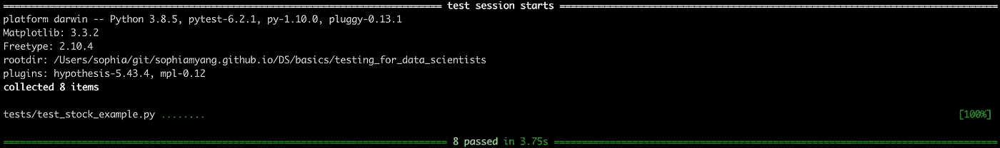

## 假设

`Hypothesis`是 Python 中的一个包，它进行基于属性的测试。我知道这个名字让数据科学家超级困惑。这个假设检验和我们在统计学中熟悉的假设检验没有任何关系。到目前为止，我们所做的所有测试都需要用户定义的输入。万一有我们没想到的死角呢？如果我们想在一个给定的空间中测试许多不同的数据，该怎么办？`Hypothesis`是使用的工具。它生成与您的策略相匹配的任意数据，在大范围的数据/测试案例上运行测试函数，然后检查您的结果是否具有您定义的某些属性。

例如，这里我们想生成一个熊猫数据帧，它有四列，列名分别为' StockA '、' StockB '、' StockC '和' StockD '。我们希望“StockA”的值介于 1e2 和 1e3 之间，“StockB”的值介于 1e2 和 1e4 之间，“StockC”的值介于 1e3 和 1e5 之间，“StockD”的值介于 1e5 和 1e6 之间。我们希望至少有 8 行。以下是根据我们的策略生成的数据示例:

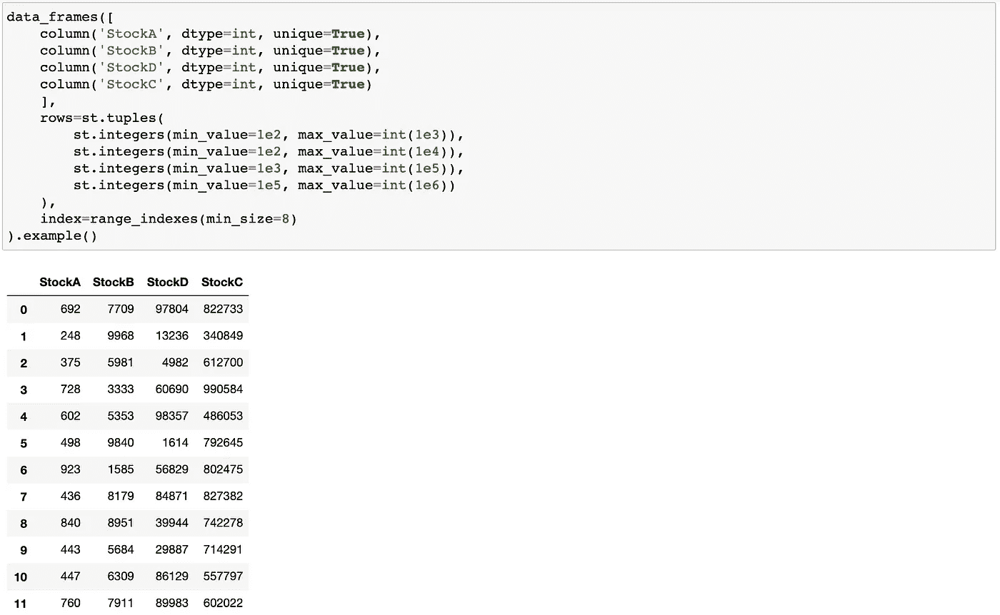

现在，在测试脚本中(见下面的右面板)，我们将在随机生成的数据帧上测试`optimize_sharpe_ratio`函数。这里我们需要使用`@given`装饰器来定义策略，并通过测试函数`test_optimization_allocation` 中的参数`df`插入生成的数据。然后，我们可以检查结果是否遵循特定的属性或规则。这里我们检查结果分配值的总和是否为 1。

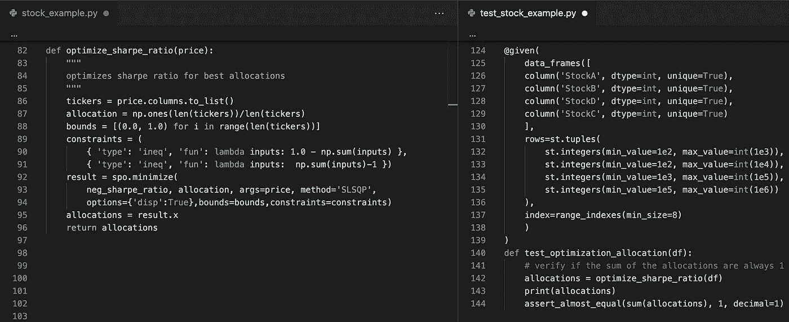

太好了！我们已经通过了在这个简单的例子中定义的所有测试。


现在，我们已经通过一个示例了解了数据科学家如何使用`pytest`和`hypothesis`来测试他们的数据科学工作流程。我们学习了如何使用`pytest` 中的`fixture` 、`mpl_image_compare` 、`parameterize`和`hypothesis` 中的`given`。这两个库还提供了许多其他有用的特性，在测试中还需要考虑许多其他的事情。根据您的用例，您可能有不同的场景和不同的边缘情况。您可能还想测试覆盖率，也就是说，我的测试覆盖了多少代码。当您测试模型时，您可能想要将您的模型与您的基准或替代模型进行比较。

本文提到的代码可以在这里找到: [stock_example.py](https://github.com/sophiamyang/sophiamyang.github.io/blob/master/DS/basics/testing_for_data_scientists/stock_example.py) 和 [test_stock_example.py](https://github.com/sophiamyang/sophiamyang.github.io/blob/master/DS/basics/testing_for_data_scientists/tests/test_stock_example.py) 。希望你喜欢这篇文章。下次见！

参考资料:
T5【https://docs.pytest.org/】T6
https://hypothesis.readthedocs.io/

作者索菲亚·杨 2021 年 1 月 9 日