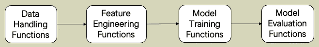
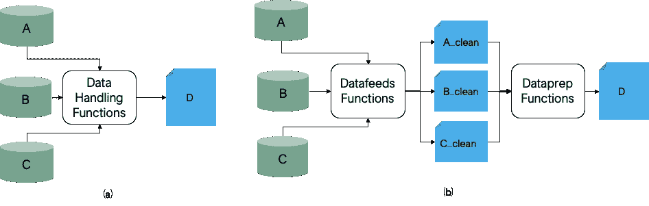
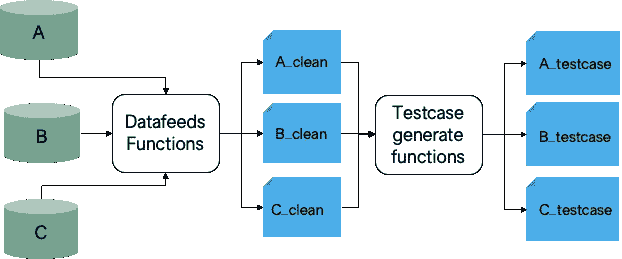
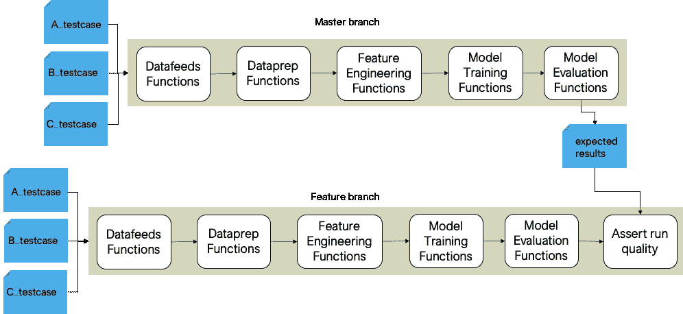

# 测试机器学习管道

> 原文：<https://towardsdatascience.com/testing-machine-learning-pipelines-22e59d7b5b56?source=collection_archive---------23----------------------->


[照片](https://www.pexels.com/photo/internet-technology-computer-display-360591/)由[马库斯·斯皮斯克](https://www.pexels.com/@markusspiske)拍摄

如果你没有时间阅读全文，可以考虑阅读 30 秒版本。

# 摘要

如果您在生产中有机器学习(ML)管道，您必须担心对管道所做更改的向后兼容性。增加测试覆盖率可能很诱人，但是高测试覆盖率不能保证您最近的更改没有破坏管道或者产生低质量的结果。为此，您需要开发端到端的测试，这些测试可以作为持续集成管道的一部分来执行。开发这样的测试需要对数据集进行采样，该数据集从产生可接受的结果的运行中为管道提供动力，并且您对该数据集有深入的了解。一旦有了采样数据，就可以运行稳定版本，如 master 等。，以产生预期的结果。当您有一个特征分支时，对采样数据运行该分支，将实际结果与预期结果进行比较，当差异可接受时，将其视为绿色。

如果你对如何做得更详细一点感兴趣，请查看其余部分。

# 背景



图 1:抽象为任务功能的有向无环图的机器学习管道。作者照片。

许多机器学习管道可以最好地抽象为任务功能的有向无环图(见图 1)。在这些任务函数下面，有成百上千行代码。随着你的代码库的成熟，我们采用分支策略，比如， [Gitflow](https://www.atlassian.com/git/tutorials/comparing-workflows/gitflow-workflow) 。对管线进行更改时，通常是通过特征分支来完成的。对该分支的每一次提交都会触发一些静态代码分析和单元测试，给你一个红色或绿色的信号，告诉你什么东西不工作或者工作了。经过几轮反馈后，您对这些变化感到满意。所以，你合并了这个分支，为一项出色的工作想些开心的事情。几天后，您已经为生产运行做好了准备，并从您最近推出的特性中获得了新的信心。第一次跑步的早晨，你准备好享受一夜之间跑完的成功的荣耀。当您查看运行状态时，您会看到您不想看到的情况:运行失败！您实施的新的改进插补技术无法处理零除法错误。您很恼火，因为单元测试可以很容易地发现这一点。所以你修改代码，添加一个测试，重新开始运行。一段时间后，您检查运行状态；又失败了。这一次是日志记录时对字符串格式的错误处理。如果幸运的话，这是您需要解决的最后一个问题。然而，你可能没有那么幸运，可能还有其他五个问题会失败。

老实说，这是一场必败之战。覆盖不断增加/变化的代码库是不容易的，其中很大一部分由于随机性、复杂的数据结构、复杂的逻辑等而不容易测试。团队的流动性也没有帮助。最大的挑战是生成测试数据，如果手动生成，会很麻烦。

# 解决方法

虽然没有万无一失的解决方案，但有一种实用的方法，如下所述。

1.  拆分数据处理功能，将中间结果保存为*干净的表格*，以便能够再现运行。
2.  执行修改后的代码，从干净的表中产生*测试用例表*。
3.  在测试用例表上端到端地运行 ML 流水线，以产生运行的预期结果*。对于任何后续的特性分支，采用运行在测试用例表上的 ML 管道的变体，并将其结果与预期结果进行比较。*

让我们在接下来的内容中更具体地描述这些步骤。

## 步骤 1:调整数据处理功能



图 2:机器学习管道中的数据处理。(a)原始设计，其中三个不同的表被清理、组合并聚集成一个表。(b)建议的设计，其中使用 Datafeeds 函数清理和保存各个表，然后使用 Dataprep 函数合并和聚合这些清理后的表，以生成最终的单个表。作者照片。

图 2 展示了一种增强 ML 管道来生成测试数据的方法。通常，所有与数据相关的活动，如清理单个表、合并多个表和聚合到有意义的维度，都是在同一任务中完成的，没有保留任何中间步骤(见图 2(a))。我们提倡将该任务分成两个任务:Datafeeds 和 Dataprep(参见图 2(b))。在第一个任务中，我们将处理与清理单个数据表相关的各种活动。应该以这样的方式完成，即使 clean table 再次经历相同的过程，它也会产生自身的副本，即`f(A) → A'; f(A') → A'`。所有数据组合和聚合过程都包含在 Dataprep 任务中。

## 步骤 2:生成测试用例表

没有必要运行完整的管道来生成干净的和测试用例表。我们可以创建一个只运行数据处理功能的 ML 管道的变体(参见图 3)。



图 3:使用干净的表生成测试用例表的数据管道。作者照片。

当表被生成时，干净的表可以被保存在与测试用例表不同的位置。例如，我们可能希望将干净的表保存在安全的数据湖中，因为它们可能包含敏感信息。然而，我们可能希望将测试用例数据集保存在一个更容易访问的地方，以便快速使用。另外，一些端到端测试实际上可能更小，例如冒烟测试，它需要更小的表。出于这些原因，我们需要生成抽样的合成表，而不是原始的干净表。

为了从原始数据集创建一个采样的合成数据集，同时保留相同的统计属性，我们可以使用数据合成库，如[合成数据库](https://github.com/sdv-dev/SDV) (SDV)。要使用该库，请生成一个从干净的表中学习的模型。

```
import sdv
from sdv.tabular import GaussianCopulamodel = GaussianCopula()
model.fit(clean_table)
sdv.save('clean_table.pkl')
```

一旦生成了模型，就可以在以后使用它来生成各种各样的测试用例数据，如下所示:

```
import sdv
from sdv.evaluation import evaluatemodel = sdv.load('clean_table.pkl')
testcase_table = model.sample(200)
assert evaluate(clean_table, testcase_table) > 0.8
```

## 步骤 3:执行测试运行



图 4:测试运行。作者照片。

测试运行包括两个不同管道的执行(参见图 4)。首先，稳定版本，即主分支，它应该在测试用例表上运行以产生预期的结果。最后，特性分支也应该在相同的表上运行。但是，在最后一步中，它应该运行一个 assert 函数，该函数读取预期的结果并与运行的实际结果进行比较。

**几个实用笔记**

根据数据的大小，保存测试用例的位置会有所不同。如果数据集很小，您可能更愿意将它保存在维护代码库的同一个存储库中。如果数据集稍大，就不应该保存在存储库中，而是保存在持续集成系统可访问的低安全性数据湖中。

通过将最新的发布/开发分支合并到主分支的最后一次提交，当新的提交发生时，主分支测试管道应该被触发。功能分支测试管道应该根据管道的运行时间来触发。如果需要几分钟，那么可能在每次提交后都要触发管道。但是，如果花费的时间更长，则应该在更少的情况下触发，例如创建拉请求时，分支被批准时，等等。

采样数据的大小将表明测试的稳健程度。样本量越小，进行测试的成本就越低，但测试的稳健性就越弱。随心所欲选择吧！

# 放弃

在这篇文章中，我根据常识和经验表达了我的观点。我不认为它会符合你的现实。然而，就像我的代码一样，我的观点也有版本。下周或下个月不会有太大变化，但明年可能会有很大变化。如果你不同意我的观点，或者更喜欢我的建议，请在评论中提供反馈。