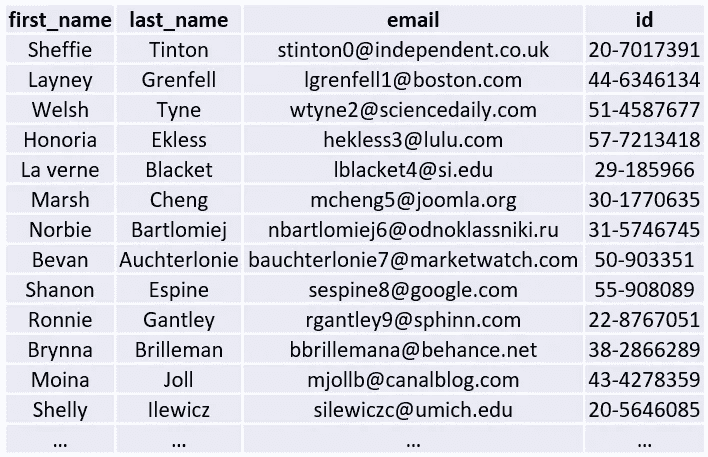
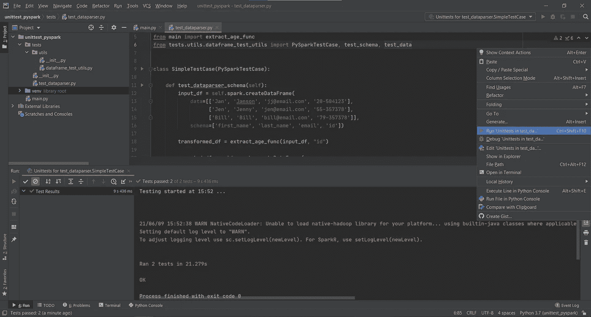
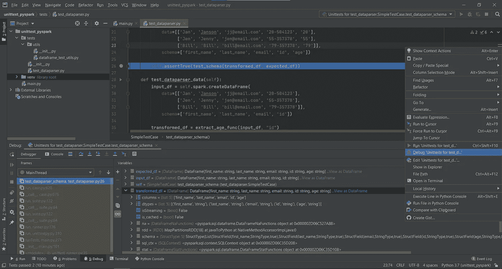

# 测试 PySpark 数据帧转换

> 原文：<https://towardsdatascience.com/testing-pyspark-dataframe-transformations-d3d16c798a84?source=collection_archive---------12----------------------->

## 提高开发到生产的速度，并确保您的代码在部署之前符合质量标准。


杰里米·帕金斯在 [Unsplash](https://unsplash.com?utm_source=medium&utm_medium=referral) 上的照片

如果你喜欢测试——不是写很多测试和测试的有用性，那么你来对地方了。我大多用 *Scala* 写 *Spark* 代码，但是我看到 ***PySpark*** 越来越占优势。不幸的是，在用 *Python* 开发 *Spark* 代码时，我经常看到较少的测试。我认为单元测试 *PySpark* 代码甚至比 *Spark-Scala* 代码( [*单元测试* *Spark-Scala*](https://medium.com/codex/how-to-easily-test-spark-dataframe-transformations-3b8cc160a705) )更容易。让我们看一个例子，看看对数据帧转换进行单元测试有多容易。

## 数据集

我们将设想一个简单的数据集，但是它非常大，以至于在集成开发环境(IDE)中用小得多的数据来测试我们的转换更加方便。



包含员工数据的样本数据集

## 任务

不要太复杂，让我们假设雇员数据集 *id* 列包含雇员年龄，我们需要将其提取到一个名为 *age* 的单独列中。员工的年龄由破折号(“-”)前的数字表示。

## 解决方案

为此，我们需要提取破折号前的数字。有两种方法可以做到这一点——要么使用正则表达式(regex ),要么用破折号分割列值。让我们在这个例子中使用正则表达式来提取年龄:

```
\d+(?=-)
```

*   **\d** 匹配任何数字字符(0–9)。
*   **+** 是一个量词，用于匹配 1 个或多个此类字符(数字)。
*   **(？=-)** 匹配主表达式后的一个组，但不包括在结果中的破折号符号后。

为了在我们的转换中使用这个正则表达式，我们将编写一个简单的函数，该函数接受一个数据帧和雇员 id 列的名称，但返回一个全新的数据帧和*年龄*列:

```
def extract_age_func(input_df: DataFrame, id_col: str):
    pattern = '\d+(?=-)'
    return input_df.withColumn('age', regexp_extract(col(id_col), pattern, 0))
```

## 测试设置

现在继续测试——我们将使用一个更流行的 *Python* 标准库包 *unittest* 。关于 *unittest* 的伟大之处在于它很容易创建一个可重用的 *SparkSession* 。让我们首先编写一些 *SparkSession* 初始化代码，我们可以在所有的测试中重用这些代码:

```
class PySparkTestCase(unittest.TestCase):
    *"""Set-up of global test SparkSession"""* @classmethod
    def setUpClass(cls):
        cls.spark = (SparkSession
                     .builder
                     .master("local[1]")
                     .appName("PySpark unit test")
                     .getOrCreate())

    @classmethod
    def tearDownClass(cls):
        cls.spark.stop()
```

这里我们创建了类 *PySparkTestCase()* ，它扩展了 *unittest。TestCase* 类并有两个类方法:

*   **setUpClass()** — *“在类中运行测试之前设置类夹具的挂钩方法。”*确保不要使用`setUp`而不是`setUpClass`来初始化每个测试的新*火花会话*。这里我们设置 *SparkSession* 在一个线程上本地运行。
*   **tearDownClass()** — *“测试后解构测试夹具的挂钩方法。”*测试运行后，我们指定停止我们的 *SparkSession* 。

在开始编写我们的测试之前，我们必须了解在进行*数据帧*转换时需要测试什么。从*数据框架*的角度来看，有两件事——*数据框架*模式测试和*数据框架*数据测试。让我们创建帮助器函数来完成这个任务:

```
deftest_schema(df1: DataFrame, df2: DataFrame, check_nullable=True):field_list = lambda fields: (fields.name, fields.dataType, fields.nullable)
    fields1 = [*map(field_list, df1.schema.fields)]
    fields2 = [*map(field_list, df2.schema.fields)]
    if check_nullable:
        res = set(fields1) == set(fields2)
    else:
        res = set([field[:-1] for field in fields1]) == set([field[:-1] for field in fields2])
    return res
```

和

```
def test_data(df1: DataFrame, df2: DataFrame):data1 = df1.collect()
    data2 = df2.collect()
    return set(data1) == set(data2)
```

*   ***test _ schema()***—获取两个*数据帧*，比较它们之间是否存在模式差异。如果模式与函数匹配，则返回*真*否则*假*。此外，还有一个是否检查列可空性的标志，因为这并不总是需要的，有时管理起来会很繁琐。
*   ***test _ data()***—也获取两个*数据帧*并检查那些*数据帧*中的数据是否匹配—如果匹配则返回*真*，如果不匹配则返回*假*。

## 测试案例

太好了，我们现在有助手函数来检查*数据帧*是否相等。让我们为我们的*数据帧*转换函数 *extract_age_func()* 编写测试:

```
class SimpleTestCase(PySparkTestCase):

    def test_dataparser_schema(self):
        input_df = self.spark.createDataFrame(
            data=[['Jan', 'Janson', 'jj@email.com', '20-504123'],
                  ['Jen', 'Jenny', 'jen@email.com', '55-357378'],
                  ['Bill', 'Bill', 'bill@email.com', '79-357378']],
            schema=['first_name', 'last_name', 'email', 'id'])

        transformed_df = extract_age_func(input_df, "id")

        expected_df = self.spark.createDataFrame(
            data=[['Jan', 'Janson', 'jj@email.com', '20-504123', '20'],
                  ['Jen', 'Jenny', 'jen@email.com', '55-357378', '55'],
                  ['Bill', 'Bill', 'bill@email.com', '79-357378', '79']],
            schema=['first_name', 'last_name', 'email', 'id', 'age'])

        self.assertTrue(test_schema(transformed_df, expected_df))
```

方法非常简单——我们在我们的测试用例中创建一个输入数据帧,并通过我们的转换函数运行它，将它与我们预期的*数据帧*进行比较。类似地，对于数据比较测试:

```
def test_dataparser_data(self):
    input_df = self.spark.createDataFrame(
        data=[['Jan', 'Janson', 'jj@email.com', '20-504123'],
              ['Jen', 'Jenny', 'jen@email.com', '55-357378'],
              ['Bill', 'Bill', 'bill@email.com', '79-357378']],
        schema=['first_name', 'last_name', 'email', 'id'])

    transformed_df = extract_age_func(input_df, "id")

    expected_df = self.spark.createDataFrame(
        data=[['Jan', 'Janson', 'jj@email.com', '20-504123', '20'],
              ['Jen', 'Jenny', 'jen@email.com', '55-357378', '55'],
              ['Bill', 'Bill', 'bill@email.com', '79-357378', '79']],
        schema=['first_name', 'last_name', 'email', 'id', 'age'])

    self.assertTrue(test_data(transformed_df, expected_df))
```

在这里，你也可以从一个单独的数据文件如*创建输入*数据帧*。csv* 或*。如果方便的话。或者像我通常做的那样——在测试用例中创建，但是注意不要将敏感信息放入代码库中。*

现在让我们运行这些测试，检查我们的年龄提取转换是否如预期的那样工作。我将使用 *PyCharm* 来运行这些测试:



为 *PySpark* 转换运行我们的单元测试。

很好，看起来我们的年龄提取转换像预期的那样工作。在我们的 IDE 中运行这些测试的好处是，我们还可以在代码中设置断点，并看到我们的转换或测试逐步执行:



使用断点在调试中运行测试

## 结论

这就是开始测试您的 *PySpark* 转换所需要的全部内容。如您所见，在您的 IDE 中进行本地测试所需的时间比打包、将其发送到您的测试环境并等待您的集群启动所需的时间要少得多。IDE 的调试功能非常方便，如果您愿意，可以一步一步地剖析您的转换。

我希望这为开始编写自己的测试打下了良好的基础。祝你好运！

代码可在 [GitHub](https://github.com/Bigdataengr/unittest_pyspark) 上获得。