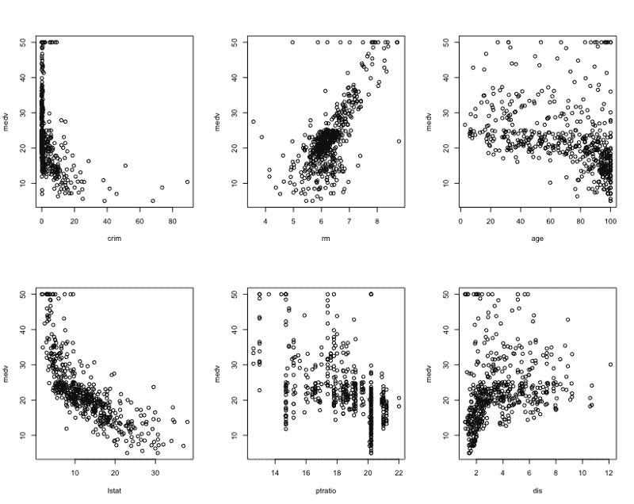
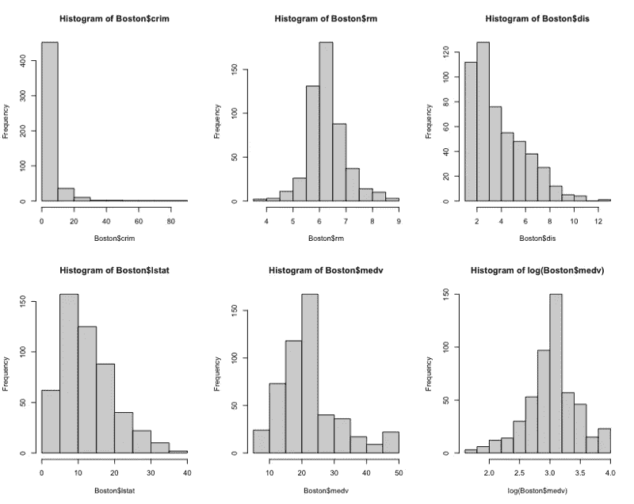
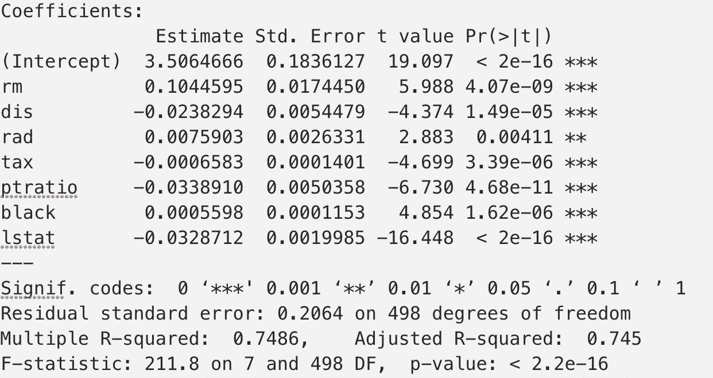
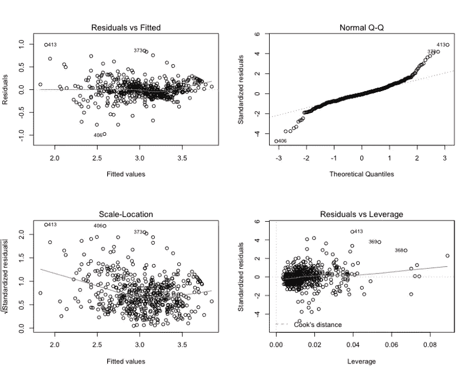
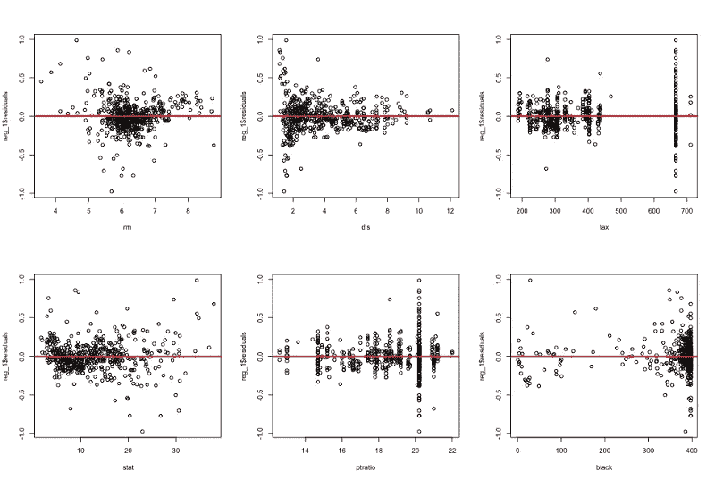
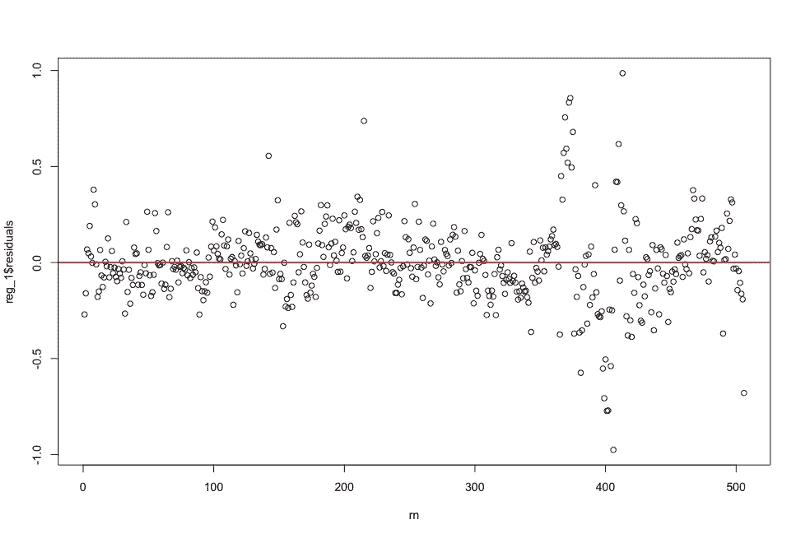

# 检验线性回归的假设

> 原文：<https://towardsdatascience.com/testing-the-assumptions-of-linear-regression-f38857abc08a?source=collection_archive---------7----------------------->

## 逐步建立线性回归模型来检验高斯-马尔可夫假设


作者图片

似乎在每个人都如此热衷于各种花哨的机器学习算法的今天，很少有人仍然关心地问:**普通最小二乘(OLS)回归所需的关键假设是什么？我如何测试我的模型是否满足这些假设？**然而，由于简单线性回归无疑是社会科学各个领域中最受欢迎的建模方法，我认为有必要快速回顾一下 OLS 的基本假设，并通过使用经典的波士顿住房数据构建线性回归模型来进行一些测试。

# 1.高斯-马尔可夫假设

高斯-马尔可夫假设确保 OLS 回归系数是最佳线性无偏估计。

1.  参数中的**线性度**
2.  **随机抽样**:观察数据代表从总体中随机抽取的样本
3.  协变量之间没有完美的共线性
4.  **误差的零条件均值**(即 E( |X) = 0)(也常称为**外生性**)
5.  **误差的同方差**(恒定方差)

需要注意的是，当假设 1-4 满足时，OLS 是无偏的(即(β*) = β)。异方差对 OLS 估计量的偏差或一致性没有影响，但它意味着 OLS 估计量不再是蓝色的，标准误差的 OLS 估计是不正确的。

# 2.数据

波士顿房价数据集由 14 个属性的 506 个观察值组成:

```
***crim:*** per capita crime rate by town
***zn:*** proportion of residential land zoned for lots over 25,000 sq.ft
***indus:*** proportion of non-retail business acres per town 
***chas:*** Charles River dummy variable (= 1 if tract bounds river; 0 otherwise)
***nox:*** nitric oxides concentration (parts per 10 million)
***rm:*** average number of rooms per dwelling
***age:*** proportion of owner-occupied units built prior to 1940
***dis:*** weighted distances to five Boston employment centres
***rad:*** index of accessibility to radial highways
***tax:*** full-value property-tax rate per USD 10,000
***ptratio:*** pupil-teacher ratio by town
***black:*** 1000(B — 0.63)² where B is the proportion of blacks by town
***lstat:*** percentage of the lower status of the population
***medv:*** median value of owner-occupied homes in USD 1000's
```

# 3.探索性分析

通过查看数据，人们很自然地会问这样一个问题:哪些因素可能会影响和预测房价。我从一些简单的散点图开始，直观地检查变量之间的关系(见下文)。下面的一组图表绘制了 *medv* 对 *crim、rm、age、lstat* 和 *dis* 的关系。这种关系似乎不是线性的。



我还绘制直方图来检查单变量分布。我决定使用 *log(medv)* 而不是 *medv* 作为因变量，因为 log 变换减轻了偏斜。同样，我会用 *log(crim)* 。



# 4.运行线性回归

即使我的直觉和探索性分析图告诉我，人口中较低地位的百分比、房间数量、犯罪率和到五个波士顿就业中心的距离可能是最重要的预测因素。在本文中，**我想从运行一个 lass 模型开始，以所有变量作为基线，也作为选择特性的一种方式**。下面是 R 代码:

lasso *reg_base* 不返回任何零系数，但是我发现 *log(cim)* 和其他一些变量并不重要。我排除了 *reg_1* 模型中那些无关紧要的变量，下面是系数:



快速解释:中值房价每变化 1 个单位(1 %)下降 3.3%，较低人口比例(lstat)增加，房间数量每变化 1 个单位房价增加 10%。对我来说很有意义。

# 5.检验高斯-马尔可夫假设

## **1。使用残差图检查线性和同质性**

*   **残差与拟合值:**围绕水平线均匀分布的残差没有明显的模式，这很好地表明具有线性关系。如果残差图中有明确的趋势，或者该图看起来像一个漏斗，这些都是给定的线性模型不合适的明确指标。
*   **正态 Q-Q** 显示残差是否正态分布。如果残差在直虚线上很好地排列，这是很好的。
*   **刻度位置**可用于检查等方差假设(同方差)。如果我们看到一条等(随机)分布点的水平线，这很好。



残差与拟合图显示线性假设或多或少得到满足。对数变换处理非线性。然而，规模-位置图表明异方差。

## **2。使用 Breusch-Pagan 测试进行同质性检验**

```
print(bptest(reg_1, data = Boston, studentize = TRUE))studentized Breusch-Pagan test
data: reg_1
BP = 64.991, df = 7, p-value = 1.51e-11
```

拒绝 Breusch-Pagan 检验的同异方差的零假设表示异方差(HSK)。我们可以用加权最小二乘法(WLS)来校正 HSK。因为 HSK 对 OLS 估计量的偏差或一致性没有影响，而且 WLS 的估计量与 OLS 的没有太大的不同。在这篇文章中，我将跳过对 HSK 的校正。

## **3。对多重共线性使用 VIF 检验**

VIF 代表方差通货膨胀系数。一般的经验法则是，Vif 超过 4 需要进一步调查，而 Vif 超过 10 是严重多重共线性的迹象，需要纠正。

```
vif(reg_1)rm dis rad tax ptratio black lstat
1.780895 1.559949 6.231127 6.610060 1.408964 1.314205 2.414288
```

VIF 检验显示了 rad 和 tax 的共线性。来缓解这个问题。我做了一个新的回归去除了 rad。系数变化不大。为了节省空间，我将不再展示它们。

## **4。检查零条件均值假设**

没有简单的方法来检验这个假设。首先，检查残差的平均值是否为零是**而不是**的方法。只要我们在关系式中包括截距，我们总是可以假设 E ( ) = 0，因为的非零均值可以被截距项吸收。你可以在这里阅读数学证明。检查它的一种方法是绘制残差与未分配因变量的行号的关系图。无论我们如何对行进行排序，残差都应该在行号上围绕零随机对称分布，这表明连续误差之间没有相关性。我还绘制了独立变量的残差图，以检查是否有明显的相关性。



残差与独立变量



残差与行数

## **5。检查遗漏的变量偏差**

最后，我认为经常思考和检查被忽略的变量偏差是一个好习惯。我想测试将犯罪率纳入回归的想法，因为我认为犯罪率会影响房价。我比较了在 *reg_2* 模式中包含 *crim* 和在 *reg_3* 模式中包含 *log(crim)* 的情况，使用了戴维森-麦金农检验。戴维森-麦金农测试的解释是拒绝 *reg_3* 规格。

读取回归统计，包括 *crim* 如预期提高了 R 平方，并且 *crim* 系数显著。然而，鉴于 *crim* 的偏态分布以及 *crim* 和 *log(medv)* 之间看似非线性的关系，我并不完全确信使用 *crim* 作为预测指标之一是必要的。

为了进一步检查，我决定将数据分为训练和测试数据，并运行一个简单的样本外测试，比较 *reg_2* 和 *reg_1* 。原来没有 *crim* 的原模型 *reg_1* 在测试数据上返回较小的 MSE。所以我认为可以有把握地断定 *reg_1* 是正确的型号。

以下是运行 reg_base、reg_1、比较 reg_2 与 reg_3 以及随后比较 reg_2 与 reg_1 的完整代码。