# 测试 Github Copilot 技术预览版

> 原文：<https://towardsdatascience.com/testing-the-github-copilot-technical-preview-330d1b0d5418?source=collection_archive---------25----------------------->

## 它很智能，是通过少打字多做事来提高生产力的好方法

罗曼·辛克维奇在 [Unsplash](https://unsplash.com?utm_source=medium&utm_medium=referral) 上拍摄的照片

朋友们好！因此，我获得了 Github Copilot 的技术预览版，我很高兴能够测试它。

我决定用各种语言测试一下，看看有多大帮助！这是一个非常优秀的工具，是我见过的最好的自动完成功能。

它让编写代码变得更加容易，并且因为需要输入更少的代码而变得更快。当你学习一门新的语言或一个新的框架时，这是有益的。

对于那些不了解 Github Copilot 的人，你可以看看[这篇由](/github-copilot-a-new-generation-of-ai-programmers-327e3c7ef3ae)[阿尔贝托·罗梅罗](https://medium.com/u/7ba6be8a3022?source=post_page-----330d1b0d5418--------------------------------)撰写的惊人文章。

因此，在本文中，我将展示我用各种语言和使用各种框架对 Copilot 进行的各种测试。

# 计算机编程语言

起初，我试着用 Python 语言写一些程序，因为它有很多用例，并且被广泛使用。

## 两个日期之间的天数

因此，我开始用 Github Copilot 页面上已经有的东西进行测试，看看它的表现如何。我只是写了函数名(你需要写一个描述性的函数名让它理解)，副驾驶建议了函数的完整代码。

日期之间的天数

您还可以通过点击以下按钮，在 Github copilot 上为您的功能循环显示所有可用的自动完成解决方案

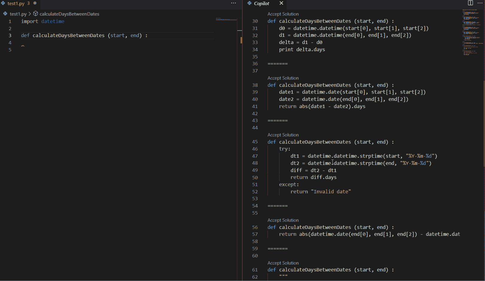

在选项间循环

## 计算利息

接下来，我尝试了一个更简单的程序，在这个程序中，副驾驶的第一个建议被证明是错误的。我知道它使用了可用的公共代码，这些错误肯定会发生，但好的一面是它有正确的答案，但不是作为第一个建议。

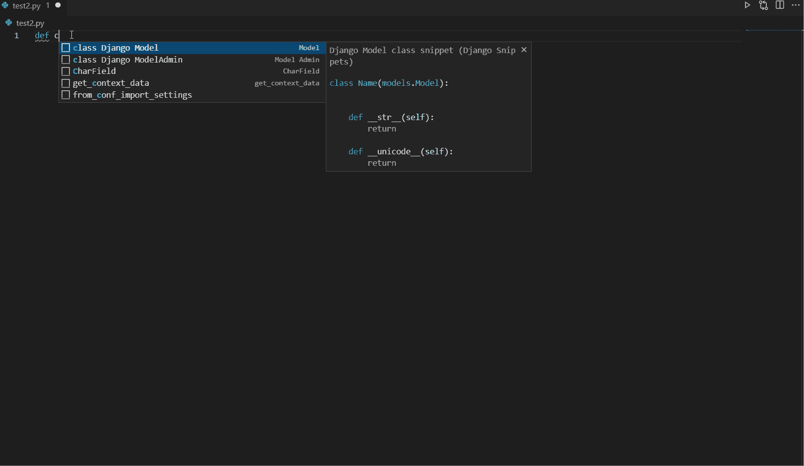

努力寻找兴趣。

正如你所看到的，第一次尝试由 Copilot 完成我的功能有错误的公式。在计算复利的时候，它首先给出了计算金额的公式，尽管我想精确地计算复利。

当我给出利息、利率和本金时，计算时间是一场灾难，因为没有一个答案符合上下文，尽管我可能已经定义得更清楚了。没关系！

## 获取特定用户的推文

接下来，我尝试了更高级的方法，我想通过输入特定用户的用户名来获取他的推文。让我们试着找出它的表现如何。

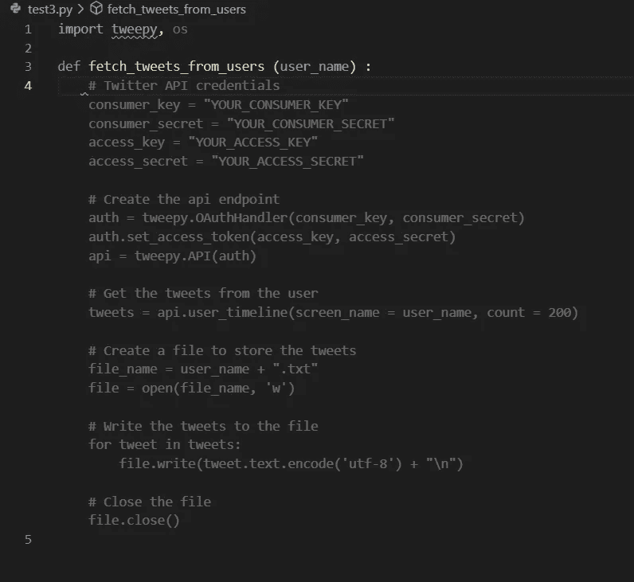

从用户那里获取推文

它很擅长这项任务。它给出了通过输入函数名来获取特定用户推文所需的完整代码。这次印象深刻！

## 检查一个数是否是质数

这是一项简单的任务。我写了函数名，然后它建议代码自动完成函数，但不是一次完成全部代码。它建议我下一行，然后下一行，直到我准备好我的完整功能。

所以，它有很好的效果。它在这次测试中非常成功。

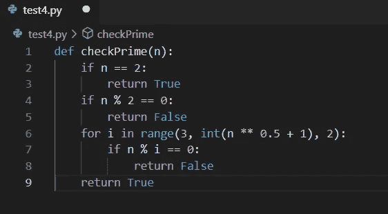

上图中，你可以看到代码，我自己只写了第一行，其余的都是 Copilot 给我建议的。

## 截图中的电子邮件

我试着写代码截图，把截图转换成文字，然后找出那张截图里的所有邮件。这是一项复杂的任务，让我们看看 Copilot 在这方面的表现。

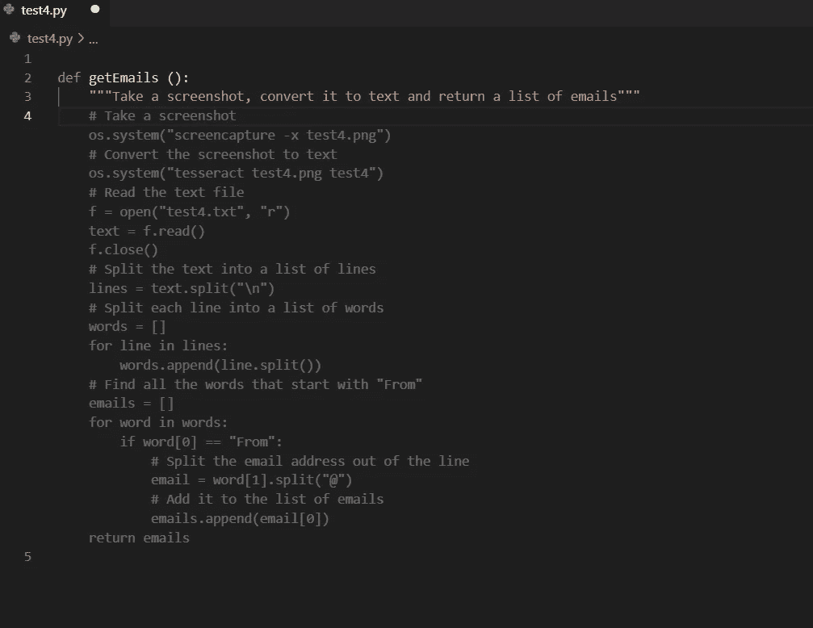

截图至电子邮件

正如你在上面的图片中看到的，我只写了函数名，并以注释的形式描述了我需要的东西，它只是建议了完整的代码。这是迄今为止最好的一次。

## 截图和验证中的电话号码

我又尝试了同样的邮件技巧，但这次我想从截图中抓取所有的电话号码。它再次工作，并给出了非常好的结果。

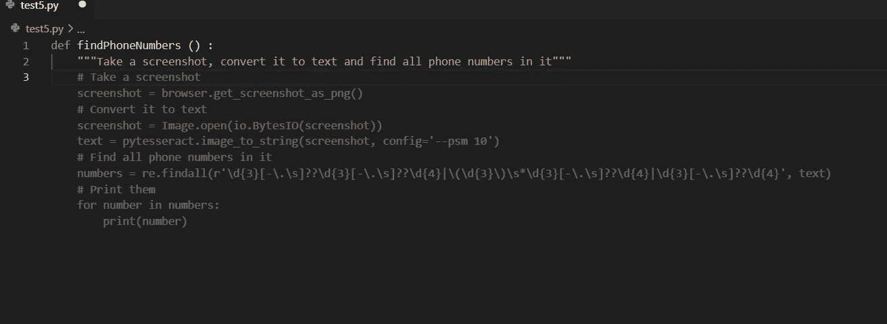

截图中的电话号码

此外，我试图构建另一个函数来接受电话号码，并检查它是否是一个有效的号码。又成功了。虽然前一个函数也检查电话号码，但我还是把它作为一个单独的函数再试了一次。

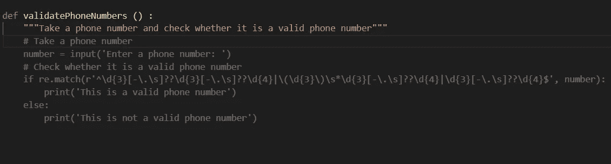

验证电话号码

这同样适用于验证电子邮件地址。我也试过了，很有效。

所以，Github Copilot 真的很擅长建议我们实际上出于实用目的需要的代码。在我看来，它可以作为验证的救命稻草，因为我不再需要在堆栈溢出中搜索奇怪的正则表达式代码来完成这项工作。副驾驶现在替我做了。它节省了我的时间。

# Java Script 语言

接下来，我们将尝试 Javascript。我们将测试各种功能，看看 Copilot 在这里能做什么。

## 从 HTML 文档中获取所有电子邮件

因此，我尝试使用 Javascript 代码找出 HTML 文件中的所有电子邮件。于是，我写下了一个描述相同的评论，写下了函数名，神奇的事情发生了！Github Copilot 向我建议了这样做的完整功能。它也给了我各种选择，其中大部分是好的。

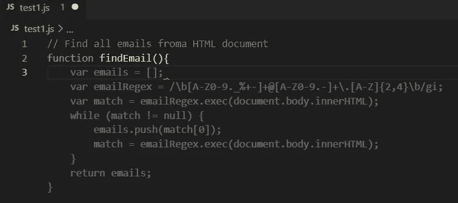

建议 1

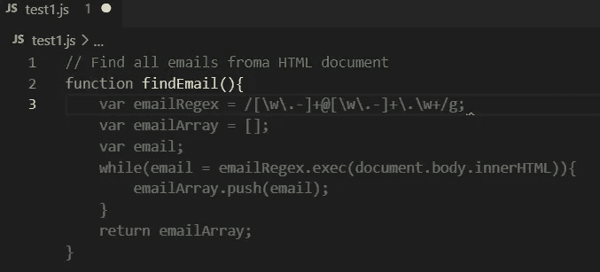

建议 2

因此，正如你在上面看到的，我展示了 Github Copilot 给我的许多不同建议中的两个，供我选择。它真的很擅长做这个节目。见鬼，我在写评论的时候甚至把拼错了*。*

## 废弃亚马逊网站以获取价格

接下来，我试着写了一条评论，描述我想废弃亚马逊网站，以获得一个产品的最佳价格。我没想到它也会为我做这些。它实际上提出了各种代码，其中一些甚至废弃了给定产品的所有可用数据，如评级、价格、描述等。

我在这里附上一个截图，以表明我得到了从亚马逊网站的产品。

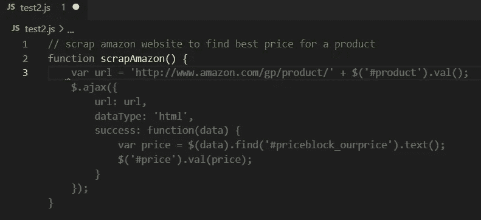

从亚马逊上查找产品的价格。

如您所见，灰色代码是建议的部分。所以，我所要做的就是写一个注释，描述我想要的，然后我给一个函数名，然后它给出了完整的代码。

## 从注释构建 Express 服务器

接下来，我试图只用注释生成代码，甚至没有定义函数名。我尝试了 Github copilot 文档中提供的那个。我尝试在端口 8000 上创建一个 Express 服务器。所以，我写了一篇评论陈述同样的观点。然后，它开始建议我逐行编码，而不是同时编码全部代码。

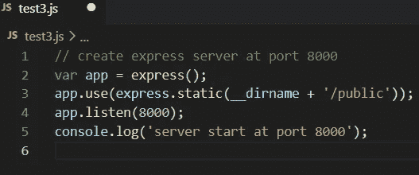

端口 8000 的快速服务器

所以，正如你所看到的，我只写了第一行，这是评论，其余的所有行都是 Github Copilot 一条一条建议的。

这对于刚接触任何框架的人来说都是非常好的，因为不需要阅读太多文档就可以快速入门。

## 从 MongoDB 获取项目

接下来，我尝试从 MongoDB 服务器获取项目，并以数组的形式返回。因此，我写了一个描述相同内容的评论，并写了一个函数名，然后像往常一样，Github Copilot 施展魔法，向我推荐了完整的代码。

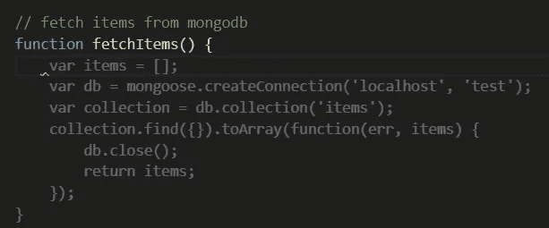

从 MongoDB 获取项目

正如我们所看到的，建议的代码使用*mongose*从本地主机 Mongo 数据库获取数据。我所要做的就是通过评论来描述我想要的东西。

## 待办事项应用程序

所以，我尝试用注释和函数来测试它，用 Javascript 构建一个完整的 Todo 应用程序。

我写了描述我想创建一个 todo 应用程序的评论，然后我写了名为 todo 的函数，然后 Github Copilot 建议了一个基本的工作 todo 代码，这看起来很神奇。

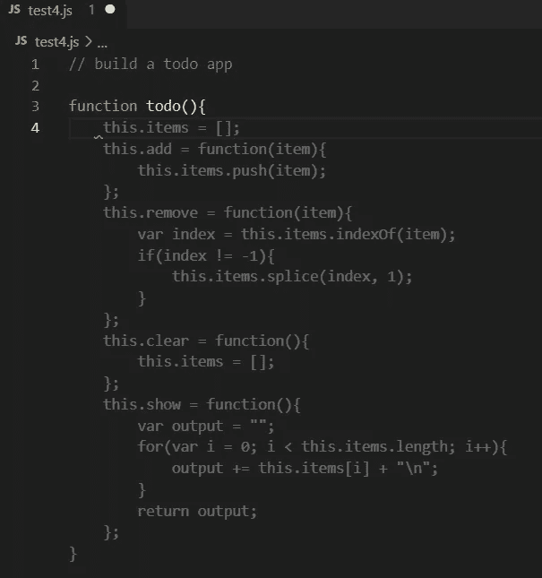

待办事项应用程序

从上面的截图可以明显看出，Github Copilot 非常擅长代码建议，这样做确实是一个很好的成就。

我还试图改变我的需求，然后我改变了注释来描述我想要构建一个 Todo 应用程序，但是这次使用 React。

令我惊讶的是，它再次显示了整个代码，包括表单、输入和按钮。即使可能会有一些遗漏和错误，因为它是一个助手，这些提示整个代码的功能是有益的，同时也是可怕的。

使用 React 的 Todo 应用程序

此外，令我惊讶的是，还有比我上面展示的更好的代码建议。上面显示的这个是它提出的许多建议之一。还有很多更好的建议，包括适当的编码风格和功能。

我在下面的截图中附上了更好的建议，虽然我已经接受了这个建议，但它不会以灰色显示，相信我，我只写了上面两行，注释和函数名。我不能有完整的程序在下面的截图，因为它很大。

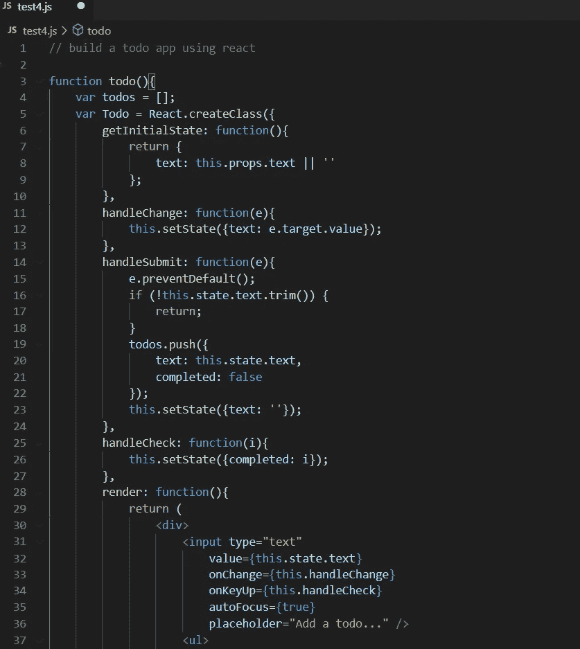

Todo 使用 React

我还尝试了一些高级的东西，如使用 Copilot 构建一个贪吃蛇游戏，令人惊讶的是，它给了我一些很好的建议，实现了主要部分。然而，没有一个是完整的代码，因为所有的建议都缺少一些部分。但是，嘿，它是用来帮助我们的，所以考虑到这一点，它真的是一个很棒的工具。

当我使用它时，我发现它非常有用，因为我现在需要编写更少的代码，这使我更有效率。我将继续使用它，并在更好的用例中对它进行越来越多的测试，以测试它的能力，并看看我能得到什么帮助。

总的来说，我对它有一种积极的感觉。它旨在帮助我们节省时间，以便我们可以专注于更有用的任务，而不是一次又一次地重复工作。

老实说，它并不完美。它有时会提示错误的代码或不完整的代码，然后您必须循环所有可用的建议，以获得正确或完整的代码。所以，我们不能完全依赖它，因为它是用来赞美我们而不是取代我们的。

它是一个助手，在这方面很有帮助。即使它有时会给出错误的建议，我们也可以很容易地纠正这些建议或选择不同的建议。它仍然节省时间。当它给出不完整的建议时，我们可以很容易地完成它们，因为大部分代码已经被建议了。

这就是这篇文章的全部内容。希望您会发现它很有用，并且一旦获得技术预览版，您也应该尝试一下。请在他们的网站上加入[技术预览的等候名单。](https://github.com/features/copilot/signup)