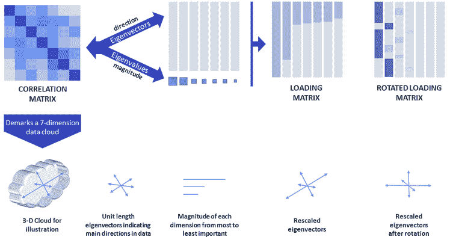
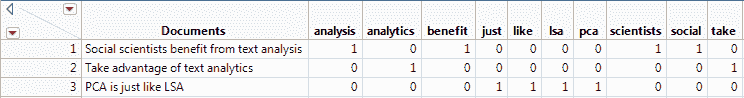
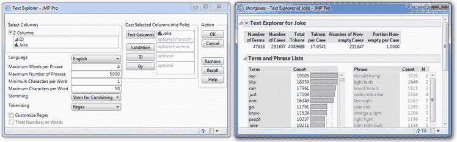
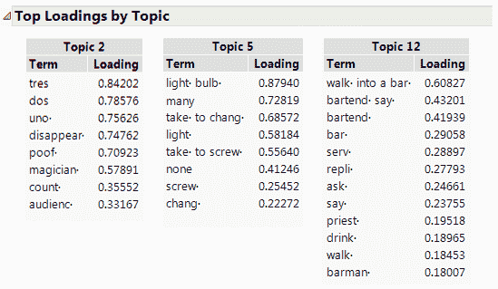

# 社会科学中的文本分析

> 原文：<https://towardsdatascience.com/text-analysis-in-the-social-sciences-a-new-spectrum-of-possibilities-33adc44e8a0e?source=collection_archive---------29----------------------->

## [思想和理论](https://towardsdatascience.com/tagged/thoughts-and-theory)

## 一系列新的可能性

计算机科学家长期受益于允许他们从各种文本文档中提取信息的方法。他们的方法不仅统计文本中的术语和短语，而且还揭示了文本的结构并提供了对文本内容的洞察。另一方面，大多数社会科学家——他们在调查的评论栏、采访记录等中有大量的文本数据。—似乎不依赖这些方法*(那些学习语言或与计算机科学家合作的人是极少数的例外)。

在这篇文章中，我鼓励社会科学家探索文本分析所能提供的各种可能性。为此，我简要介绍了两种文本分析技术:潜在语义分析(LSA)和主题分析(TA)。显而易见，具有多元统计学背景的社会科学家将能够毫不费力地使用、应用和解释 LSA 和助教(可能只需要这篇文章就能让你开始工作！)我的解释依赖于社会科学中众所周知的两种统计技术:主成分分析(PCA)和因子分析(FA)。

# 主成分分析综述

PCA 是一种允许我们从数据中识别和提取最大可变性的不相关维度的方法。这是通过数据的相关矩阵的特征值分解来完成的。图 1 描述了特征值分解中涉及的步骤，以及帮助解释 PCA 的后续步骤(注意，为了便于回顾，该图过于简化)。

*图一。主成分分析步骤的描述。图片作者。*

相关矩阵表示多维空间中的“数据云”。特征值分解有助于识别该云中相互垂直的主要维度，并产生两条关键信息:表示主要维度方向的**特征向量**，以及表示每个维度大小和维度方差的**特征值**。如果只有几个维度捕获了数据中的大部分可变性(即，前两个特征值相对于所有其他特征值都很大)，那么分析师可能会选择保留前两个特征向量和特征值，以减少他们必须分析的变量的数量。所有的特征向量都是单位长度的，但是可以使用特征值提供的信息来“调整大小”。这些重新调整的特征向量被称为载荷。

载荷向量的可变性等于它们相应的特征值。此外，加载系数是描述维度(主成分)和相应变量之间的关联的相关系数。因此，载荷对于理解主分量代表什么是至关重要的。然而，载荷矩阵可能具有难以辨别的模式，例如跨越几个维度的中等大小的载荷(参见图 1 中的载荷矩阵)。因此，分析师可能会选择旋转加载矩阵，以努力改善组件的解释。最常见的是，采用正交旋转(例如，Varimax)，这往往导致一种简单的载荷模式(Thurstone，1947 年称之为“简单结构”)。也就是说，对于给定的部件，载荷非常高，而对于所有其它部件，载荷几乎为零。旋转载荷矩阵的简单结构(见图 1)有助于清楚地识别每个主分量代表什么。

# 主成分分析==潜在语义分析

既然主成分分析在你的脑海中是新鲜的，好消息是潜在语义分析(LSA)只是对文本术语的相关矩阵进行的主成分分析(但不涉及任何旋转)。换句话说，分析中的变量是表示某个术语在文本文档中的出现频率的列。这组变量被称为文档术语矩阵(DTM；参见图 2)，它的列数与文档中的术语数一样多，行数与文档数一样多。如果我们想要一个二进制 DTM，每个单元格条目可以是 0 或 1，这取决于给定的术语是否在给定的文档中。频率 DTM 要求每个条目是该术语在给定文档中出现的次数的计数。还有其他方法来建造 DTM；文献(Ramos，2003)中推荐的方法被称为 TF-IDF(术语频率-逆文档频率)，您可以在 [JMP](https://www.jmp.com/en_us/software/data-analysis-software.html?utm_campaign=aw&utm_source=bl&utm_medium=referral) 中通过点击一个按钮来实现它！

*图二。三个文档的样本文档术语矩阵(DTM)。图像是使用 JMP Pro 软件生成的，版权 2021 SAS Institute Inc .，经作者许可使用。*

注意，图 2 中的第一个文档有单词“from ”,但是这个词没有出现在 DTM 中。这是因为创建 DTM 需要一些重要的初步步骤。接下来让我们看看那些！

# 设置用于分析的文本数据

文本分析从确定测量单位开始。具体来说，您必须确定什么将构成“文档”文档可以是一个句子、段落、文章或一本书，还有许多其他选择。下一步涉及识别文档中的相关术语。你可以通过过滤掉“停用词”(那些在文本语料库中不太可能有助于揭示结构的极其常见的词，如“the”、“and”、“from”、“is”、“of”等)来做到这一点。).此外，您可以选择将相似的术语浓缩成一个。例如，图 2 中的“分析”和“分析”列是多余的，可以合并成一列“分析”这就是所谓的词干。最后，不是文本中的所有单词都应该分开。图 2 第一行的“社会科学家”就是一个例子。在创建 DTM 之前，您可以将这些单词组合成一个术语(您可以对类似“从前”这样的短语执行相同的操作)。

以上所有步骤对于固体分析都至关重要。幸运的是，JMP 的文本浏览器平台让这些任务变得轻而易举！在 Analyze >文本浏览器菜单下，将包含文档的数据表中的列指定为文本列(参见图 3)。您还可以在启动窗口中自定义词干选项。启动文本浏览器后，您可以进一步选择短语作为术语。

*图三。文本资源管理器启动窗口(左)和启动文本资源管理器的初始报告(右)。图像是使用 JMP Pro 软件生成的，版权 2021 SAS Institute Inc .，经作者许可使用。*

完成所有预备步骤后，您可以创建 DTM 并使用它进行 PCA。然而，取决于你的 DTM 有多大(它们往往很大)，我上面描述的 PCA 可能需要很长时间来运行，并且需要大量的内存。幸运的是，JMP 使用奇异值分解代替特征值分解，使这种分析非常有效！在以后的文章中，我将解释特征值分解和奇异值分解之间的等价性，但是现在，你必须相信我，这两种方法会导致相同的结果。

# 话题分析

另一种有价值的文本分析技术是主题分析(TA)。这种技术也可以很容易地转化为社会科学家通过澄清 TA 是简单的 PCA 与 Varimax 旋转的负荷矩阵。与 LSA 类似，TA 是用奇异值分解而不是特征值分解来进行的，以使其更有效。由于载荷的旋转，从 TA 得到的结果可能比从 LSA 得到的结果更容易解释。主题将是文本数据可变性的主要方面。加载允许你解释这个主题代表了什么。此外，主题(或组件)分数可以计算并用于辅助分析。

为了让大家了解 TA 能做些什么，我在 231，657 个笑话的数据集**上执行了 TA。为了避免冒犯任何读者，我只展示了分析中出现的三个主题的结果(图 4)。

*图 4。从对 231，657 个笑话的数据表执行的主题分析(TA)中选择主题。图像是使用 JMP Pro 软件生成的，版权 2021 SAS Institute Inc .，经作者许可使用。*

读者可能会同意，图 4 中每个主题所代表的笑话类型之间有明显的区别。要获得更多令人信服的文本分析示例，请参见[这篇关于预测未来股票价格的文章](https://community.jmp.com/t5/JMP-Blog/Exploring-text-to-see-what-might-happen-in-the-stock-market/ba-p/33121)，或者阅读最近使用社交媒体数据的出版物(Kern et al .，2016)。或者看[这个视频](https://youtu.be/JnigzY7gl_o)。

# 关于因子分析的注记

在开始部分，我说我会依靠社会科学家的 PCA 和 FA 的知识。但到目前为止我只讨论了 PCA。如果你的训练和我的相似，你就会知道 PCA 和 FA 之间有很大的不同。在[的前一篇文章](https://community.jmp.com/t5/JMP-Blog/Principal-components-or-factor-analysis/ba-p/38347)中，我描述了这些差异，但我也提到了一个关键的相似之处:随着所考虑的数据矩阵规模的增长，PCA 和 FA 的结果变得越来越相似(如果你想重温 FA，我推荐你[阅读文章](https://community.jmp.com/t5/JMP-Blog/Principal-components-or-factor-analysis/ba-p/38347))。事实上，在文本分析中，数据矩阵往往非常大。在上面的样本文档术语矩阵中，DTM 已经有 10 个变量了！笑话示例中的 DTM 有 4316 个变量！).因此，来自 LSA 和助教的主题或组成部分可以被认为是潜在变量的近似值，可以有效地用于解决无数的研究问题！

# 关闭…

太多时候，我们让我们的统计工具包来决定我们研究的设计和分析(有时是无意的！).因此，我希望这篇文章打开了社会科学(和其他领域)中新的研究问题的大门，这些问题可以用文本分析独特地解决。

# 要点

*   尽管文本分析依赖于社会科学家熟知的统计技术，但它在社会科学中并未得到充分利用。
*   潜在语义分析相当于对文档术语矩阵进行的主成分分析。
*   文档术语矩阵具有与文档一样多的行和与文档中的术语一样多的列。单元格包含给定文档中出现的术语。
*   主题分析相当于主成分分析，通过旋转成分载荷来帮助解释主题。但是请注意，一些聚类方法有时也被称为主题分析。
*   因为文档术语矩阵往往很大，社会科学家可以将主成分视为潜在变量或潜在主题的很好的近似。

关于文本分析还有很多要说的！我建议从这个点播网络广播开始，它在描述更多细节方面做得很好。你还可以看到[我的帖子](https://community.jmp.com/t5/JMPer-Cable/The-new-look-of-Text-Explorer/ba-p/43506)关于 JMP 的文本浏览器平台，尤其是[罗塞塔石碑部分](https://community.jmp.com/t5/JMPer-Cable/The-new-look-of-Text-Explorer/ba-p/43506#Rosetta-Stone)，阐明了 PCA 和 LSA/TA 更多的联系。

# 参考

*   Kern，M. L .，Park，g .，Eichstaedt，J. C .，Schwartz，H. A .，Sap，m .，Smith，L. K .，& Ungar，L. H. (2016)。从社交媒体语言中获得洞察力:方法和挑战。*心理方法。*提前在线发布。[http://dx.doi.org/10.1037/met0000091](http://dx.doi.org/10.1037/met0000091)
*   j .拉莫斯(2003 年 12 月)。使用 tf-idf 确定文档查询中的单词相关性。在*第一届机器学习教学会议论文集*(第 242 卷，第 133–142 页)。
*   瑟斯通法律杂志(1947 年)。*多因素分析*。芝加哥:芝加哥大学出版社，1947 年。

*现在的文字分析比 2017 年我第一次写这个帖子的时候更普遍。

**感谢在此免费提供此文件的 amoudgl:[https://github.com/amoudgl/short-jokes-dataset](https://github.com/amoudgl/short-jokes-dataset)

*本文原载于 2017 年 9 月 26 日* [*JMP 用户社区*](https://community.jmp.com/t5/JMP-Blog/Principal-components-or-factor-analysis/ba-p/38347) *。*