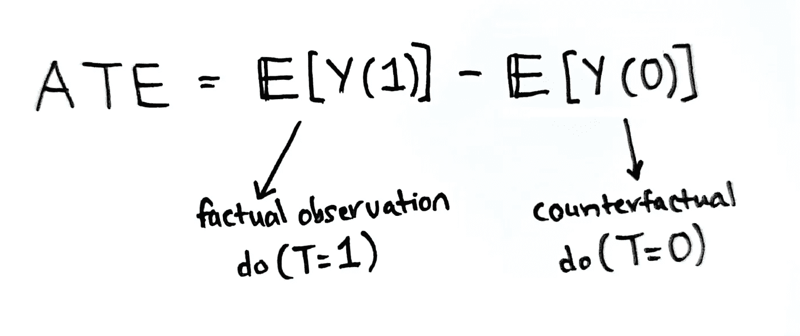

# 基于文本的因果推理

> 原文：<https://towardsdatascience.com/text-based-causal-inference-86e640efb2af?source=collection_archive---------8----------------------->

## [实践教程](https://towardsdatascience.com/tagged/hands-on-tutorials)

## 教程分析选民欺诈假情报估计因果关系的文本作为治疗和混杂因素


文本的因果图(W)为治疗(T)和混杂因素(Z)，结果为 Y，协变量为 C，其中 T 和 Z 相关。图片作者。

科幻小说告诉我们，猖獗的虚假信息是一个社会陷入反乌托邦的前兆。有人可能会说，虚假信息破坏了民主的稳定([摩根 2018](https://www.tandfonline.com/doi/full/10.1080/23738871.2018.1462395) 、[法卡什& Schou 2019](https://www.routledge.com/Post-Truth-Fake-News-and-Democracy-Mapping-the-Politics-of-Falsehood/Farkas-Schou/p/book/9780367322175) )。显而易见，人们无视医学证据对公共健康有负面影响。例如，愿意忽视证据的人可能会选择拒绝接种疫苗，从而危及他人和自己的生命。人们应该谨慎，因为科学虚假信息无处不在，但当可信的新闻材料被假新闻的涌入所破坏时，很难追究人们的责任。一种更阴险的虚假信息形式是对一小部分人的现实的颠覆；一种集体歇斯底里，抓住了那些在另一个现实中认知脆弱的人。我说的是关于上次美国大选选民欺诈的超现实说法，当时特朗普的马屁精拒绝接受他输掉了大选。不可否认，围绕选民欺诈的假新闻对接下来的 1 月 6 日起义产生了煽动性的影响，这是一个尖叫着反乌托邦社会的悲剧事件。

政治哲学家汉娜·阿伦特(Hannah Arendt)声称，人们有必要参与政治，将其作为美好生活的一部分。在《人类的状况》中，阿伦特说，仅仅和你所爱的人一起工作、共度时光是不够的，你还必须参与政治生活([阿伦特，1958](https://en.wikipedia.org/wiki/The_Human_Condition) )。有许多美国人追随这种风气，参与政治；认为这是他们作为公民的权利和责任。不幸的是，他们中的一些人容易受到错误思想的影响，成为像[卡农](https://en.wikipedia.org/wiki/QAnon)这样的离奇阴谋的牺牲品。在本克勒、法里斯和罗伯茨的“[网络宣传](https://oxford.universitypressscholarship.com/view/10.1093/oso/9780190923624.001.0001/oso-9780190923624)”中，作者声称宣传反馈循环部分是由人们避免认知不适的愿望推动的。也就是说，人们会寻找强化他们世界观的信息，而忽视或轻视相反的证据。从流行病学的角度来看，假新闻充当了疾病的传播媒介，传播危险的虚假信息，让公共领域充斥着相互矛盾的说法，让人几乎无法辨别真相。

但是政治和数据科学有什么关系呢？作为一名对虚假信息感兴趣的研究人员，我自然会寻求使用数据科学工具来回答社会和政治问题。眼前的利益，是理解社会媒体和假新闻之间的关系。有人声称，受冲击价值和向上投票驱动的社交媒体的毒性对假新闻的传播产生了影响。更具体地说，看看 Twitter，我质疑假新闻是否对 retweet count 的结果有因果影响。分享假新闻会导致更高的转发数吗？这篇教程是我试图回答这个问题的结果，也是对上一篇关于使用 NLP 进行因果推理的文章的后续。

在这篇文章中，为了使用文本来估计因果关系，我使用了由[Jacobs Technion-Cornell Institute](https://tech.cornell.edu/jacobs-technion-cornell-institute/)管理的 Twitter [VoterFraud2020](https://github.com/sTechLab/VoterFraud2020) 数据集。该数据集由研究人员公开提供，并在[仪表板](https://voterfraud2020.io/)上共享，原始论文归功于[阿比洛夫等人(2021)](https://arxiv.org/abs/2101.08210) 。我从讨论数据和描述初步分析开始。接下来，我将介绍因果文本算法，并对语言属性的因果效应进行相应的研究( [Pryzant，2021](https://arxiv.org/abs/2010.12919) )。此外，我还介绍了使用观察数据进行因果推断的准则，并详细说明了因果文本算法的估计过程。接下来，我列出了因果实验的框架，这直接导致了如何设置和使用因果文本工具的教程(我从最初的 repo 派生和改编而来)。我还介绍了用因果文本算法解决提出的因果问题所需的步骤。最后，我简要讨论了结果并考虑了可能的扩展。

## **数据描述**

开源的[康奈尔 VoterFraud2020 Twitter 数据集](https://voterfraud2020.io/)包含来自 260 万用户的 760 万条推文和 2560 万条转发，都与 2020 年 10 月 23 日至 2020 年 12 月 16 日之间的选民欺诈指控有关。由于 Twitter 的隐私政策，只有 tweet ids 和用户 id 是共享的；然而，数据集的 [GitHub 存储库](https://github.com/sTechLab/VoterFraud2020)包含了合成数据的脚本。在这个实验中，我只关注了 760 万条原始推文。一旦收集了 tweet，就需要做一些预处理来清理 tweet 文本并提取 URL。这些网址都是 Twitter 的缩写格式“t.co ”,因此必须被解析。为了更好地了解解析后的网址的受欢迎程度，每个网址都被赋予了一个来自亚马逊网站流量统计分析的 Alexa 排名。

媒体云是由哈佛大学伯克曼克莱恩互联网中心开发的开源媒体内容分析工具。该平台有[为美国媒体源策划的源列表](https://sources.mediacloud.org/#/home)，按政治派别划分，涵盖[左](https://sources.mediacloud.org/#/collections/200363061)、[中左](https://sources.mediacloud.org/#/collections/200363048)、[中右](https://sources.mediacloud.org/#/collections/200363050)、[中右](https://sources.mediacloud.org/#/collections/200363062)和[右](https://sources.mediacloud.org/#/collections/200363049)。使用这些美国新闻源列表，我交叉引用了从选民欺诈推特数据集中解析的 URL。这是为专门链接到新闻文章的 URL 选择的。媒体云对新闻媒体有强大的调查能力，所以我能够使用媒体云查询来确定孤立文章的媒体内链接份额计数和脸书份额计数。除了这篇文章元数据，我还搜集了当时还在网上的所有新闻文章的全文。

这些步骤给了我一个共享新闻文章的原始推文的组合数据集，其中包含新闻文章的全文、文章元数据、推文元数据和 Alexa 对 URL 的排名。需要说明的是，760 万条推文的数据集被削减了，这样每条推文都有相应的新闻文章。收集文章全文的目的是使用[潜在狄利克雷分配(LDA)](https://medium.com/me/stories/public) 进行主题建模，以查看是否有可能隔离假新闻文章。此外，260 万用户的 VoterFraud2020 数据集还包含由社区检测算法确定的每个用户的社区或聚类(例如 [Louvain 方法](https://en.wikipedia.org/wiki/Louvain_method))。考虑到产生的 tweet-article 数据集的多数据流和丰富性，有必要运行一些初步分析，这将在接下来介绍。

## **初步分析**

首先，考虑到推文本身，推文的文本可能对识别假新闻有价值。因此，我开始用 [LDA](/topic-modeling-with-latent-dirichlet-allocation-e7ff75290f8) 对 tweet 文本进行主题建模，以获得 Twitter 话语内容的总体感觉。


2020 年 10 月 23 日至 12 月 16 日期间精选 VoterFraud2020 推文的话题间距离图。图片作者。

LDA 模型的结果强调了几个主题，这些主题明确涉及选民欺诈假信息对话的各个方面。例如，一个与其他主题不同的值得注意的主题是关于 alt-right 标签“# stopthesteal”。同样值得注意的是同样孤立的《华尔街日报》和《纽约时报》的事实核查话题。有趣的是，声称有欺诈证据的推文与福克斯新闻频道等右翼新闻媒体的推文有很大重叠。总体而言，有几个虚假信息的线索，从选票收获，关于投票软件的阴谋，断言欺诈的宣誓书，以及军方参与的谣言。

使用社区检测算法对用户社区的分析提供了用户数量不同的 5 个不同社区，如下所示。


放大集团是那些推动选民欺诈议程的人，外国集团代表着潜在的外国影响，相比之下微不足道。

关注假新闻的传播，这五个社区在分享新闻文章的网址时表现不同。媒体云元数据包含媒体链接计数，该计数代表一篇文章被其他媒体源链接的次数。一篇高度内链接的文章可以被认为是更主流的。下图显示了三个最大社区的媒体链接数随时间变化的趋势。


2020 年 10 月 23 日至 12 月 16 日分享的关于选民欺诈的新闻文章的媒体内链计数。图片作者。

上述时间序列表明，与两个放大器社区相比，中间偏左的社区倾向于分享更“主流”的文章。尽管中间偏左的社区更有可能分享主流文章，但它们并没有获得很高的转发量。这显示在下面按社区统计的平均转发次数的时间序列中。


一段时间内社区共享的 URL 的平均转发次数。图片作者。

事实上，它是第三大社区“Amplifiers_1 ”,尽管只代表 11.5%的用户，却拥有最高的共享 URL 转发数。这里的问题是，即使中左翼试图核实那些传播选民欺诈假新闻的人，他们在 Twitter 上也没有得到太多的关注。同样令人吃惊的是，尽管不共享主流媒体，但相对较小的“放大器 1”小组在传播信息方面具有很大的影响力。

人们普遍认为假新闻经常出现在边缘网站上，远离主流。在计算了每个新闻文章 url 的 Alexa 排名或受欢迎程度后，就有可能查看网站的“fringiness”与转发这些边缘网站的社区之间的关系。在下面的热图中，Alexa 排名或“边缘分数”根据转发次数进行加权，并根据主题绘制了社区分布。


转发加权 Alexa 排名(边缘分数)热图，显示了边缘分数主题的社区分布。图片作者。

在这里，我们可以看到“Amplifier_1”组不仅获得了最大的转发量份额，还分享了最多的边缘网站。由于我们对假新闻的处理是否对转发计数的结果有因果影响这一因果问题感兴趣，因此边缘分数和假新闻文章之间的关系也很有趣。

此时，有必要查看新闻文章的实际文本，以更好地帮助对假新闻进行分类。使用 LDA 对新闻文章进行主题建模的过程导致七个主题中的五个是明显的假新闻文章。这使得每个 url 都可以被贴上标签，因此每条推文都可以被贴上假新闻的标签。这个 NLP 衍生的标签被用作稍后描述的因果实验的设置中的代理标签。此外，为了测试因果文本算法的有效性，我还标记了 100 个最受欢迎的假新闻网址。这个标签覆盖了 18%的推文-文章数据集，给了我大约 28K 个推文-文章对，它们既有通过主题建模的代理标签，也有通过手动标注的真实标签。具有代理治疗标签和真实治疗标签，允许对该任务的因果文本算法进行基准测试。在接下来的三节中，我将讨论因果文本算法的细节，并介绍一些理解该工具所需的因果概念。

## **因果文本算法**

本教程中使用的因果文本算法是由 [Pryzant 等人(2021](https://arxiv.org/abs/2010.12919) )创建的，它在一篇题为“语言属性的因果效应”的论文中被称为“文本原因”。这个因果算法使用了另一个工具——CausalBERT，它最初是由 [Veitch 等人(2020)](http://proceedings.mlr.press/v124/veitch20a.html) 设计的。CausalBERT 被开发用于产生因果推理的文本嵌入；本质上，作者设计了一种方法，在测试因果关系时，使用人工智能语言模型来调整文本。

因果文本算法有两个组成部分，第一，它利用远程监督来提高代理标签的质量，第二，使用 CausalBERT 来调整文本。Pryzant 等人试图将作者意图的因果效应形式化，同时建立必要的假设以从观察数据中识别因果效应。这项工作的另一个贡献是，他们提出了一个估计量，当调整文本时，偏差是有界的。

VoterFraud2020 数据集代表观察数据，其中推文是在没有干预的情况下获得的。因为，因果效应的测量需要满足其他条件不变的假设，即所有协变量保持固定，我们必须对干预进行推理。 [Pryzant 等人](https://arxiv.org/abs/2010.12919)描述了从观测数据中估计因果效应的两个挑战。首先，有必要“通过具体说明与之相对应的假设干预，将利息的因果关系正式化。”( [Pryzant 等人，2021 年](https://arxiv.org/abs/2010.12919))。这一挑战可以通过想象对文本作者的干预来克服，他们被告知使用不同的语言属性。

因果推理的第二个挑战是识别，我们感兴趣的实际语言属性只能通过嘈杂的代理(如主题标签)来衡量。因此，该研究还建立了从嘈杂的代理标签中恢复语言属性的真实因果效应所需的假设。因果文本算法的创建者调整文本中的混杂，并证明这一过程限制了因果估计的偏差。在我之前关于因果关系和 NLP 的文章中，我详细讨论了文本混淆的问题。

## **用观察数据进行因果推断**

在用观察数据讨论因果推断的时候，有必要说一下平均处理效应(ATE)。如下图所示，ATE 是真实世界(T=1)和反事实世界(T=0)之间潜在结果的差异。我之前在两篇文章中以直观的方式描述了潜在结果框架:[使用 NLP 的因果推断](/causal-inference-using-natural-language-processing-da0e222b84b)和[计量经济学的因果推理:因果森林](/causal-machine-learning-for-econometrics-causal-forests-5ab3aec825a7)。



平均治疗效果(ATE)是真实世界和反事实世界之间潜在结果的差异。图片作者。

然而，如上所述，我们也关心混杂。为了处理混杂因素(W *ᵢ* )，后门调整公式(Pearl，2009)可用于根据所有观察到的变量重写 ate:t*ᵢ*用于治疗，Y *ᵢ* 用于结果。下图显示了这种混杂关系，混杂因素 W *ᵢ* 对治疗和结果都有影响。


混杂 Wi 对治疗 Ti 和结果 Yi 都有影响。来源:[韦奇等人(2020)](http://proceedings.mlr.press/v124/veitch20a.html) 。

W *ᵢ* 的混杂效应导致虚假关联，这也可以被称为“诱导非因果关联的开放后门路径”( [Pryzant 等人，2021](https://arxiv.org/abs/2010.12919) )。我之前在[一篇关于用因果关系改进 NLP 模型的文章](/improving-nlp-with-causality-2dec1fa90b74)中讨论过伪相关性和后门路径。ATE 的后门调整公式如下图所示。


如何用借壳调整公式计算平均治疗效果(ate)？改编自 [Pryzant 等人(2021](https://arxiv.org/abs/2010.12919) )。

如果我们假设混杂因素 W *ᵢ* 是离散的，那么数据可以分组为 w 的值，可以计算潜在结果的平均差异，最后，我们取 w 组的平均值

Pryzant 等人(2021 年)提出了以下文本和结果的因果模型:


作者的意图可能与读者的观点不同，因为读者不知道作者的意图。来源: [Pryzant 等人(2021](https://arxiv.org/abs/2010.12919) )。

文本由 W 表示，它具有语言属性 T(作为处理)和其他属性 Z(作为协变量)。这里，Z 可以是文本的主题、情感、长度或其他性质。这一因果模型是建立在文学观点上的，即语言受制于两个视角:作者意图的文本和读者解释的文本。读者的第二视角由 *T_tilde* 和 *Z_tilde* 示出，其中 *T_tilde* 表示读者所接收的处理，而 *Z_tilde* 表示读者所感知的文本 W 的其他质量。结果 Y 受波浪号变量的影响，而不是直接受 Z 和 T 的影响。 *T_hat* 变量表示从文本 W 中导出的代理标签，它可以是主题标签。

假设干预的处理，是要求作者使用(或不使用)一个语言属性 T，其中 T 是一个二元选择。不可能使用观察数据来捕捉 Z 的未观察到的语言特征，因为它与 t 相关。但是，可以估计读者感知的语言属性，这由波浪线变量表示。读者视角的比率定义为:


读者感知的平均治疗效果， *T_tilde* 替代 T .改编自 [Pryzant 等人(2021](https://arxiv.org/abs/2010.12919) )。

为了计算兴趣的因果效应，作者视角的 ate， [Pryzant 等人(2021](https://arxiv.org/abs/2010.12919) )开发了一个定理(定理 1)，该定理利用了从 *T_tilde* 计算的读者视角的 ATE。他们将 *Z_tilde* 定义为文本 W 的函数，如下图所示，其中给定 W 或同时给定 *T_tilde* 和 *Z_tilde* ，Y 的潜在结果是等价的。


定理 1，混杂信息， *Z_tilde* 是文本的函数，w .改编自 [Pryzant et al. (2021](https://arxiv.org/abs/2010.12919) )。

如此定义了 *Z_tilde* 之后，可以将 ATEᵣₑₐ定义为以下等式:


读者视角的 ATE 可以用 *T_tilde* 和 *Z_tilde* 来写。改编自 [Pryzant 等人(2021](https://arxiv.org/abs/2010.12919) )。

据说 ATEᵣₑₐ等于 ATE𝓌ᵣᵢ，文本 w 拆分成读者用来感知波浪号变量的信息。 *Z_tilde* 代表混杂属性，因为它影响结果并且与 *T_tilde* 相关。明确地说，这个定理只在某些假设下成立，其中有三个假设。首先，未被观察到的混淆(w)阻塞了 *T_tilde* 和结果 y 之间的后门路径。其次，我们需要假设 T = *T_tilde* ，也就是说，存在意图(ATE𝓌ᵣᵢ)和感知(ATEᵣₑₐ).)的一致最后一个假设是阳性(或重叠)假设，即治疗的概率在 0 和 1 之间。在[另一篇关于因果关系的文章](/improving-nlp-with-causality-2dec1fa90b74)中，我提供了对积极性假设的直观解释。

更复杂的是，除了不能直接观察作者的意图之外，我们不能观察读者的感知；因此，需要代理。对于 *T_tilde* ，可以使用代理 *T_hat* 来计算利息的因果效应，其中在前面的等式中用 *T_hat* 代替 *T_tilde* 来计算估计需求(ATEₚᵣₒₓᵧ).


用 *T_hat* 替换 *T_tilde* 允许计算代理 ATE。改编自 [Pryzant 等人(2021](https://arxiv.org/abs/2010.12919) )。

此时，有必要调整混杂的估计要求，换句话说，调整 *Z_tilde* 的 ATEₚᵣₒₓᵧ。这可以通过使用 CausalBERT，一个预先训练好的语言模型来测量。这种方法的另一个优点是，由代理标签引起的偏差是有限的，因此它是良性的——“它只能降低效应的幅度，但不会改变符号。”。Pryzant 等人(2021 )将此称为定理 2，并声明“更准确的代理将产生更低的估计偏差。”。

## **因果估计**

既然我们已经讨论了如何使用观察数据进行文本因果推断，那么实际的部分就是估计过程。因果文本算法有两个重要特征:改进代理标签和调整文本。提高代理标签准确性的方法是基于偏差是有限的这一事实。使用远程监督来改进代理标签，这是受对[词汇归纳](https://arxiv.org/abs/1606.02820)和标签传播的工作的启发。目标是通过训练分类器来预测代理标签，然后使用该分类器来重新标记标记为 T=0 但看起来像 T=1 的例子，从而提高代理标签的召回率。本质上，如果需要，代理标签被重新标记。

因果文本算法的第二个特征是，它使用预先训练的语言模型针对文本进行调整。通过使用文本(w)、改进的代理标签( *T_hat** )和结果(y)来测量 ATEₚᵣₒₓᵧ。这依赖于定理 1，如前所述，它显示了如何调整文本的混淆部分。 [Pryzant 等人(2021](https://arxiv.org/abs/2010.12919) )使用一个 [DistilBERT](https://arxiv.org/abs/1910.01108) 模型来产生一个带有嵌入的文本表示，然后选择对应于一个预先考虑的分类标记【CLS】的向量。Pryzant 等人使用 Huggingface transformers 实现了具有 66M 个参数的 DistilBERT，而用于文本调整的向量 M *ₜ* ，增加了 3080 个参数。然后优化该模型，使得表示 **b** (W)直接逼近混杂信息 *Z_tilde* 。估计量 Q 是为预期的条件结果而训练的，如下图所示。


估计量 *Q_hat* 依赖处理， *t* ，模型表示 **b** (W)，协变量，c .改编自 [Pryzant et al. (2021](https://arxiv.org/abs/2010.12919) )。

在这个等式中，当给定代理 *T_hat* 时，估计量 Q 被显示为等价于 Y 的期望条件结果，代理估计量本身不仅基于处理 *t* ，而且基于模型表示 *Z_tilde* ( **b** (W))和协变量 c。 相当于一个偏差项( *b)* 和两个向量(Mᵇₜ *、* Mᶜₜ)的参数化和，这依赖于表示 **b** (W) 和一个 **c** 向量。 **c** 向量是协变量 c 的[一键编码](https://hackernoon.com/what-is-one-hot-encoding-why-and-when-do-you-have-to-use-it-e3c6186d008f)向量，两个 Mₜ是为治疗的值 *t* 学习的。该模型的培训目标是优化:


用于优化因果文本模型的训练目标。来源: [Pryzant 等人(2021](https://arxiv.org/abs/2010.12919) )

在这个方程中， *𝛩* 是模型的所有参数，而 l(。)是交叉熵损失，其与估计器 *Q_hat，*本身一起使用，基于 m 个 *ₜ* 向量。原始的伯特掩蔽语言建模目标(MLM)被表示为 R(.)，𝛼超参数是对传销目标的惩罚。利用 *Q_hat* 估计器，在改进的代理标签等同于 *t* 的例子中，参数 Mᵇₜ和 Mᶜₜ被更新。

下图显示了这种设置，其中 W 代表文本，C 代表协变量，CausalBERT 模型代表文本，因此可以预测 y 的潜在结果。


使用 CausalBERT 进行文本调整，使用 BERT 单词嵌入来预测 Y 的潜在结果。改编自 [Pryzant 等人(2021](https://arxiv.org/abs/2010.12919) )。

总之，使用完全因果文本算法进行估计需要改进的代理标签，以及文本和结果的因果模型，该模型提取并调整 *Z_tilde* 的混淆。当估计因果效应时，该算法还允许包含协变量 *C* 。如上图所示，向量 **c** 和模型表示 **b** ( *W* )用于预测 Y 的潜在结果，同时使用来自 *T_hat*、*代理标签的信息。表示法 **b** ( *W* )直接逼近混杂信息( *Z_tilde* )，这允许它针对文本进行调整。

一旦估算器 *Q_hat* 被拟合，就可以计算戴帽子的 ATEₚᵣₒₓᵧ，如下式所示:


戴帽子的 ATEₚᵣₒₓᵧ是用代理估计量 *Q_hat 来估计的。*改编自 [Pryzant 等人(2021](https://arxiv.org/abs/2010.12919) )。

用这种方法导出的 ATE 可用于确定读者视角的因果效应，其本身被假设为等同于作者视角的因果效应。这种 ATE 的准确性取决于代理的准确性以及 CausalBERT 对文本的调整程度。下一节描述了用于测试假新闻对转发量的因果影响的实验框架。

## **实验框架**

因果问题是假新闻对转发数是否有因果影响。几年前，科学杂志上一项非常受欢迎的研究声称，在社交媒体上，假新闻比真实新闻传播得更快。然而，这项研究并不依赖于因果分析。这些结果有可能是基于混杂因素和转发数之间的虚假相关性。例如，用户所属的社区没有被调查，新闻网站的受欢迎程度也没有被调查。一些社区可能更容易传播假新闻，人们可能更愿意分享热门新闻网站。此外，语言是复杂的，推文的文本可能会造成混淆，所以我们需要控制推文的主题、写作风格、语气和长度。因此，设计一项因果研究是有价值的，在这项研究中，可能的混杂因素得到了控制，推文本身也根据混杂因素进行了调整。

如前所述，从观测数据中估计因果效应有两个挑战:干预和识别。首先，我们需要对作者意图的假设干预进行推理，这样他们会使用(或不使用)特定的语言属性。有必要将假新闻的分享视为一种语言属性，代表作者的意图，然后它可以是一种可以干预的治疗方法。更简单地说，我们将链接到假新闻的 url 的共享视为语言属性，其中的干预将是告诉用户共享真实的新闻文章(T=0)而不是假新闻文章(T=1)。在干预这种处理时，推文的其余质量必须保持不变。我们将这些其他文本质量称为 Z，因此 Z 代表潜在的混淆因素，如主题、风格、语气或长度。推文文本将被称为 W(或简称为“文本”)，其他协变量如用户社区或 Alexa 排名将被表示为 c。该设置如下图所示。


实验装置的因果图。w 是推文文本，T 是代理主题标签，Z 是其他混淆性质，Y 是转发计数，C 代表社区或 Alexa 排名。图片作者。

代理处理是通过用 LDA 对文章进行主题建模来确定的假新闻标签。因为数据集有假新闻文章的金色标签，所以有两个处理变量( *T_true* 和 *T_proxy* )，这样就有可能将 *T_proxy* 与 *T_true* 进行基准测试。最后，结果 Y 是转发次数。对于第一个测试，C 变量是分类的，其中一个数字用于表示用户社区。除文本外，所有其他变量都是二进制数字指示器(0 或 1)。对于第二个测试，Alexa 排名被用作协变量 C，我们专门查看单个社区:“Amplifiers_1”。在这个测试中，每个 url 的 Alexa 排名通过分位数的宁滨值转化为分类变量。下一节详细介绍了我如何在本教程中采用因果文本算法，并解释了如何解释结果。

## **估计因果关系**

[Pryzant 等人(2021](https://arxiv.org/abs/2010.12919) )在 GitHub 上分享了[因果文本算法](https://github.com/rpryzant/causal-text)，该算法利用了 CausalBERT 的 [Pytorch 实现。对于本教程，有必要修改原来的因果文本包，因为它是专门为介绍性论文中描述的因果实验定制的。此外，它似乎不是由作者维护(更新)的，所以我必须更新需求。我还简化了输出，并删除了本教程不需要的无关模拟部分。其余的改动很小，是在调试过程中做的。总的来说，我对原始算法做了很少的修改，我的修改可以在 GitHub](https://github.com/rpryzant/causal-bert-pytorch) 上访问[。如果你觉得这种算法有用，请访问 star Pryzant 等人关于](https://github.com/haayanau/causal-text)[因果文本算法](https://github.com/rpryzant/causal-text)的原始知识库。

该工具从命令行运行，我建议用 GPU 运行它，以利用深度学习的速度。在这里，我解释如何设置 Colab(利用免费的 GPU 实例)并运行因果文本算法。首先，数据需要有正确的格式。该工具接受“.”。tsv "文件，有五列，用于五个变量: *T_proxy* ， *T_true* ，C，Y，text。协变量 C 必须是分类的，用简单的整数表示。 *T_proxy* ， *T_true* 和 outcome，Y 变量必须是二进制数字指示器(0 或 1)。“文本”就是 tweet 文本。适应的因果文本算法产生七个不同的 ATE 结果值。

使用 *T_true* 标签，因果文本算法计算“Oracle”ATE 值；这可以被认为是作为基线的真实 ATE。接下来，计算“未调整的”ATE 值作为附加基线，其中 ATE 是以 *T_hat* 为条件的结果的预期差异，不考虑协变量。接下来的两个值是“T-boost”ATE 值，其中 T-boost 指的是通过改善代理标签来加强治疗。代理标签由两个不同的分类器以两种方式改进。一个分类器只对积极的和未标记的数据起作用，而另一个是直接的回归，特别是 Sci-kit Learn 的随机梯度下降分类器。下一个 ATE 值是文本已经调整的值，这是“W 调整”值。最后两个 ATE 值将 T-boosting 与文本调整相结合，每个分类器类型一个 ATE 值。这最后两个值代表了由 [Pryzant 等人(2021](https://arxiv.org/abs/2010.12919) )设计的完整“文本原因”算法。

第一步是在 Colab 中安装所需的包。这是通过以下单行代码完成的:

```
!pip install sklearn transformers tensorflow
```

接下来，我们检查 GPU 是否可用。

```
import torchif torch.cuda.is_available():
   device = torch.device("cuda") print('There are %d GPU(s) available.' %       torch.cuda.device_count())
   print('We will use the GPU:', torch.cuda.get_device_name(0))
   !nvidia-smielse: print('No GPU available, using the CPU instead.')
   device = torch.device("cpu")
```

的”。tsv”文件应与数据一起保存在 Google Drive 中，以便于访问。我们只需安装驱动器就可以访问文件。

```
from google.colab import drive
drive.mount('/content/gdrive')
```

然后，我们导航到保存数据的文件夹。

```
%cd gdrive/My Drive/my_folder
```

接下来，我们从 GitHub 克隆了因果文本算法的改编 repo。

```
!git clone https://github.com/haayanau/causal-text.git
```

克隆因果文本包后，需要导航到主脚本所在的目录。

```
%cd causal-text/src
```

运行算法非常简单，运行下面的命令，路径指向"。tsv”文件。“run_cb”参数意味着将使用 CausalBERT 来调整文本。每个模型被训练 3 个时期。

```
!python main.py --run_cb --data /content/gdrive/MyDrive/my_folder/my_data.tsv
```

如前所述，该命令产生七种类型的 ATE 值。 [Pryzant 等人](https://arxiv.org/abs/2010.12919) (2021)提醒“当代理准确度低于 80%时，ATE 估计会失去保真度”。他们还声称，对文本的混淆部分进行调整是至关重要的，并且在没有对文本进行调整的情况下，考虑 C 的估计可能比未调整的估计更差。下一节简要讨论两个实验的结果，并建议一些扩展。

**结果和扩展**

对于第一个测试，我们正在研究转发计数(Y)上假新闻的比率(T)，用户社区(C)和推文文本是混杂因素。有 15，468 个观察值，结果如下所示。


真实(预测)值表明实际上没有因果关系，这与假新闻比真实新闻传播更快的普遍预期相反，并会获得更高的转发数。未调整的 ate 值也没有显示因果效应，尽管没有考虑协变量 c。就匹配真实 ATE 值而言，使用 CausalBERT 调整文本的(W adjust) ATE 最接近。来自完整的“文本原因”算法(针对文本进行调整并改进标注)的值都不如不使用改进标注的 W 调整值那样接近真实 ATE。

第二个测试只关注“Amplifiers_1”社区，并将 Alexa 排名作为潜在的混杂协变量。有 1，485 个观察值，结果如下所示。


这里再次说明，一旦我们控制了 Alexa 的排名，假新闻对转发量似乎没有因果关系。真实的(oracle) ATE 值是轻微的负值，使用“pu”分类器进行 T-boosting 的“TEXTCAUSE”算法的完整版本会生成与真实值最接近的 ATE。这种处理提升了价值(TextCause pu)，不仅包括改进的代理标签，还针对带有 CausalBERT 的文本进行了调整。未调整的 ATE 性能最差，然而，所有其他 ATE 值的性能都类似地差。

很有可能在本实验中存在未观察到的未被控制的混杂因素。这可能解释了为什么没有检测到因果关系，或者相反，根本没有因果关系。在这一点上，我们还没有证明假新闻对转发次数有因果关系，也没有明确证明没有因果关系。我们所做的就是质疑研究人员普遍宣称的假设，即假新闻在社交媒体上比真实新闻传播得更快。包含更多的协变量可能会改善实验，但是，要确定包含哪些协变量是很棘手的。还有一种可能是样本量不够大，特别是第二次测试只有 1485 个观察值。

我们可以实现几个扩展。从第一个测试开始，我们可以用 Alexa rank 的用户社区代替协变量 c。对于第二个测试，我们可以增加样本量，甚至跨社区进行比较。如果因果文本算法可以容纳一个以上的协变量(更高维度)，这将是有帮助的。如果因果文本算法能够处理异质治疗效果并计算条件平均治疗效果(CATE ),将会更加有用。例如，我们可以以用户社区为条件，查看不同组之间的 CATEs 是否有差异。

## **最终想法**

因果推理和自然语言处理的交叉是令人着迷的，因果文本算法是创造性和主动性的一个很好的例子。我的希望是，这项研究将继续推进关于用文本来估计因果关系的方法的可能的边界。在应用方面，因果文本算法可以应用于各个领域，如经济学、医疗保健、市场营销、公共政策甚至流行病学。人们对假新闻现象的看法有所转变，例如，有人呼吁将这个问题作为公共健康问题来处理。世卫组织采取了流行病学的方法，将假新闻事件称为“i [nfodemics](https://www.who.int/health-topics/infodemic#tab=tab_1) ”。所有这些变化表明，现在可能是时候对虚假信息采取因果方法了。探索因果关系可能是开发一个受经济学启发的框架的一种方式，用于查看虚假信息对社会的因果影响。就个人而言，我对将这种方法应用于利用开源社交媒体数据的经济研究很感兴趣。

我欢迎提问和反馈，请随时在 [Linkedin](https://www.linkedin.com/in/haaya-naushan-a4b5b61a5/) 上与我联系。