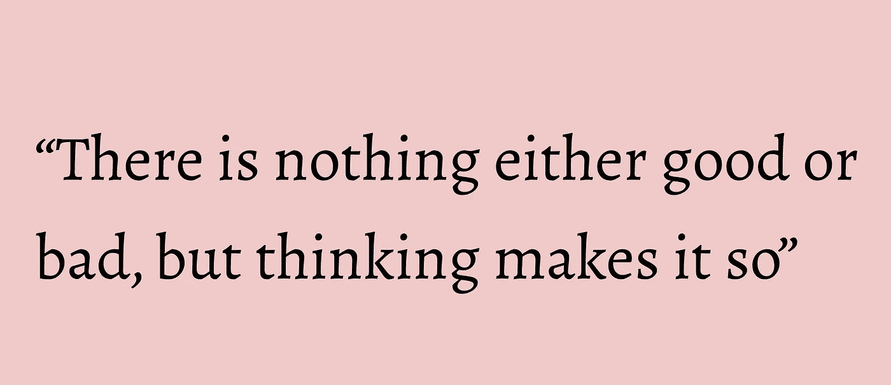
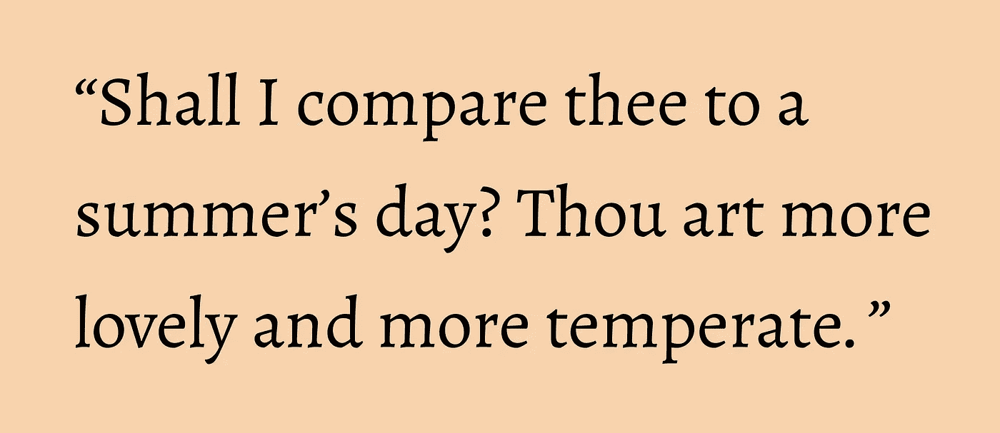

# 文本分类和朴素贝叶斯模型的基础

> 原文：<https://towardsdatascience.com/text-classification-and-the-basics-of-a-naive-bayes-model-1f9096af4577?source=collection_archive---------45----------------------->

## 理解模型如何工作以及如何处理它的陷阱

**文本分类**是一个相当常见的自然语言处理应用。本文旨在给出一些文本分类应用的高层次概述，然后介绍朴素贝叶斯模型，它是文本分类的基础。

由[凯利·西克玛](https://unsplash.com/@kellysikkema?utm_source=medium&utm_medium=referral)在 [Unsplash](https://unsplash.com?utm_source=medium&utm_medium=referral) 上拍摄的照片

# 文本分类应用

您可能会看到它应用于以下领域:

*   情感分析:在这里，我们可以将文本分为正面、负面或其他类别。一个拥有数百万用户的平台，如脸书或 Twitter，如何调节内容并检测仇恨言论？这是当今发展和研究的一个巨大领域
*   **垃圾邮件过滤:**你可能对这个很熟悉——每天有 540 亿条垃圾邮件被发送，其中大部分在我们浪费时间和注意力之前就被过滤掉了。
*   **作者归属:**这段文字是谁写的？我们可以训练一个模型来猜测这是莎士比亚！

莎士比亚的哈姆雷特。图片作者。

*   **体裁分类:**根据电影剧本，是喜剧还是动作片。这是我第一堂数据科学课的核心！
*   **语言 ID:** 想想 Google Translate 是如何检测到你输入什么语言才能被翻译的。

这些问题正在通过监督学习模型得到解决，在监督学习模型中，我们向模型输入带标签的训练数据，以学习某种模式或功能，这反过来将帮助它对以前没有见过的文本进行分类。

例如，已经被标记为负面或正面的电影评论可以被用作训练数据，从而给出模型信息，该模型信息可以用于确定先前未看到的电影评论的情绪。**但是模型如何从它的训练数据中学习呢？引擎盖下到底发生了什么？**

# 一袋单词

单词包(BOW)是我们用数字表示文本的一种方式。它不考虑文本中单词的顺序，而只是跟踪出现的单词。每一段文本(一条推文，或者除了书籍之外的文本)都被赋予一个由 1 和 0 组成的数组，每一个 1 和 0 都映射到一个特定的单词。例如，如果我们通过 BOW 表示法对下面的引用进行编码，我们将得到一个大的数组，其中大部分是英语中所有常见单词的 0，但是单词" shall "、" I "、" compare "、" thee "、" to "、" a "、" summer's" "day "等是 1。

莎士比亚的十四行诗 18。图片作者。

如果我们对大量莎士比亚的引语这样做，并将它们标记为正面或负面，我们现在就有了一个可以用来训练模型的数据集。**模型如何知道根据我们的训练数据预测正面还是负面？**

我们真正想了解的是:

**给定一段文本中的一些文本(我们根据它包含的单词将其转化为 1 和 0 的向量)，该文本是正面还是负面的概率更高？**我们可以通过贝叶斯规则找到这种概率，贝叶斯规则是一种常见的情感分析分类器的核心，称为朴素贝叶斯模型。

**快速补充说明:**之前我提到文本分类的一个重要应用是检测垃圾邮件。自 90 年代推出 [MAPS](https://en.wikipedia.org/wiki/Mail_Abuse_Prevention_System) (邮件滥用预防系统)以来，垃圾邮件一直是一个大问题。有趣的是，Y Combinator 的保罗·格拉厄姆在 2002 年写了一篇很有影响力的论文，提出了一种更有效的过滤垃圾邮件的方法。它包括一个改进版本的*贝叶斯过滤*，即朴素贝叶斯模型！

# 朴素贝叶斯模型

贝叶斯规则规定，我们可以找到某个事件 A 的概率，给定某个其他事件 B 已经发生。这是用 P(A | B)表示的。我们的朴素贝叶斯分类器可以找到莎士比亚的第 18 首十四行诗中的引用是肯定的概率(事件 A)，假设它包含它所包含的单词(Shall，I，compare，thee，等等)。=事件 B)。这是基本公式:

贝叶斯法则。图片作者。

P(文本片段为正|它包含的单词)= P(它包含那些单词|文本片段为正)* P(文本为正)/ P(那些单词出现在我们训练数据中的任何文本中)。

一项一项来看，在这个公式中有一些事情需要注意:

*   如果我们考虑到给定文本中其他单词的概率如何变化，那么一个肯定文本包含我们输入到分类器中的单词的概率 P(B|A)的计算就有点复杂。例如，如果“hell”也在文本中，那么“yeah”更有可能包含在一段文本中，因为“hell yeah！”是一个常用短语。也许不是特别来自莎士比亚，但作为一般规则。**这里，我们做一个重要的简化假设:假设所有的特征都是独立的。因此，为了找到 P(B|A ),我们只需将一个词在一段给定为正的文本中出现的概率乘以下一个词在给定为正的文本中出现的概率，对于所有的词。**
*   文本为正的概率 P(A)就是所谓的**先验。**在实践中，这些概率通常基于训练数据:在训练数据集中，我们有百分之多少的肯定文本？
*   一段文本包含某些单词的概率 P(B ),是为了帮助我们调整一般情况下或多或少出现的单词的总体概率

上面所做的独立性假设意味着计算每个特征的概率时不考虑其周围的其他特征，这是这些特征中的“幼稚”特征，因此被称为朴素贝叶斯。

# 缺陷和缓解措施

朴素贝叶斯实现中出现的一些问题以及我们可以做些什么来处理它们。

## 重复的单词

有时，如果一个单词在一段文本中重复多次，我们的分类器可能会出错。例如，看看【2020 年 7 月的这条推文。新泽西州州长用了 19 次“真的”这个词😲因为他正在号召居民在疫情期间举行室内聚会。

我们可能会试图计算某个单词在一篇文章中出现的次数，并将 19 作为单词“really”的数字表示。**然而,“真的”的每一次出现并没有增加我们对这条推文情感的理解。相反，我们只是在这段文本的数组表示中为一个单词的一次或多次出现添加 1。**

照片由[德鲁·帕特里克·米勒](https://unsplash.com/@drewpatrickmiller?utm_source=medium&utm_medium=referral)在 [Unsplash](https://unsplash.com?utm_source=medium&utm_medium=referral) 上拍摄

## 没有出现在特定类中的功能

在我们的独立性假设下，对于一段文本中的每个单词，我们通过乘以某个单词出现的概率来找到一段文本属于某个类别的概率，假设该单词是某个类别的一部分。有时，我们针对某个类别的训练数据将不包含一个单词/特征。

例如，如果在我的训练数据中被标记为阳性的文本片段都不包含单词“厌恶”，则 P(“digust”出现|该文本片段为阳性)= 0。🤭这意味着无论我们将它乘以什么(其余单词的概率),结果也将是 0！

为了减轻这一点，我们可以给每个元素增加一点概率质量。通常，我们对每个单词使用的概率是:P =该单词在训练数据中的出现次数/训练数据中的总单词数。因此，不要说“厌恶”出现的概率是 0 / 100，000，例如，我们可以对每个元素取 2，这样它就等于 2 / (100，000 + 2*#个不同的单词)并且我们不会得到 0。机会总是有的，不管多小😉

# 主要外卖

朴素贝叶斯模型将贝叶斯定理应用于文本分类，并且可以相当容易地训练，与其他模型相比，**计算量**相对较少。然而，鉴于它们依赖于每个参数的独立性，它们无法达到高级文本分类技术所达到的相同精度——实际上，我们在文本片段中看到的彼此相邻的单词**是相互依赖的**。