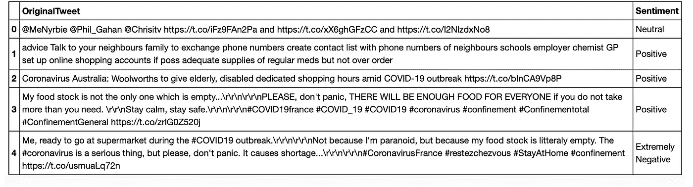
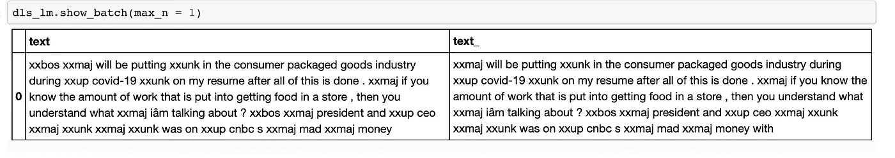
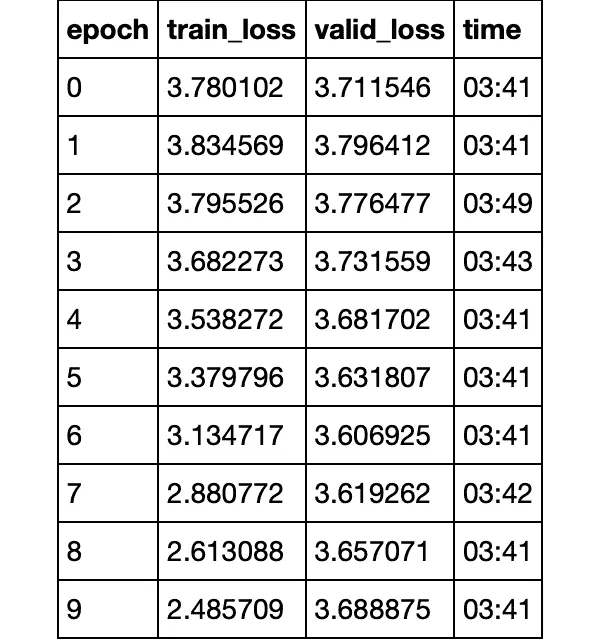
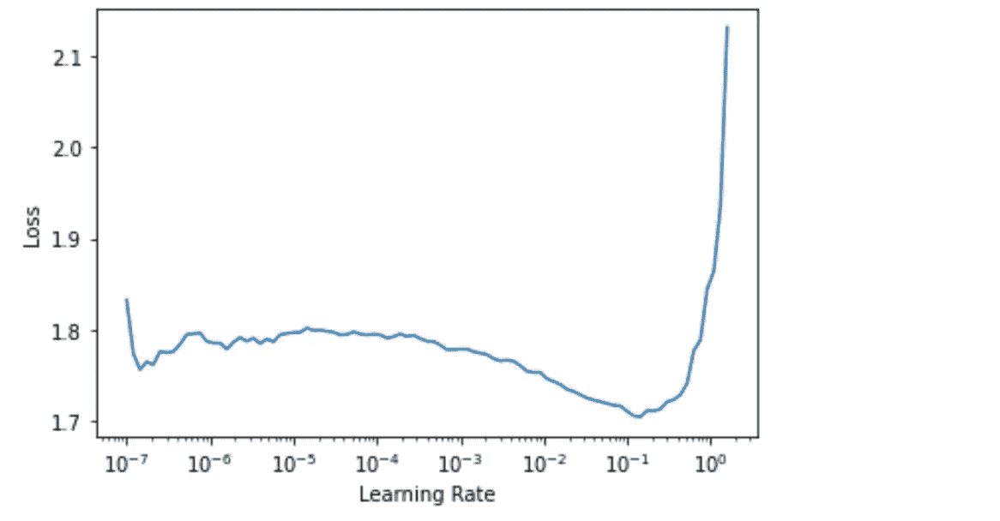
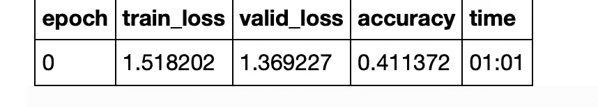
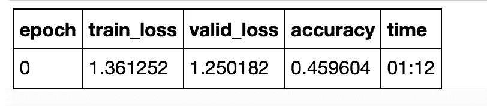
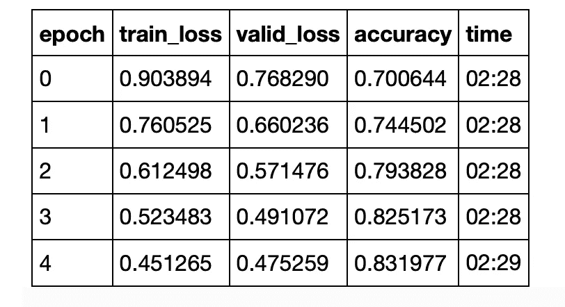

# 仅 20 行代码的文本分类

> 原文：<https://towardsdatascience.com/text-classification-in-just-20-lines-of-code-8baf9c2a0a53?source=collection_archive---------26----------------------->

## 用 Pytorch 和 Fastai 以最少的设置训练一个最先进的文本分类器


图片由 [Unsplash](https://unsplash.com?utm_source=medium&utm_medium=referral) 上的 [Alexandru Acea](https://unsplash.com/@alexacea?utm_source=medium&utm_medium=referral) 拍摄

我将在这个项目中使用的数据集是来自 Kaggle 的[新冠肺炎推特情感分类数据集。](https://www.kaggle.com/datatattle/covid-19-nlp-text-classification)

## 设置

下载完数据后，导入 **fastai** 文本模块以及 **pandas** 来读取 csv 文件。在这一点上，我将只使用训练数据——它包含足够数量的 tweets，以充分分配训练和验证。

```
**from** **fastai.text.all** **import** *path = Path('/storage/Corona_NLP_train.csv')**import** **pandas** **as** **pd**
df = pd.read_csv(path, usecols = ['OriginalTweet', 'Sentiment'], encoding = 'latin1')
df.head()
```

> 输出是简单的文本数据，包含原始 tweet 和一个情绪栏，有五个类别:非常积极、积极、消极、非常消极和中立。



列车数据

## 为预测文本中的下一个单词建立语言模型

接下来，我们继续从这个数据集创建一个语言模型。这实际上使用了来自 fastai 的预训练模型来制作编码器，我们稍后使用该编码器进行微调，以便进行分类。

但是首先，我们将数据加载为数据块:

```
dls_lm = TextDataLoaders.from_df(df, 
                                 text_col = 'OriginalTweet', 
                                 label_col = 'Sentiment', 
                                 valid_pct = 0.20, 
                                 bs = 64, 
                                 is_lm = **True**)
```

> 注意:我们将验证分割为整个培训 csv 文件的 20%。

如果我们试着看看这款车型的 **X** 和 **y** 特征由什么组成，我们会看到:

```
dls_lm.show_batch(max_n = 1)
```



一条来自语言模型的推文

这实质上是构建分类管道的第一部分。在这一步中，我们确保我们的模型知道如何预测给定文本行中的下一个单词(或子单词),因此稍后我们可以使用它来训练分类器，以从文本中预测情感(含义)。

定义语言模型很简单:

```
learn = language_model_learner(dls_lm, AWD_LSTM, drop_mult = 0.3)
```

然后我们训练它。

```
learn.fit_one_cycle(10, 1e-2)
```



我们微调过的预训练语言模型

最后，保存模型的编码器(除了最后一个嵌入层——输出层):

```
learn.save_encoder('finetuned')
```

就是这个！现在我们可以在这个编码器的帮助下继续训练这个模型，为我们执行分类！

## 训练分类器

首先定义另一个数据加载器:

```
dls_clas = TextDataLoaders.from_df(df, 
                        valid_pct = 0.2, 
                        text_col = 'OriginalTweet',
                        label_col = 'Sentiment', 
                        bs = 64, 
                        text_vocab = dls_lm.vocab)
```

现在，我们才开始训练！

```
learn = text_classifier_learner(dls_clas, AWD_LSTM, drop_mult = 0.5, metrics = accuracy).to_fp16()# load our saved encoder
learn = learn.load_encoder('finetuned')
```

我确保我以适当的学习率进行训练，所以我先 ***绘制损失与学习率曲线*** :

```
learn.lr_find()
```

我们得到这样一条曲线:



lr 曲线

这就是我们如何确定学习率 **2e-3** 应该是我们开始训练的好地方。

现在，我们只需要从解冻一层开始训练，然后是两层，再多一些，然后是整个模型一个一个的解冻。

适合整个模型一次:

```
learn.fit_one_cycle(1, 2e-3)
```



无层解冻

然后解冻最后两层:

```
learn.freeze_to(-2)
learn.fit_one_cycle(1, 3e-3)
```



最后 2 个解冻

然后是最后四个:

```
learn.freeze_to(-4)
learn.fit_one_cycle(1, 5e-3)
```


最后 4 个解冻

最后，整个模型:

```
learn.unfreeze()
learn.fit_one_cycle(5, 1e-2)
```



决赛成绩

这就是我们的最终结果！

## 你自己试试！

```
learn.predict('This was a really bad day in my life. My whole family except my dad was infected.')Output:
('Extremely Negative',
 tensor(0),
 tensor([9.7521e-01, 1.8054e-02, 5.1762e-05, 5.3735e-03, 1.3143e-03]))
```

瞧啊。我们有一个相当准确的文本分类器！今后，我们只需要进行更多的研究和实验，就能建立一个更好的模型！

这个小项目的完整代码可以在:[https://github.com/yashprakash13/RockPaperScissorsFastAI](https://github.com/yashprakash13/RockPaperScissorsFastAI)获得

[](https://github.com/yashprakash13/RockPaperScissorsFastAI) [## yashprakash 13/rock paper scissors fastai

### 这些笔记本包含来自 medium 系列博客文章的代码:Fastai-My 的快速介绍…

github.com](https://github.com/yashprakash13/RockPaperScissorsFastAI) 

快乐学习！😁

[从这里获得我的免费指南，轻松地将这个模型部署为 API。](https://tremendous-founder-3862.ck.page/cd8e419b9c)

在 [Twitter](https://twitter.com/csandyash) 和 [LinkedIn](https://www.linkedin.com/in/yashprakash13/) 上与我联系。