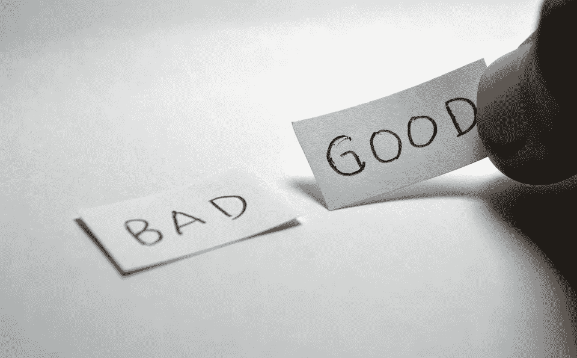

# 文本分类:使用自然语言处理预测“好”或“坏”的陈述

> 原文：<https://towardsdatascience.com/text-classification-predicting-good-or-bad-statements-using-natural-language-processing-e3a4edb07118?source=collection_archive---------21----------------------->

## 使用空间库创建和训练 NLP 模型，以预测和分类输入线



图片由[拉姆德隆](https://pixabay.com/users/ramdlon-710044/)从 [Pixbay](https://pixabay.com/photos/good-bad-opposite-choice-choose-1123013/) 拍摄

这篇博客将介绍一种非常基本的方法，预测给定的输入语句应该被分类为“好”还是“坏”。为此，我们将首先利用过去的数据集训练自然语言处理(NLP)模型。这样，我们开始怎么样！

## 先决条件:

你应该知道 BOW(单词袋)方法。你可以查看[1]了解更多细节。BOW 方法本质上是将文本转换成数字，使得 NLP 模型更容易学习。

在本教程中， [Google Colab](https://colab.research.google.com/) 用于运行脚本。你可以选择任何你喜欢的平台。另外，使用的脚本语言是 Python。

## 数据集

由于这是一个非常入门的博客，我自己写的数据集总共只有 7 行，如表 1 所示。一旦你熟悉了基本要素，我强烈建议你选择一个更大的数据集，并尝试应用类似的处理来获得经验。Kaggle 是追踪无数数据集的好地方。

表 1:带有标记为“好”或“坏”的简单语句的自定义数据集

## Python 脚本

你可以在[这个](https://github.com/semicolon123/ML-DL-projects/blob/main/Predict_good_bad_lines_in_dataset.ipynb) Github 仓库中找到完整的代码库。在这篇博客中，我将只解释重要的代码片段。如果仍然需要代码的其他部分的助手，做评论，我很乐意帮助。

我们将使用 [spaCy](https://spacy.io/) 包。这是一个免费的开源库，用于 Python 中的自然语言处理。我强烈推荐你访问这个软件包的网站，快速浏览一下它提供了什么。

导入数据集后，我们将创建一个空白模型。我们使用 spaCy 提供的文本分类器。请注意，文本分类程序有许多版本。但是我们将使用 textcat，如下面的代码所示。使用`textcat`是因为我们只想预测一个真正的标签，它要么是*好的*要么是*坏的。*

```
nlp = spacy.blank("en")  *#model is named as nlp*

*# text categroizer wit standard settings*
textcat = nlp.create_pipe("textcat", config={
                "exclusive_classes": **True**,
                "architecture": "bow"}) *#bow = bag of words*

nlp.add_pipe(textcat) *#add textcat to nlp*
```

## 训练模型

为了训练一个模型，你需要一个优化器，为此，spaCy 包来拯救你。优化器将在训练阶段使用`minibatch`函数不断更新模型。请注意下面的代码，它完成了我们刚刚讨论过的任务。

```
from **spacy**.util import **minibatch**
optimizer = nlp.begin_training() *#create optmizer to be used by spacy to update the model*

batches = minibatch(train_data, size=8) *#spacy provides minibatch fn*

for batch in batches:
    texts, labels = zip(*batch)
    nlp.update(texts, labels, sgd=optimizer)
```

## 做预测

在上一步中，我们使用输入数据集对模型进行了定型。完成后，您可以使用如下所示的 predict()方法，使用训练好的模型对输入语句或行进行预测:

```
*# i mentioned all lines to be predicted in a 'texts' array* Lines = ["**I look awesome**"] 
docs = [nlp.tokenizer(text)**for** text **in** Lines]      
textcat = nlp.get_pipe('textcat') 
scores, _ = textcat.predict(docs) *#Prob score for both classes (Good/bad)* 
print(scores)
```

另外，请注意一件事。当上述代码运行时，输出将类似于:

```
[[0.50299996 0.49700007]]
```

上面的输出是两个类标签的概率分数。在当前的场景中，可能的标签是- *好的*或*坏的。*根据上述输出，给定输入线为*好*的概率更大(0.50299996)，因此模型将该线分类为*好*。

为了使预测更直接，让我们打印给定输入行的类标签，而不是概率分数。

```
predicted_labels = scores.argmax(axis=1)
print([textcat.labels[label] **for** label **in** predicted_labels])
```

您将看到如下输出:

```
['Good']
```

## 后续步骤

首先，祝贺你！您刚刚学习了如何使用 spaCy 库构建文本分类器。绝对有许多替代方法可以做到这一点，我以后会提供更多的指导性博客。在进一步通知之前，我想请求我的读者从这个指导性练习中吸取经验，并将其应用到一些相对更大的数据集上。

还有，你可以在 [Twitter](https://twitter.com/SwatiRajwal) 和 [LinkedIn](https://www.linkedin.com/in/swati-r-84682b12b/) 上问我一个问题！

## 参考

[1] Ismayil，M. (2021 年 2 月 10 日)。*从文字到向量——走向数据科学*。中等。[https://towards data science . com/from-words-to-vectors-e24f 0977193 e](/from-words-to-vectors-e24f0977193e)