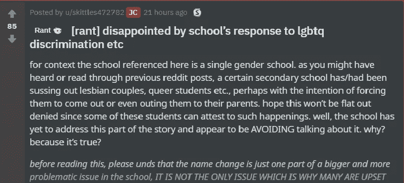
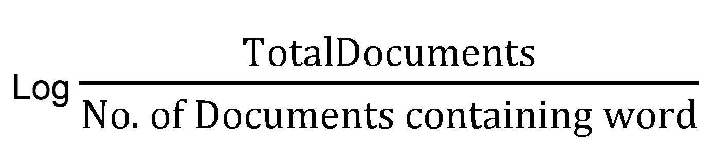
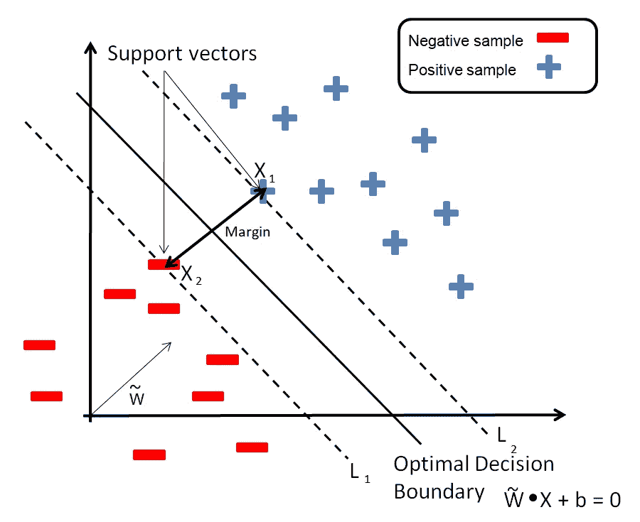
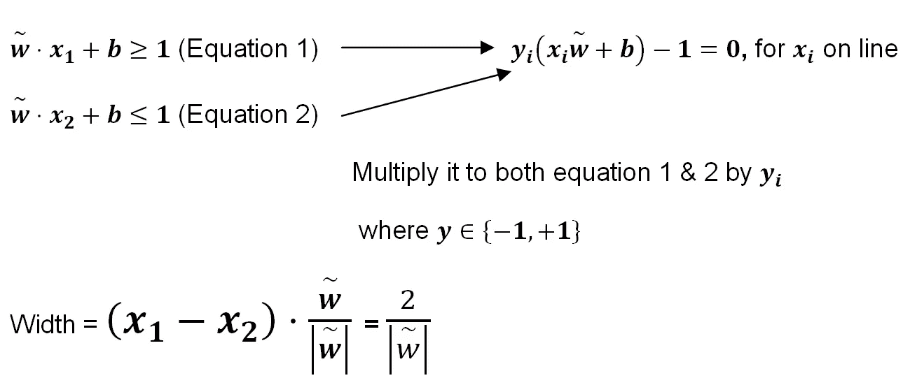
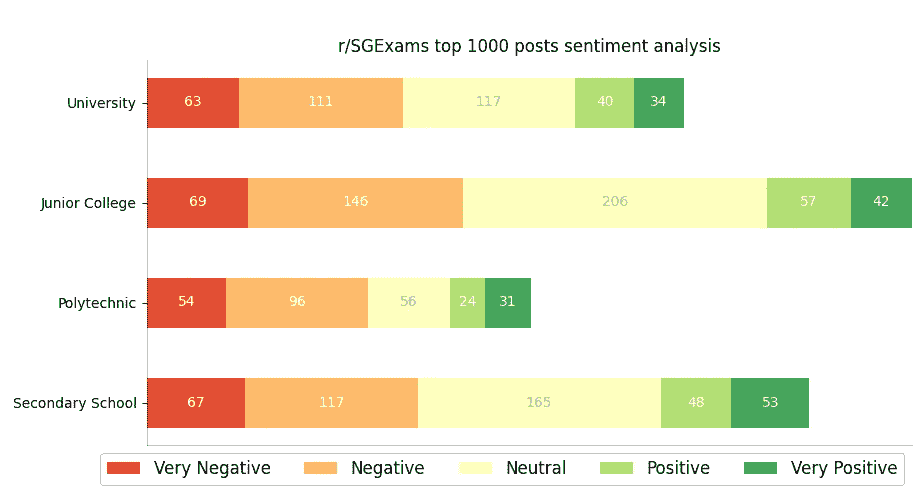
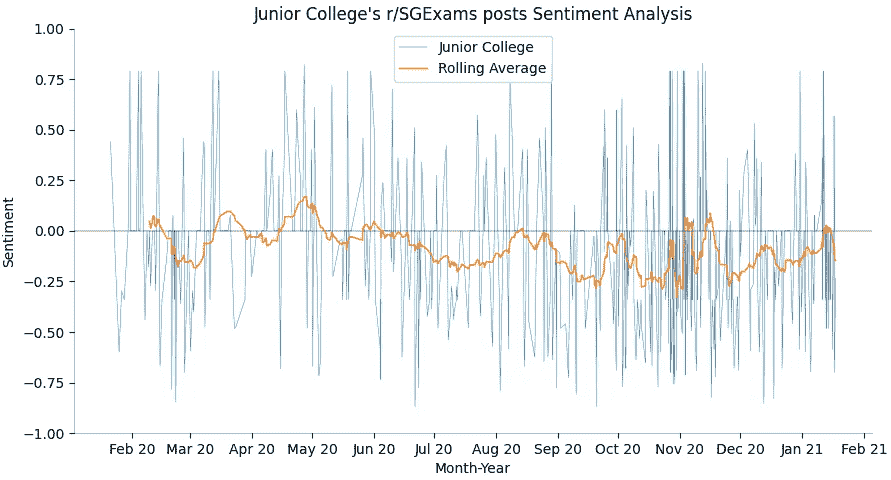
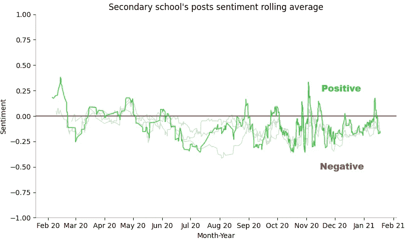
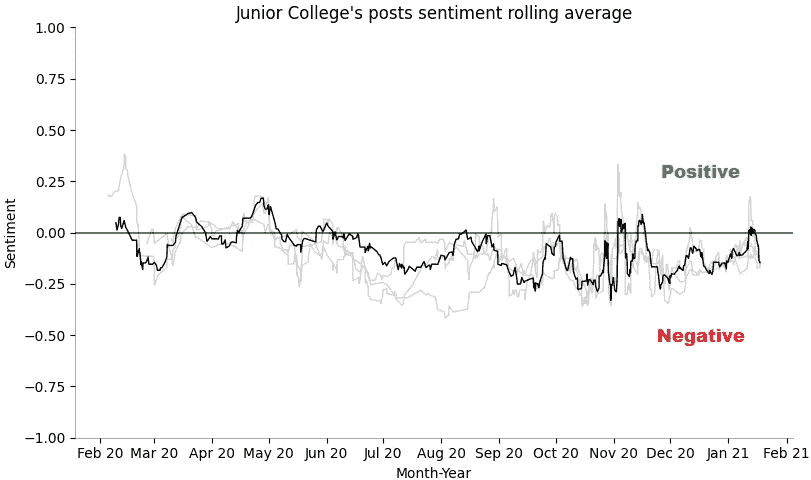
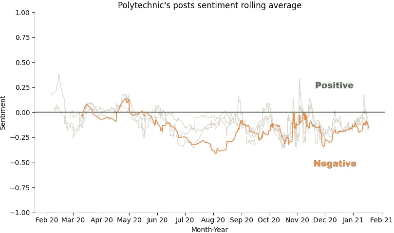
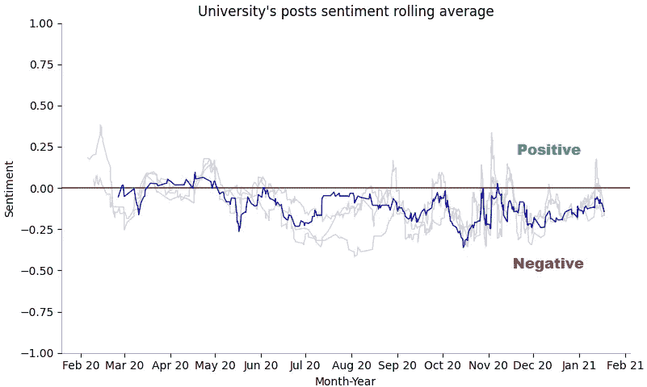

# r/SG 考试中的文本分类和情感分析

> 原文：<https://towardsdatascience.com/text-classification-sentiment-analysis-on-r-sgexams-4ea341134fba?source=collection_archive---------21----------------------->

## 使用支持向量机和 VADER(价感知字典和情感推理机)


显示大专帖子情绪分析及其滚动平均值的图表，按作者分类的图像

## 介绍

两个月前，我用 Python 课程完成了 CS50 的人工智能入门。在课程中，我对情绪分析的概念特别感兴趣，从文本数据中提取特征，并输入机器学习算法来确定情绪基调。我决定着手一个涉及文本分类和情感分析的项目。

## 数据集搜索

在过去的 12 年里，作为新加坡教育体系的一部分，r/SG exams subred dit 似乎一直是学生们讨论的首选平台，从学生们抱怨某篇 O-level 论文有多难，到学生们询问各种大学课程。



r/SGExams 上的示例帖子，图片来自 [Reddit 的 r/SGExams](https://www.reddit.com/r/SGExams/)

无数这样的讨论为文本分类和对每个教育水平的学生意见的情感分析提供了完美的数据集。

## 数据析取

我使用 PRAW，Reddit API 包装器来提取 r/SGExams 上前 1000 个帖子的标题，标题文本，URL，日期，时间。我将数据提取到一个嵌套字典中，然后将它转换成一个熊猫数据框。我将 meme post 图片表示为文本:“meme post”使用一个带有 *is_self()* 的循环函数添加到熊猫数据帧中。

请注意，要使用 PRAW API，您必须创建一个帐户并注册以获得 OAuth2 密钥(client_id、client_secret、user_agent)。

## 数据预处理

从 Reddit 中提取数据后，我继续进一步细化数据以适应模型需求。执行数据预处理的步骤如下:

*   删除任何空白行
*   将所有文本改为小写
*   **单词标记化:**将文本流分解成单词、短语
*   删除停用词
*   删除非字母数字文本
*   **单词变元化:**在考虑上下文的情况下，将单词的屈折形式(有时是衍生相关形式)简化为通用基本形式的过程。

我只应用了词汇化，没有使用词干来保持标记的可读性。对于那些不确定两者之间区别的人来说，词干通常会删除导致错误含义和拼写的单词的最后几个字符，而词条化则考虑上下文并将单词转换为称为词条的基本形式。这里有一个例子:

```
**Original**   **Stemming   Lemmatization**
Having     Hav        Have
The going  The go     The going
Am         Am         Be
```

我面临的一个问题是，由于一个句子中的单词通常有多个词条，它们将不会被正确转换。像“学习”这样的词不会转换成“研究”。为了解决这个问题，我添加了一个 *get_wordnet_posttag* 函数，该函数接收一个单词并返回一个词性标签(POS tag)，并添加到 *lemmatized_word()* 的第二个参数中。POS 标签允许函数更准确地对单词进行词汇化。

## 准备培训和测试数据集

语料库将分为两个数据集:训练和测试。训练数据集将用于拟合模型，同时对测试数据集进行预测，所有这些都是通过 sklearn 库中的 *train_test_split* 函数实现的。

## 编码

之后， *Train_Y* 和 *Test_Y* 中的数据类型字符串的标签在一个称为编码的过程中被转换成数字格式，以便模型理解。例如:["JC "，" Uni "，" Poly "，" Sec"] → [0，1，2，3]

## 单词矢量化

有多种方法可以将文本数据转换成矢量，例如 Word2Vec，但是对于这个项目，我将使用目前最流行的方法，TF-IDF，它代表词频—逆文档频率。



作者图片

*   **词频:**一个词在文档中出现的频率
*   **逆文档频率:**衡量一个单词在文档中的稀有程度

TF-IDF 模型首先适用于整个语料库以建立其词汇。 *Train_X* 和 *Test_X* 随后被矢量化为 *Train_X_tfidf* 和 T *est_X_tfidf* ，两者都包含一个唯一数字列表及其相关的 TF-IDF 分数。

## 支持向量机算法

那么什么是支持向量机(SVM)？它是一个监督学习模型，具有相关的学习算法，用于分析数据以进行分类和回归分析。

我将从解释几个关键概念开始；

*   **边距:**两个不同类的数据点之间的距离
*   **决策边界:**又称超平面，它们在 2D 特征空间中以一条线的形式存在，在 3D 特征空间中以一个平面的形式存在，当超过 4 维或更多维时，很难想象。决策边界对数据点进行分类。
*   **交叉验证:**确定误差范围内可能的最低错误分类和观察次数。

不深究数学，先从下图说起。有两类数据点，由一个决策边界和它的边界分开。为了找到边界的宽度，引入一个垂直于判定边界的单位向量 ***w*** 。



作者图片



作者图像页边空白长度的确定公式

SVM 的目标是最大化数据点和决策边界之间的差距。这也称为软边界分类器或支持向量分类器(SVC)。SVC 是一个具有较高偏差和较低方差的决策边界，其支持向量来自位于软边缘或边缘的数据点，这些数据点通过交叉验证获得。在这种情况下，最大间隔分类器(MMC)将不起作用，因为它降低了数据点和决策边界之间的间隔阈值，尤其是在存在异常值的情况下，增加了过度拟合的机会。

然而，SVC 和 MMC 都无法处理具有大量重叠分类的非线性数据，这就是 SVM 发挥作用的地方。简单来说，SVM 处理的是相对低维度的数据，将数据转换到更高维度，找到一个可以区分高维度数据的 SVC。但是转换这样的数据需要大量的计算。因此，SVM 使用核函数通过计算每一对点*之间的关系来寻找更高维度的 SVC，就好像它们在高维度中一样，而不需要将数据转换到更高维度，这通常被称为核技巧。*

对 SVM 有所了解后，我们可以探索我们的数据集并构建 SVM 模型。

## 结果

结果和我预料的差不多。出于时间的考虑，我没有根据 subreddit 上所有可用的数据来训练模型。事实上，我只使用了前 1000 篇帖子来测试整个流程。该模型的准确率为 58.3%，绝对是过度拟合。此外，因为所有的帖子都是同一个主题:教育，由于许多常用术语可以互换，所以很难区分每个教育水平。

## 情感分析

我在同一个数据集上运行了一个情感分析工具，将类别(中学、大专、理工和大学)考虑在内。

我在这个项目中使用了 [VADER (Valence Aware 词典和情感推理器)](https://github.com/cjhutto/vaderSentiment)，一个基于词典和规则的情感分析工具，因为它专门针对社交媒体上表达的情感进行了调整。此外，它对情绪的极性(积极/消极)和强度都很敏感。VADER 的评分标准用数值计算情绪:1 代表最积极，1 代表最消极，0.05 到 0.05 代表中性。我测试了该工具，以测试它是否能够理解语言强度并检测双极性:

```
from vaderSentiment.vaderSentiment import SentimentIntensityAnalyzer
def sentiment_analyzer(sentence):
    score = analyser.polarity_scores(sentence)
    return score['compound']sentence = "I dislike mushroom"
sentiment_analyzer(sentence)
OUTPUT: -0.3818sentence = "I really hate mushroom"
sentiment_analyzer(sentence)
OUTPUT: -0.6115

sentence = "I dislike mushroom but I love fried chicken" 
sentiment_analyzer(sentence)
OUTPUT: 0.7184sentence = "I dislike mushroom but I like fried chicken"
sentiment_analyzer(sentence)
OUTPUT: 0.3506
```

此外，我用“meme”更新了它的词汇，作为一种积极的情绪，因为 r/SGExams 包含了相当多关于当前教育事务的 meme 帖子。

我创建了一个图表，来查看所有教育水平职位的总体情绪分布，以便进行比较，或许还能得出一些结论。我使用 Matplotlib 来可视化我的数据。



不同教育水平的观点综述。作者图片

值得注意的是，与所有教育水平相关的负面情绪数量超过了正面情绪，大专的负面帖子数量最多。更深入的分析显示，情绪被分类为中立的帖子主要与查询相关，这解释了它们的中立性。

我进一步绘制了每个教育水平的时间表及其滚动平均值，看看是否有任何可观察到的趋势。



作者图片

这个图表变得非常混乱，很难可视化，所以我编辑了我的代码，删除了原始的情绪数据，只绘制了每个教育水平的滚动平均值。



作者图片



作者图片



作者图片



作者图片

## 评估图表

总的来说，正如条形图所预测的那样，所有教育水平的人全年的情绪大多是负面的。我注意到，对于大专和中学，他们的情绪从 6 月份开始到第二年 2 月是最消极的，这符合期末考试临近的趋势，随后是 O 和 A 级成绩的发布，导致学生在平台上表达他们对进入梦想学校/课程的压力、焦虑和疑虑。

对于理工学院和大学，无法得出任何结论，这可能是因为与 JC 和中学的最终系统相比，它们采用了模块化的学术系统。更深入的分析表明，他们的帖子主要是关于各种专业课程、ama、rants、奖学金的查询，而不是关于考试、结果的查询，因此解释了不同情绪的帖子的不可预测的波动。

## 结尾注释

在我结束这篇文章之前，我想补充一些免责声明

**如果可能的话，从我的项目中获得的结果应该被轻视**

有很多事情可以做得更好。

例如，当对文本进行分类时，我主要通过它们的 flairs 来区分它们。像元、咆哮和忠告这样的口号被归类在所有的教育水平下。这种分类形式可能不准确，因为一些职位虽然是一般性的，但却是针对特定教育水平的，从而导致不准确。

除此之外，我使用的数据集非常小，只有 1000 个帖子，各个教育水平之间的数字不平衡，数据的传播仅限于大约一年，因此很难确定趋势。

无论如何，这是一个非常有趣的项目，也是一次很好的学习经历，我期待着在未来学到更多，做更多的项目。

所有代码都可以在我的 Github 中找到:

[](https://github.com/S3annnyyy/TCSAProject/) [## S3 annnyyy/tcsa 项目

### Reddit 上的文本分类和情感分析项目

github.com](https://github.com/S3annnyyy/TCSAProject/) 

LinkedIn 简介:[肖恩·雅普](https://www.linkedin.com/in/seanyckang/)

干杯！

## 参考

[1]帕特里克·亨利·温斯顿教授，[支持向量机](https://www.youtube.com/watch?v=_PwhiWxHK8o&ab_channel=MITOpenCourseWare) (2014)，MITOpenCourseWare on Artificial Intelligence

[2] Felippe Rodrigues，[用 Python 刮 Reddit](https://www.storybench.org/how-to-scrape-reddit-with-python/)(2018)，东北大学新闻学院的 storybench.org