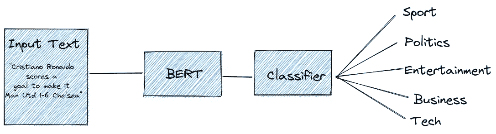
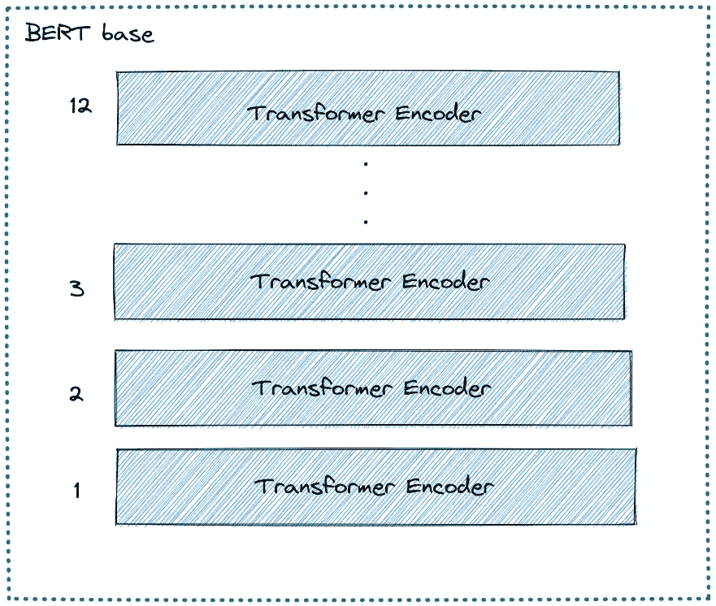
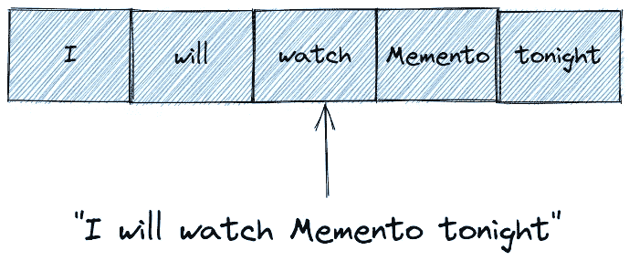
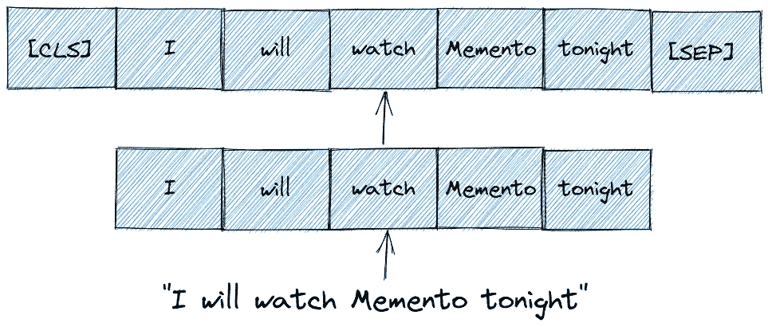
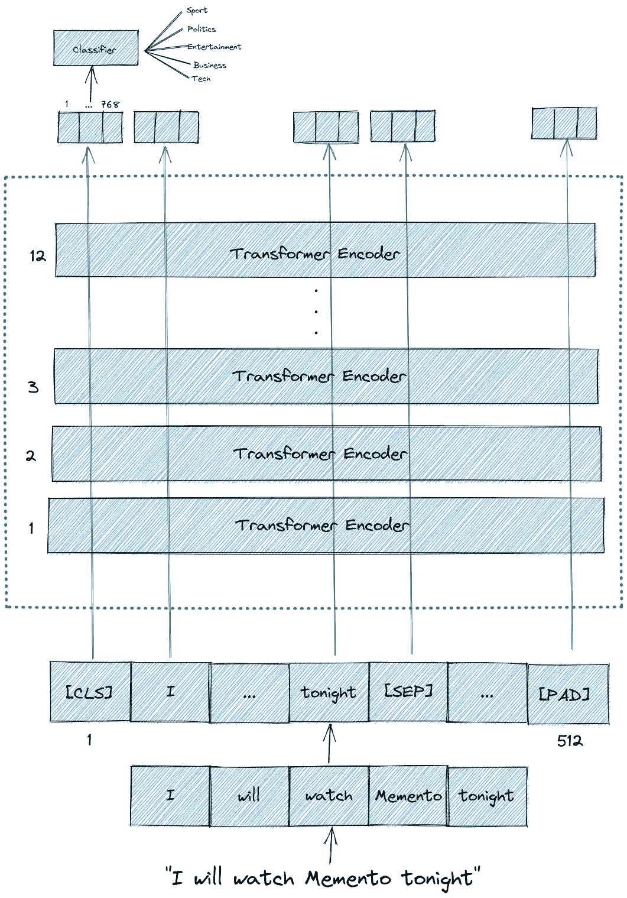
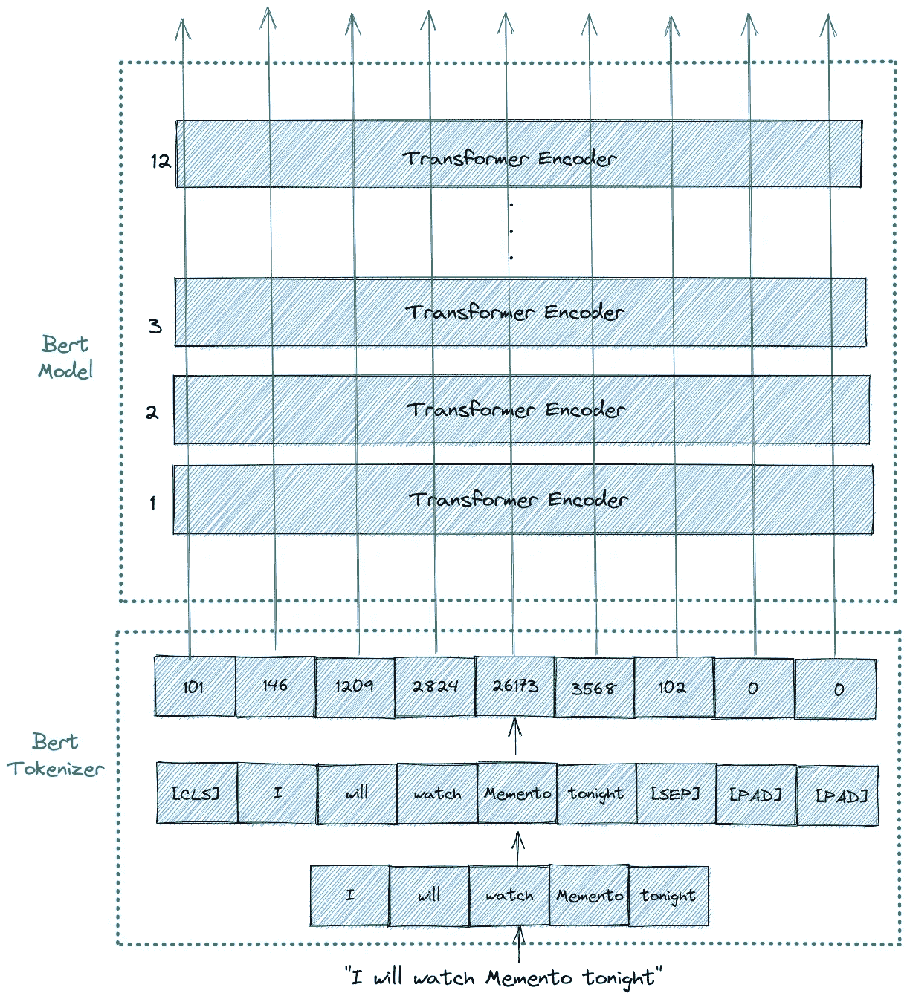
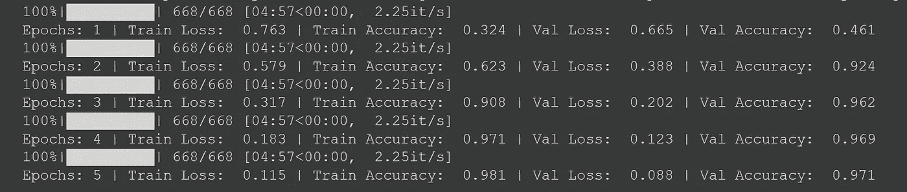

# PyTorch 中基于 BERT 的文本分类

> 原文：<https://towardsdatascience.com/text-classification-with-bert-in-pytorch-887965e5820f?source=collection_archive---------0----------------------->

## 如何利用来自拥抱脸的预先训练的 BERT 模型来分类新闻文章的文本


由 [Unsplash](https://unsplash.com/s/photos/news?utm_source=unsplash&utm_medium=referral&utm_content=creditCopyText) 上的[absolute vision](https://unsplash.com/@freegraphictoday?utm_source=unsplash&utm_medium=referral&utm_content=creditCopyText)拍摄

早在 2018 年，谷歌就为 NLP 应用开发了一个强大的基于 Transformer 的机器学习模型，该模型在不同的基准数据集上都优于以前的语言模型。这个模型叫做伯特。

在这篇文章中，我们将使用来自拥抱脸的预训练 BERT 模型进行文本分类任务。您可能已经知道，文本分类任务中模型的主要目标是将文本分类到一个预定义的标签或标记中。



图片来自作者

具体来说，很快我们将使用预先训练好的伯特模型来分类一篇新闻文章的文本是否可以归类为*体育*、*政治*、*商业*、*娱乐*或*科技*类别。

但是在我们深入研究实现之前，让我们简单地讨论一下 BERT 背后的概念。

# 伯特是什么？

BERT 是**B**I directional**E**n coder**R**的缩写，代表来自 **T** 变压器。这个名字本身就给了我们几个线索，让我们知道伯特是怎么回事。

BERT 架构由几个堆叠在一起的变压器编码器组成。每个 Transformer 编码器封装了两个子层:自我关注层和前馈层。

有两种不同的 BERT 模型:

1.  BERT **base** 是一个 BERT 模型，由 12 层变压器编码器、12 个注意头、768 个隐藏尺寸和 110M 个参数组成。
2.  BERT **大**是一个 BERT 模型，由 24 层变压器编码器，16 个注意头，1024 个隐藏尺寸，340 个参数组成。



图片来自作者

BERT 是一个强大的语言模型至少有两个原因:

1.  它根据从拥有 8 亿单词的 BooksCorpus 和拥有 2500 万单词的 Wikipedia 中提取的未标记数据进行预训练。
2.  顾名思义，它是利用编码器堆栈的双向特性进行预训练的。这意味着伯特不仅从左到右，而且从右到左从一系列单词中学习信息。

# 伯特输入和输出

BERT 模型期望将一系列标记(单词)作为输入。在每个记号序列中，有两个特殊的记号是 BERT 期望的输入:

1.  **【CLS】**:这是每个序列的第一个记号，代表分类记号。
2.  **【SEP】**:这是让 BERT 知道哪个令牌属于哪个序列的令牌。这个特殊标记主要对于下一个句子预测任务或问答任务是重要的。如果我们只有一个序列，那么这个标记将被附加到序列的末尾。

为了使它更清楚，让我们说我们有一个由下面的短句组成的文本:


图片来自作者

第一步，我们需要把这个句子转换成一系列的标记(单词)，这个过程叫做*标记化*。



图片来自作者

尽管我们已经对输入句子进行了标记，但我们还需要做一步。我们需要通过添加**【CLS】**和**【SEP】**记号来重新格式化记号序列，然后将它用作我们的 BERT 模型的输入。



图片来自作者

幸运的是，我们只需要一行代码就可以将输入的句子转换成 BERT 期望的符号序列，正如我们在上面看到的。我们将使用`BertTokenizer`来完成这项工作，稍后您可以看到我们是如何完成的。

还需要注意的是，可以输入 BERT 模型的最大令牌大小是 512。如果一个序列中的令牌少于 512 个，我们可以用**【PAD】**令牌填充未使用的令牌槽。如果序列中的令牌长度超过 512，那么我们需要进行截断。

这就是伯特所期望的输入。

然后，BERT 模型将在每个记号中输出大小为 768 的嵌入向量。我们可以使用这些向量作为不同类型的自然语言处理应用的输入，无论是文本分类、下一句预测、命名实体识别(NER)还是问答。

对于文本分类任务，我们将注意力集中在从特殊的**【CLS】**记号输出的嵌入向量上。这意味着我们将使用来自**【CLS】**令牌的大小为 768 的嵌入向量作为我们分类器的输入，然后它将输出一个大小为我们分类任务中类别数量的向量。

下面是 BERT 模型的输入和输出的图示。



图片来自作者

# 基于 BERT 的文本分类

现在我们要跳转到我们的主题，用 BERT 对文本进行分类。在本帖中，我们将使用 *BBC 新闻分类*数据集。如果你想跟进，你可以[在 Kaggle](https://www.kaggle.com/sainijagjit/bbc-dataset) 下载数据集。

这个数据集已经是 CSV 格式的，它有 2126 个不同的文本，每个文本都被标记为 5 个类别之一:*娱乐*、*体育*、*科技*、*商业*或*政治*。

让我们看看数据集是什么样子的。

如您所见，dataframe 只有两列，即作为标签的*类别*和作为 BERT 输入数据的*文本*。

## 预处理数据

从上一节中您可能已经知道，我们需要通过添加**【CLS】**和**【SEP】**标记来将我们的文本转换成 BERT 期望的格式。我们可以用拥抱脸的`BertTokenizer`类轻松做到这一点。

首先，我们需要通过 pip 安装 Transformers 库:

```
pip install transformers
```

为了让我们更容易理解从`BertTokenizer`得到的输出，让我们用一个简短的文本作为例子。

下面是上面对`BertTokenizer` 参数的解释:

*   `padding`:将每个序列填充到您指定的最大长度。
*   `max_length`:每个序列的最大长度。在本例中，我们使用 10，但对于我们的实际数据集，我们将使用 512，这是 BERT 允许的最大序列长度。
*   `truncation`:如果为真，则每个序列中超过最大长度的记号将被截断。
*   `return_tensors`:将要返回的张量的类型。既然我们使用 Pytorch，那么我们使用`pt`。如果用 Tensorflow，那么就需要用`tf`。

您从上面的`bert_input`变量中看到的输出是我们稍后的 BERT 模型所必需的。但是这些输出意味着什么呢？

1.  第一行是`input_ids`，是每个令牌的 id 表示。我们实际上可以将这些输入 id 解码成实际的令牌，如下所示:

如您所见，`BertTokenizer`负责对输入文本进行所有必要的转换，这样它就可以用作我们的 BERT 模型的输入了。自动添加**【CLS】****【SEP】****【PAD】**令牌。既然我们指定最大长度为 10，那么最后只有两个**【PAD】**记号。

2.第二行是`token_type_ids`，这是一个二进制掩码，标识一个令牌属于哪个序列。如果我们只有一个序列，那么所有的令牌类型 id 都将是 0。对于文本分类任务，`token_type_ids`是我们的 BERT 模型的可选输入。

3.第三行是`attention_mask`，这是一个二进制掩码，用来标识一个令牌是真实的单词还是仅仅是填充。如果令牌包含**【CLS】****【SEP】**或任何真实单词，那么掩码将是 1。同时，如果令牌只是填充符或**【填充符】**，那么掩码将为 0。

正如你可能注意到的，我们使用来自`bert-base-cased` 模型的预训练`BertTokenizer`。如果数据集中的文本是英文，这个预先训练好的标记器可以很好地工作。

如果您有来自不同语言的数据集，您可能想要使用`bert-base-multilingual-cased`。具体来说，如果数据集是德语、荷兰语、中文、日语或芬兰语，您可能希望使用专门针对这些语言预训练的标记器。您可以在这里查看对应的预训练分词器[的名称。](https://huggingface.co/transformers/pretrained_models.html)

综上所述，下面是`BertTokenizer`对我们输入句的说明。



图片来自作者

## 数据集类

现在我们知道了从`BertTokenizer`将得到什么样的输出，让我们为新闻数据集构建一个`Dataset`类，作为生成新闻数据的类。

在上面的实现中，我们定义了一个名为`labels`的变量，这是一个将 dataframe 中的*类别*映射到我们标签的 id 表示中的字典。注意，我们还在上面的`__init__`函数中调用了`BertTokenizer`来将我们的输入文本转换成 BERT 期望的格式。

定义数据集类后，让我们将数据帧分成训练集、验证集和测试集，比例为 80:10:10。

## 模型结构

到目前为止，我们已经构建了一个数据集类来生成我们的数据。现在，让我们使用预训练的 BERT 基本模型构建实际模型，该模型具有 12 层 Transformer 编码器。

如果您的数据集不是英文的，最好使用`bert-base-multilingual-cased`模型。如果您的数据是德语、荷兰语、中文、日语或芬兰语，则可以使用专门为这些语言预先训练的模型。你可以在这里查看对应预训模特[的名字。](https://huggingface.co/transformers/pretrained_models.html)

从上面的代码可以看出，BERT 模型输出两个变量:

*   在上面的代码中，我们命名为`_`的第一个变量包含序列中所有标记的嵌入向量。
*   我们命名为`pooled_output`的第二个变量包含**【CLS】**令牌的嵌入向量。对于文本分类任务，使用这种嵌入作为我们的分类器的输入就足够了。

然后我们将`pooled_output` 变量传递给一个带有 ReLU 激活函数的线性层。在线性层的末端，我们有一个大小为 5 的向量，每个向量对应于我们标签的类别(*体育、商业*、*政治、*、*娱乐*和*科技*)。

## 训练循环

现在是我们训练模型的时候了。训练循环将是标准 PyTorch 训练循环。

我们对模型进行 5 个时期的训练，并使用 Adam 作为优化器，而学习率设置为 *1e-6* 。我们还需要使用分类交叉熵作为损失函数，因为我们正在处理多类分类。

建议您使用 GPU 来训练模型，因为 BERT 基本模型包含 1.1 亿个参数。

使用上述配置 5 个时期后，您将获得以下输出作为示例:



显然，由于训练过程的随机性，您可能不会获得与上面截图类似的损失和准确性值。如果你在 5 个周期后没有得到一个好的结果，试着增加周期到，比如说，10 个或者调整学习速率。

## 根据测试数据评估模型

既然我们已经训练了模型，我们可以使用测试数据来评估模型在看不见的数据上的性能。下面是在测试集上评估模型性能的函数。

运行上面的代码后，我从测试数据中得到了 0.994 的准确率。由于训练过程中的随机性，你得到的准确度显然会与我的略有不同。

# 结论

现在你知道了我们如何利用来自拥抱脸的预先训练的 BERT 模型进行文本分类任务的步骤。我希望这篇文章能帮助你开始使用 BERT。

需要记住的一点是，我们不仅可以使用来自 BERT 的嵌入向量来执行句子或文本分类任务，还可以执行更高级的 NLP 应用，如问题回答、下一句预测或命名实体识别(NER)任务。

你可以在 t [**的笔记本**](https://github.com/marcellusruben/All_things_medium/blob/main/Text_Classification_BERT/bert_medium.ipynb) 中找到这篇文章中演示的所有代码片段。