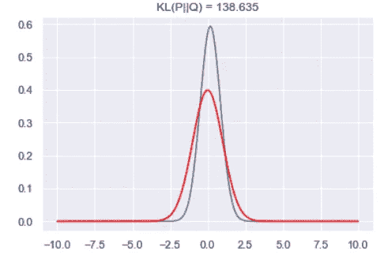
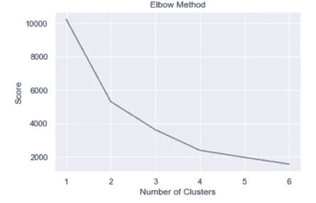
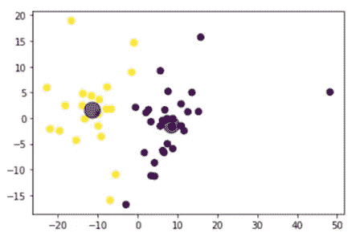
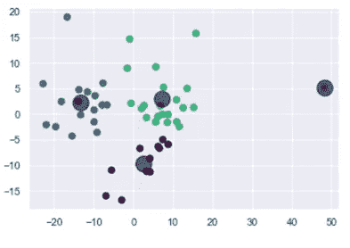

# 基于 K-means 的文本聚类

> 原文：<https://towardsdatascience.com/text-clustering-using-k-means-ec19768aae48?source=collection_archive---------3----------------------->

## K-means 算法的理论和实践理解完全指南

Pierre Bamin 在 [Unsplash](https://unsplash.com?utm_source=medium&utm_medium=referral) 上拍摄的照片

## 什么是文本聚类？

聚类方法是无监督算法，通过创建不同的聚类来帮助从大量文本数据中总结信息。这种方法有助于理解数据集的主要内容以及不同的类别，您可以划分数据集中文本的上下文。

在我详细讨论聚类算法之前，稍后。让我们首先了解算法的工作原理，以及稍后为模型提供信息所需的发现。

在这篇文章中，我将讨论 K-Means 算法的理论概念和 K-Means 算法的实际实现。随着我们更深入地研究这篇文章，你会看到我做的一些实验，这些实验只是为了提高模型的准确性。最后，您将看到在我的数据集上实现该算法后得出的结论，以及它在正确汇总数据集方面的整体性能。

**K-Means 聚类:** K-means 聚类是一种无监督的学习方法，当我们没有标记的数据时使用，就像在我们的例子中，我们有未标记的数据(均值，没有定义的类别或组)。该算法的目标是在数据中找到组，而组的数量由变量 k 表示。数据已经在高相似性点的基础上聚集在一起，而低相似性点在单独的群集中。

在我们深入研究将数据集输入 K-Means 算法之前，我们必须首先准备数据集。

**实际执行:**

**步骤 1:** 第一件事是使用下面提供的函数读取文件并返回列表。

**步骤 2:读取 N 元语法:**

第二步是读取我们在上一步 [**搭配**](/generating-colocations-n-grams-6dd8bea31d13) 中生成的 N 元语法:

*   在查看了 [**搭配的步骤**](/generating-colocations-n-grams-6dd8bea31d13) 中产生的前 100 个结果后，我得出结论，频率、t 检验&似然比检验在过滤&后表现良好，给出了大部分相似的结果。
*   然而，PMI &卡方检验甚至在没有应用过滤器的情况下也给出了类似的良好结果。但是我仍然对这两种方法都应用了过滤器。虽然这些方法给出了很好的结果，但是仍然认为一些“让我们”“最后更新”之类的事件是有意义的。
*   应用过滤器可能没有删除这些无意义的事件，但是它减少了他们在列表中的偏好。
*   我在上一篇文章中可视化了每一种过滤方法，并且我看到除了频率之外，所有方法都给出了有意义的&相似的聚类结果。
*   生成的 n-grams 列表大部分是相似的，因为在每种方法中只有偏好的顺序是变化的。
*   因此，这里我使用了我在上一篇文章中生成的过滤似然二元模型和三元模型列表。

下面的函数用来读取 n 元模型(二元模型和三元模型)，然后返回二元模型和三元模型的组合列表。

**Step-3:** 在读取 nGrams 之后，下一步是将 n-Grams 的列表拆分成令牌以进一步使用。

**步骤 4:获取 n 元向量的函数。**

这一步至关重要，因为我们必须创建 n-gram 向量，以便稍后为模型提供信息。

**步骤 5:** 从文本文件中读取手套向量。

我已经使用预训练的基于域的嵌入来生成用于向量映射的单词。如果有的话，你可以使用基于域的嵌入，否则你可以使用其他流行的嵌入，比如斯坦福的 Glove，谷歌的 Word2Vec，Elmo 和 Flair。

下一步是使用下面几行代码创建一个单词到矢量的特征数组。

创建一个新的数据框，其中包含唯一的单词及其在语料库下列出的文档中的出现频率。

此时，我们的数据集已经准备好进一步执行，并且能够馈入 K-Means 算法。但是在将这个数据集输入到模型之前，我们还必须注意 K-means 算法的一些限制，这些限制可能会导致模型的准确性较差。

**K-Means 限制:**

1.  K-means 聚类算法是一种无监督的学习方法，需要大量的微调，人们应该记住它的局限性和缺点。
2.  根据我的分析，它不适合小规模数据集。
3.  它在均匀分布的数据集上表现不佳。
4.  它需要使用一些外部方法找到 k 的一些最佳值，然后将其馈送给算法的参数。

**为提高模型精度所做的改进:**

1.  **取转置:**

*   我已经对我的数据集进行了转置，并在转置上应用了进一步的步骤，因为它给出了相当好的可分离聚类。

**2。缩放数据集:**

*   因为我们将在一个无监督的学习模型上工作，它在低数据上工作得很差。
*   因此，在将数据送入 k-means 算法之前，需要对数据进行缩放。

**3。标准化数据集:**

*   为了确保数据的内部一致性，意味着每种数据类型将具有相同的内容和格式。
*   标准化值对于跟踪不容易进行比较的数据非常有用。

**4。检查数据集的一致性:**

*   我已经使用 KL 散度测试检查了两个数据集的一致性。
*   我检查了 KL 测试，只是为了对分布有一个概念，我们在这里不比较分布。
*   如果两个分布相等，KL 散度为零。
*   如果两个分布不同，KL 散度为正。

为了找到两个数据集的 KL 散度，使用了下面的函数。

下面的代码将显示数据帧分布和正态分布之间的视觉差异。

**数据帧间比较&正态分布:**

*   **我得到了与上述转置和正态分布完全相似的分布，KL 散度得分= 138.635。**

**应用均匀分布的结论:**

*   我首先将每个数据集的图与正态分布图进行了比较，因为我得到了每个数据集的钟形分布。
*   从上图中，我们可以很容易地得出结论，数据集不是均匀分布的，因为我们得到了一些钟形曲线。
*   因此，我们可以很容易地应用 K-Means 算法。

一旦我们检查了所有的条件，并对限制进行了必要的改进，我们就可以进一步对我们准备好的数据集应用 K-Means 算法。

**执行聚类:** 我在这里使用了 K-Means 算法来生成聚类。

1.  **K-Means 聚类** K-means 聚类是一种无监督学习方法，当我们没有已标记的数据时使用，因为在我们的情况下，我们有未标记的数据(均值，没有定义的类别或组)。该算法的目标是在数据中找到组，而组的数量由变量 k 表示。数据已经在高相似性点的基础上聚集在一起，而低相似性点在单独的群集中。

该算法的实际工作是这样的，它计算质心并迭代直到找到最佳质心。此外，以这样的方式分配数据点，使得数据点和质心之间的平方距离之和最小。
由于 K 是必须首先定义的参数，我们需要计算 K 的最佳值

为了计算 K 的最佳值，我们使用了肘法。

**肘法:**

为了选择最佳的聚类数或参数值 **K，**执行下面提供的功能。

**应用肘法后的结论:**

*   如上图所示，肘形曲线的拐点表示被认为是要选择的最佳聚类数的分界点。
*   因此，最佳聚类数是 2。

**执行 K-means 聚类后:
结果:**

*   因为该图本身证明了 K-均值聚类会导致离群值。
*   根据上图，从提供的数据集中只能获得两个独立的聚类。
*   k 均值聚类实际上对异常值很敏感，因为均值很容易受到异常值的影响。
*   为了**到**改进聚类的结果，我微调了 K-Means 算法的参数，现在结果有所增强。参见下图以供参考。

*   从提供的数据集中可以获得总共 4 个独立的聚类。
*   现在让我们看看获得的顶级特征聚类。

**在我的数据集上得出的结论和进一步的改进:**

*   为了检查我的数据集的分布，我应用了 KL 散度方法，它是不均匀的。所以，可以应用 k-means。
*   我用肘法找到了 k 的最佳值。
*   为了获得更好的结果，在将数据集输入 k-means 之前，先对其进行缩放和标准化。

下面是 [**完整代码**](https://colab.research.google.com/drive/1UdLMBR6BiCO7Wlqi2sKCWNdEN392kPcf?usp=sharing) ，大家可以参考一下，以便更好的理解。

我希望这篇文章能解决你的疑问。

您可以通过以下方式联系我:

1.  订阅我的 [**YouTube 频道**](https://www.youtube.com/channel/UCdwAaZMWiRmvIBIT96ApVjw) 视频内容即将上线 [**这里**](https://www.youtube.com/channel/UCdwAaZMWiRmvIBIT96ApVjw)
2.  跟我上 [**中**](https://medium.com/@TechyKajal)
3.  通过 [**LinkedIn**](http://www.linkedin.com/in/techykajal) 联系我
4.  跟随我开始我的博客之旅:-[**https://kajalyadav.com/**](https://kajalyadav.com/)
5.  成为会员:-[https://techykajal.medium.com/membership](https://techykajal.medium.com/membership)

也可以看看我的其他博客:

 [## 通过构建 NLP 管道清理和预处理文本数据

### 用 python 处理文本数据的完整演练

towardsdatascience.com](/cleaning-preprocessing-text-data-by-building-nlp-pipeline-853148add68a)  [## 主题建模

### 使用 pyLDAvis 执行主题建模的完整指南

towardsdatascience.com](/topic-modelling-f51e5ebfb40a)