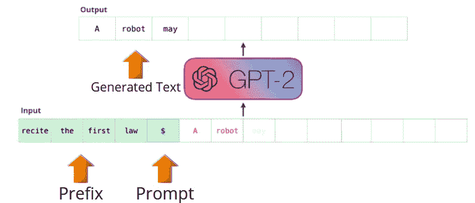
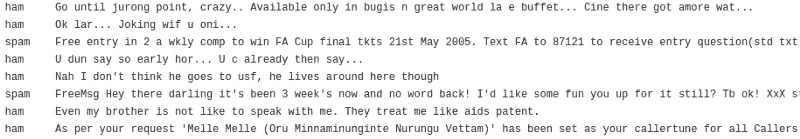
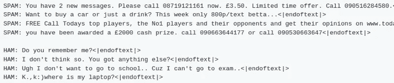

# 使用 GPT-2 语言模型的文本数据扩充

> 原文：<https://towardsdatascience.com/text-data-augmentation-using-gpt-2-language-model-e5384e15b550?source=collection_archive---------24----------------------->

## 使用预训练语言模型 GPT-2 在自然语言处理中生成合成数据

图片来自[来源](https://unsplash.com/photos/n6B49lTx7NM)

D 数据增强是深度学习从业者大量使用的一种技术，用于增加他们训练数据集中的多样性和规模，以设计健壮的机器学习系统。每个工程师都希望他们的模型不仅在训练集上表现良好，还能很好地推广到未知场景。因此，除了[过拟合](https://en.wikipedia.org/wiki/Overfitting)和[正则化](/regularization-an-important-concept-in-machine-learning-5891628907ea)之外，决定模型泛化的另一个重要因素是它在训练时间内看到的相关数据的数量和种类。到今天为止，有很多经过测试的[转换](https://machinelearningmastery.com/how-to-configure-image-data-augmentation-when-training-deep-learning-neural-networks/)可以在图像上进行增强，在低资源设置下效果惊人。但是对于文本数据就没那么容易了。很简单，因为自然语言封装了不同层次的句法和语义信息。

# 一些现有的方法和问题

在这一领域，过去的工作集中在使用 [WordNet](https://wordnet.princeton.edu/) 、 [Word2Vec](http://jalammar.github.io/illustrated-word2vec/) 等方法对语法中某些特殊类型的单词进行**同义词替换**。这种方法是一个很好的起点，但是在提供可变性方面并没有给我们的模型增加多少价值。此外，这些系统本质上非常脆弱。例如，WordNet 有一组固定的单词，通常会导致[超出词汇表](https://medium.com/@shabeelkandi/handling-out-of-vocabulary-words-in-natural-language-processing-based-on-context-4bbba16214d5)，然而，将预先训练的 Word2Vec 的最近邻居视为同义词在实践中并不总是能得到想要的结果。举个例子——和“神奇”这个词最近的邻居是“蜘蛛”。考虑到《神奇蜘蛛侠》是一部电影，这在某种意义上也是正确的。

这个领域中一篇有趣的论文是 [EDA:提高文本分类任务性能的简单数据扩充技术](/eda-easy-data-augmentation-techniques-for-boosting-performance-on-text-classification-tasks-3e61a56d1332)。在本文中，作者讨论了三种扩充文本数据的方法，这些方法已被证明能改善文本分类任务的结果。*请随时关注贴有标签的帖子，了解更多关于此事的详细信息。*

> 今天，在这个博客中，我们将看到如何使用 **GPT2 进行高质量的文本增强**。

在我们跳到代码和方法之前，我想花点时间用一两段话解释一下 GPT 新协议。GPT-2 值得拥有自己的独立博客，*你可以关注* [*图示的 GPT-2(可视化变压器语言模型)*](http://jalammar.github.io/illustrated-gpt2/)

# GPT-2 语言模型

[GPT-2](http://jalammar.github.io/illustrated-gpt2/) 本质上是一个复杂的[语言模型](https://en.wikipedia.org/wiki/Language_model)，它基于 **Transformer 架构**并在 40GBs 的网络文本上训练。这是一个由多个解码器单元相互叠加而成的堆栈，支持一些先进的学习概念，如[掩蔽自我注意](https://medium.com/@mekarahul/what-are-self-attention-models-69fb59f6b5f8)、多头、[剩余连接](/residual-blocks-building-blocks-of-resnet-fd90ca15d6ec)、[层标准化](https://mlexplained.com/2018/11/30/an-overview-of-normalization-methods-in-deep-learning/)等。GPT-2 语言模型试图优化的是在看到过去的单词后，本质上预测给定序列中的下一个单词。下图，即从[借用的图解 GPT-2(可视化变压器语言模型)](http://jalammar.github.io/illustrated-gpt2/)直观地给出了一个清晰的画面

GPT-2 文本生成|修改后的图像来自[来源](http://jalammar.github.io/illustrated-gpt2/)

在这里，绿色文本充当前缀，一旦看到提示($)，模型就开始以自回归的方式一次生成一个单词，直到到达标记的末尾。智能手机上的自动完成功能，Gmail 中的自动撰写功能，本质上是基于类似的概念。

训练如此庞大的模型将需要相当多的 GPU 日和大量数据。幸运的是，这个模型的版本是开源的，让我们不用从头开始训练这些模型。我们现在可以通过给它们适当大小的特定于领域的数据，在我们的任务中直接微调这些模型。现在让我们看看如何在实践中做到这一点。

*让我们继续前进，在我们的分类数据集上微调 GPT-2 模型，看看它能为给定类别生成真实的示例。*

# 资料组

出于实验目的，我们将使用[垃圾邮件数据集](https://github.com/prakhar21/TextAugmentation-GPT2/blob/master/data/SMSSpamCollection)。。我们的数据集中有大约 5500 个样本。下图显示了相同的片段-

垃圾邮件数据集数据片段|作者图片

# 方法

我们将使用 GPT-2 模型为**学习关于类 Ham 和 Spam 的单词分布、语义、句法结构**。一旦训练完成，我们将为这些类别中的每一个生成合成样本，您将看到这些样本足够好，可以添加回我们的数据集，用于训练具有更大数据的分类模型。

预训练的 GPT-2 模型成为这项任务的合适候选，因为我们在数据集中对于每个垃圾邮件/垃圾邮件类别都只有很少的样本。理想情况下，我们想要一个已经知道很多关于自然语言的句法、语法、语义结构的模型。作为实施的一部分，我们将在我们的垃圾邮件/业余爱好者数据集上微调 GPT2，并期望它学习这些电子邮件的单词用法和语言结构。

我们首先通过将标签和文本相互连接来创建输入样本，并将其传递给 GPT-2 模型用于**学习单词-单词和标签-文本依赖关系**。将标签添加到实际的示例中，将有助于我们稍后引导模型控制文本的生成，并使其特定于给定的标签/主题。

训练 GPT-2 就像训练任何其他语言模型一样简单，我们一次传递一个单词，并在另一端预测下一个单词，然后将生成的单词循环回输入，依此类推，在每一步，我们都计算交叉熵损失。*您可以在这里* *访问培训代码* [*。*](https://github.com/prakhar21/TextAugmentation-GPT2/blob/master/train.py)

一旦模型被训练和转储，我们就可以生成样本了。您可以在 [finetune_gpt_generate 找到使用训练好的模型生成样本的代码。](https://github.com/prakhar21/TextAugmentation-GPT2/blob/master/generate.py)我们采用 **Top-k，Top-p 采样策略**作为我们选择的[文本解码技术](/5-text-decoding-techniques-that-every-nlp-enthusiast-must-know-6908e72f8df9)。

# 结果

以下是我们训练过的模型生成的一些新颖样本。正如所承诺的那样，我们可以看到生成的样本看起来非常真实，具有足够的可变性，应该有望帮助我们的模型提高精确度，并更好地进行概括。

生成的样本|作者图片

*所有代码和预训练的垃圾邮件/业余邮件生成器模型可在—* 找到

 [## GitHub-prak har 21/text augmentation-gp T2:针对定制主题的微调预训练 gp T2…

### 针对特定主题文本生成的微调预训练 GPT2。这种系统可用于文本扩充。git…

github.com](https://github.com/prakhar21/TextAugmentation-GPT2) 

**如果你愿意，你也可以在******查看一些最近在 NLP 数据增强领域的研究。****

**我希望你喜欢读这篇文章。如果你愿意支持我成为一名作家，可以考虑注册[成为一名媒体成员](https://prakhar-mishra.medium.com/membership)。每月只需 5 美元，你就可以无限制地使用 Medium。**

# **参考**

1.  **所使用的数据集是公开的，可以在[https://www.kaggle.com/venky73/spam-mails-dataset](https://www.kaggle.com/venky73/spam-mails-dataset)访问**

**感谢您的宝贵时间！**