# 使用一键编码、Tf-Idf、计数向量、同现向量和 Word2Vec 的文本数据表示

> 原文：<https://towardsdatascience.com/text-data-representation-with-one-hot-encoding-tf-idf-count-vectors-co-occurrence-vectors-and-f1bccbd98bef?source=collection_archive---------14----------------------->

## 本文是对 ***的全面概述*** 对机器学习算法的文本数据的一些数值表示

图片由[T5【阿玛多】洛雷罗 来自](https://unsplash.com/@amadorloureiroblanco) [Unsplash](https://unsplash.com/photos/BVyNlchWqzs)

# a)导言

构建机器学习模型不仅限于数字，我们可能还希望能够处理文本。但是，那些模型只能用数字来喂养。为了弥合这一差距，许多研究都致力于为文本数据创建数字表示。在本文中，我们将探讨其中的一些: ***One-hot 编码、计数向量、Tf-Idf、共现向量和 Word2Vec*** 。我们还将讨论它们的优缺点。

此外，在文章中， ***上下文*** 和 ***相邻词*** 将用于表示同一事物。

***免责声明:*** *不会执行高级预处理技术，因为目标是真正理解每个算法背后的概念。但这可能是另一篇文章的主题。*

# b)独热编码

该算法用于生成一个向量，其长度等于数据集中类别的数量，一个类别是一个单独的单词。
举例来说，我们想要一个热编码表示，用于以下三个文档的每一个，这三个文档对应于关于一家餐馆的评论。

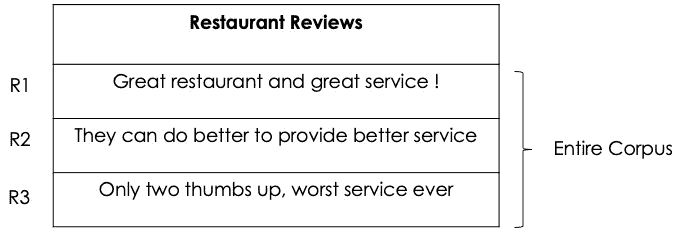

作者图片(关于一家餐馆的评论(R1:第一次评论))

每个文档的独热编码表示是按照以下步骤完成的:

*   **步骤 1** :创建**语料库中所有单词的集合**

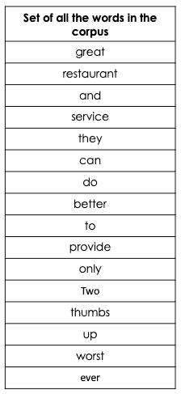

作者图片

*   **第二步** : **确定给定单词**在特定评论中的存在与否。出席用 1 表示，缺席用 0 表示。然后，每个评论将被表示为一个包含 0，1 个元素的**元组**。

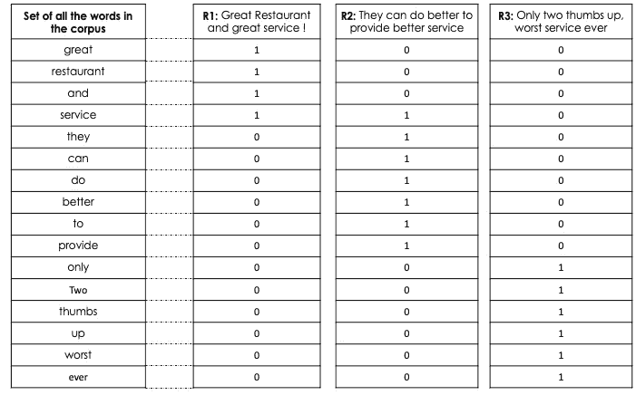

作者图片

在这两个步骤的最后，我们最终可以得到所有三个评论(R1 到 R3)的独一无二的编码表示。这种技术看起来很简单，但是有以下缺点:

*   **真实世界的词汇往往是巨大的，因此代表每个文档的向量的大小也将是巨大的**，无论给定文档中的单词数量是多少。
*   我们完全失去了单词在评论/文档中出现的顺序，这不幸地导致了上下文的丢失。
*   由于二进制表示，单词的**频率信息丢失**。例如 ***伟大*** *这几个字在第一篇评论中出现了两次*也*这几个字* ***更好*** *在第二篇评论*中出现了两次，但是没有办法表达出来，我们只知道它们的存在。

# c)计算矢量

这种算法非常类似于 on-hot 编码，但是**它的优点是识别单词在文档中出现的频率/计数**。我们可以按照以下步骤将计数向量应用于我们之前的语料库:

第一步:将每个文档转换成包含该文档的单词序列。

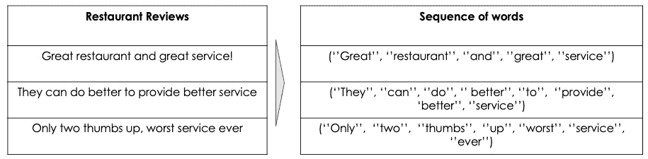

作者图片

*   **第二步**:从语料库中所有单词的集合中，**统计该单词在文档中出现的频率。**

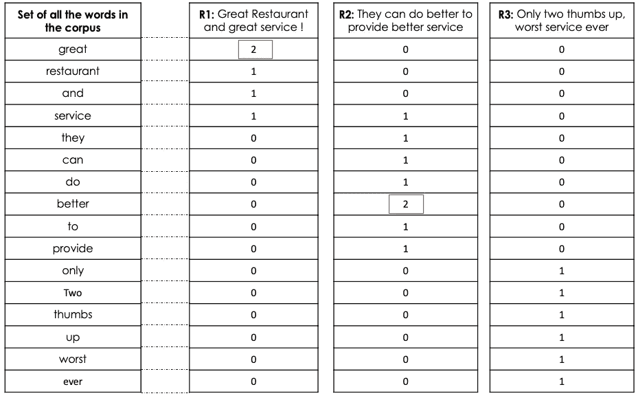

作者图片

从上表中，我们可以注意到:

*   **great 这个词在第一次复习的单词序列中出现了两次**，所以它的值用 2 表示。其他单词也一样，1 分表示餐厅，1 分表示服务，0 分表示更好，等等。
*   单词 better 也在第二次复习的单词序列中出现两次，那么它的值用 2 表示，以此类推。
*   同样的分析也适用于第三次审查。

正如您所注意到的，**就**而言，计数向量的缺点类似于一键编码:

*   代表每个文档的向量的大小。但是缓解这个问题的一个常用技术是只根据它们的频率选择顶部的 ***n*** 个单词。 ***n* 为每个单词的计数。**
*   没有捕获单词的上下文。
*   失去了语义和词与词之间的关系。

# D) Tf-Idf

该算法是对计数向量的改进，广泛应用于搜索技术中。Tf-Idf 代表 **T** erm **f** 频率-**I**n 反转 **d** 文档 **f** 频率。它倾向于捕捉:

*   一个单词/术语 ***Wi*** 在文档 ***dj 中出现的频率。*** 这个表达式在数学上可以表示为 ***Tf(Wi，dj)***
*   如何**频繁**同一个词/术语出现在整个语料库中 ***D*** 。这个表达式在数学上可以用 ***df(Wi，D)来表示。***
*   ***Idf*** 度量**如何不常出现**单词 ***作业指导书*** 出现在语料库 ***D.***

有了这些额外的信息，我们可以使用下面的公式使用 ***tf*** 和 ***idf*** 值的乘积来计算 ***Tf-Idf*** :

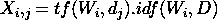

Tf-Idf 公式

每个文档 ***dj*** 将由该文档中每个单词的 ***Tf-Idf*** 得分来表示，如下所示:

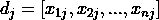

文档 j 的向量表示

***Tf*** 赋予在单个文档中出现频率较高的单词更多的重要性(权重)。另一方面， ***Idf*** 将尝试对在整个语料库中多次出现的单词进行加权，因为我们可以想到诸如“the”、“this”、“a”、“an”等单词。然后将它们放在一起( ***Tf-Idf*** )有助于捕捉文档中不常出现的罕见单词。

## D1)优势

*   捕获文档中单词的相关性和频率。

## D.2)退税

*   每个单词仍然以独立的方式被捕获，因此它出现的上下文没有被捕获。

# e)同现向量

该算法基于相似单词将一起出现并且也将具有相似上下文的原理。为了便于理解，我们将同时应用上下文窗口和构建共现矩阵。但是在深入这个过程之前，让我们理解一下上下文窗口和共现矩阵。

## **E.1)上下文窗口**

对于感兴趣的给定单词，我们基于窗口的 ***大小来识别它的相邻单词。*** 这些相邻的词可以认为是:

*   感兴趣单词左边的单词
*   感兴趣单词右边的单词
*   感兴趣的单词周围的单词

## E.2)共现矩阵

在说共现矩阵之前，我们先来看看什么是两个词的共现。两个词 ***W1*** 和 ***W2*** 的共现对应于这两个词在上下文窗口中同时出现的次数。
从那里，我们可以构建共现矩阵，它是一个 ***NxN*** 矩阵， ***N*** 是整个语料库中词汇的总数。所以每个文档的大小都是 NxN。

## E.3)共现矩阵/向量的逐步构建过程

出于教学目的，我们将应用 2 个 的 ***上下文窗口，其中 ***滑动大小为 1 个*** ，并且我们将只考虑下面 ***给出的一个文档。******

**document = "非洲有许多未开发的潜力"。** 在我们的情况下 ***N=7，*** 但是在现实生活中我们最终可以拥有一个庞大的词汇集。

*   用行和列中的词汇集创建大小为 NxN 的矩阵
*   用零初始化矩阵。
*   从左到右，识别感兴趣的单词及其相邻单词。
*   计算相邻单词与感兴趣的单词一起出现的次数。
*   递增对应于感兴趣的单词的单元格以及每一个相邻单词及其相应的出现次数。

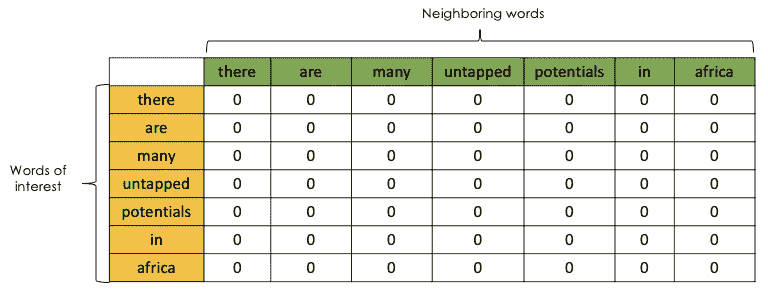

作者提供的图像(用零初始化后的矩阵状态(大小= 7 x 7))

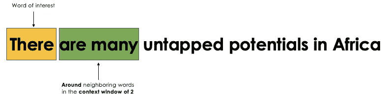

作者图片(图片编号 1:感兴趣的词是“那里”)

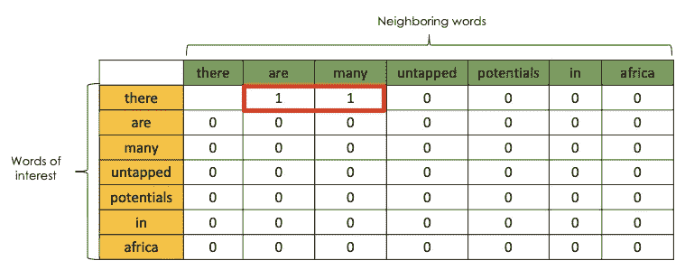

作者提供的图片(来自图片 n 1 的矩阵状态)

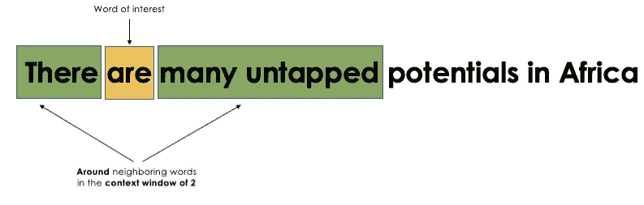

作者图片(图片编号 2:感兴趣的词是“are”)

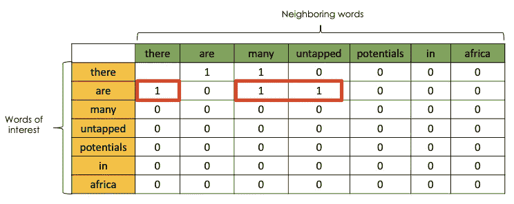

作者提供的图片(来自图片 n 2 的矩阵状态)

作者图片(图片编号 3:感兴趣的词是“许多”)

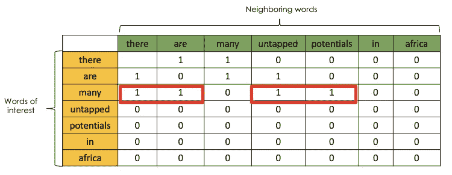

作者提供的图片(来自图片 3 的矩阵状态)

作者图片(图片编号 4:感兴趣的词是“未开发的”)

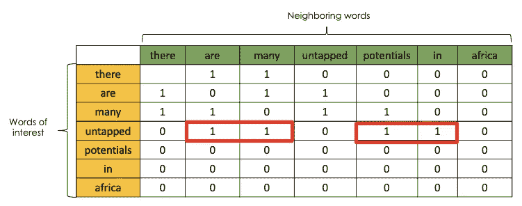

作者提供的图片(来自图片 n 4 的矩阵状态)

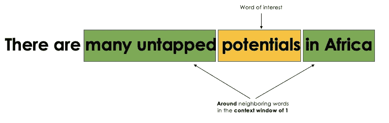

作者图片(图片编号 5:感兴趣的单词是“潜在的”)

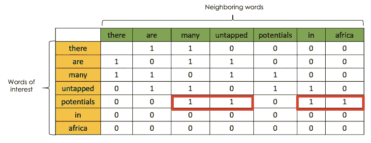

作者提供的图片(来自图片 n 5 的矩阵状态)

作者提供的图片(图片编号 6:感兴趣的单词是“in”)

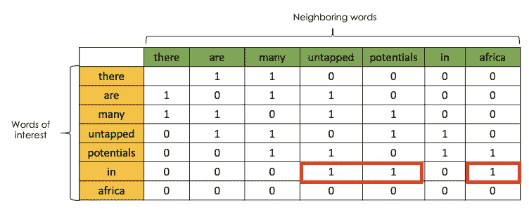

作者提供的图片(来自图片 n 6 的矩阵状态)

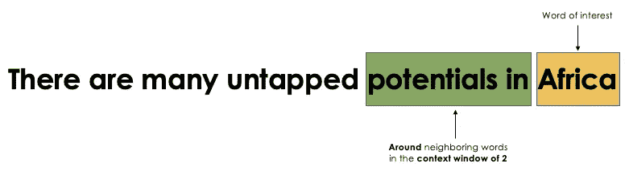

作者图片(图片编号 7:感兴趣的词是“非洲”)

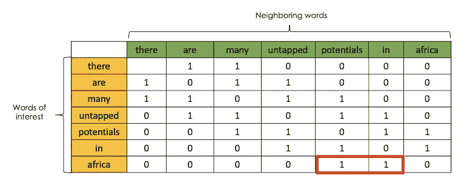

作者提供的图片(来自图片 n 7 的最终矩阵状态)

## 优势

*   捕获同一文档中单词之间的语义关系。
*   它提供了高效的计算，因为它可以很容易地被重用。
*   它可以使用 PCA(主成分分析)等技术为降维任务提供更准确的表示。

## 5)退税

*   我们得到一个巨大的矩阵，这当然需要大量的内存。

# F) Word2Vec

这种算法甚至比以前的算法更好地以数字形式表示文本，因为我们不仅可以对单词进行低维表示，还可以通过 ***捕捉它们的含义*** 和它出现的 ***上下文(*邻近单词***)。*

*关于 word2vec 的一个大假设是:一个单词的含义可以通过它的公司来推断，这个公司可能至少听过一次类似下面的话:告诉我你的朋友是谁，我就能知道你是谁。 Word2vec 自带了两种神经网络架构: **CBOW** 和 **Skip-gram** (本文不做深入探讨)。*

*   ****CBOW*** 将相邻单词作为输入，**预测感兴趣的单词**。*

*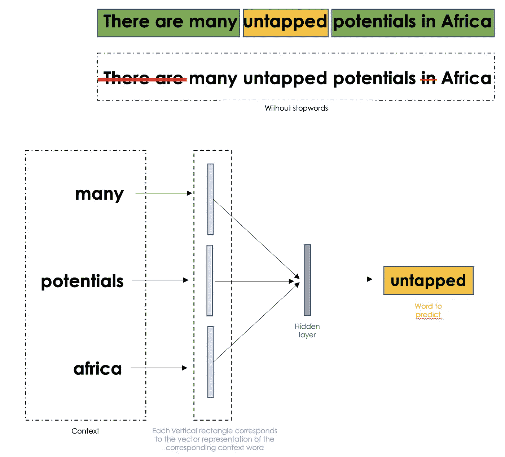*

*作者提供的图片(CBOW 架构应用于示例)*

*   ****Skip-gram*** 另一只手执行相反的任务。它将感兴趣的单词作为输入，然后**预测它的相邻单词。***

*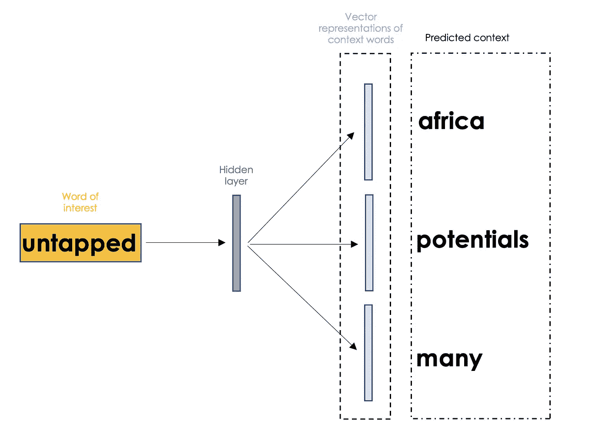*

*作者的图片(应用于示例的跳过程序架构)*

> ***是的，我明白了 Word2Vec 的大意，但是语义关系是如何从 vectors 中捕捉到的呢？***

*一旦 word2vec 模型已经在给定的大型数据语料库中被训练，那么就有可能获得输入单词的数字表示。下图说明了如何捕获含义和语义表示:*

*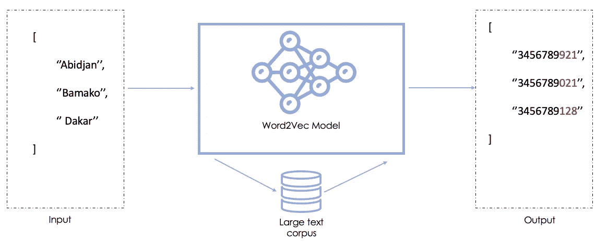*

*作者图片*

*   ***阿比让、巴马科**和达喀尔**分别是科特迪瓦**马里**和塞内加尔**的重要城市*****
*   *有了足够大的训练文本语料库，该模型将能够通过向阿比让、巴马科和达喀尔分配数值表示来计算出潜在的 ***城市*** 语义，这些数字表示在值上彼此非常相似，正如我们在**输出**中所看到的。*

## *1)优势*

*   *Word2vec 抓住了单词的意思。*
*   *它捕捉单词之间的关系(“阿比让”~“科特迪瓦”==“巴马科”~“马里”)，这意味着“阿比让”和“科特迪瓦”的矢量表示之间的减法非常接近“巴马科”和“马里”的矢量表示的减法结果*
*   *它从维数非常低的大量训练数据中捕获非常有趣的信息。*

# *g)文章结尾*

*我希望您喜欢这篇文章，并且它将帮助您做出正确的选择，为机器学习任务编码您的文本数据。如果您有任何问题或意见，我将很高兴欢迎进一步讨论。*

*如需进一步阅读，请随时查阅以下链接:*

*[https://iks Inc . online/2015/06/23/how-to-use-words-co-occurrence-statistics-to-map-words-to-vectors/](https://iksinc.online/2015/06/23/how-to-use-words-co-occurrence-statistics-to-map-words-to-vectors/)*

*https://arxiv.org/abs/1301.3781*

*再见🏃🏾*