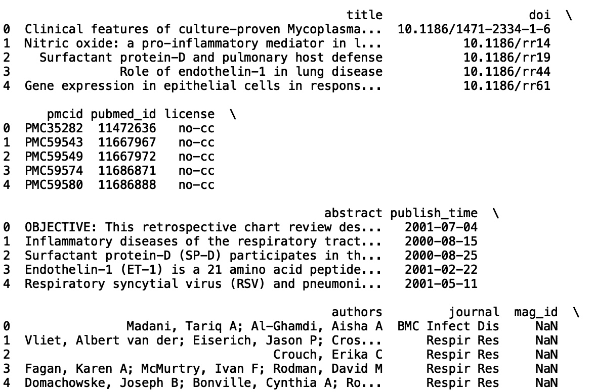

# Python 中与熊猫争论的文本数据

> 原文：<https://towardsdatascience.com/text-data-wrangling-with-pandas-in-python-a52ffccee24e?source=collection_archive---------20----------------------->

## 用熊猫从文本中提取信息


照片由[像素](https://www.pexels.com/photo/brown-rope-tangled-and-formed-into-heart-shape-on-brown-wooden-rail-113737/)上的 [Pixabay](https://www.pexels.com/@pixabay) 拍摄

原始文本数据通常以难以直接用于分析的形式出现，并且通常需要文本处理方法。文本处理是自动生成和操作文本的实践。它可以用于许多数据操作任务，包括文本的特征工程、数据争论、网页抓取、搜索引擎等等。在本教程中，我们将看看如何使用 Pandas 库来执行一些重要的数据处理任务。

数据争论是收集和转换数据以解决分析问题的过程。这通常也是整个数据科学流程中最重要、最耗时的一步。因此，掌握基本的 Pandas 工具和技能对于生成清晰、可解释的文本数据非常重要。

文本数据争论的应用包括移除、提取、替换和转换。例如，您可以从文本中删除不必要的重复字符、单词或短语，或者提取对文本意义至关重要的重要单词或短语。您还可以使用熊猫来替换单词或短语，以获得更多信息或有用的文本。最后，Pandas 可以将表示时间戳的字符转换成可用于分析的 datetime 对象。今天，我们将看看如何从文本中提取以及将字符串值转换成时间戳。

这些方法的一个有趣应用是在探索与特定领域或主题相关的研究出版物的上下文中。在这里，我们将使用 Pandas library 来分析和提取信息，例如来自各种期刊的冠状病毒研究论文的标题和摘要。

一旦有了这些数据，我们就可以利用这些数据执行几项分析任务，包括找到最常被问到的研究问题，并对论文的结果和结论进行情感分析。然后，这些类型的分析可以作为产生尚未解决的新研究问题的跳板。

出于我们的目的，我们将使用新冠肺炎开放研究数据集(CORD-19)，它可以在[这里](https://www.kaggle.com/allen-institute-for-ai/CORD-19-research-challenge)找到。

首先，让我们导入 Pandas 库，将文件 metadata.csv 读入 Pandas 数据帧，并显示前五行数据:

```
import pandas as pddf = pd.read_csv(“metadata.csv”)print(df.head())
```



我们将使用“标题”、“摘要”、“期刊”和“出版时间”列让我们过滤我们的数据框架，只包括这四列:

```
df = df[[‘title’, ‘abstract’, ‘journal’, ‘published_time’]].copy()print(df.head())
```


现在，让我们将数据整理为 50000 条记录，并写入一个名为 covid.csv 的新文件:

```
df_new = df.sample(50000)df_new.to_csv(“covid.csv”)
```

现在，让我们显示前五行数据:

```
print(df_new.head())
```


**使用 str 访问器方法从文本中检索信息**

我们将讨论的第一个操作是使用 Pandas 进行基于文本的信息提取。我们可以做的第一件事是分析哪些期刊最频繁地出现在 CORD-19 数据中。这可以让我们深入了解哪种期刊在 COVID 研究领域影响最大。

让我们将 collections 模块中的 counter 方法应用于 journal 列。这里，我们展示了 100 种最常出现的研究期刊:

```
print(Counter(df_new[‘journal’]).most_common(100))
```


我们看到最常见的值实际上是“nan”(不是一个数字)，我们可以从数据中删除它:

```
df_new[‘journal’].dropna(inplace=True)print(Counter(df_new[‘journal’]).most_common(100))
```


现在，我们可以看到出现频率最高的期刊是 *PLoS One、bioRxiv、BMJ、Sci Rep、Lancet* 和 *Nature* 。

假设我们只想查看特定期刊的摘要和标题。我们可以使用 Pandas 轻松过滤期刊名称上的数据。让我们过滤我们的数据框，只包含来自出版物 *PLoS One* 的记录:

```
df_plos = df_new[df_new[‘journal’] == ‘PLoS One’]print(df_plos.head())
```


另一个有趣的观察是，在我们的原始数据框架中，许多期刊包含“感染”或“传染”这两个词。假设我们对专门从事传染病研究的期刊感兴趣。这种过滤将排除在数据中发现的我们可能不感兴趣的其他研究领域，如肠道微生物组、化疗、麻醉等。我们可以提取与包含传染病子字符串“Infect Dis”的日志对应的所有记录。我们可以使用 Pandas 字符串访问器中的 contains 方法来实现这一点:

```
df_infect = df_new[df_new[‘journal’].str.contains(‘Infect Dis’, regex=False)]print(df_infect.head())
```


我们看到我们的数据帧 df_infect 的日志名称带有子字符串“Infect Dis”在 df_infect 中，我们看到了包含单词“微生物”的两个日志这可能会激起我们对现有微生物研究的兴趣。我们可以对原始数据框进行过滤，仅包含名称中带有“微生物”的期刊:

```
df_microbial = df_new[df_new[‘journal’].str.contains(‘Microbial’, regex=False)].copy()
```


我们可以从几个不同的方向进行分析。也许我们对专注于微生物组的研究感兴趣。如果是这样，我们可以在“抽象”列中进一步使用 contains 方法:

```
df_abstract_microbiome = df_new[df_new[‘abstract’].str.contains(‘microbiome’, regex=False)].copy()print(“Number of Microbiome Studies: “, len(df_abstract_microbiome))
```


这一行动产生了一个 90 行的数据框，其中包含侧重于肠道微生物组研究的出版物。对标题和摘要的进一步文本分析使我们能够解决一些更有趣的问题，如:

*   研究人员对新冠肺炎和肠道微生物组研究提出了什么样的问题？
*   是否有频繁出现的词或短语可以洞察研究方向？
*   例如，在过去几年中，许多关于传染病的研究已经转向了解肠道健康和饮食如何影响免疫系统功能。一个有趣的分析将是观察与肠道微生物组相关的关键词的频率如何随着时间的推移而变化。
*   频繁出现的单词或短语是否有时间依赖性趋势？
*   确定研究问题中是否存在与时间相关的趋势有助于发现空间中哪些问题尚未得到回答。例如，如果您发现在过去 5 年中，肠道微生物组研究显著增加，那么您可以过滤您的数据，只包括与肠道微生物组研究相关的论文。然后，您可以对摘要执行进一步的分析，以查看在空间中提出了什么类型的问题，以及发现了什么类型的关系。这有助于新的研究问题的形成。

在这里，我们将重点讨论最后一个问题。为此，我们需要将字符串值时间戳转换成可用于分析的值。

**将字符串值转换成时间戳**

将字符串时间值转换成用于定量分析的时间戳是文本数据处理的重要部分。如果你想分析文本数据中任何依赖于时间的趋势，这是一个重要的步骤。这是因为为了从时间值(如月、日或年)中提取任何有用的信息，我们需要将它们从字符串转换为日期时间值。我们现在需要这样做来回答上面关于频繁出现的单词和短语的问题。

首先，我们需要将“publish_time”列转换成 Pandas datetime 对象。让我们继续使用 df_abstract_microbiome 数据框架:

```
df_abstract_microbiome[‘publish_time’] = pd.to_datetime(df_abstract_microbiome[‘publish_time’], format=’%Y/%m/%d’)
```

我们可以创建一个提取出版年份的新列:

```
df_abstract_microbiome[‘year’] = df_abstract_microbiome[‘publish_time’].dt.yearprint(df_abstract_microbiome.head())
```

接下来，让我们打印一组年份:

```
print(set(df_abstract_microbiome[‘year’]))
```


我们有 2011-2021 年的数据。我们错过了 2012 年和 2018 年。这种缺失可能是由于我们的数据过滤以及我们之前执行的下采样造成的。这不会对我们的结果产生太大影响，也仍然能够检测任何时间相关的趋势。此外，通过将样本量从 50000 增加到一个更大的数字，可以很容易地解决这个问题。

现在，让我们使用 Python 库 TextBlob 从论文摘要中生成情感分数。[情感分析](https://builtin.com/data-science/covid-vaccine-sentiment)是一种自然语言处理方法，用于理解文本中表达的情感。

我们可以做的一个粗略假设是，带有负面情绪的摘要对应于发现负面关系的大型研究，反之亦然。

例如，下面的摘要有一种积极的情绪:


像“丰富”和“有益”这样的词表示积极的情绪。现在让我们为我们的抽象专栏生成情感分数:

```
df_abstract_microbiome[‘abstract_sentiment’] = df_abstract_microbiome[‘abstract’].apply(lambda abstract: TextBlob(abstract).sentiment.polarity)print(df_abstract_microbiome.head())
```


接下来我们需要做的是计算每年的平均情绪。我们可以使用 Pandas groupby 方法来实现这一点。然后我们可以[使用 Matplotlib](https://builtin.com/data-science/data-visualization-tutorial) 中的线形图来可视化时间序列数据。

```
df_group = df_abstract_microbiome.groupby([‘year’])[‘abstract_sentiment’].mean()import matplotlib.pyplot as pltimport seaborn as snssns.set()plt.xlabel(‘Year’)plt.ylabel(‘Sentiment’)plt.title(‘Research Sentiment in Gut Microbiome Studies’)plt.plot(df_group.index, df_group.values)
```


我们看到，从 2011 年到 2021 年，情绪有小幅上升的趋势。不过，这只包含 90 条记录，这并不是很多数据。让我们考虑对《公共科学图书馆·综合》杂志的出版物进行情感分析，看看我们是否能获得更多信息:

```
df_plos[‘publish_time’] = pd.to_datetime(df_plos[‘publish_time’], format=’%Y/%m/%d’)df_plos[‘year’] = df_plos[‘publish_time’].dt.yeardf_plos[‘abstract_sentiment’] = df_plos[‘abstract’].apply(lambda abstract: TextBlob(abstract).sentiment.polarity)df_plos_group = df_plos.groupby([‘year’])[‘abstract_sentiment’].mean()import matplotlib.pyplot as pltimport seaborn as snssns.set()plt.xlabel(‘Year’)plt.ylabel(‘Sentiment’)plt.title(‘Research Sentiment in PLoS One Publications’)plt.plot(df_plos_group.index, df_plos_group.values)
```


我们看到，对于《公共科学图书馆·综合》杂志的记录，我们有 2006 年到 2021 年的数据，这给了我们更多的工作。在这一批中，我们可以看到情绪有小幅上升的趋势，但在过去 15 年中相当稳定。

最后，让我们考虑一下出版物 *Nature* ，它在我们的样本中拥有最长的数据历史:

```
df_nature = df_new[df_new[‘journal’] == ‘Nature’].copy()df_nature[‘publish_time’] = pd.to_datetime(df_nature[‘publish_time’], format=’%Y/%m/%d’)df_nature[‘year’] = df_nature[‘publish_time’].dt.yeardf_nature[‘abstract_sentiment’] = df_nature[‘abstract’].apply(lambda abstract: TextBlob(abstract).sentiment.polarity)df_nature = df_nature.groupby([‘year’])[‘abstract_sentiment’].mean()import matplotlib.pyplot as pltimport seaborn as snssns.set()plt.xlabel(‘Year’)plt.ylabel(‘Sentiment’)plt.title(‘Research Sentiment in Nature Publications’)plt.plot(df_nature.index, df_nature.values)plt.show()
```


这是三个重叠的图:


与《公共科学图书馆》杂志的*相比，《自然》杂志的*似乎总体上更倾向于正面评价。如果我们的假设，即情绪是一项研究中发现的关系的指示是正确的，这将意味着 *PLoS One* 可能有相对更多的研究报告了积极的关系。例如，正相关关系可能是:“药物 X 增加 CD4 T 细胞”。

如果您有兴趣访问这里使用的代码，可以在 [GitHub](https://github.com/spierre91/builtiin/blob/main/research_sentiment.py) 上找到。

# **结论**

这一分析仅仅触及了你能从文本中获得的洞察力类型的表面。你可以很容易地使用这些技巧来进一步分析。

具体来说，Pandas contains 方法允许您快速、轻松地在数据中搜索文本模式。如果你是一名领域专家，你可以搜索与你想问的问题相关的特定术语。

例如，与由 COVID 引起的细胞因子风暴相关的通常研究的蛋白质靶标是 Janus 激酶(JAK)家族蛋白质。可以使用 contains 方法搜索所有涉及 JAK 家族蛋白质的出版物。此外，这种类型的数据探索可能会让你发现你以前可能没有考虑过的新问题。

对研究摘要的情感分析有可能作为在大量出版物中快速鉴定研究结果的代理。例如，如果我们的负面情绪等于结果中的负面关系的假设是合理的，你可以用它来帮助你的研究。负相关的例子是“药物 X 抑制 JAK”和“药物 Y 抑制 sars-Cov-2”如果有合适的领域专业知识，Pandas 和 TextBlob 可以用来构建高质量的研究搜索引擎，以加快研究过程。

Pandas 用于基于文本的数据辩论，TextBlob 用于情感分析，这两者的结合确实非常强大。研究人员经常面临手动执行文献搜索的任务，这可能非常耗时。这些工具有助于加速问题的形成和研究目的的信息检索过程。

如果你有兴趣学习 python 编程的基础知识、Pandas 的数据操作以及 python 中的机器学习，请查看[*Python for Data Science and Machine Learning:Python 编程、Pandas 和 sci kit-初学者学习教程*](https://www.amazon.com/dp/B08N38XW2Q/ref=sr_1_1?dchild=1&keywords=sadrach+python&qid=1604966500&s=books&sr=1-1) *。我希望你觉得这篇文章有用/有趣。*

***本帖原载于*** [***内置博客***](https://builtin.com/machine-learning) ***。原片可以在这里找到***[](https://builtin.com/data-science/data-wrangling-pandas)****。****