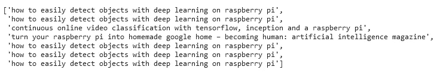

# 使用 Python 进行文本探索

> 原文：<https://towardsdatascience.com/text-exploration-with-python-cb8ea710e07c?source=collection_archive---------13----------------------->

## 文本探索循序渐进指南

## 用 n-grams 单词云探索隐藏在文本中的有趣见解


詹妮弗·格里芬在 [Unsplash](https://unsplash.com/s/photos/interesting?utm_source=unsplash&utm_medium=referral&utm_content=creditCopyText) 上的照片

在文本分析中，文本探索一直是我最喜欢的过程。当我发现有趣的东西时，我总是很兴奋。我在学习期间做过两个文本分析项目，都是用主题建模来研究长文本中讨论的主题。

在我做分析之前，我从来没有读过这篇文章，我也不应该这样做，因为这篇文章非常长，阅读它们来理解主题是不合理的。因此，我进行了文本探索，这给了我对文本内容的粗略想法，并让我知道我应该从主题建模模型中期待什么。

下面是我如何使用 Word Cloud 来探索我的一个学校项目中的文本的例子，你可以跳到下一部分的脚本和解释。

如果你是一个视频人，这里的视频适合你。

# 我的学校项目中的文本探索

通过使用单词云来探索文本是了解**在文本**中被频繁讨论的内容的一种完美而有趣的方式。例如，Kaggle 的约会应用数据集包含用户对以下 9 个问题的回答[2]:

1.  关于我/自我总结
2.  当前的目标/愿望
3.  我的黄金法则/我的特点
4.  我可能会在天赋上打败你
5.  我热衷的最后一场演出/爱好
6.  完美的一天/时刻
7.  一.价值/需求
8.  我愿意承认的最隐私的事情/秘密
9.  我在寻找/约会什么

问题以不同的顺序显示给每个用户，所以我们不能只提取某些问题的答案。

以下是从他们的回答中生成的词云。


从文本生成的词云。图片作者。

上面的字云是清理后的文本*生成的字云(参考本文中处理和清理文本的步骤，*[*Python 中的文本处理*](/text-processing-in-python-29e86ea4114c) *)。*从云这个词中映入我眼帘的是“阳光一尘不染的心灵”和“永恒的阳光一尘不染”。这两个三元组似乎是一个短语的一部分，我以前从未见过这些术语，所以我想谷歌一下，看看它们是否有什么意思。


纯洁心灵的永恒阳光。

原来是一部名为《美丽心灵的永恒阳光》的剧。这大概就是问题 5“我狂吃的最后一个节目/爱好”的答案。另一部被频繁提及的剧大概是《生活大爆炸》，在单词 Cloud 中显示为“生活大爆炸”。

> 从这里我们能看到什么？

> 《美丽心灵的永恒阳光》和《生活大爆炸》是当时最受欢迎的两部电视剧。

这种洞察力有意义吗？在进行进一步分析之前，我们现在还不能断定，但我们可以从这一陈述中作出假设。例如，当用户分享这些信息时，他们倾向于接受与他们观看同一系列的比赛。

我希望看到用户对他们的比赛有更多的期待。因此，我提取了包含单词“You”的每一行句子(您可以在本文中看到我是如何提取句子的，[使用正则表达式提取文本(Python)](/text-extraction-using-regular-expression-python-186369add656) )。


从提取的文本生成的词云。作者创建的图像。

现在我们可以看到什么与“你”有关。或许我们可以忽略 YouTube.com？无论如何，从上面的单词云，我们可以做出一个**假设**，用户期待着结识有很强幽默感的新朋友，并希望建立长期关系。同样，来自词云的信息可能不完整，因为它只显示了频繁出现的短语，我们可以通过主题建模或其他自然语言技术来进一步证明这一点。

> 有意思？

> 这是我过去项目的全部内容。现在让我们开始使用 Python 进行文本探索。

# 数据集简介

我最近在 Kaggle 上发现了一个有趣的数据集，觉得探索一下会很有趣。

我找到的文本数据是来自 Kaggle 的 [Medium Articles](https://www.kaggle.com/hsankesara/medium-articles) 数据集，其中包含 337 篇与机器学习、人工智能和数据科学相关的文章的作者、掌声、阅读时间、链接、标题和文本。

在下面的文本探索中，我将只使用文章的标题，来研究作者中有哪些流行的话题。

# 使用 Python 进行文本探索

## **1。导入库**

```
import re
import pandas as pd# text processing
import nltk
from nltk.tokenize import WordPunctTokenizer
nltk.download('stopwords')
from nltk.corpus import stopwords
## needed for nltk.pos_tag function 
# nltk.download('averaged_perceptron_tagger')
nltk.download('wordnet')
from nltk.stem import WordNetLemmatizer# visualization
import numpy as np
import matplotlib.pyplot as plt
%matplotlib inline
import seaborn as sns
from wordcloud import WordCloud
```

## **2。导入数据**

```
df = pd.read_csv("articles.csv")
print(df.shape)
print(df.columns)
df.head()
```


数据框。图片作者。

## **3。文本处理**

这里的过程类似于我上一篇文章[Python 中的文本处理](/text-processing-in-python-29e86ea4114c)中的过程。因此，我将在这里粘贴脚本，但跳过重复部分的解释，以避免冗余。

**a .标记化**

将标题拆分成一个令牌列表。

```
# change DataFrame columns into a list
title = df['title'].values# tokenize
title_text = ""
title_all = []
for _ in title:
    title_text += (_ + " ")
    title_all.append(_)

word_punct_token = WordPunctTokenizer().tokenize(title_text)
```

标题中有 4099 个标记。

**b .正常化**

移除不需要的令牌。

```
clean_token=[]
for token in word_punct_token:
    new_token = re.sub(r'[^a-zA-Z]+', '', token) # remove any value that are not alphabetical
    if new_token != "" and len(new_token) >= 2: # remove empty value and single character value
        vowels=len([v for v in new_token if v in "aeiou"])
        if vowels != 0: # remove line that only contains consonants
            new_token = new_token.lower() # change to lower case
            clean_token.append(new_token)# Get the list of stop words
stop_words = stopwords.words('english')
stop_words.extend(["could","though","would","also","us"])# Remove the stopwords from the list of tokens
tokens = [x for x in clean_token if x not in stop_words]
```

在我们移除非字母值、单字符标记、只包含辅音和没有太多洞察力的停用词的标记后，还剩 2214 个标记。我们移除了将近一半的代币。

本例中使用的数据集很小，因此删除这些标记不会显著提高模型的速度，但当我们分析一个巨大的数据集时，这将是至关重要的。

**c .位置标签和术语化**

标出单词的词性，并相应地将单词还原成其基本形式。

```
# POS Tag every token and save into dataframe
data_tagset = nltk.pos_tag(tokens)
df_tagset = pd.DataFrame(data_tagset, columns=['Word', 'Tag'])# to focus on nouns, adjective and verb
tagset_allowed = ['NN','NNS','NNP','NNPS','JJ','JJR','JJS','VB','VBD','VBG','VBN','VBP','VBZ']
new_tagset = df_tagset.loc[df_tagset['Tag'].isin(tagset_allowed)]
text = [str(x) for x in new_tagset['Word']]
tag =[x for x in new_tagset['Tag'] if x != '']
```

词类标签有 30 多种，但有意义的标签大多属于名词、形容词和动词的范畴。因此，我们可以从模型中过滤掉其他标签。

```
# Create lemmatizer object 
lemmatizer = WordNetLemmatizer()# Lemmatize each word and display the output
lemmatize_text = []
for word in text:
    output = [word, lemmatizer.lemmatize(word, pos='n'),lemmatizer.lemmatize(word, pos='a'),lemmatizer.lemmatize(word, pos='v')]
    lemmatize_text.append(output)# create DataFrame using original words and their lemma words
df = pd.DataFrame(lemmatize_text, columns =['Word', 'Lemmatized Noun', 'Lemmatized Adjective', 'Lemmatized Verb'])df['Tag'] = tag
```


词汇化后的数据框架。图片作者。

上面的脚本创建了三个列，存储了词汇化的名词、词汇化的形容词和词汇化的动词。当单词的标签是名词时，单词的基本形式将反映在词汇化的名词列中，形容词基本形式反映在词汇化的形容词列中，动词基本形式反映在词汇化的动词列中。

在这个阶段，每一类词类都被进一步划分为子类。根据[1]，名词进一步分为

1.  单数或复数名词(NN)，
2.  单数专有名词(NNP)，
3.  复数专有名词(NNPS)，以及
4.  复数名词(NNS)。

形容词和动词也被进一步分成小类。当我们稍后想要根据组选择令牌时，这可能会增加一些工作量。因此，子类别将被其主类别所取代。

```
# replace with single character for simplifying
df = df.replace(['NN','NNS','NNP','NNPS'],'n')
df = df.replace(['JJ','JJR','JJS'],'a')
df = df.replace(['VBG','VBP','VB','VBD','VBN','VBZ'],'v')
```

然后，将使用下面的脚本创建一个新列“Lemmatized Word ”,其中包含单词的基本形式。

```
'''
define a function where take the lemmatized word when tagset is a noun, and take lemmatized adjectives when tagset is adjective
'''
df_lemmatized = df.copy()
df_lemmatized['Tempt Lemmatized Word']=df_lemmatized['Lemmatized Noun'] + ' | ' + df_lemmatized['Lemmatized Adjective']+ ' | ' + df_lemmatized['Lemmatized Verb']lemma_word = df_lemmatized['Tempt Lemmatized Word']
tag = df_lemmatized['Tag']
i = 0
new_word = []
while i<len(tag):
    words = lemma_word[i].split('|')
    if tag[i] == 'n':        
        word = words[0]
    elif tag[i] == 'a':
        word = words[1]
    elif tag[i] == 'v':
        word = words[2]
    new_word.append(word)
    i += 1

df_lemmatized['Lemmatized Word']=new_word
df_lemmatized.head()
```


在数据帧中创建的词汇。图片作者。

文本处理的最后一步是将词条化的单词列转换成列表，供下一步处理。

```
lemma_word = [str(x) for x in df_lemmatized['Lemmatized Word']]
```

现在，我们准备创建单词云来探索文本！

## 4.文本探索

通常情况下，我会按照递增的顺序用 n-grams 创建单词云。因此，我们将从一元模型开始，然后是二元模型和三元模型。

## Unigram

名词、形容词和动词都是有意义的，因此将为每个标签类别创建一个词云。

## a.名词

```
# select only noun for word cloud
tagset = df_lemmatized
tagset_allowed = ['n']
new_tagset = tagset.loc[tagset['Tag'].isin(tagset_allowed)]
text = ' '.join(str(x) for x in new_tagset['Lemmatized Noun'])
wordcloud = WordCloud(width = 1600, height = 800, max_words = 200, background_color = 'white').generate(text)
plt.imshow(wordcloud, interpolation = 'bilinear')
plt.axis("off")
#plt.savefig('Vis/Noun_WordCloud.png') # if you want to save the WordCloud
plt.show()
```


名词的词云。图片作者。

基于名词的词云，题目中使用频率较高的名词有*媒介、机器、网络、学习、智能、*和*数据科学*。

## b.形容词

```
# select only adjectives for word cloud
tagset = df_lemmatized
tagset_allowed = ['a']
new_tagset = tagset.loc[tagset['Tag'].isin(tagset_allowed)]
text = ' '.join(str(x) for x in new_tagset['Lemmatized Adjective'])
wordcloud = WordCloud(width = 1600, height = 800, max_words = 200, background_color = 'white').generate(text)
plt.imshow(wordcloud, interpolation = 'bilinear')
plt.axis("off")
#plt.savefig('Vis/Adjectives.png')
plt.show()
```


形容词的单词云。图片作者。

题目中常用的形容词有*神经、深沉、人工、大、新*和*好玩*。

## c.动词

```
# select only verbs for word cloud
tagset = df_lemmatized
tagset_allowed = ['v']
new_tagset = tagset.loc[tagset['Tag'].isin(tagset_allowed)]
text = ' '.join(str(x) for x in new_tagset['Lemmatized Verb'])
wordcloud = WordCloud(width = 1600, height = 800, max_words = 200, background_color = 'white').generate(text)
plt.imshow(wordcloud, interpolation = 'bilinear')
plt.axis("off")
#plt.savefig('Vis/Adjectives_BeforeStemming.png')
plt.show()
```


动词的单词云。图片作者。

题目中经常出现的动词有*学习(learn)、使用、深入、理解、发生*和*面试*。在这个阶段，结合名词、形容词、动词的词云，大致可以看到经常讨论的话题。主题是神经网络、数据科学、机器学习、深度学习和人工智能。

然后，基于动词的词云，我们可以确定文章的目标。举个例子，

1.  使用、学习、解释、构建——包含这些关键词的文章是使用软件包、工具或算法的教程
2.  面试——带有这个关键词的文章是对面试的建议或指导

## 二元模型

对于二元和三元词云，我们将需要使用**计数向量器**来计算频率。

```
#Using count vectoriser to view the frequency of bigrams
tagset_allowed = ['a','n','v']
new_tagset = df_lemmatized.loc[df_lemmatized['Tag'].isin(tagset_allowed)]
text = [' '.join(str(x) for x in new_tagset['Lemmatized Word'])]vectorizer = CountVectorizer(ngram_range=(2, 2))
bag_of_words = vectorizer.fit_transform(text)
vectorizer.vocabulary_
sum_words = bag_of_words.sum(axis=0) 
words_freq = [(word, sum_words[0, idx]) for word, idx in vectorizer.vocabulary_.items()]
words_freq =sorted(words_freq, key = lambda x: x[1], reverse=True)
print (words_freq[:100])#Generating wordcloud and saving as jpg image
words_dict = dict(words_freq)
WC_height = 800
WC_width = 1600
WC_max_words = 200
wordCloud = WordCloud(max_words=WC_max_words, height=WC_height, width=WC_width,background_color = 'white')
wordCloud.generate_from_frequencies(words_dict)
plt.title('Most frequently occurring bigrams')
plt.imshow(wordCloud, interpolation='bilinear')
plt.axis("off")
plt.show()
wordCloud.to_file('wordcloud_bigram_title.jpg')
```


Bigram 词云。图片作者。

从 Bigram 词云，我们可以看到比 unigram 更有意义的短语。比如强化学习，learn TensorFlow，raspberry pi，初学者指南，图像分割和硅谷。

让我们看看用三元词云能找到什么。

## 三元模型

与二元模型相同，我们必须先用计数矢量器计算频率。

```
#Using count vectoriser to view the frequency of trigrams
vectorizer = CountVectorizer(ngram_range=(3, 3))
bag_of_words = vectorizer.fit_transform(text)
vectorizer.vocabulary_
sum_words = bag_of_words.sum(axis=0) 
words_freq = [(word, sum_words[0, idx]) for word, idx in vectorizer.vocabulary_.items()]
words_freq =sorted(words_freq, key = lambda x: x[1], reverse=True)
print (words_freq[:100])#Generating wordcloud and saving as jpg image
words_dict = dict(words_freq)
WC_height = 800
WC_width = 1600
WC_max_words = 200
wordCloud = WordCloud(max_words=WC_max_words, height=WC_height, width=WC_width,background_color = 'white')
wordCloud.generate_from_frequencies(words_dict)
plt.title('Most frequently occurring trigrams')
plt.imshow(wordCloud, interpolation='bilinear')
plt.axis("off")
plt.show()
wordCloud.to_file('wordcloud_trigram_title.jpg')
```


三元词云。图片作者。

频繁阶段几乎类似于二元模型，除了“检测对象深度”、“识别深度学习”和“深度学习覆盆子”。前两个三元模型应该分别用于深度学习的对象检测和深度学习的图像识别，而第三个三元模型，我不确定。

> 让我们找出它。

```
# using the pre-process data
title = df['title'].values
keyline = []
for line in title:
    line = line.lower()
    result = re.search(r"(^|[^a-z])" + "raspberry pi" + r"([^a-z]|$)", line)
    if result != None:
        keyline.append(line)
```



片名包含“树莓派”。作者图片

Raspberry Pi 用于检测具有深度学习的对象。

重复的文章不会被删除，因为它们有不同的链接。

# 从媒体文章标题的词云透视

从为媒体文章标题创建的词云中，我们可以看到大多数标题是由更多的**通用**或**流行**术语组成的，如机器学习、人工智能、深度学习和神经网络。这些都是当时的热门话题。但是，数据集不包含文章发布的时间。因此，我们无法确定词语的选择如何影响文章的浏览率。

# 结论

一般来说，如果与二元模型和三元模型相比，一元模型的平均出现频率会更高。因此，为了避免有意义的二元模型和三元模型被埋没，我们将分别为一元模型、二元模型和三元模型创建词云。

此外，二元模型和三元模型也有助于我们更好地理解文本，因为一元模型可能会令人困惑，当附加到一元模型的单词发生变化时，其含义可能会发生变化。比如低质好质。

这也引出了另一个问题，为什么在某些情况下文本探索是必不可少的。想象你正在浏览一家家具店的评论，如果你正在做**话题建模**，你可能会得到人们正在讨论的**一般话题**，像椅子、桌子、橱柜等等。通过**词云**进行文本探索，你可能知道人们在评论中经常提到的**短语**。例如，表质量低，交货慢等。

最后，虽然在我的例子中没有显示出来，但是我们可能会遇到这样的情况，当我们在文本探索过程中探索一些经常显示但没有意义的标记时，我们需要回到文本处理。移除它们可以揭示隐藏在它们下面的有洞察力的标记，并且进一步减少训练模型的时间。

> 字云只是文字探索的方法之一，可能不是最好的，但却是最好玩的方法！

## 一些旁注

如果你对 NLTK 和 SpaCy 在文本处理上的区别感兴趣的话，[Python 中的文本处理](/text-processing-in-python-29e86ea4114c)。

如果您对从列表中提取包含关键字的句子感兴趣，[使用正则表达式(Python)](/text-extraction-using-regular-expression-python-186369add656) 进行文本提取。

# 保持联系

订阅 [YouTube](https://www.youtube.com/channel/UCiMtx0qbILP41Ot-pkk6eJw)

# 参考

[1] D. Juraksky 和 J. H. Martin，《词性和命名实体的[序列标注》，载于](https://web.stanford.edu/~jurafsky/slp3/8.pdf) [*语音和语言处理*](https://web.stanford.edu/~jurafsky/slp3/) ，2020 年，第 4 页。

[2] A. Kim 和 A. Escobedo-Land，“OkCupid Data for introductive Statistics and Data Science Courses”，*《统计教育杂志》，*第 23 卷，2015 年 07 期。

祝贺并感谢你阅读到最后。希望你喜欢这篇文章。 ☺️


伊恩·施耐德在 [Unsplash](https://unsplash.com/s/photos/passion?utm_source=unsplash&utm_medium=referral&utm_content=creditCopyText) 上拍摄的照片