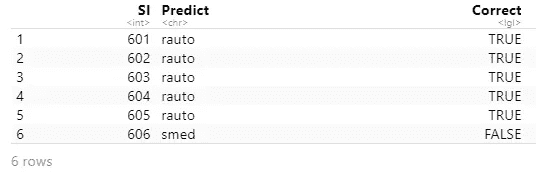
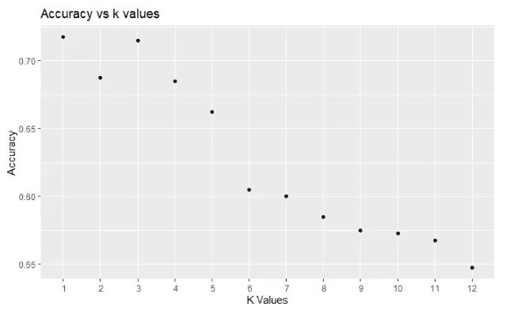
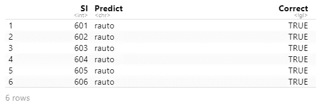

# R 语言中文本文件的处理、清理和分类

> 原文：<https://towardsdatascience.com/text-files-processing-cleaning-and-classification-of-documents-in-r-394c6b4f1504?source=collection_archive---------19----------------------->


杰森·罗斯韦尔在 [Unsplash](https://unsplash.com?utm_source=medium&utm_medium=referral) 上的照片

## 使用了一些很棒的包和 K 近邻分类器

随着文本文档数量的不断增加，文本文档分类已经成为数据科学中的一项重要任务。与此同时，机器学习和数据挖掘技术也在每天进步。Python 和 R 编程语言都具有惊人的文本数据清理和分类功能。

本文将关注使用 R 库的文本文档处理和分类。

## 问题陈述

这里使用的数据是打包在名为 20Newsgroups 的文件夹中的文本文件。该文件夹有两个子文件夹。其中一个包含训练数据，另一个包含测试数据。每个子文件夹包含 20 个文件夹。这 20 个文件夹中的每一个都包含数百个不同主题的新闻文件。这个项目的目的是选择两个主题，并开发一个分类器，可以对这两个主题的文件进行分类。

请随意从该链接下载数据集，并遵循:

[https://github . com/rashida 048/Text-Files-Classification-in-R/blob/main/20 news groups . zip](https://github.com/rashida048/Text-Files-Classification-in-R/blob/main/20Newsgroups.zip)

## 数据准备

我们将使用“tm”库，这是一个数据挖掘框架。这个框架内置了一个“文本”文件夹。让我们在电脑上找到“文本”文件夹的路径。

首先，调用这个项目所需的所有库:

```
library(tm) # Framework for text mining.
library(SnowballC) # Provides wordStem() for stemming.
library(dplyr) # Data preparation and pipes %>%.
library(ggplot2) # Plot word frequencies.
library(scales) # Common data analysis activities.
library(pdftools)
```

使用 system.file()函数，可以找到“文本”文件夹的路径:

```
system.file("texts", package = "tm")
```

输出:

```
[1] "C:/Users/User/Documents/R/win-library/4.0/tm/texts"
```

然后我把“20 个新闻组”文件夹放在“短信”文件夹里。现在，我们将逐一带来训练和测试数据。正如我在问题陈述中提到的，我们将只使用这个文件夹中 20 个主题中的两个。我选择了“rec”。汽车和科学。医学。以下是 training 文件夹中“rec.autos”文件夹的路径:

```
mac.path.loc = system.file("texts", "20Newsgroups", "20news-bydate-train", "rec.autos", package = "tm")
mac.path.loc
```

输出:

```
[1] "C:/Users/User/Documents/R/win-library/4.0/tm/texts/20Newsgroups/20news-bydate-train/rec.autos"
```

检查“rec.autos”文件夹中的内容是个好主意。将上面的路径传递给“DirSource”函数将为我们提供这些信息。

```
mac.files = DirSource(mac.path.loc)
mac.files
```

产量相当大。这里我展示了输出的一部分

输出:

```
$encoding
[1] ""$length
[1] 594$position
[1] 0$reader
function (elem, language, id) 
{
    if (!is.null(elem$uri)) 
        id <- basename(elem$uri)
    PlainTextDocument(elem$content, id = id, language = language)
}
<bytecode: 0x0000014ff238f130>
<environment: namespace:tm>$mode
[1] "text"$filelist
  [1] "C:/Users/User/Documents/R/win-library/4.0/tm/texts/20Newsgroups/20news-bydate-train/rec.autos/101551"
  [2] "C:/Users/User/Documents/R/win-library/4.0/tm/texts/20Newsgroups/20news-bydate-train/rec.autos/101552"
  [3] "C:/Users/User/Documents/R/win-library/4.0/tm/texts/20Newsgroups/20news-bydate-train/rec.autos/101553"
  [4] "C:/Users/User/Documents/R/win-
```

输出顶部的$length 变量显示 594。这意味着“rec.autos”文件夹中有 594 个项目。这意味着 594 个文本文件。我如何知道它们是测试文件？在这里的输出中，$mode 变量表示“文本”。之后，最后有一个 594 个文件的列表。但是为了节省空间，我只显示了 4 个。

现在，我想创建一个名为“fun.corpus”的函数，它将从指定主题的训练和测试文件夹中获取指定数量的文件。我们将在函数之后解释更多关于函数的内容。

```
fun.corpus = function(t, f, n){
  mac.path.loc = system.file("texts", "20Newsgroups", t, f, package = "tm")
  mac.files = DirSource(mac.path.loc)
  mac.corpus = VCorpus(URISource(mac.files$filelist[1:n]),
                     readerControl = list(reader=readPlain))
  return(mac.corpus)}
```

该函数有三个参数。“t”表示测试或培训文件夹，“f”表示主题(我们选择了“sci.med”或“rec”。autos’)，n 表示我们想要分类的文件的数量。“VCorpus”功能将文件转换为语料库格式。如果这种形式对你来说是新的，随着我们继续前进，它会变得更加清晰。所以，不用担心。

现在，使用这个功能，我从“sci.med”中获取了 300 个文件，从“rec”。培训文件夹中的“汽车”主题。对于测试文件夹，我从每个主题中拿出 200 个文件夹。

```
rautos_train = fun.corpus("20news-bydate-train", "rec.autos", 300)
smed_train = fun.corpus("20news-bydate-train", "sci.med", 300)rautos_test = fun.corpus("20news-bydate-test", "rec.autos", 200)
smed_test = fun.corpus("20news-bydate-test", "sci.med", 200)
```

让我们检查一下我们刚刚创建的 rautos_train 语料库中的一个文件。

```
inspect(rautos_train[[1]])
```

输出:

```
<<PlainTextDocument>>
Metadata:  7
Content:  chars: 2589From: [cs012055@cs.brown.edu](mailto:cs012055@cs.brown.edu) (Hok-Chung Tsang)
Subject: Re: Saturn's Pricing Policy
Article-I.D.: cs.1993Apr5.230808.581
Organization: Brown Computer Science Dept.
Lines: 51In article <[C4vIr5.L3r@shuksan.ds.boeing.com](mailto:C4vIr5.L3r@shuksan.ds.boeing.com)>, fredd@shuksan (Fred Dickey) writes:
|> CarolinaFan@uiuc ([cka52397@uxa.cso.uiuc.edu](mailto:cka52397@uxa.cso.uiuc.edu)) wrote:
|> :  I have been active in defending Saturn lately on the net and would
|> : like to state my full opinion on the subject, rather than just reply to others'
|> : points.
|> :  
|> :  The biggest problem some people seem to be having is that Saturn
|> : Dealers make ~$2K on a car.  I think most will agree with me that the car is
|> : comparably priced with its competitors, that is, they aren't overpriced 
|> : compared to most cars in their class.  I don't understand the point of 
|> : arguing over whether the dealer makes the $2K or not?  
|> 
|> I have never understood what the big deal over dealer profits is either.
|> The only thing that I can figure out is that people believe that if
|> they minimize the dealer profit they will minimize their total out-of-pocket
|> expenses for the car. While this may be true in some cases, I do not
|> believe that it is generally true. I bought a Saturn SL in January of '92.
|> AT THAT TIME, based on studying car prices, I decided that there was
|> no comparable car that was priced as cheaply as the Saturn. Sure, maybe I
|> could have talked the price for some other car to the Saturn price, but
|> my out-of-pocket expenses wouldn't have been any different. What's important
|> to me is how much money I have left after I buy the car. REDUCING DEALER PROFIT
|> IS NOT THE SAME THING AS SAVING MONEY! Show me how reducing dealer profit
|> saves me money, and I'll believe that it's important. My experience has
|> been that reducing dealer profit does not necessarily save me money.
|> 
|> FredSay, you bought your Saturn at $13k, with a dealer profit of $2k.
If the dealer profit is $1000, then you would only be paying $12k for
the same car.  So isn't that saving money?Moreover, if Saturn really does reduce the dealer profit margin by $1000, 
then their cars will be even better deals.  Say, if the price of a Saturn was
already $1000 below market average for the class of cars, then after they
reduce the dealer profit, it would be $2000 below market average.  It will:1) Attract even more people to buy Saturns because it would SAVE THEM MONEY.

2) Force the competitors to lower their prices to survive.Now, not only will Saturn owners benefit from a lower dealer profit, even 
the buyers for other cars will pay less.Isn't that saving money?$0.02,
doug.
```

看，在开始，我们有这个文本来自哪个电子邮件地址，组织名称，和主题。在本文的这一部分，我只使用了这三条信息来对文件进行分类。

> 如果您愿意，可以随意使用整个文档。我也尝试了一下，在这个数据集上得到了类似的结果。

下面是“ext”函数，它将语料库和文件数量作为输入，并返回一个向量列表，其中只包含电子邮件地址、组织名称和文本文件的主题。在您看到该函数后，可以获得更多关于该函数的解释。

```
ext = function(corp, n){
  meta.info = list()
  for (i in 1:n){
    g1 = grep("From: ", corp[[i]]$content)
    g2 = grep("Organization: ", corp[[i]]$content)
    g3 = grep("Subject: ", corp[[i]]$content)
    each_c = c(corp[[i]]$content[g1], corp[[i]]$content[g2], corp[[i]]$content[g3])
    meta.info[[i]] = each_c
  }
  return(meta.info)
}
```

以下是对这里所做工作的解释。这个函数传递了两个参数。语料库和需要处理的文件数量。首先我浏览了文件。从每个文件中，我们提取包含字符串的文本片段:“发件人:”组织:”主题。只为每个语料库制作这三个信息的向量，并将其添加到列表中。使用这个函数，我们可以从之前创建的所有语料库中提取必要的信息。

```
sm_train = ext(smed_train, 300)
sm_test = ext(smed_test, 200)ra_train = ext(rautos_train, 300)
ra_test = ext(rautos_test, 200)
```

现在合并所有的列表。

```
merged = c(sm_train, ra_train, ra_test, sm_test)
merged.vec = VectorSource(merged)
```

这是一个很大的列表，其中有来自培训和测试文件夹的 1000 个对象。

再次将“合并”列表转换成语料库。

```
v = VCorpus(merged.vec)
```

检查该语料库的一个元素:

```
inspect(v[[1]])
```

输出:

```
<<PlainTextDocument>>
Metadata:  7
Content:  chars: 114From: bed@intacc.uucp (Deb Waddington)
Organization: Matrix Artists' Network
Subject: INFO NEEDED: Gaucher's Disease
```

它有 114 个字符，包括我们提取的信息。所以，很完美！

## 数据清理

数据清理非常重要。每次我处理文本数据时，它都显著提高了分类器的性能。很难找到完美的文本数据。所以，大部分时间我们都要清洗它们。

我们把每篇文章都做得很小。只有三条信息。我将删除电子邮件地址中的“@”符号，删除字符串中的“发件人:”、组织:”和“主题:”部分，因为这三部分信息不丰富，删除标点符号，并阻止数据。我将转换后的语料库保存在“temp.v”变量中。

```
transform.words = content_transformer(function(x, from, to) gsub(from, to, x))
temp.v = tm_map(v, transform.words, "@", " ")
temp.v = tm_map(temp.v, transform.words, "From: |Organization: |Subject: ", "")
temp.v = tm_map(temp.v, removePunctuation)
temp.v = tm_map(temp.v, stemDocument, language = "english")
```

这里 transform.words 函数使用 content_transformer 函数。它有三个参数，“x”是语料库，“from”是模式(在这种情况下是“@”符号或“From: |Organization: |Subject:”)，而“to”是替换(在这种情况下是空格或无)。

检查转换是否有效:

```
inspect(temp.v[[1]])
```

输出:

```
<<PlainTextDocument>>
Metadata:  7
Content:  chars: 76bed intaccuucp Deb Waddington
Matrix Artist Network
INFO NEEDED Gaucher Diseas
```

成功了！没有“@”符号，“发件人:”部分，“组织:”部分和“主题:”部分，没有标点符号。如果你仔细注意单词，有些单词是有词干的。

## 开发和训练分类器

这是有趣的部分！我们需要一个文档术语矩阵。我将 temp.v 语料库转换为文档术语矩阵。因为分类器不接受语料库。矩阵是数据的正确格式。

```
dtm = DocumentTermMatrix(temp.v, control = list(wordLengths = c(2, Inf), bound = list(global=c(5, Inf))))
```

请记住，当我们从文件夹中导入数据时，我们从 training 文件夹中提取了 600 个文件，从 test 文件夹中提取了 400 个文件。然后创建合并语料库，将训练语料库放在最上面。让我们从文档术语矩阵中分离出训练和测试数据。

```
dtm.train = dtm[1:600,]
dtm.test = dtm[601:1000,]
```

为了输入到分类器，需要数据的正确标签或标记来训练模型。这意味着哪个文件应该被标记为什么。测试数据也需要标签。因为我们预测完标签后，需要一个参照物来对比，找出预测的准确率。

我们知道数据的顺序。这是训练和测试数据的标签:

```
tags = factor(c(rep("smed", 300), rep("rauto", 300)))
tags1 = factor(c(rep("rauto", 200), rep("smed", 200)))
```

标签用于训练数据，标签 1 用于测试数据。

我使用了 K 近邻或 KNN 分类器。如果你还没有类库，你需要安装它。下面是分类器。它接受训练数据、测试数据、训练数据的标签和“k”值。

只是一个关于 KNN 分类器的高层次和简短的想法。该分类器首先使用训练数据和训练数据的标签来学习关于数据的趋势。当它得到新数据进行分类时，它会计算该数据与其他数据之间的距离。并根据距离将新数据标记为最近邻居。这里 K 的值开始起作用。如果 K 的值是 5，它将新数据标记为五个最近的数据点。你需要找到一个合适的 k 值。

这里我用 K 的值作为 4。

```
library(class)set.seed(245)
prob.test = knn(dtm.train, dtm.test, tags, k=4, prob = TRUE)
prob.test
```

以下是部分输出:

```
[1] rauto rauto rauto rauto rauto smed  smed  smed  smed  smed  smed 
 [12] rauto rauto smed  rauto rauto smed  rauto rauto rauto rauto rauto
 [23] smed  rauto rauto smed  rauto rauto rauto smed  smed  rauto smed 
 [34] rauto rauto smed  rauto smed  smed  rauto smed  smed  rauto rauto
 [45] rauto rauto rauto smed  rauto smed  smed  smed  smed  smed  smed 
 [56] smed  smed  rauto rauto smed  smed  rauto rauto rauto smed  rauto
 [67] smed  rauto rauto smed  smed  rauto rauto rauto rauto smed  rauto
 [78] smed  rauto rauto smed  rauto rauto rauto smed  smed  rauto rauto
 [89] rauto rauto smed  rauto rauto smed  rauto rauto smed  smed  smed
```

它总共有 400 个预测。它学习训练数据和标签。并预测 400 个测试数据的标签。记住，我们有 400 个测试数据。

现在，我将制作一个数据框。数据框中将有三列:601 到 1000 的序列号、来自分类器的预测标签以及标签是否正确。

```
a = 601:1000
b = levels(prob.test)[prob.test]
c = prob.test==tags1res = data.frame(SI = a, Predict = b, Correct = c)
head(res)
```

输出:



以下是预测的准确性:

```
sum(c)/length(tags1)
```

输出:

```
[1] 0.685
```

所以，准确率是 68.5%。但是这个准确率可能随着不同的 k 值而变化。我创建了一个函数，它将 k 值作为参数，并返回准确率。

下面是函数:

```
prob.t = function(n){
  set.seed(245)

  prob.test = knn(dtm.train, dtm.test, tags, k=n, prob = TRUE)
  a = 601:1000
  b = levels(prob.test)[prob.test]
  c = prob.test==tags1

  return(sum(c)/length(tags1))
}
```

使用此功能，可计算 k 值为 1 至 12 时的准确率:

```
res.list = c()
for (i in 1:12){
  acc = prob.t(i)
  res.list = append(res.list, acc)
}
res.list
```

输出:

```
[1] 0.7175 0.6875 0.7150 0.6850 0.6625 0.6050 0.6000 0.5850 0.5750
[10] 0.5725 0.5675 0.5475
```

k 值与准确度的散点图将显示准确度如何随 k 值变化的趋势。

```
ggplot(res.data, aes(x = K_values, y = res.list)) + geom_point()+
  labs(
    title="Accuracy vs k values",
    x = "K Values",
    y = "Accuracy"
  ) + 
  scale_x_discrete(limits=1:12)
```

输出:



k 值为 1 时精度最高，k 值为 3 时精度最高。之后就一直往下走。

## 分级机效率的分析

我使用 1 的 k 值再次创建了预测精度的数据框:

```
set.seed(245)
prob.test = knn(dtm.train, dtm.test, tags, k=1, prob = TRUE)
a = 601:1000
b = levels(prob.test)[prob.test]
c = prob.test==tags1
res = data.frame(SI = a, Predict = b, Correct = c)
head(res)
```

输出:



混淆矩阵提供了许多有助于评估分类器效率的信息。

```
library(e1071)
library(caret)confusionMatrix(as.factor(b), as.factor(tags1), "smed")
```

输出:

```
Confusion Matrix and StatisticsReference
Prediction rauto smed
     rauto   105   18
     smed     95  182

               Accuracy : 0.7175          
                 95% CI : (0.6706, 0.7611)
    No Information Rate : 0.5             
    P-Value [Acc > NIR] : < 2.2e-16       

                  Kappa : 0.435           

 Mcnemar's Test P-Value : 8.711e-13       

            Sensitivity : 0.9100          
            Specificity : 0.5250          
         Pos Pred Value : 0.6570          
         Neg Pred Value : 0.8537          
             Prevalence : 0.5000          
         Detection Rate : 0.4550          
   Detection Prevalence : 0.6925          
      Balanced Accuracy : 0.7175          

       'Positive' Class : smed
```

看，分类器预测的 105 个“rec.autos”文件是正确的，而 95 个“rec.autos”文件被错误地预测为“sci.med”文件。另一方面，182 个“sci.med”文件被分类器正确地标记，18 个“sci.med”文件被错误地标记为“res.autos”文件。

此外，灵敏度是 0.91，这实际上是回忆。精度为 0.657，即上面混淆矩阵结果中的“位置 Pred 值”。使用这两个数据，我们可以计算 F1 分数:

```
F1 = (2*0.657*0.91) / (0.657 + 0.91)
F1
```

输出:

```
[1] 0.7630759
```

F1 分数是衡量模型效率的重要标准。F1 值越接近 1，模型越好。

如果精度、召回和 F1 分数对你来说是新的，这里有一个详细的讨论:

[](/a-complete-understanding-of-precision-recall-and-f-score-concepts-23dc44defef6) [## 完全理解精确度、召回率和 F 分数的概念

### 机器学习中如何处理倾斜数据集

towardsdatascience.com](/a-complete-understanding-of-precision-recall-and-f-score-concepts-23dc44defef6) 

## 结论

我希望这个演示有所帮助。我提取了实验对象的数据并运行了分类器。但是请随意使用整个文本并自己再次运行分类器。这将只需要一些额外的时间，因为整个文本是大量的数据。此外，它可能需要更多的清洁。喜欢完整的文字会有很多停用词。你可以考虑把它们去掉，让文字变小一点。只是一个想法。还有，我只用了 2 组数据，做了二元分类。但是 KNN 分类器也适用于多类分类器。您可能想要选择更多的组。

欢迎在推特上关注我，喜欢我的 T2 脸书页面。

## 更多阅读:

[](https://pub.towardsai.net/dissecting-1-way-anova-and-ancova-with-examples-in-r-a3a7da83d742) [## 用 R 中的例子剖析单向方差分析和协方差分析

### 通过分析方差得出的均值差异

pub.towardsai.net](https://pub.towardsai.net/dissecting-1-way-anova-and-ancova-with-examples-in-r-a3a7da83d742) [](/detailed-guide-to-multiple-linear-regression-model-assessment-and-inference-in-r-146845067aa3) [## 多元线性回归模型、评估和推理的详细指南

### 模型开发、解释、方差计算、f 检验和 t 检验

towardsdatascience.com](/detailed-guide-to-multiple-linear-regression-model-assessment-and-inference-in-r-146845067aa3) [](/detail-explanation-of-simple-linear-regression-assessment-and-inference-with-anova-bb12ff4604d3) [## 简单线性回归的详细解释，评估，和用 ANOVA 的推断

### 一步一步的讨论和例子，手动实现和 R

towardsdatascience.com](/detail-explanation-of-simple-linear-regression-assessment-and-inference-with-anova-bb12ff4604d3) [](https://medium.com/codex/complete-details-of-simple-logistic-regression-model-and-inference-in-r-eedb1c84b65f) [## R 中简单逻辑回归模型和推论的完整细节

### 举例演示

medium.com](https://medium.com/codex/complete-details-of-simple-logistic-regression-model-and-inference-in-r-eedb1c84b65f) [](https://pub.towardsai.net/a-complete-guide-to-confidence-interval-t-test-and-z-test-in-r-for-data-scientists-cd16dd2d0eec) [## 数据科学家置信区间、t 检验和 z 检验完全指南

### 大量的实践练习

pub.towardsai.net](https://pub.towardsai.net/a-complete-guide-to-confidence-interval-t-test-and-z-test-in-r-for-data-scientists-cd16dd2d0eec) [](/a-complete-guide-to-time-series-data-visualization-in-python-da0ddd2cfb01) [## Python 时序数据可视化完全指南

### 这应该给你足够的资源来制作时间序列数据的视觉效果

towardsdatascience.com](/a-complete-guide-to-time-series-data-visualization-in-python-da0ddd2cfb01)