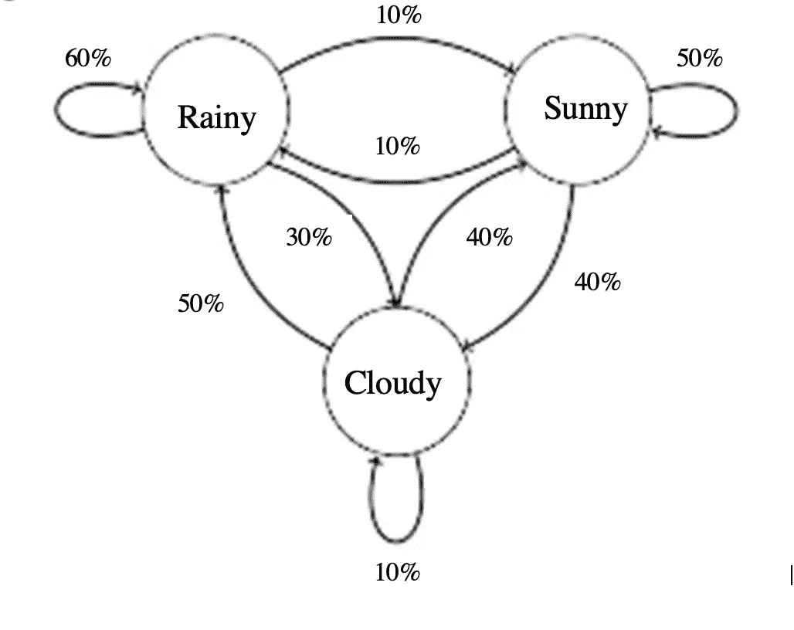
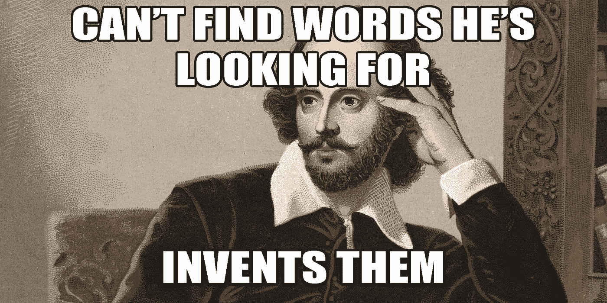

# 用马尔可夫链生成文本:使用马尔可夫链的介绍

> 原文：<https://towardsdatascience.com/text-generation-with-markov-chains-an-introduction-to-using-markovify-742e6680dc33?source=collection_archive---------5----------------------->

## 用马尔可夫链生成莎士比亚英语文本

这是对文本生成的马尔可夫链的一个简单介绍。我们将使用 Markovify 库对威廉·莎士比亚最著名的三部悲剧进行训练，看看我们生成的结果是否清晰、连贯。我知道这两个术语有些模糊，但我觉得大多数人在使用它们时会理解我的意图，特别是当他们看到文本中产生的变化时。

Markovify 是一个 python 库，自称是“一个简单的、可扩展的马尔可夫链生成器”。用途包括根据现有文本生成随机的半可信句子。。我必须承认，它使用起来非常简单快捷。马尔可夫链本身是极好的创造，它给出了多态过程的“保持”和“改变”概率。我不会在这里深入研究马尔可夫链的数学，但是可以随意参考[的这个](https://brilliant.org/wiki/markov-chains/)和[的这个](https://setosa.io/ev/markov-chains/)，分别获得全面的概述和可视化。出于我们的目的，我将直观地解释马尔可夫链。



作者图片

看上面的图像，我们可以看到我们有三种可能的状态；多云、下雨和晴天。马尔可夫链依靠当前的状态来预测未来的结果。如果我们观察到今天下雨，我们的概率如下:明天仍然下雨的可能性是 60%，多云的可能性是 30%，晴天的可能性是 10%。当我们从多云和晴朗的状态开始时，可以应用相同的逻辑。

那么这到底是怎么处理文本的呢？本质上，我们语料库中的每个单词都使用马尔可夫链以不同的概率与其他每个单词“连接”。因此，如果我们的初始单词(state)是“Thou ”, Markovify 会为我们语料库中的每一个其他单词分配一个概率，即它跟随我们的初始单词的可能性有多大。它可能有 65%的“Shall”可能跟在“Thou”后面，还有 20%的“is ”, 10%的“may ”,以此类推，我们的整个语料库将构成最后的 5%。请注意,“你”跟着它自己的可能性应该接近 0%,因为一个单词这样重复它自己没有多大意义，而且几乎所有的单词都是如此。为了更深入的了解，请点击查看电影、指标和思考分类[。](https://napsterinblue.github.io/notes/algorithms/markov/markovify/)

# 生成文本



来自:[https://libguides.spsd.org/shakespeare/words](https://libguides.spsd.org/shakespeare/words)

所以我们终于准备好实现 Markovify 来生成文本了。你可以在 Github 的这里找到我的 Colab 笔记本。首先我们需要安装我们的库和包。

```
!pip install nltk
!pip install spacy
!pip install markovify
!pip install -m spacy download en
```

我们将使用 NLTK 和 spaCy 进行文本预处理，因为它们是最常见的，如果我们首先解析文本，我们的模型将更好地生成文本。现在我们可以导入我们的库了。

```
import spacy
import re
import markovify
import nltk
from nltk.corpus import gutenberg
import warnings
warnings.filterwarnings('ignore')nltk.download('gutenberg')
!python -m spacy download en
```

在这个演示中，我们将使用古腾堡 NLTK 语料库中的三个莎士比亚悲剧。我们将首先打印古腾堡语料库中的所有文档，以便您可以随意混合和匹配这些文档。

```
#inspect Gutenberg corpus
print(gutenberg.fileids())
```

在这个演示中，我们将使用莎士比亚的三部悲剧《麦克白》、《凯撒大帝》和《哈姆雷特》。所以我们接下来将导入它们并检查文本。

```
#import novels as text objects
hamlet = gutenberg.raw('shapespeare-hamlet.txt')
macbeth = gutenberg.raw('shakespeare-macbeth.txt')
caesar = gutenberg.raw('shakespeare-caesar.txt')#print first 100 characters of each
print('\nRaw:\n', hamlet[:100])
print('\nRaw:\n', macbeth[:100])
print('\nRaw:\n', caesar[:100])
```

接下来，我们将使用 re 库构建一个实用函数来清理我们的文本。这个函数将删除不需要的空格、缩进、标点等等。

```
#utility function for text cleaning
def text_cleaner(text):
  text = re.sub(r'--', ' ', text)
  text = re.sub('[\[].*?[\]]', '', text)
  text = re.sub(r'(\b|\s+\-?|^\-?)(\d+|\d*\.\d+)\b','', text)
  text = ' '.join(text.split())
  return text
```

接下来，我们将继续通过删除章节标题和指示符来清理我们的文本，并应用我们的文本清理功能。

```
#remove chapter indicator
hamlet = re.sub(r'Chapter \d+', '', hamlet)
macbeth = re.sub(r'Chapter \d+', '', macbeth)
caesar = re.sub(r'Chapter \d+', '', caesar)#apply cleaning function to corpus
hamlet = text_cleaner(hamlet)
caesar = text_cleaner(caesar)
macbeth = text_cleaner(macbeth)
```

我们现在想使用 spaCy 来解析我们的文档。更多可以在[这里找到](https://spacy.io/usage/processing-pipelines)上的文字处理管道。

```
#parse cleaned novels
nlp = spacy.load('en')
hamlet_doc = nlp(hamlet)
macbeth_doc = nlp(macbeth)
caesar_doc = nlp(caesar)
```

现在我们的文本已经被清理和处理，我们可以创建句子和组合我们的文档。

```
hamlet_sents = ' '.join([sent.text for sent in hamlet_doc.sents if len(sent.text) > 1])
macbeth_sents = ' '.join([sent.text for sent in macbeth_doc.sents if len(sent.text) > 1])
caesar_sents = ' '.join([sent.text for sent in caesar_doc.sents if len(sent.text) > 1])shakespeare_sents = hamlet_sents + macbeth_sents + caesar_sents#inspect our text
print(shakespeare_sents)
```

我们的文本预处理已经完成，我们可以开始使用 Markovify 来生成句子。

```
#create text generator using markovify
generator_1 = markovify.Text(shakespeare_sents, state_size=3)
```

现在是有趣的部分。我们只需要写一个循环来生成尽可能多的句子。下面，我们将创建 3 个长度不确定的句子和 3 个长度小于 100 个字符的句子。

```
#We will randomly generate three sentences
for i in range(3):
  print(generator_1.make_sentence())#We will randomly generate three more sentences of no more than 100 characters
for i in range(3):
  print(generator_1.make_short_sentence(max_chars=100))
```

一些示例文本:

哈姆雷特，这颗珍珠是你，为你的健康干杯。"

“尊敬的大人，我要和他谈谈。”

对莎士比亚的英语来说还不错。但我认为我们可以做得更好。我们将使用 SpaCy 实现 POSifiedText，尝试改进我们的文本预测。

```
#next we will use spacy's part of speech to generate more legible text
class POSifiedText(markovify.Text): def word_split(self, sentence):
      return ['::'.join((word.orth_, word.pos_)) for word in nlp(sentence)] def word_join(self, words):
      sentence = ' '.join(word.split('::')[0] for word in words)
      return sentence#Call the class on our text
generator_2 = POSifiedText(shakespeare_sents, state_size=3)
```

最后，使用我们的新生成器打印更多的句子。

```
#now we will use the above generator to generate sentences
for i in range(5):
  print(generator_2.make_sentence())#print 100 characters or less sentences
for i in range(5):
  print(generator_2.make_short_sentence(max_chars=100))
```

一些例子:

“他杀了我的母亲，逃跑吧，我恳求你哦，这是反击你的假丹麦狗。"

"请你赐恩于他们，我们让你的女王陛下安息."

# 最后

在本文中，我们介绍了如何使用马尔可夫链快速轻松地实现文本生成的 Markovify。您可以看到，一旦有了一个干净的文本，实现、启动和运行它是多么容易。我计划发布更多的 NLP/文本生成模型，使用神经网络、transformers 和其他相同的语料库，目标是比较它们之间的复杂性和性能。