# 汉堡连锁店 Yelp 评论的文本挖掘和情感分析

> 原文：<https://towardsdatascience.com/text-mining-and-sentiment-analysis-for-yelp-reviews-of-a-burger-chain-6d3bcfcab17b?source=collection_archive---------8----------------------->

社交媒体帖子和客户评论等文本是一座等待被发现的金矿。我们可以将这些非结构化数据转化为有用的见解，这可以帮助公司更好地了解客户喜欢他们的产品或服务的程度，更重要的是，为什么，然后尽快进行业务改进。


照片由[拉米尔·苏亚雷斯](https://unsplash.com/@ramillesoares?utm_source=medium&utm_medium=referral)在 [Unsplash](https://unsplash.com?utm_source=medium&utm_medium=referral) 上拍摄

# **1 案件背景**

超级汉堡是我最喜欢的汉堡店之一。每次我去那里，都会看到顾客排队买汉堡。有一天我在想，为什么人们对这家汉堡连锁店如此着迷？我知道 Yelp 上有很多评论，也许这是一个很好的开始来找出背后的秘密。

# 2 数据理解

## **2.1 数据来源**

我使用 Yelp API，得到了湾区 17 家 Super Duper Burgers 餐厅的相关信息，比如 URL、评论数、评分、位置等。

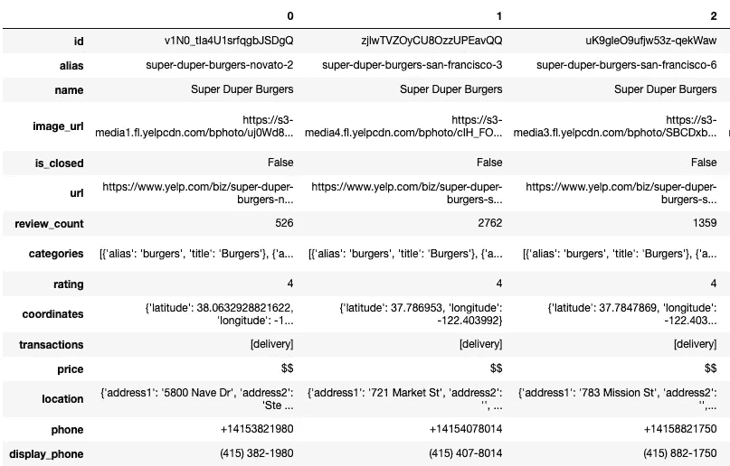

来自 Yelp API 的餐馆信息

然后我用美汤做了网页抓取，获得了各个餐厅的点评。我不仅得到了评论的内容，还得到了具体客户的日期和评级。当我们进行时间序列分析时，数据是有用的，如果我们应用任何监督学习算法来进行预测，评级可以是目标变量。我总共收到了 10661 条评论。

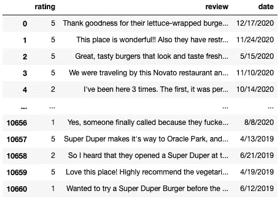

Yelp 评论

## 2.2 探索性数据分析

可视化是进行探索性数据分析的好方法。

```
import matplotlib.pyplot as pltdf['date'] = pd.to_datetime(df['date'])
df = df.set_index('date')plt.plot(df['review'].resample('M').count())
plt.xlabel('Year')
plt.ylabel('Number of reviews')
plt.title('Number of reviews per month')
plt.show()
```

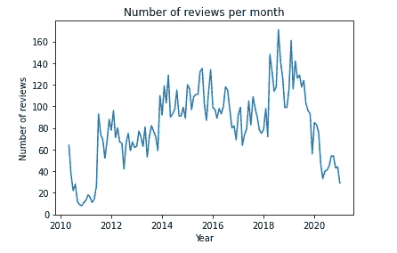

这些评论是从 2010 年 4 月 9 日到 2020 年 12 月 21 日，历时超过十年。每月的评论数量在增加，这可能意味着在过去的十年里，这家汉堡连锁店变得越来越受欢迎。在 COVID 之后，这个数字显著下降，每个月只有大约 30 个客户会写评论。

```
import seaborn as snsax = sns.barplot(data=df, x='rating', y='rating', estimator=lambda x: len(x) / len(df) * 100)
ax.set(ylabel="Percent")
plt.title('Distribution of Customer Rating')
plt.show()
```

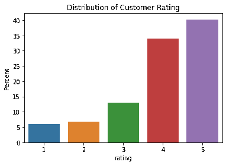

```
plt.plot(df['rating'].resample('M').mean())
plt.xlabel('Year')
plt.ylabel('Rating')
plt.title('Average Monthly Customer Rating')
plt.ylim(0,5)
plt.show()
```

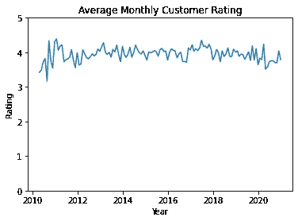

大多数顾客对餐厅感到满意，超过 70%的顾客给了 4 或 5 分。随着时间的推移，评级没有太大变化，相当稳定在 4。

## 2.3 数据清理

在评论中，一些字符引用如“&amp；在我们的文本内容中是没有用的，我把它们删除了。

```
df['review'] = [i.replace("&amp;amp;", '').replace("\'",'') for i in df['review']]
```

接下来，我想确保所有的评论都是英文的，我用一个名为 *langdetect* 的库和特定的函数 *detect_langs* 进行了语言检测。

```
from langdetect import detect_langslanguage = [detect_langs(i) for i in df.review]
languages = [str(i[0]).split(':')[0] for i in language]
df['language'] = languages
```

10，661 条评论中有 8 条被检测为其他语言。它们中的大多数都很短，并且在单词上有某种强调:waaaaaay 代表方式，guuuud 代表好。在这种情况下，检测不是那么准确。如果我们仔细看看这 8 篇评论中的每一篇，它们实际上都是英文的，我会保留它们。

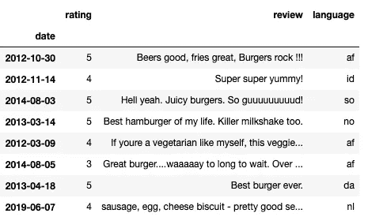

在其他语言中检测到的评论

# 3 文本挖掘

## 3.1 停用词

在每一种语言中，都有出现频率过高且信息不足的词，比如英语中的“a”、“an”、“the”、“and”。在我们进行任何文本挖掘之前，建立一个包含所有停用词的列表并删除它们是很有用的。

根据具体的上下文，您可能还想向列表中添加更多内容。在我们的例子中，像“super”、“duper”这样的词意义不大。

```
from nltk.corpus import stopwords
from sklearn.feature_extraction.stop_words import ENGLISH_STOP_WORDSmy_stop_words = set(stopwords.words('english') + list(ENGLISH_STOP_WORDS) + ['super', 'duper', 'place'])
```

## 3.2 词云

词云是一种非常流行的突出文本数据中高频词的方法。一个特定的词在文本中出现的次数越多，它在词云中的位置就会越大越粗。

```
from wordcloud import WordCloud# concatenate all the reviews into one single string 
full_text = ' '.join(df['review'])cloud_no_stopword = WordCloud(background_color='white', stopwords=my_stop_words).generate(full_text)
plt.imshow(cloud_no_stopword, interpolation='bilinear')
plt.axis('off')plt.show()
```

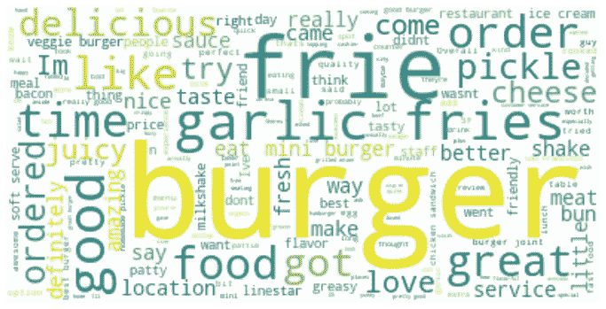

词云

我们可以看到很多顾客提到了“汉堡”、“蒜蓉薯条”、“奶酪”和其他一些词。

## 3.3 标记化和词袋(BoW)

除了单词 cloud，我们还可能对一个单词在所有评论中出现的确切次数感兴趣。在这里，我们实际上试图将文本数据转换成数字形式，单词包是用数字表示文本的最简单形式。它基本上建立了一个出现在文档集合(语料库)中的单词列表，并跟踪它们的频率。

```
from nltk.tokenize import word_tokenize
from nltk import FreqDistlower_full_text = full_text.lower()
word_tokens = word_tokenize(lower_full_text)tokens = list()
for word in word_tokens:
    if word.isalpha() and word not in my_stop_words:
        tokens.append(word)token_dist = FreqDist(tokens)
dist = pd.DataFrame(token_dist.most_common(20),columns=['Word', 'Frequency'])
```

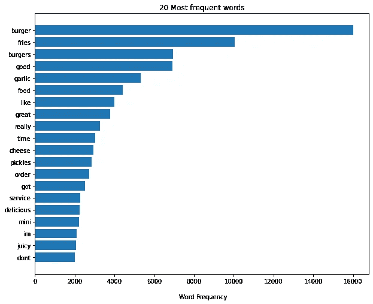

显然，“burger”和“burgers”表达的是同一个意思，我们可以通过使用词干做得更好。词干化是将单词转换成词根形式的过程，即使词干化后的单词在语言中不是有效单词。一般来说，词干往往会砍掉后缀，如“-ed”和“ing”以及复数形式。

```
from nltk.stem import PorterStemmerporter = PorterStemmer()
stemmed_tokens =[porter.stem(word) for word in tokens]
stemmed_token_dist = FreqDist(stemmed_tokens)
stemmed_dist = pd.DataFrame(stemmed_token_dist.most_common(20),columns=['Word', 'Frequency'])
```

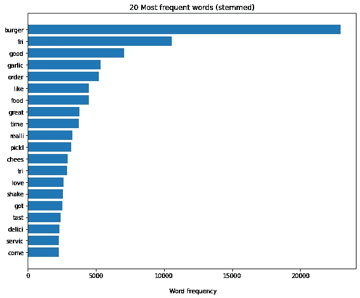

## 3.4 牛顿克

在单词袋方法下，词序被丢弃。但是，很多时候，单词的顺序很重要。比如比较这两句话:1) *我是快乐的，不是悲伤的。* 2) *我难过，不开心。*它们的含义完全不同，但它们将通过单符号 BoW 获得相同的数字表示。为了更好地捕捉上下文，我们可以考虑相邻出现的成对或三对单词，它们也可以给我们更多有用的信息。

```
from sklearn.feature_extraction.text import CountVectorizervect = CountVectorizer(stop_words=my_stop_words, ngram_range=(2,2))bigrams = vect.fit_transform(df['review'])bigram_df = pd.DataFrame(bigrams.toarray(), columns=vect.get_feature_names())bigram_frequency = pd.DataFrame(bigram_df.sum(axis=0)).reset_index()bigram_frequency.columns = ['bigram', 'frequency']
bigram_frequency = bigram_frequency.sort_values(by='frequency', ascending=False).head(20)
```

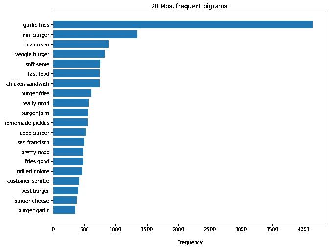

大蒜薯条似乎是这家汉堡连锁店最受欢迎的菜单，甚至超过了汉堡！其他最畅销的菜肴包括迷你汉堡、冰淇淋、蔬菜汉堡和鸡肉三明治。成对的记号比单个记号给我们更多的洞察力。

## 3.5 人们为什么喜欢它

尽管二元模型给了我们更多的信息，但它只回答了什么的问题。如果我是老板，我肯定会对为什么感兴趣:为什么人们喜欢薯条？是因为特别的味道还是酱料？

为了回答这个问题，我将使用 Word2Vec 模型，看看哪些词最有可能出现在我们的目标词周围，如薯条、汉堡、服务等。Word2Vec 使用神经网络模型从语料库中学习单词关联。与 BOW 和 n-grams 相比，Word2Vec 利用了上下文，更好地捕捉了单词的含义和关系。

Word2Vec 背后有两种模型架构:连续词包(CBOW)和 skip-gram。我不会在这里给出太多关于算法的细节，你可以在其他文章和论文中找到更多。一般来说，CBOW 更快，而 skip-gram 更慢，但在表示不常用的单词方面做得更好。

我们可以用 Python 中的 Gensim 轻松完成这项工作。首先，我得到了评分为 4 或 5 的好评，并进行了一些基本的预处理。

```
from nltk.tokenize import sent_tokenizegood_reviews = ' '.join(df_good.review)# split the long string into sentences
sentences_good = sent_tokenize(good_reviews)good_token_clean = list()# get tokens for each sentence
for sentence in sentences_good:
    eng_word = re.findall(r'[A-Za-z\-]+', sentence)
    good_token_clean.append([i.lower() for i in eng_word if i.lower() not in my_stop_words])
```

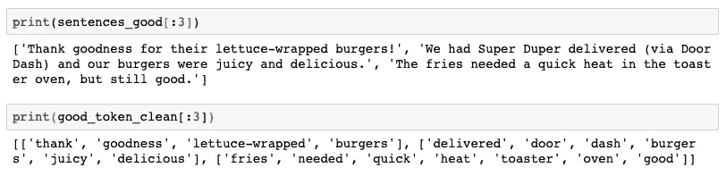

前后文本清理

现在我们可以建立模型，看看顾客最喜欢汉堡连锁店服务的哪一点。

```
from gensim.models import Word2Vecmodel_ted = Word2Vec(sentences=good_token_clean, size=500, window=10, min_count=1, workers=4, sg=0)model_ted.predict_output_word(['service'], topn=10)
```

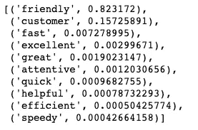

显然，人们真的很欣赏他们友好的客户服务以及快速快速的反应。对于我们感兴趣的其他目标词，我们也可以这样做。这些周围的单词信息量很大，它们可以更好地解释人们为什么喜欢或解释某些事情。

# 4 情感分析

情感分析是理解人们对某一主题的看法的过程。有两种方法:基于词典/规则的方法和自动方法。

## 4.1 基于词典的工具— VADER

这种方法有一个预定义的带有情感分数的单词列表，它将词典中的单词与文本中的单词进行匹配。我将使用 NLTK 包中的 VADER 分析器。对于每一段文本，分析器提供四个分数:负面、中性、正面和复合。前三个很容易理解，对于复合分数，它是正分数和负分数的组合，范围从-1 到 1:低于 0 为负，高于 0 为正。我将使用复合分数来衡量情绪。

```
# Load SentimentIntensityAnalyzer
from nltk.sentiment.vader import SentimentIntensityAnalyzer# Instantiate new SentimentIntensityAnalyzer
sid = SentimentIntensityAnalyzer()# Generate sentiment scores
sentiment_scores = df['review'].apply(sid.polarity_scores)sentiment = sentiment_scores.apply(lambda x: x['compound'])monthly_sentiment = sentiment.resample('M').mean()
```

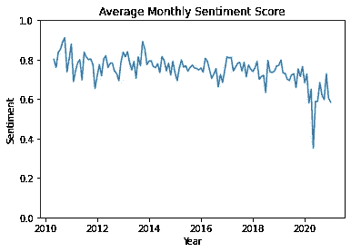

总的来说，人们对这家汉堡连锁店的看法是积极的，我们可以注意到在过去的十年中有下降的趋势，尤其是在疫情之后。

## 4.2 监督学习分类器

我们还可以使用已知情感的历史数据来预测一段新文本的情感。这里我将使用两个监督学习分类器:逻辑回归和朴素贝叶斯。

首先，我将正面评论标记为“1”(评分为四或五)，负面评论标记为“0”(评分为一或二)。9271 条评论中有 85%是正面的。

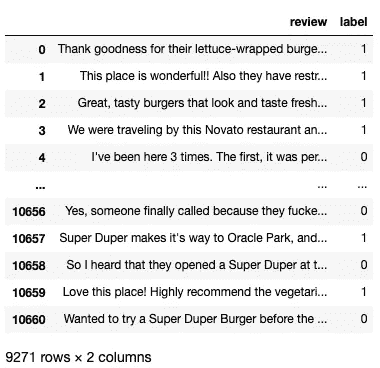

然后，我使用 BoW 对评论进行矢量化，并将其分为训练集和测试集。

```
from sklearn.feature_extraction.text import CountVectorizer
from sklearn.model_selection import train_test_split# vectorization
vect = CountVectorizer(max_features=300, stop_words=my_stop_words)
vect.fit(df_update.review)
X = vect.transform(df_update.review)
X_df = pd.DataFrame(X.toarray(), columns=vect.get_feature_names())# Define the vector of targets and matrix of features
y = df_update.label
X = X_df# Perform the train-test split
X_train, X_test, y_train, y_test = train_test_split(X, y, test_size=0.3, random_state=42, stratify=y)
```

现在我们可以建立模型了。第一个是逻辑回归。

```
from sklearn.linear_model import LogisticRegressionlog_reg = LogisticRegression().fit(X_train, y_train)
y_pred_lg = log_reg.predict(X_test)# find the most informative words
log_odds = log_reg.coef_[0]
coeff = pd.DataFrame(log_odds, X.columns, columns=['coef'])\
            .sort_values(by='coef', ascending=False)
```

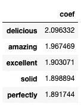

正面评论的最有信息量的词

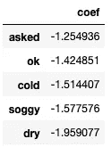

负面评论的最有信息的词

第二个模型是朴素贝叶斯。

```
from sklearn.naive_bayes import MultinomialNB nb_classifier = MultinomialNB()
nb_classifier.fit(X_train, y_train)
pred = nb_classifier.predict(X_test)
```

最后，我们可以比较这两个模型的泛化性能。事实证明，这两个模型都非常有效，准确率超过 90%。当然，我们仍然可以通过使用 n-grams、Tf-idf 等来改进模型。

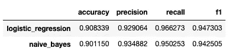

泛化性能

# 5 结论

文本挖掘不仅让我们知道人们在谈论什么，而且知道他们是如何谈论的。这对于品牌监测、产品分析和客户服务是非常重要和有益的。使用 Python，我们可以方便地利用各种库来更深入地研究文本并获得有价值的见解。