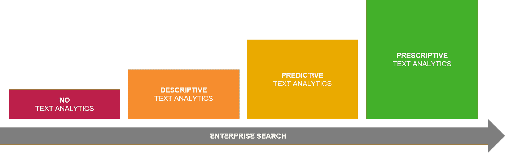

# 用 Simone 挖掘文本—第 1 部分

> 原文：<https://towardsdatascience.com/text-mining-with-simone-part-1-8fc8b780c856?source=collection_archive---------38----------------------->

## *关于组织内部文本挖掘系列的第一篇博客*

# 介绍

随着整个世界的数字化转型，来自各种来源的文本信息呈爆炸式增长。在这种情况下，文本信息是指非结构化数据，如 html、xml 和文档格式，如 Microsoft Word、Adobe PDF 和电子邮件。

随着世界的数字化转型，数据挖掘应运而生。组织已经采取措施使用数据和数据驱动的见解来创造价值，但这些努力主要集中在结构化数据上，而不是非结构化数据上。非结构化数据通常会超出范围。

然而，储存信息最自然的方式是通过文本。为了解释某事，你可能会把它写在文档中。然而，不管文档的结构如何，对计算机来说，它是一个无结构的单词集合。

甚至关于结构化数据的信息也经常使用文档进行交流。不可否认，文本信息在信息交流中起着巨大的作用。归根结底，我们是通过语言来交流知识的。有人甚至会说，没有语言知识就根本不存在。

消费者应该感到欣慰的是，微软文件浏览器和苹果查找器等现成工具提供了足够的功能，使私人文档集合(在某种程度上)易于管理。消费者也受益于像谷歌这样的公司，它们使互联网上浩瀚的文本信息变得可以搜索。

另一方面，组织在文档管理方面面临着更复杂的挑战。大多数组织数据以非结构化形式存储(约 80%)，但对所有这些信息的控制仍然有限。对于您来说，在公司股份上找不到特定的文档听起来可能并不陌生。

尽管组织最近在数据的有效管理方面投入了大量努力，但这通常仍局限于结构化数据。组织开始进行数据管理，目标与增长、效率和合规性相关。那么文件呢？为什么那些收获不被珍惜？为什么结构化数据挖掘比文本挖掘更普遍？

# 文本挖掘快速入门

文本挖掘是一种数据分析，旨在从文本信息中检索有价值的见解。它是被称为自然语言处理(NLP)的研究领域的一部分，位于计算语言学、计算机科学和人工智能的交叉点。NLP 是计算机分析和理解人类语言的一种方式。它通常用于机器翻译、自动问答以及文本挖掘等应用。

由于人类语言的模糊性和复杂性，需要在文本挖掘之前进行数据准备，以确保文档内部的信息以合适的方式呈现。这个阶段可以被称为文本细化。

文本优化包含清理活动，如删除和词干化特定单词。例如，删除*停用词*，如“the”、“as”和“a”。这个博客中最常见的词是“The ”,但这不是一个有价值的见解。这就是为什么在开始分析之前，这些本质上无意义的词被删除。词干是指具有相同含义的词的概括，例如，“经理”、“管理”和“管理”都可以归为名为“管理”的同一类别。在文本细化阶段，概念被预定义，同义词被识别。这一切都是为了创造价值。举例来说，在合同谈判的背景下,“好聚会”的意思与夜总会的背景完全不同。一旦文本被提炼，它就可以被分析。在实现您的分析目标之前，在精化和分析之间可能会有一些跳跃。

# 组织内部的文本挖掘

文本挖掘的组织应用是双重的:分析和企业搜索。

## 分析学

文本挖掘中的描述性分析是指从文档中自动检索信息(无需完全阅读文档)。可以创建单词云来提取和可视化地表示一个或多个文档的主要主题。这可以为您的信息环境带来有趣的见解。然而，词云的应用是有限的。

更有价值的练习是主题提取和命名实体识别。主题抽取是识别文档中有意义的术语。命名实体识别是提取属于预定义类别的名称，例如人、组织和地点。可以通过使用元数据将提取的术语、主题和实体附加到文档上。这使得最终用户更容易找到和理解文档。

描述性文本分析的另一个应用是情感分析。可以对大量文档进行情感分析，以确定文档的总体情感是负面的、正面的还是中性的。这是通过识别正面和负面术语并计算每个文档中这些术语的数量来完成的。一个组织应用的例子可以是确定员工评论的一般情绪，或者使用社交媒体数据评估公司活动的成功。例如，星巴克使用实时文本挖掘和情感分析来识别负面推文，并迅速做出回应。

文本挖掘的级别—按作者分类的图像

预测文本分析更进了一步，因为文档还可以根据其内容进行聚类和分类。这是通过基于特定术语在文档中的出现频率与术语在其他文档中的出现频率相比较来对相似的文档进行分组来实现的。这被称为术语频率-逆文档频率(tf-idf)。

知道一个特定的文档属于某种类型，我们就可以使用文本挖掘技术来确定哪些其他文档属于同一类别。这是一种监督学习的方式，对文本信息的组织非常有益。在您的文档环境中实现这样的文本挖掘技术可以帮助您的组织走向有效的内容监管。

内容监管指的是发现、收集和呈现关于特定主题的信息的过程。这类似于网飞对电影所做的，因为它根据所选电影的特征来推荐其他电影。在一个知识驱动的组织中，这可能有很大的好处，例如在寻找主题专家或收集现有信息以撰写新合同或提案时。

使用规定的文本分析，计算机可以根据文件的内容预测文件需要保存在哪里。实施实时文本挖掘技术可以让你的系统对你在旅途中写的文件进行分类。根据你写文档时使用的单词，系统可以检测出异常。例如，系统可以发出警告，询问保存位置是否合适，建议不同的标题或自动为文档生成元数据。

## 企业搜索

在组织文档管理的背景下，上面提到的文本挖掘技术的实现都通过使查找信息更容易来提高组织搜索的质量。然而，组织搜索也可以通过在搜索本身中实现文本挖掘技术来改进。

比方说，一名员工想找到所有供应商的电话号码，但这些号码“隐藏”在收件箱的某个地方。使用预定义的“电话号码”类别，搜索不会一次查找一个特定的电话号码，而是返回与预定义的电话号码类别匹配的所有结果。这些归纳技术使得搜索更加有效。

词干的概念有助于这一点以及文本挖掘技术返回搜索结果，即使术语不完全匹配。实施这种搜索技术有利于提高运营效率，因为员工不再需要点击数百个文件夹来查找特定的文档。

这种搜索方法不仅对最终用户有用，而且对试图保持对信息环境的控制并遵守法律法规的管理人员也很有用。这种通用的搜索类别可用于监控人们是否将信息保存在正确的位置，例如，如果在给客户的信中使用了个人信息(如信用卡号和社会保险号)，则可以很容易地批量找到这些信息并进行适当的存档。

## 履行

当然，市场上有许多利用上述功能的现有解决方案。请继续关注本系列的下一篇博客，阅读更多关于现有市场解决方案的内容。