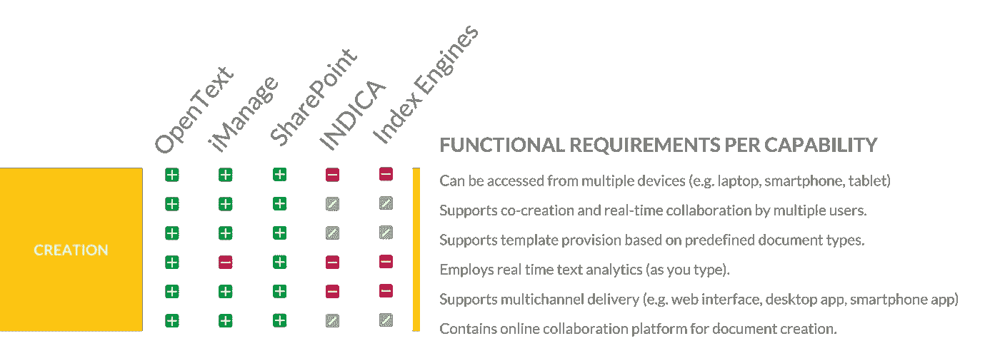
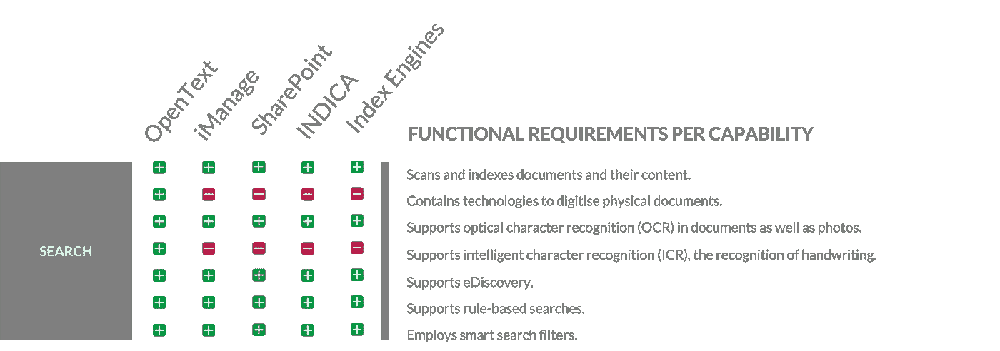

# 用 Simone 挖掘文本—第二部分

> 原文：<https://towardsdatascience.com/text-mining-with-simone-part-2-27aafeca6741?source=collection_archive---------23----------------------->

## 关于组织内部文本挖掘系列的第二篇博客

在本系列的第一篇[博客](/text-mining-with-simone-part-1-8fc8b780c856)中，我们深入探讨了文本挖掘的概念。在本系列的第 2 部分中，我们继续探索控制。

# 介绍

就这样决定了。需要获得对大量非结构化信息的控制。仅仅依靠人是不可行的，我们的员工已经够忙的了。清理数 TB 的非结构化数据根本不符合他们繁忙的日程安排。需要自动化。那么，有什么选择呢？

当然，有许多现成的解决方案可以帮助组织管理他们的非结构化数据，企业内容管理(ECM)市场多年来已经发生了很大的发展和变化。随着产品的重点从“文档管理”转变为“内容管理”，出现了许多合并和收购。Gartner 发布了关于 ECM 服务的季度报告，在最新发布的报告中，他们将 **OpenText、Box、Hyland** 和**微软**列为该领域的顶级解决方案提供商。

最适合您需求的解决方案取决于您组织的具体情况。请记住，技术是为您提供支持的，这一点非常重要。我在市场上经常看到的是，员工已经调整了他们的工作方式，以符合解决方案的要求，而不是调整解决方案来满足他们自己的需求。

在这篇博客中，我将重点介绍七种不同的功能，其中前四种(创建、形式化、归档和销毁)属于更传统的文档和记录管理领域，而其他三种(监控、元数据和搜索)属于内容管理领域。

内容和记录管理的七种能力—按作者分类的图像

# 创造

首先，ECM 解决方案应该支持最终用户的需求。在这个数字社会中，这意味着应该可以在多种不同的设备上创建文档，并促进与同事的(实时)文档协作。从内容管理的角度来看，还希望解决方案在开始创建文档时为最终用户提供模板。

# 正规化(= formalization)

第二，通常有一个文件正式化的时间点。这是文件成为“记录”的时刻，它不能再被调整或改变。例如，对于一份合同，这将是双方签字的时刻。对于其他文件，这一时刻可能没有明确定义。一般来说，这是 1.0 版本创建的时刻，但即使是这个 1.0 版本也可能在以后发生变化。例如，考虑一个策略文档。为了支持这种文档的形式化，需要一个工作流，其中部门领导或团队领导可以正式批准该文档，从而非常清楚哪个版本是最新的。对于不需要部门负责人正式批准的文档，最终用户应该能够自己发布文档的最终版本。正式化后，这些文档不应再与活动文档的主体(如相同文档的早期版本)相混淆，从而使整个组织在查找特定信息时能够清楚地了解应该参考哪个文档。

# 归档

第三，解决方案应该具有归档功能。文档必须在某个时刻离开活动环境，被保存在一个安全的环境中，以便在需要时可以查看。当保存在活动文档之间时，这些“遗留文档”会造成不必要的混乱，但仍需要保存，以防出现关于文档历史的问题。因此，这两种类型—遗留文档和活动文档—应该存储在不同的环境中。

# 破坏

自然，遗留文档也会堆积起来。此外，它们还受法律要求的约束，如关于保留期的法律。当涉及到个人身份信息时，甚至可能根本不允许存储这些文档。这就是为什么销毁机制是任何 ECM 解决方案的重要组成部分。对于正式的记录，这可以通过在保留期结束时销毁文档来实现自动化。从未获得最终状态的非正式文档，如笔记或草稿，应根据标准化的销毁策略定期清理。

# [计]元数据

这让我们想到了我最喜欢的，ECM 的症结:元数据。元数据只是关于数据的数据。对于文档，这可以是文档类型、标题、状态、作者或创建日期。这是文本挖掘技术做得最好的地方。非结构化信息的标准化和结构化是通过元数据来完成的。在文档的生命周期中，某些信息应该附加到文档中。例如，当文档被正式化时，该文档被标记为“最终”并且保留期被添加到文档中。这有助于在一段时间后自动归档和移除文档。对于合同，将文档的开始和结束日期作为元数据添加也可以促进合同谈判过程，因为组织可以快速确定哪些合同需要续签，而不必筛选一堆旧文档。理想情况下，解决方案不会要求文档创建者每次都手动向文档添加元数据，而是基于内容自动生成元数据。自动生成是有利的，因为手动输入会导致最终用户的失望，并且更容易出错。

# 监视

与任何数据管理计划一样，实施某种监控机制来确保一旦达到可接受的质量水平，数据就能保持在该质量水平是非常重要的。因此，这些解决方案应该支持某种信息环境的概述，信息管理者可以通过查阅这些概述来了解文档创建过程、模板的可用性以及元数据属性的集中管理。模式和新的文档类型可以通过支持内容监管的文本挖掘技术来识别。内容监管是指相似和相关文档的聚集。内容监管识别不适合现有元数据属性的文档。因此，它指示何时需要定义新的文档类型及其相关的保留期。还应在“对象”级别促进监控，允许信息经理识别包含特定或禁止信息的文档。例如，想想个人身份信息。

# 搜索

对于最终用户来说，这可能是任何 ECM 解决方案最重要的方面。我如何搜索，更重要的是，*如何找到*我要找的东西？这里，期望远远超出必须记住文档的标题。解决方案应该扫描文档内容、元数据，并提供用户友好的过滤选项来优化搜索结果。一个可以解答你所有问题的入口。

# 市场解决方案

*免责声明:下面列出的可用市场解决方案并不详尽。这个博客的目标不是提供一个完整的解决方案列表，而是探索各种文本挖掘功能。创建这份名单的面试是在 2019 年夏天进行的。请注意，自那以后，各方都发展了自己的能力。请单独与他们联系，以了解有关当前功能的更多信息。*

本博客将考虑各种不同的解决方案，而不是关注 Gartner 确定的顶级解决方案。例如，SharePoint 是市场上最受欢迎的解决方案之一，因为它与 Office 365 一起提供，因此通常已经是组织可用许可证的一部分。它通过其高级数据治理功能涵盖了上面讨论的许多特性。概述考虑了 SharePoint online(用于商业)。OpenText 是市场领导者之一，因此不能被排除在外。下面的概述考虑了他们的整个产品组合。为了满足所有要求的功能，必须提供现成的产品组合。iManage 是一个成本较低的解决方案，提供了许多与 OpenText 相同的功能。INDICA 和索引引擎不是传统的 ECM 解决方案，因为它们侧重于监控、元数据和搜索，而不是文档创建和存储。他们在这个领域开发了一些非常有用的功能。如果您不想改变您当前的体系结构(例如，您希望继续使用您当前的文件共享)，但又想获得对该环境的控制，这些解决方案是很好的选择。下面是这些解决方案的一些现成功能的概述，这些功能对应于上面定义的重点领域。请注意，所有这些解决方案都在不断开发和改进，本概述是在 2019 年夏天创建的。

能力映射，创建—按作者分类的图像

能力映射、形式化——作者图片

功能映射、归档—按作者分类的图像

能力映射、销毁—作者提供的图片

功能映射，监控—按作者分类的图片

功能映射，元数据-按作者分类的图像

功能映射，搜索-按作者分类的图片

功能映射的图例—按作者分类的图片

这概括介绍了可以用来更好地管理内容的企业软件解决方案。请继续关注本系列的下一篇博客，了解这在实践中是如何运作的。