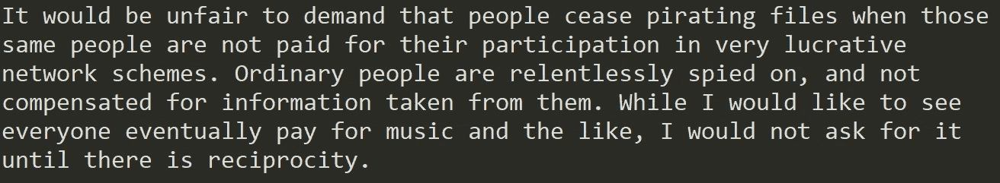
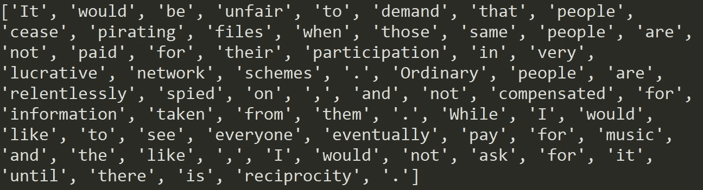
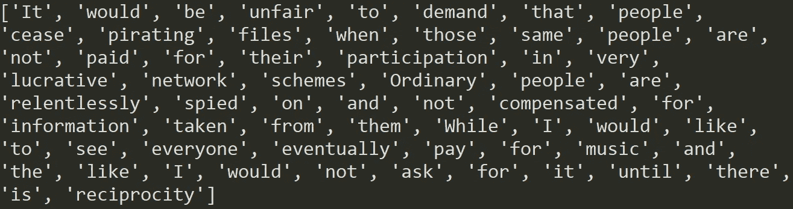
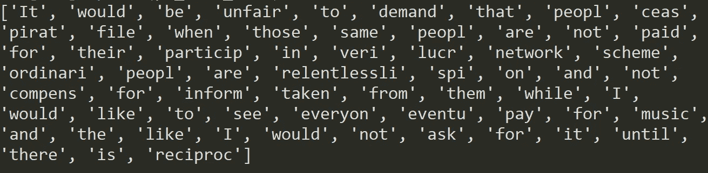
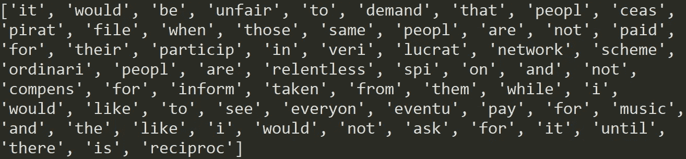
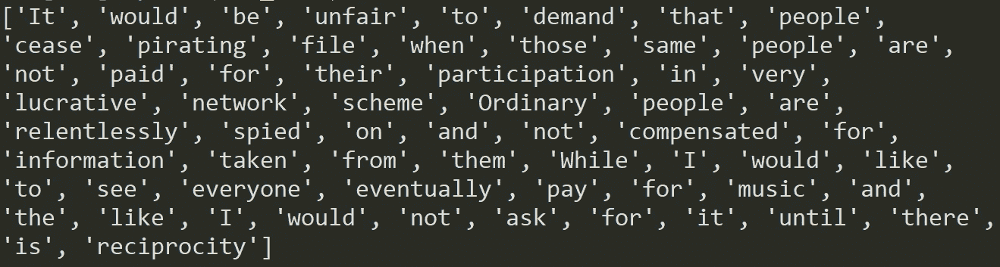

# 自然语言处理中的文本规范化

> 原文：<https://towardsdatascience.com/text-normalization-for-natural-language-processing-nlp-70a314bfa646?source=collection_archive---------1----------------------->

## Python 的词干化和词汇化


梅尔·普尔在 [Unsplash](https://unsplash.com?utm_source=medium&utm_medium=referral) 上的照片

自然语言处理(NLP)可能是目前人工智能(AI)中最热门的话题。在 GPT-3 凭借其[写文章、编码](https://www.forbes.com/sites/kenrickcai/2021/01/04/forbes-ai-awards-2020-meet-gpt-3-the-computer-program-that-can-write-an-op-ed/?sh=7748d45f93a7)以及[从文本中创建图像](https://techxplore.com/news/2021-01-module-openai-gpt-unique-images.html)的能力取得突破后，谷歌宣布了其新的[万亿参数人工智能语言模型](https://thenextweb.com/neural/2021/01/13/googles-new-trillion-parameter-ai-language-model-is-almost-6-times-bigger-than-gpt-3/)，它几乎比 GPT-3 大 6 倍。这些都是该学科的巨大进步，不断将边界推向新的极限。

这怎么可能呢？机器如何与人类语言互动？NLP 中有几十个子字段，但我们必须从基础开始。在另一篇文章中，我浏览了一些关于如何开始 NLP 之旅的提示。现在该谈谈文本规范化了。

> 为什么我们需要文本规范化？

当我们规范化文本时，我们试图减少它的随机性，使它更接近预定义的“标准”。这有助于我们减少计算机必须处理的不同信息量，从而提高效率。像**词干**和**词汇化**这样的规范化技术的目标是将一个单词的屈折形式，有时是衍生相关形式减少到一个共同的基本形式。

# 一个例子

杰伦·拉尼尔说:

> “要求人们停止盗版文件是不公平的，因为这些人参与了非常有利可图的网络计划却没有得到报酬。普通人被无情地监视着，从他们那里获取的信息得不到补偿。虽然我希望看到每个人最终都为音乐之类的东西付费，但在互惠互利之前，我不会要求这样做。”

让我们首先将短语保存为一个名为“句子”的变量:

```
sentence = “It would be unfair to demand that people cease pirating files when those same people aren't paid for their participation in very lucrative network schemes. Ordinary people are relentlessly spied on, and not compensated for information taken from them. While I'd like to see everyone eventually pay for music and the like, I'd not ask for it until there's reciprocity.”
```

在另一篇文章中，我介绍了一些技术来对文本执行[实验性数据分析，所以现在我将重点介绍不同的类型或方法。](/how-to-begin-your-nlp-journey-5dc6734dfb43)

## 扩张收缩

在我们的句子中，我们将单词“we will”缩写为“we 'll”，这应该在进一步规范化之前进行管理。

> **缩写**是通过去掉字母并用撇号代替来缩短的单词或单词组合，去掉它们有助于文本标准化

展开缩写有不同的方法，但最直接的方法之一是创建一个包含相应展开的缩写字典:

```
contractions_dict = { “ain’t”: “are not”, ”’s”:” is”, ”aren’t”: “are not”, “can’t”: “cannot”, ”can’t’ve”: “cannot have”, “‘cause”: “because”, ”could’ve”: “could have”, ”couldn’t”: “could not”, “couldn’t’ve”: “could not have”, “didn’t”: “did not”, ”doesn’t”: “does not”, “don’t”: “do not”, ”hadn’t”: “had not”, ”hadn’t’ve”: “had not have”, “hasn’t”: “has not”, ”haven’t”: “have not”, ”he’d”: “he would”, “he’d’ve”: “he would have”, ”he’ll”: “he will”, “he’ll’ve”: “he will have”, “how’d”: “how did”, ”how’d’y”: “how do you”, ”how’ll”: “how will”, “I’d”: “I would”, “I’d’ve”: “I would have”, ”I’ll”: “I will”, “I’ll’ve”: “I will have”, ”I’m”: “I am”, ”I’ve”: “I have”, “isn’t”: “is not”, “it’d”: “it would”, ”it’d’ve”: “it would have”, ”it’ll”: “it will”, “it’ll’ve”: “it will have”, “let’s”: “let us”, ”ma’am”: “madam”, “mayn’t”: “may not”, ”might’ve”: “might have”, ”mightn’t”: “might not”, “mightn’t’ve”: “might not have”, ”must’ve”: “must have”, ”mustn’t”: “must not”, “mustn’t’ve”: “must not have”, “needn’t”: “need not”, “needn’t’ve”: “need not have”, ”o’clock”: “of the clock”, ”oughtn’t”: “ought not”, “oughtn’t’ve”: “ought not have”, ”shan’t”: “shall not”, ”sha’n’t”: “shall not”, “shan’t’ve”: “shall not have”, ”she’d”: “she would”, ”she’d’ve”: “she would have”, “she’ll”: “she will”, “she’ll’ve”: “she will have”, ”should’ve”: “should have”, “shouldn’t”: “should not”, “shouldn’t’ve”: “should not have”, ”so’ve”: “so have”, “that’d”: “that would”, ”that’d’ve”: “that would have”, “there’d”: “there would”, “there’d’ve”: “there would have”, “they’d”: “they would”, “they’d’ve”: “they would have”,”they’ll”: “they will”,
 “they’ll’ve”: “they will have”, “they’re”: “they are”, ”they’ve”: “they have”, “to’ve”: “to have”, ”wasn’t”: “was not”, ”we’d”: “we would”, “we’d’ve”: “we would have”, ”we’ll”: “we will”, ”we’ll’ve”: “we will have”, “we’re”: “we are”, ”we’ve”: “we have”, “weren’t”: “were not”,”what’ll”: “what will”, “what’ll’ve”: “what will have”, ”what’re”: “what are”, “what’ve”: “what have”, “when’ve”: “when have”, ”where’d”: “where did”, “where’ve”: “where have”,
 “who’ll”: “who will”, ”who’ll’ve”: “who will have”, ”who’ve”: “who have”, “why’ve”: “why have”, ”will’ve”: “will have”, ”won’t”: “will not”, “won’t’ve”: “will not have”, “would’ve”: “would have”, ”wouldn’t”: “would not”, “wouldn’t’ve”: “would not have”, ”y’all”: “you all”, “y’all’d”: “you all would”, “y’all’d’ve”: “you all would have”, ”y’all’re”: “you all are”, “y’all’ve”: “you all have”, “you’d”: “you would”, ”you’d’ve”: “you would have”, “you’ll”: “you will”, ”you’ll’ve”: “you will have”, “you’re”: “you are”, “you’ve”: “you have”}
```

然后，我们可以使用正则表达式来更新文本:

```
import re
contractions_re = re.compile('(%s)'%'|'.join(contractions_dict.keys()))def expand_contractions(s, contractions_dict=contractions_dict):
  def replace(match):
    return contractions_dict[match.group(0)]
  return contractions_re.sub(replace, s)sentence = expand_contractions(sentence)
print(sentence)
```



## 标记化

标记化是将连续文本分割成句子和单词的过程。本质上，它的任务是将文本切割成称为*记号的片段。*

```
import nltk
from nltk.tokenize import word_tokenize
sent = word_tokenize(sentence)
print(sent)
```



接下来，我们应该去掉标点符号。

## 删除标点符号

```
nltk.download(“punkt”)def remove_punct(token):
 return [word for word in token if word.isalpha()]sent = remove_punct(sent)
print(sent)
```



现在我们可以对句子进行词干分析和词汇化。

# 堵塞物

词干化是将单词缩减为词干或词根形式的过程。词干提取的目的是将相关单词减少到同一个词干，即使该词干不是字典中的单词。例如，连接，连接，连接词减少到一个共同的词“连接”。

对英语进行词干提取的最常见算法，也是一种被反复证明非常有效的算法，是波特的 [**算法**](https://nlp.stanford.edu/IR-book/html/htmledition/stemming-and-lemmatization-1.html) 。

```
from nltk.stem import PorterStemmer
ps = PorterStemmer()ps_stem_sent = [ps.stem(words_sent) for words_sent in sent]
print(ps_stem_sent)
```



这里发生了什么？单词已经减少，但其中一些不是真正的英语单词。词干化指的是一种粗糙的启发式过程，它砍掉单词的词尾，希望在大多数情况下都能正确实现这一目标。结果呢？**对单词或句子进行词干分析可能会导致单词不是实际单词。**

这是因为词干分析中主要有两个错误:

*   **词干过多:**一个单词的大部分被砍掉，超出了需要的部分，这反过来导致单词被错误地缩减为同一个词根或词干，而它们本应被缩减为更多的词干。例如，单词“大学”和“宇宙”被简化为“宇宙”。
*   **词干提取不足:**当两个或两个以上的单词可能被错误地简化为一个以上的词根，而实际上它们应该被简化为同一个词根时，就会出现词干提取不足。例如，单词“data”和“datum”分别被简化为“dat”和“datu”(而不是同一个词干“dat”)。

波特斯特梅尔的一个改进是 [**雪球斯特梅尔**](/text-preprocessing-with-nltk-9de5de891658) ，它把单词词干变成更准确的词干。

```
from nltk.stem import SnowballStemmer
sb = SnowballStemmer(“english”)sb_stem_sent = [sb.stem(words_sent) for words_sent in sent]
print(sb_stem_sent)
```



还是不好，对吧？让我们遵循不同的方法。

# 词汇化

与词干化不同的是，**词条化将单词还原为其基本单词**，适当减少屈折变化的单词，确保词根属于该语言。它通常比词干提取更复杂，因为词干提取器在不知道上下文的情况下处理单个单词。在引理化中，一个词根叫做**引理**。一个词条是一组单词的标准形式、词典形式或引用形式。

就像词干一样，有[不同的分类器](https://datascience.foundation/sciencewhitepaper/natural-language-processing-nlp-simplified-a-step-by-step-guide)。对于这个例子，我们将使用 WordNet lemmatizer。

```
from nltk.stem.wordnet import WordNetLemmatizer
lemmatizer = WordNetLemmatizer()lem_sent = [lemmatizer.lemmatize(words_sent) for words_sent in sent]
print(lem_sent)
```



如果您提供想要进行词汇化的上下文，甚至可以进一步提高词汇化的性能，这可以通过词性(POS)标记来实现。

**词性标注**的任务是给句子中的每个单词分配它在句子中假设的词性。词性标注的主要目标是识别给定单词的语法组:它是名词、代词、形容词、动词、副词等等。根据上下文。

> 词性标注提高了准确性

可以用 POS 作为语音参数，在 Python 中默认是**名词**。例如，没有 POS 标签的单词' *leaves* '将被词条化为单词' *leaf'* '，但是有了**动词**标签，它的词条将变成' *leave* '。

为了获得最好的结果，您必须将 POS 标签提供给 lemmastizer，否则它可能无法将所有单词减少到您想要的 lemma。

# 结论

虽然词汇化对某些查询很有帮助，但它同样会损害性能。另一方面，词干增加了召回率，同时损害了精确度。从文本中获得更好的价值[规范化更多地取决于单词使用的语用问题，而不是语言形态学的形式问题](https://nlp.stanford.edu/IR-book/html/htmledition/stemming-and-lemmatization-1.html)。

尽管对于诸如英语之类的现代语言来说，文本规范化被认为已经很好地解决了，但是对于许多(例如，历史上的)语言来说，由于缺乏资源和不稳定的拼写，这个问题更难解决。

> 那么，我们是不是应该一直正常化？

它[取决于问题的性质](https://opendatagroup.github.io/data%20science/2019/03/21/preprocessing-text.html)。**例如，主题建模**依赖于内容词的分布，内容词的识别依赖于词之间的字符串匹配，这是通过对它们的形式进行词汇化来实现的，以便所有变体在文档中是一致的。词汇化对于**训练单词向量**也很重要，因为单词窗口内的精确计数会被不相关的词形变化扰乱，比如简单复数或现在时态的词形变化。另一方面，一些**情感分析**方法(例如 VADER)，根据单词的形式具有不同的等级，因此输入*不应当*被词干化或词条化。

所有的预处理并不要求最终的模型或应用程序是有效的，它实际上可能会阻碍模型或应用程序的成功或准确性。我们需要问自己:规范化是否会丢失重要信息？还是无关信息被删除了？

> **对这些话题感兴趣？关注我**[**Linkedin**](https://www.linkedin.com/in/lopezyse/)**或** [**Twitter**](https://twitter.com/lopezyse)