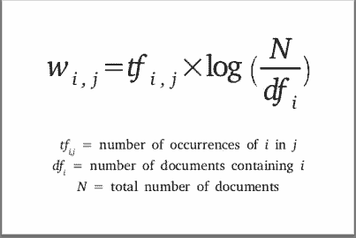
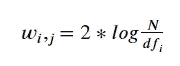
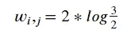
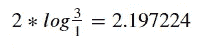

# 数据科学和文本挖掘的文本表示

> 原文：<https://towardsdatascience.com/text-representation-for-data-science-and-text-mining-719ce81f3c84?source=collection_archive---------22----------------------->


照片由来自 Unsplash 的 Pietro Jeng 拍摄

W 对于数据科学相关项目来说，处理文本数据是最令人兴奋的事情之一。20 年前，处理和存储文本数据对于许多组织来说几乎是不可避免的，并且许多数据管道将围绕这种类型的数据，这似乎是不可能的。

奇怪的是，为特征处理或数据科学算法存储文本数据并不像人们想象的那样自然。首先，在计算机中，文本主要由二进制表示法表示——一个句子或一个文档主要被解释为一串与二进制表示法有某种关系的字符。

这似乎使得在数据管道、建模或决策过程中使用文本数据变得极其困难。幸运的是，有一些技术可以用来将文本表示为数学数组，然后可以编码成算法，甚至可以将我的数据变成大多数分析的圣杯，表格数据。

一个问题出现了——我应该如何将我的文本表示为表格数据？这可能吗？幸运的是，有很多技术可以用来提供这种文本表示，接下来让我们探索其中的三种。


计算机并不真正理解像你和我这样的书中的文本(图片来自 Unsplash 的[真诚媒体](https://unsplash.com/@sincerelymedia)

## 二元矢量器

我们要讨论的第一项技术非常简单，至今仍在自然语言处理管道中广泛使用— **二进制矢量器。**

我们来想象下面两句话:

> “我去了杂货店”
> 
> 我去了电影院

如果我们想用表格或数组格式表示这两个句子，我们可以首先从语料库中提取不同的单词(语料库通常是指文本的集合)。让我们使用 Python 代码来做这件事(我将在整篇文章中使用它):

```
sentence_1 = 'I went to the grocery store'
sentence_2 = 'I went to the movie theater'vocab = set(
   list(
      sentence_1.split(' ')+sentence_2.split(' ')
  )
)
```

我们的 vocab 对象现在包含了语料库中的不同单词:

*   我去了杂货店、商店、电影院、剧院

如果我们订购我们的 vocab:

```
vocab.sort()
```

我们得到一个包含以下元素的列表:

```
grocery, I, movie, store, the, theater, to, went
```

让我们继续用我们的 vocab 的元素数目创建一个零数组，其中我们的列表中位置 *j* 的每个单词 *w* 将被映射到我们的数组的位置 *j* :

```
import numpy as np
array_words = np.zeros(len(vocab))
```

我们的示例数组将包含以下元素:

```
[0, 0, 0, 0, 0, 0, 0]
```

当单词 *w* 出现在句子中时，我们可以通过将每个元素 *j* 变为 1 来将我们的句子映射到这个数组中——让我们从第一个句子*“我去了杂货店”—* 开始，并相应地更新我们的数组:

```
[1, 1, 0, 1, 1, 0, 1, 1]
```

**同时可视化我们的 vocab 列表和数组将使这一点更加明确:**

```
grocery, I, movie, store, the, theater, to, went
[1,      1,     0,     1,   1,       0,  1,    1]
```

请注意，只有我们的句子中没有的单词被设置为 0——这是将句子映射到数字数组的一种非常简单的方法。让我们检查用同样的逻辑为第二句话生成的数组:

```
grocery, I, movie, store, the, theater, to, went
[0,      1,     1,     0,   1,       1,  1,    1]
```

在 numpy 中创建这两个数组:

```
array_words = np.array([
  [1,1,0,1,1,0,1,1],
  [0,1,1,0,1,1,1,1]
])
```

我们现在对我们的句子有了一个简单的数学表示——幸运的是，我们不必像 *scikit-learn* 一样为特定语料库中的所有句子手工做这件事，这是在 *feature_extraction.text* 模块中一个名为 ***CountVectorizer*** 的函数中实现的。

想象我们有一个**列表**的句子:

```
sentence_list = ['I went to the grocery store',
'I went to the movie theater']
```

我们可以定义*计数矢量器*对象，将*二进制*设置为*真*(剧透一下，这是在纯*计数矢量器*和*二进制矢量器*之间划线的参数！)和 *tokenizer* 等于 *str.split —* 不要太在意最后一个选项，它只是一种模拟我们之前所做的相同数组的方式(如果没有这个选项，在矢量器的 *scikit-learn* 实现中，默认情况下会从输出中删除单个字母，因此将从输出中删除" *I"* ):

```
from sklearn.feature_extraction.text import CountVectorizer
cvec = CountVectorizer(tokenizer=str.split, binary=True)
```

然后在我们的列表上应用一个 *fit_transform* (例如，我们也可以将列作为一个有几个句子的 dataframe 的参数),这将产生一个数组，就像我们之前手动完成的那样:

```
cvec.fit_transform(sentence_list).todense()
```

注意在 *fit_transform* 方法之后调用的 *todense()* 方法。我们这样做是因为最初 *fit_transform* 由于空间压缩的问题以**稀疏矩阵格式保存结果对象—** 接下来我们将对此进行更多讨论。

让我们看看上面的指令生成的数组:

```
[[1, 1, 0, 1, 1, 0, 1, 1],
 [0, 1, 1, 0, 1, 1, 1, 1]]
```

**听着耳熟？这和我们以前手工制作的是一样的！你可以将这种方法推广到你所拥有的任何一组句子或文件中。**

现在让我们提出一个如下句子的问题:

> 我去了杂货店，然后去了自行车店

单词**、【去了】、【到了】、**和**、【商店】、**在我们的句子中出现了两次。在二进制矢量器方法中，数组只标记单词在句子中的存在(1)或不存在(0)。对于一个 NLP 应用程序来说，拥有单词的实际数量可能是有意义的——让我们看看如何通过一个简单的改变来做到这一点。

## 计数矢量器

计数矢量器与上面的方法非常相似。我们计算单词在句子中的出现次数，而不是用 1 和 0 来标记单词的存在。

从上面的例子来看，**我们需要添加一些单词到我们的词汇库中，**因为我们在第三个句子中有一些前两个句子中没有的新单词。

回想一下我们的第一个 vocab 对象:

```
grocery, I, movie, store, the, theater, to, went
```

我们再加上***‘和’，‘然后’******‘自行车’****:*

```
and, bike, grocery, I, movie, store, the, theater, then, to, went
```

这将增加我们的数组的大小！让我们将句子*‘我去了杂货店，然后去了自行车店’*映射到源自 vocab 的新数组，保持二进制格式:

```
and, bike, grocery, I, movie, store, the, theater, then, to, went
[1,     1,       1, 1,     0,     1,   1,       0,    1,  1,    1]
```

现在，如果不是有一个**二进制矢量器**，而是有一个**计数矢量器**对单词进行计数，那么我们有如下结果:

```
and, bike, grocery, I, movie, store, the, theater, then, to, went
[1,     1,       1, 1,     0,     2,   2,       0,    1,  2,   2]
```

不同之处在于，对于在句子中出现两次的每个单词，数组的值都是 2。在某些模型中，以这种方式构建要素阵列可能会产生更好的结果。

这里，对于单词****【store】*******【the】【to】***和***【gotten】***，这个句子数组将显示一个更高的值——如果这对您的 NLP 应用程序有好处，这确实取决于您希望您的数组如何传达来自语料库的信息以及您正在构建的模型的类型。**

***scikit-learn* 中的实现与我们之前所做的非常相似:**

```
**cvec_pure = CountVectorizer(tokenizer=str.split, binary=False)**
```

***二进制，*在这种情况下，被设置为*假的*和将产生一个更“纯”的计数矢量器。 *Binary=False* 实际上是 *CountVectorizer* 对象的默认参数，如果你在调用函数时没有声明参数的话。**

**更新我们的句子列表:**

```
**sentence_list = ['I went to the grocery store',
'I went to the movie theater',
'I went to the grocery store and then went to the bike store']**
```

**并将我们新的计数矢量器应用于我们的句子:**

```
**cvec_pure.fit_transform(sentence_list).todense()**
```

**这是我们得到的三个句子的数组:**

```
**[[0, 0, 1, 1, 0, 1, 1, 0, 0, 1, 1],
 [0, 0, 0, 1, 1, 0, 1, 1, 0, 1, 1],
 [1, 1, 1, 1, 0, 2, 2, 0, 1, 2, 2]]**
```

****正如你已经注意到的，我们的数组的大小(我们的 *vocab* 中的 *w* 的字数)可以快速增加**。这可能会导致一些问题，但我们会在文章的最后解决一个我们可以使用的调整。**

## **TF-IDF**

**我们看到的方法，从来没有把语料库作为一个整体来考虑——我们总是独立地看句子，并假设每个文本与语料库中的其他句子或文档不相关。**

**在为特征生成数组时，将语料库作为一个整体的一种常见方法是使用**术语频率-逆文档频率矩阵方法，或通常称为 TF-IDF。****

**TF-IDF 的公式似乎令人望而生畏，但它实际上非常简单——我们将使用该公式最简单的实现(还有其他版本，如平滑的版本，详细信息:[https://stats . stack exchange . com/questions/166812/why-add-one-in-inverse-document-frequency](https://stats.stackexchange.com/questions/166812/why-add-one-in-inverse-document-frequency)):**

****

**TF-IDF 公式(来源:[https://www . search engine journal . com/TF-IDF-can-it-really-help-your-SEO/331075/# close](https://www.searchenginejournal.com/tf-idf-can-it-really-help-your-seo/331075/#close))**

**请注意，这个等式中有几项—让我们从第一项开始，*I 在 j 中出现的次数—* **这里我们要映射特定单词在特定文本中出现的次数。**回到我们三句话的例子:**

```
**sentence_list = ['I went to the grocery store',
'I went to the movie theater',
'I went to the grocery store and then went to the bike store']**
```

**让我们获得第三个*句子中单词 *store(我们称之为 i)* 的 TF-IDF 得分(我们称之为 j)。* **单词 *i* 在正文 *j 中出现了多少次？*****

*答案是 2！在这个句子中，我们有两个单词存储。我们可以更新我们的公式，因为我们知道第一项:*

**

*更新了第一项的 j(第 3 句)中 I(商店)的 TFIDF 权重公式*

*现在让我们计算等式的右边——我们需要单词 *i* 在我们语料库中的所有文档中出现的次数。在这种情况下，单词 *store* 出现在**我们拥有的两个文档中—** 我们还可以计算 N，它是我们拥有的文档/句子的数量:*

**

*j 中 i(store)的 TFIDF 权重公式(第 3 句)*

***该公式的返回值约为 *0.81，*** 这是为第三句中的单词 *store* 考虑的 TF-IDF 得分**—**该值将替换我们的二进制矢量器中的潜在值 1 或数组中该值的计数矢量器 2。*****

*一个单词在一个特定的句子中权重如何？两个假设:*

*   *a)单词 *i* 在文档 *j.* 中出现的频率更高*
*   *b)该词在整个语料库中较为少见。*

*模拟两种场景，从场景 a 开始)——如果单词 *store* 在我们的文本中出现 4 次，我们的得分会更高:*

**

*对于场景 b ),如果文本中的特定单词在语料库中更少见，您还可以提高该单词的 TF-IDF 分数——让我们想象单词 store 只出现在我们的 1 个句子中，第一个词的值固定为 2:*

**

*随着单词在语料库中变得越来越少，该单词和句子的 TF-IDF 分数会变得更高。这是与我们之前看到的方法的一个相关区别，我们之前看到的方法没有考虑单词在整个语料库中的分布。*

*当然，当我们转到分布领域时，我们有一些缺点——如果在部署 NLP 应用程序后，您的群体发生了很大变化(这意味着，某些单词在我们的语料库中的预期出现次数)，这可能会对您的应用程序产生重大影响。*

*同样，我们不需要自己做所有的计算！在 *scikit-learn* 中有一个很酷的实现，我们可以使用:*

```
*from sklearn.feature_extraction.text import TfidfVectorizer
tf_idf = TfidfVectorizer(tokenizer=str.split)*
```

*查看我们的 TFIDF 数组的第三句话，我们上面计算的一个和相应的 vocab:*

```
*['and', 'bike', 'grocery', 'i', 'movie', 'store', 'the', 'theater', 'then', 'to', 'went']
[0.31 ,  0.31 ,     0.236,0.18,       0,   0.471, 0.366,         0, 
0.31 , 0.366, 0.366]*
```

*请注意*商店*在句子中的 TFIDF 得分最高，这是因为两件事:*

*   *存储在该句子中重复，因此等式的左侧具有较高的值。*
*   *从重复词(*储存*、*到*、*、*、*到*)来看，*储存*是整个语料库中比较少见的词。*

*您可能还会注意到， *scikit-learn* 实现中的值介于 0 和 1 之间，并不完全是我们从您的简化公式中得到的值。这是因为 *scikit-learn* 实现默认执行规格化和平滑化(你可以查看 ***norm*** 和 ***smooth_idf*** 函数的参数。*

## *维度*

*在所有这些方法中，正如我们在添加一个新句子时所看到的，维度变得非常快。虽然这两种方法都以稀疏格式保存数据，避免了我们在内存错误方面的麻烦(特别是如果我们使用自己的笔记本电脑工作的话)，但是这种高维数(数组中的高列数)对于许多 NLP 应用程序来说可能是有问题的。*

*对于上述所有方法，scikit-learn 实现有两个参数可以帮助您处理高层次的维度:*

*   ***min_df:** 接收一个整数值，该值作为 N 个文档的最小数量的阈值(或者百分比，如果您传递一个 float 的话)，单词必须出现在该 N 个文档上才能被认为是一个数组列。*
*   ***max_features:** 接收一个整数，该整数设置您允许数组拥有的最大列数。*

***这两种方法都会丢失信息，**在我们的 NLP 管道中使用它们，一如既往地取决于您的应用。*

*让我们看一个例子，我们的计数矢量器的 min_df 设置为 2:*

```
*cvec_limit = CountVectorizer(tokenizer=str.split, binary=False, min_df=2)*
```

*返回的数组没有**大小的 vocab，而是只有出现在我们下面的两个 tweets 中的单词:***

```
*sentence_list = ['I went to the grocery store',
'I went to the movie theater',
'I went to the grocery store and then went to the bike store']*
```

*如果您检查特性名称，您只有一个 6 列的数组，对应于单词:*

```
*['grocery', 'i', 'store', 'the', 'to', 'went']*
```

*而这些词恰恰是那些只出现在我们三条推文中至少两条的词！*

*用 **max_features** 参数做同样的实验，检查你是否能够理解它背后的直觉！*

## *结论*

*首先，也是最重要的，这里有一个小要点，你可以用在你的项目中:*

*可以对你的文本做更多的事情来避免维数问题，也可以对你的文本进行预处理。*

*例如，常见的预处理技术包括对句子进行词干化/词尾化或删除停用词——但是请记住——每次对文本进行预处理，都会丢失信息！在计算你的特征时，一定要考虑到这一点，并且一定要将你的文本数据限定在最终目标本身的范围内(分类模型、计算单词向量、使用递归神经网络等)。).*

*除了我向你展示的技术，更多的研究正在进行中——例如将单词向量(【https://en.wikipedia.org/wiki/Word_embedding】)转换成句子或文档向量，但我们将在另一篇文章中讨论这个问题！*

> *感谢你花时间阅读这篇文章！你可以在 LinkedIn(【https://www.linkedin.com/in/ivobernardo/】)上加我，也可以查看我公司的网站()。*
> 
> **如果你有兴趣获得分析方面的培训，你也可以访问我在 Udemy 上的页面(*[*https://www.udemy.com/user/ivo-bernardo/*](https://www.udemy.com/user/ivo-bernardo/)*)**

****这个例子摘自我在 Udemy 平台*** ***上为绝对初学者开设的*** [***NLP 课程——该课程适合初学者和希望学习自然语言处理基础知识的人。该课程还包含 50 多个编码练习，使您能够在学习新概念的同时进行练习。***](https://www.udemy.com/course/nlp_natural_language_processing_python_beginners/?couponCode=LEARN_NLP)*