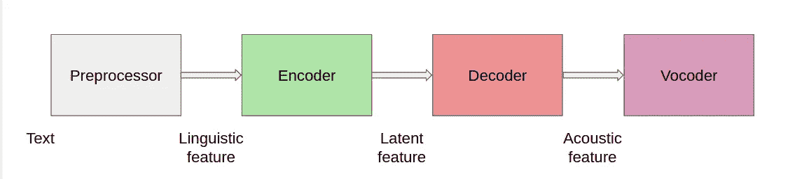
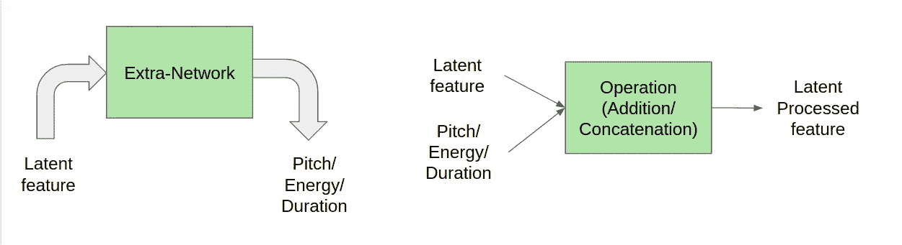
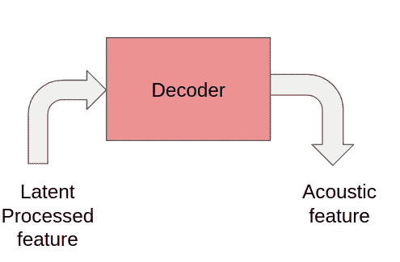
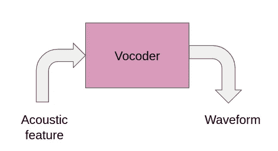

# 基本文本到语音转换，已解释

> 原文：<https://towardsdatascience.com/text-to-speech-explained-from-basic-498119aa38b5?source=collection_archive---------13----------------------->

## 了解 Alexa、Siri 和其他聊天机器人中使用的文本到语音转换技术。

照片由 [Unsplash](https://unsplash.com?utm_source=medium&utm_medium=referral) 上的 [Findaway Voices](https://unsplash.com/@findawayvoices?utm_source=medium&utm_medium=referral) 拍摄

顾名思义，在这个博客中，我们将学习文本到语音(TTS)合成。当你听文本到语音转换时，你脑海中响起的第一个铃声是什么？对我来说，它是 Alexa、Google Home、Siri 和许多其他目前呈指数增长的对话机器人。深度学习研究的进展帮助我们生成了类似人类的声音，所以让我们看看如何利用这一点。我将从几个定义开始，但是如果你想了解更多，那么先阅读[这篇](https://medium.com/@AnveeNaik/all-you-need-to-know-to-start-speech-processing-with-deep-learning-102c916edf62)博客。

**音位**:音位是使一个单词的发音和意义不同于另一个单词的最小声音单位。

韵律:诗歌中使用的节奏和声音模式。

**Mel-spectrogram:** 通过对音频的短时傅立叶变换(STFT)的频率轴进行非线性变换，降低维数而得到的。它强调对区分语音非常重要的低频细节，而不强调通常是噪声的高频细节。

我强烈建议您在继续之前阅读这篇[文章](https://medium.com/@AnveeNaik/all-you-need-to-know-to-start-speech-processing-with-deep-learning-102c916edf62)，因为在这里我已经详细解释了上述术语和音频的其他基础知识。现在，让我们了解深度学习算法用于设计 TTS 系统的基本结构。

# 文本到语音(TTS)结构

整体设计(图片由作者提供)

这是 TTS 系统中使用的不同组件的高级示意图。我们模型的输入是文本，它经过几个模块，最终被转换成音频。让我们了解一下这些模块对流程的贡献。

**预处理器**

*   **分词**:将句子分词
*   **音素/发音**:它根据音素的发音将输入文本分解成音素。例如，“你好，祝你愉快”转换为 HH AH0 L OW1，HH AE1 V AH0 G UH1 D D EY1。
*   **音素时长:**表示音频中每个音素所用的总时间。
*   **音高:**传达情感的关键特征，它极大地影响着语音的韵律。
*   **能量:**表示 mel 频谱图的帧级幅度，直接影响语音的音量和韵律。

语言特征只包含音素。能量、音调和持续时间实际上分别用于训练能量预测器、音调预测器和持续时间预测器，模型使用它们来获得更自然的输出。

**编码器**

编码器(图片由作者提供)

其他处理(图片由作者提供)

编码器输入语言特征(音素)并输出 n 维嵌入。编码器和解码器之间的这种嵌入被称为潜在特征。潜在特征是至关重要的，因为像说话人嵌入(将在未来的博客中解释)等其他特征与这些特征连接在一起，并传递给解码器。此外，潜在特征还用于预测能量、音调和持续时间，这反过来在控制音频的自然度方面起着至关重要的作用。

**解码器**

解码器(作者图片)

解码器用于将嵌入在潜在处理特征中的信息转换成声学特征，即 Mel 频谱图。

但是为什么输出 mel 频谱图而不是直接从解码器产生语音/音频呢？

这是因为音频包含比 Mel 频谱图更多的变化信息(例如，相位)。与文本到语谱图生成相比，这导致文本到音频的输入和输出之间的信息差距更大。因此，Mel 光谱图是优选的。

**声码器**

声码器(作者图片)

它将声学特征(Mel 声谱图)转换为波形输出(音频)。这可以使用 Griffin Lim 这样的数学模型来完成，或者我们也可以训练一个神经网络来学习从 mel 频谱图到波形的映射。事实上，基于学习的方法通常优于 Griffin Lim 方法。

因此，我们没有使用解码器直接预测波形，而是将这一复杂而复杂的任务分为两个阶段，首先从潜在的处理特征预测 mel-spectrogram，然后使用 mel-spectrogram 生成音频。

现在，您已经熟悉了 TTS 系统中使用的所有基本组件。我们可以得出结论，你已经准备好阅读和学习像 Fastspeech、Tacotron、WaveNet 等复杂的研究论文。为了感受一下 TTS 的实际表现，请点击这里查看一些音频样本[。](https://speechresearch.github.io/fastspeech2/)

让你看看下一篇博客包含了什么，我们知道如何从文本中生成特定说话者的音频，但是我们如何为一段文本生成不同说话者的音频呢？我们不能只转储与模型架构的当前设置中的所有说话者相关的数据，因为模型会与这种一对多映射(一个文本到多个说话者的映射)混淆。这将导致模型产生在扬声器之间平均的音频，这将不是清晰可闻或可理解的。

*成为* [*介质会员*](https://medium.com/@AnveeNaik/membership) *解锁并阅读介质上的许多其他故事。关注我们的*[*Medium*](https://medium.com/@AnveeNaik)*，阅读更多此类博文*。