# 文本到语音—基础知识(第二部分)

> 原文：<https://towardsdatascience.com/text-to-speech-foundational-knowledge-part-2-4db2a3657335?source=collection_archive---------17----------------------->

## 训练、合成和实现最新的 TTS 算法所需的知识:利用 ESPnet 的机器学习音频从零到英雄系列的第 2 部分

资料来源:Giphy

# 背景:

在第 1 部分中，我们通过一个简单的 ESPnet TTS 实现展示了快速合成的能力。不过，如果你和我一样，你可能想知道这一切是如何在幕后工作的！起初，我很难找到一篇完整的文章或资料来源来解释幕后发生的事情。这篇文章总结了大量的调查/研究论文、YouTube 演讲视频和博客文章。如果没有这篇出色的[调查论文](https://arxiv.org/abs/2106.15561)，这篇文章是不可能发表的，这篇论文提供了许多图片和文字。我试图在这里“综合”我的基础知识发现，希望这能让你更好地理解:

*   基本音频术语和框架
*   文本到语音算法的发展
*   深入研究声学模型和神经声码器算法
*   下一代端到端 TTS

# 基本音频术语:

## 波形:

计算机解释在固定时间帧内改变振幅的音频信号。每个样本通常具有 65，536 个值(16 位)，质量以 kHz 为单位测量。波形中的循环分量是下面讨论的方法的主要分量。

来源:Giphy(音频波形)

## 音素:

文本到语音引擎不直接将字符作为输入，而是音素，特别强调 ARPA(英语),如在 CMU 字典中找到的。例如，绿色是 G R IY1 N。其他语言可能有不同的格式，但用法相同。这就是为什么我们将输入文本(在训练期间)转换成音素，这些音素是区分语言中一个单词与另一个单词的不同声音单位。当你的输入被处理后，它会被一个训练有素的神经网络转换成音素，这个神经网络还会学习生成新单词的拼写。

## 光谱图:

深度学习模型不直接将原始音频作为输入，因此音频被转换为频谱图，并且傅立叶变换源音频到时频域。变换过程在变换之前将声音信号的持续时间分割成较小的信号，然后将输出组合成单个视图。

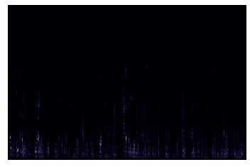

示例光谱图(作者)

上图中的颜色直观地展示了音频分贝。然而，我们可以看到，我们并没有从这个音频剪辑中捕捉到太多。

## 梅尔光谱图:

人类对声音频率的理解可能会因对频率的印象而大相径庭，大自然对声音的感知不是线性的。这就是开发[梅尔秤](https://www.sfu.ca/sonic-studio-webdav/handbook/Mel.html)的原因。它的关键是在处理振幅(多大声)和频率(音高)的对数标度时考虑了分贝标度。把声音特征全部储存在梅尔的声谱图中。

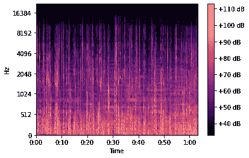

Mel 谱图示例(作者)

我们可以看到，Mel-spectrogram 提供了一个更清晰的图像，以分贝为单位进行测量，并针对输入 TTS 进行了优化。如果你想对数学有更深的理解，看看这个伟大的帖子[这里](/audio-deep-learning-made-simple-part-2-why-mel-spectrograms-perform-better-aad889a93505)。

## 音频评估指标:

ML 工程师用来评估语音合成质量的最常见的数字指标是平均意见得分(MOS)，其范围从 0 到 5，日常人类语音从 4.5 到 4.8。要检查基准，你可以在这里看，但至少目前不包括所有的 TTS 算法。

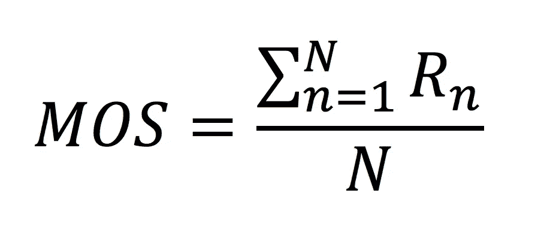

来源:作者的平均意见得分

## 自回归(AR):

描述基于过去数据预测未来值的模型，其基本假设是未来 ***将*** 与过去相似。在处理音频领域时，这是一个重要的注意事项，因为你需要知道扬声器在哪些单词上受过训练，以产生正确的输出音频。当在这两种算法之间工作时，还存在速度和质量的一般化折衷，其中自回归生成具有较低的速率，但是较高的质量和非自回归生成具有相反的效果。

## 统计参数语音合成(SPSS):

一种解决传统拼接 TTS 问题的文本到语音转换方法。这种方法通过生成语音所需的声学参数，然后使用算法从生成的声学参数中恢复语音来合成语音。主流的两阶段方法框架是基于 SPSS 的。

## **主流 2 阶段框架:**

回顾一下，TTS 已经从串联合成发展到参数合成，再到基于神经网络的合成，如[第 1 部分](/text-to-speech-lifelike-speech-synthesis-demo-part-1-f991ffe9e41e)所述。在第 1 部分中，我们分解了主流的两阶段方法，如下所述。

来源:作者图片(主流 2 阶段高层架构)

## **文本到语音框架:**

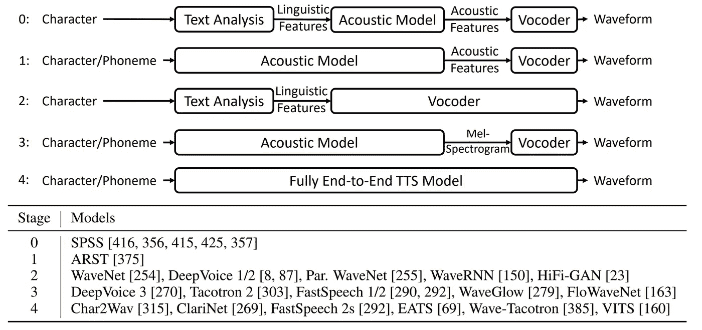

来源:关于神经语音合成的调查

上图显示了目前使用的五种不同类型的 TTS 框架。第三阶段和第四阶段是本文的主题。

当前主流的基于两阶段(声学模型+声码器)神经网络的模型已经显著提高了合成语音的质量。突出的方法(例如，Tacotron 2/FastSpeech 2)将首先从文本生成 Mel 谱图，然后使用诸如 WaveNet 的神经声码器从 Mel 谱图合成语音。目前还有一种朝着下一代完全端到端 TTS 模型的演进，我们将对此进行讨论。

# 文本到语音的演变:

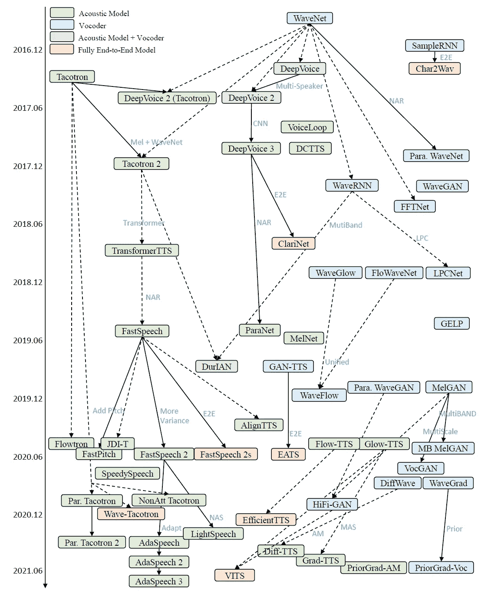

来源:关于神经语音合成的调查

上面这张侧面的网络图清楚地表明，利用神经网络的合成文本到语音(TTS)领域在过去几年中一直呈爆炸式增长，最近的趋势是如何从主流的两阶段(声学模型+声码器)转向下一代端到端模型。

在下面的数据流图中，我们可以看到不同的基于神经的 TTS 算法是如何从原始文本(字符)开始并生成波形的。上图和下图都非常有助于将算法的发展和相应的数据流联系起来。

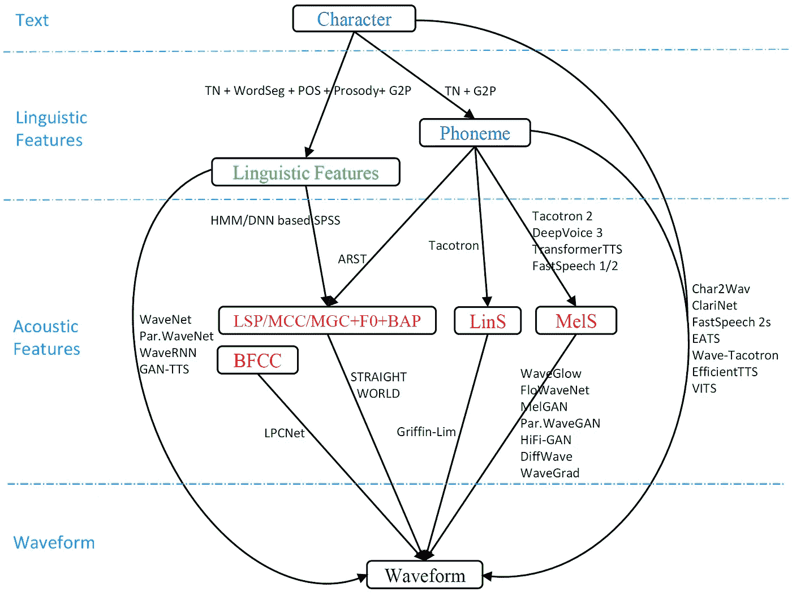

来源:关于神经语音合成的调查

# 声学算法和神经声码器深入研究:

资料来源:Giphy

# 声学算法:

当前声学算法使用的 ***三种*** 主要架构类型有:

## 递归神经网络(RNN)

来源:[通过根据 Mel 谱图预测调节 WaveNet 的自然 TTS 合成](https://arxiv.org/abs/1712.05884v2)

RNN 是用于诸如非自回归 TacoTron 2 的算法的声学模型框架，并且是递归的序列到序列特征预测网络，其关注于从输入字符序列预测 Mel 谱图帧的序列。 [WaveNet](https://paperswithcode.com/method/wavenet) 的修改版本根据预测的 Mel 谱图帧生成时域波形样本。TacoTron 2 架构在改善语音质量方面比其他方法(如级联、参数和自回归 TacoTron 1)向前迈进了一大步。TacoTron 2 的架构如上图所示。

## 卷积神经网络(CNN)

像 DeepVoice 3 这样的算法利用全卷积网络结构进行语音合成，从字符生成 Mel-spectro gram，并扩展到真实世界的多说话人数据集。这类声学算法类似于主流 CNN 通过对每类图像的训练来分类狗和猫，但在这种情况下，它的训练是在梅尔频谱图上进行的。DeepVoice 3 通过使用更紧凑的序列到序列模型和直接预测 Mel-spectrogram 而不是复杂的语言特征，改进了以前的 DeepVoice 1/2 系统。

## 变压器

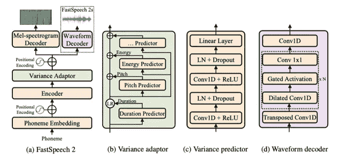

来源:[微软研究院博客 FastSpeech2，作者:徐坦](https://www.microsoft.com/en-us/research/lab/microsoft-research-asia/articles/fastspeech-2-fast-and-high-quality-end-to-end-text-to-speech/)

基于转换器的(自我关注)声学算法，如 FastSpeech 1/2，利用基于转换器的编码器-注意力-解码器架构从音素生成 Mel 频谱图。它们是[转换网络](/transformer-neural-network-step-by-step-breakdown-of-the-beast-b3e096dc857f)的衍生，后者是一种架构，旨在解决序列到序列的任务，同时轻松处理远程依赖性。与具有自回归编码器注意力解码器的其他模型(例如 TacoTron 2)相比，基于变压器的算法通过前馈变压器网络显著加快了语音合成，从而并行生成 Mel 频谱图。最值得注意的是，该算法通过完全去除作为中间输出的 Mel 频谱图来简化输出，并且在推理过程中直接从文本生成语音波形，从而享有训练中完全端到端联合优化和推理中低延迟的好处。FastSpeech 2 实现了比 FastSpeech 1 更好的语音质量，并且通过利用基于变换器的架构保持了快速、鲁棒和可控的语音合成的优点；这可以在上面的 FastSpeech 2 图中看到，重要的是要注意方差适配器部分是使用 FastSpeech 2 时与其他声学算法/框架相比的主要区别。

# 神经声码器算法

用于将声学模型输出声谱图转换成我们的目标音频波形(也称为合成语音)。非自回归模型最有前途，但不如自回归模型。

基本上有四种主要类型的声码器:

*   **自回归:** WaveNet 是第一个基于神经网络的声码器，它扩展卷积以自回归生成波形点。这种方法的新颖之处在于它能够利用几乎没有关于输入音频信号的先验知识，而是依赖于端到端的学习。
*   **基于流程:**用一系列可逆映射转换概率密度的生成模型。这种方法有两个不同的框架，一个利用自回归转换，另一个[双向](https://arxiv.org/abs/2109.13675.)转换。
*   **基于 GAN:**仿照典型的生成对抗网络(GANs)用于图像生成任务。任何一个 GAN 框架都是由一个用于数据生成的生成器和一个用于判断生成器数据的鉴别器组成的。我总是想到的类比是强盗和警察，强盗总是试图想出新的计划/袭击，而警察试图阻止他们。大多数当前的基于 GAN 的声码器将利用扩展卷积来增加感受野以模拟波形序列中的长相关性，并利用转置卷积来上采样条件信息以匹配波形长度。另一方面，鉴别器专注于设计模型以捕获波形特征，从而为发生器提供更好的引导信号。损失函数提高了对抗训练的稳定性和效率，并提高了音频质量。如下表所示，许多现代神经声码器都是基于 GAN 的，并将使用各种方法来实现发生器、鉴别器和损失函数。

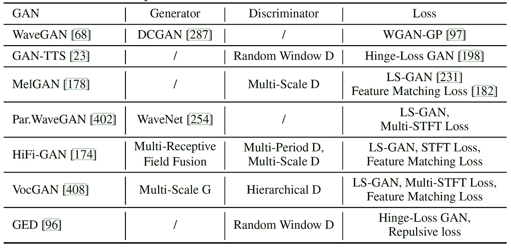

来源:关于神经语音合成的调查

**基于扩散:**利用声码器的去噪扩散概率模型，直觉上是数据和潜在分布之间的映射具有扩散过程和逆过程。目前的研究表明，这类声码器产生高质量的语音，但需要大量的时间进行推理。

下图展示了所有类型的神经声码器及其架构。

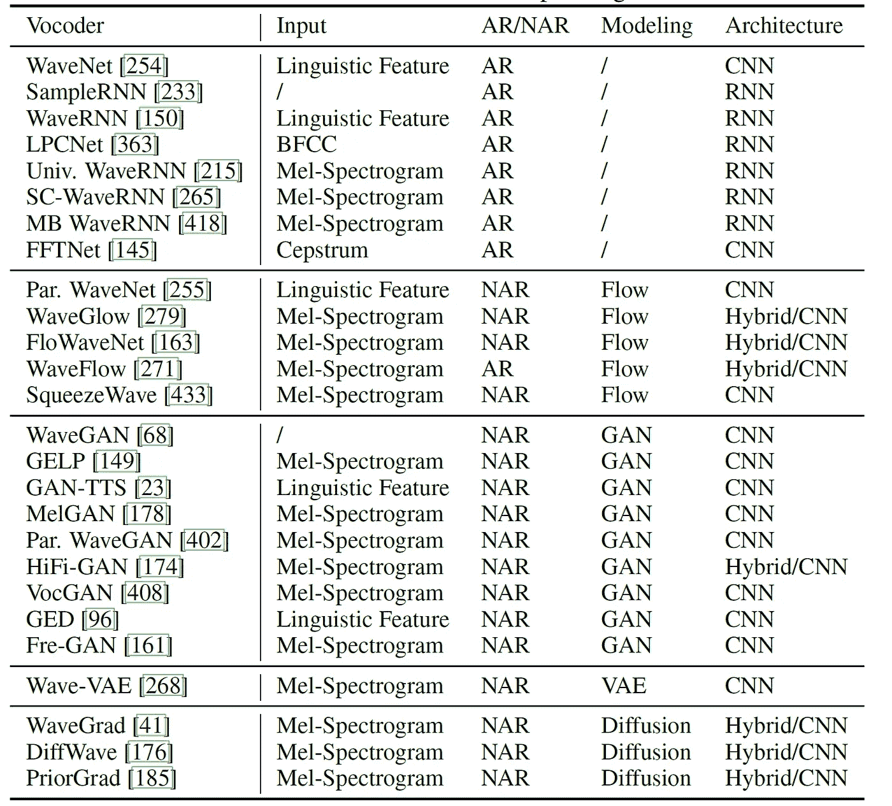

来源:关于神经语音合成的调查

# 下一代端到端 TTS

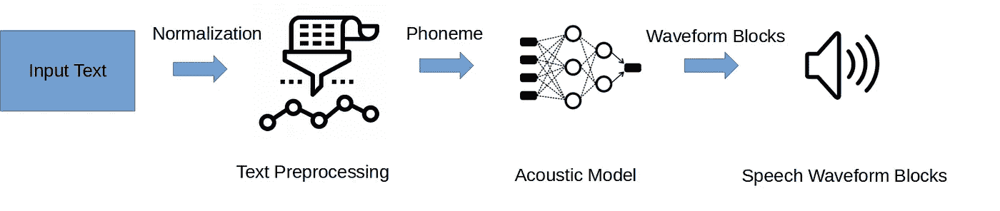

来源:作者图片(下一代端到端 TTS 框架)

发展图中定义的 TTS 的当前研究和发展正朝着端到端 TTS 的方向发展，尽管与主流的两阶段方法相比，由于当前的一些质量限制和训练时间资源要求，它还没有达到临界质量。也就是说，与 SPSS 相比，端到端 TTS 有一些明显的优势:

*   大幅降低开发和部署成本。
*   拥有连接架构和端到端优化意味着减少当前主流 2 阶段方法中的错误传播。
*   需要较少的人工注释和特性开发。
*   传统的声学模型需要语言和声学特征之间的对齐，而基于序列到序列的神经模型通过注意或预测隐含地学习对齐
*   持续时间联合，这更像是端到端的，并且需要更少的预处理
*   随着神经网络建模能力的不断增强，语言特征被简化为仅仅是字符或音素序列，而声学特征已经从低维的、浓缩的

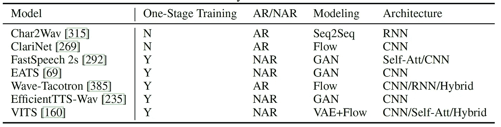

来源:关于神经语音合成的调查

在上图中，我们可以看到当前提出的端到端 TTS 算法的概述，尽管不是所有的*都有开源代码。*

FastSpeech 2s 被部署到微软 Azure Managed TTS 服务中，对我来说，这以一种应用的商业形式清楚地证明了该领域的未来状态。对我们来说幸运的是，开源的 ESPnet 2 有带对抗学习的条件变量自动编码器( [VITs](https://arxiv.org/abs/2106.06103) )可供使用，我计划在未来的帖子中实际介绍它。

# 下一步是什么？

现在，我们已经在第 1 部分中使用 EspNet 2 做了一些简单的 TTS，并且对声学算法、神经声码器和整个 TTS 架构有了很好的基础理解，让我们开始应用它吧！未来的文章将会介绍如何在 ESPnet 中进行语音增强、自动语音识别和训练我们的声音！

资料来源:Giphy

# 参考

如前所述，如果没有微软亚洲研究院团队在“[神经语音合成调查](https://arxiv.org/abs/2106.15561)”中提供的精确措辞、描述和照片，这篇文章是不可能发表的。

*   [https://arxiv.org/abs/2106.15561](https://arxiv.org/abs/2106.15561)
*   [https://speechresearch.github.io/fastspeech/](https://speechresearch.github.io/fastspeech/)
*   [https://www . Microsoft . com/en-us/research/blog/fast speech-new-text-to-speech-model-improves-on-speed-accuracy-and-control ability/](https://www.microsoft.com/en-us/research/blog/fastspeech-new-text-to-speech-model-improves-on-speed-accuracy-and-controllability/)
*   [https://towards data science . com/audio-deep-learning-made-simple-part-2-why-Mel-spectrograms-perform-better-aad 889 a 93505](/audio-deep-learning-made-simple-part-2-why-mel-spectrograms-perform-better-aad889a93505)
*   [https://theaisummer.com/text-to-speech/](https://theaisummer.com/text-to-speech/)
*   [https://www.youtube.com/watch?v=knzT7M6qsl0](https://www.youtube.com/watch?v=knzT7M6qsl0)