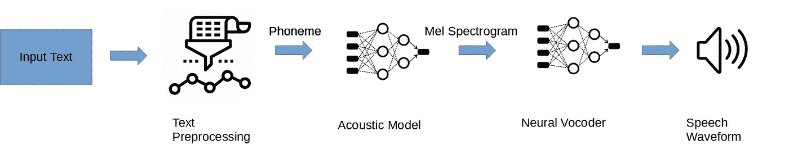
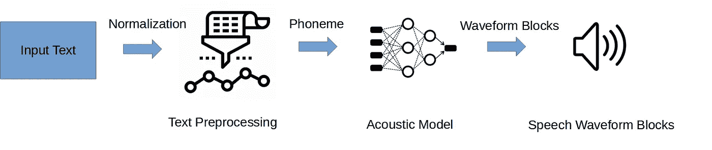

# 文本到语音—逼真的语音合成演示(第一部分)

> 原文：<https://towardsdatascience.com/text-to-speech-lifelike-speech-synthesis-demo-part-1-f991ffe9e41e?source=collection_archive---------2----------------------->

## 利用 ESPnet 从零到英雄系列的开始。第一篇文章涵盖了以音频为中心的机器学习的现状，包括背景、架构和一个 TTS 演示。

资料来源:Giphy 的反对意见

跳到**[**谈够了就演示吧！**](#5cf5)**如果要查看代码****

# ******背景******

****音频的机器学习领域现在无疑是最前沿的。当今产品提供的大多数应用程序都是专有的。社区正在开发许多特定于音频的开源框架和算法。在接下来的几篇文章中，我的目标是更深入地探究音频的一些实际的端到端应用。从语音到文本，从文本到语音，再到声音克隆。正如标题所提到的，这篇文章将关注文本到语音(语音合成)的简单实现，并作为本系列的第 1 部分。****

# ******文本到语音转换用例******

*   ****个人虚拟助理****
*   ****创建您自己的有声读物/播客****
*   ****支持语音的网站****
*   ****独特的 NPC 游戏玩家声音****
*   ****免费开源的方式帮助有语言障碍的用户自由交流****
*   ****计算机扫盲支持工具****

# ******现代文本到语音的历史******

****来源:Youtube 第一台电脑演唱《黛西·贝尔》****

****我遇到了一些开源的文本到语音转换框架。经过大量的研究/实验，只有一个被证明是完全开源的、可扩展的、易于集成到应用程序中的。****

****使用计算机合成语音并不新鲜。第一个文本到语音合成的成功用例发生在 20 世纪 60 年代末，当时研究人员在贝尔实验室使用一台笨重的房间大小的 IBM 计算机重现了歌曲“ [Daisy Bell](https://www.youtube.com/watch?v=41U78QP8nBk&ab_channel=SlavenRadovic) ”，但音频质量仍然是几十年来的一个问题。直到机器学习的现代革命和深度神经网络(DNNs)的进步，这个领域才得以转变，算法可以产生听起来像人类的合成语音。许多新的音频用例现在是可能的和可扩展的。****

****由于 DNN 的要求，为您的音频用例训练您自己的定制声音是非常 GPU 密集型的，需要几天甚至几周的时间。这是当前社区大规模采用和整合的一个障碍。正如我们将在本演示中探索的那样，然而，通过预先训练的声音，您可以快速获得结果！****

****在最初的研究中，你会第一次看到来自 Corentin Jemine 的广受欢迎的 [SV2TTS](https://github.com/CorentinJ/Real-Time-Voice-Cloning) ,一瞥什么是可能的是很有趣的。它不是完全可定制的，如果你的用例是声音克隆，你会得到不合格的结果。虽然它是开源工具的一个很好的例子，但它的主干被商业化成了[like . ai 的](https://www.resemble.ai/)主要产品。****

****因为 TTS 的主流 2 阶段方法遵循与卷积神经网络(CNN)模型类似的结构，简而言之，可以用文本来标记“Mel-Spectrogram”(音频图像)，这允许音频的分类任务。我们基本上使用了现代 CNN 用来分类猫和狗的相同深度学习技术，现在使用音频图像来分类声音，也就是 Mel-spectrogram。****

****随着最近向神经网络 TTS 框架的推进，我遇到了 ESPnet2 和 Tensorflow TTS。****

****当你阅读这篇文章的时候，可能会有新的东西发布，所以我建议你经常回顾代码为的[论文中的音频领域。](https://paperswithcode.com/search?q_meta=&q_type=&q=audio)****

****这条路径将我引向以下机器学习音频框架:****

## ****TensorFlow TTS:****

*   ****仅仅是一个文本到语音的应用程序。****
*   ****加快训练/推理进度的能力，通过使用[量化感知](https://www.tensorflow.org/model_optimization/guide/quantization/training_comprehensive_guide)和[修剪](https://www.tensorflow.org/model_optimization/guide/pruning/pruning_with_keras)进一步优化，产生接近实时的结果。为了证实这一点，请看一下 Ahsen Khaliq 在这里设置的拥抱面孔链接。****
*   ****专为支持实时语音合成而构建。****

## ****ESPnet:****

*   ****包括语音识别和合成的端到端语音处理工具包。这给出了统一的神经模型架构，从而为机器学习工程师带来了简单明了的软件设计。****
*   ****内置自动语音识别(ASR)模式，基于著名的 [Kaldi](https://kaldi-asr.org/doc/about.html) 项目****
*   ****端到端 TTS 算法的广泛算法支持。****
*   ****最大的 TTS 开源活跃社区。****
*   ****大量语言支持****
*   ****提升性能的新型 ASR 变压器****

****这两个项目都是在 Apache-2.0 许可下开源的，可以免费使用:)****

****如果$$$$没有障碍，您可以随时使用任何云服务提供商(CSP)提供的付费托管服务 TTS。****

****我选择与 ESPnet 合作是因为它有更广泛的文档、社区支持和端到端的框架。也就是说，如果您只是在寻找一个更轻量级的 TTS 架构，TensorFlow TTS 可能是更好的选择。****

# ****ESPnet1 至 ESPnet2****

****深入研究 ESPnet repo，您可能会感到困惑，因为它包含 ESPnet1 和 ESPnet 2…不要害怕！ESPnet2 是 DNN 培训的最新版本，具有以下升级:****

*   ****现在独立于 Kaldi 和 Chainer，不像 ESPnet1。****
*   ****培训期间 parallels 中的特征提取和文本处理****
*   ****通过增强持续集成、丰富文档、支持 docker、pip 安装和 model zoo 功能来改进软件工作流程。****
*   ****对于初学者来说，最好利用 ESPnet2，从我的理解来说，ESPnet1 更具可定制性。****

# ****文本到语音体系结构类型****

****我们必须理解我们可以用来合成语音的不同类型的架构，以及当前的发展。****

## ****串联式——老派****

****传统的老式技术，使用存储的语音数据库，将语音映射到特定的单词。虽然对于某些映射的单词，您可以产生可理解的音频，但输出的语音将不包括自然的声音、“韵律、情感等”****

## ****主流 2 阶段:****

****一种混合参数 TTS 方法，它依靠由声学模型和神经声码器组成的深度神经网络来近似输入文本和组成语音的波形之间的参数和关系。****

****主流两阶段 TTS 系统的基本高级概述****

********

****来源:作者提供的图片(主流 2 阶段高层架构)****

## ****文本预处理和规范化:****

*   ****只是输入文本的前一步。它将以输入到声学模型中的向量的形式被转换成目标语言的语言特征。****
*   ****将输入文本转换为 ESPnet 可以解释的格式。这是通过归一化(例如 Aug to August)和经由字形到音素的转换(例如 August to 2fadaset)转换成音素来完成的。****

## ****声学模型:****

*   ****算法被优化以将预处理/标准化的文本转换成 [Mel 光谱图](https://en.wikipedia.org/wiki/Mel-frequency_cepstrum)作为输出。****
*   ****对于大多数算法，您需要将语言特征向量转换为声学特征，再转换为 Mel 谱图。声谱图确保我们现在已经考虑了所有相关的音频特征。****

## ****神经声码器:****

*   ****最后一步的输入是 Mel 频谱图，通过神经声码器转换成波形。****
*   ****虽然有许多不同类型的神经声码器，但今天的现代声码器都有 GAN 基础。****

## ****下一代端到端文本到波形模型:****

****最近的音频 TTS 论文正朝着这个方向发展。利用单一声学模型，该模型不输出馈送神经声码器的 Mel 频谱图。****

********

****来源:作者提供的图片(下一代端到端架构)****

## ****概述:****

*   ****直接预测序列，而无需在任何地方生成中间表示或 Mel 谱图，从而消除了对神经声码器的需要。****
*   ****这极大地简化了快速波形生成目标所需的模型架构和训练。****
*   ****在撰写本文期间，ESPnet 仅支持具有对抗性学习的条件变分自动编码器( [VITs](https://arxiv.org/abs/2106.06103) )。****

## ****怎么会？****

*   ****通过训练 DNN 模型来预测波形块的序列(1-D 目标信号被切割成没有重叠的段),而不是 2 阶段过程所预测的整个波形。****
*   ****训练速度的提高来自于块自动回归波形的产生。每一步都并行生成一个新的块，而不是像 WaveRNN 这样的传统神经声码器的回归性质。****

# ******说够了就演示吧！******

****我们将使用广泛使用的 [**LJSpeech**](https://keithito.com/LJ-Speech-Dataset/) (美国女性说话者)预训练模型来回顾英语的文本到语音单说话者示例。****

****还有其他语言，比如汉语普通话，日语等。，你可以利用。如果你想要快速简单的东西，我推荐你去看看[拥抱脸](https://huggingface.co/models?pipeline_tag=text-to-speech&sort=downloads&search=tts)来找到更多 ESPnet 训练过的模型。****

****你可以通过[Google Colab](https://colab.research.google.com/github/espnet/notebook/blob/master/espnet2_tts_realtime_demo.ipynb)ESPnet TTS Demo 或在本地跟进。如果你想在本地运行，确保你有一个 CUDA 兼容的系统。****

## ****步骤 1:安装****

****从终端或通过前缀为(！idspnonenote)的 Jupyter 笔记本安装。)****

## ****步骤 2:下载预先训练的声学模型和神经声码器****

****实验！(这是有趣的部分)****

## ****下一代端到端( **Text2wav)** 型号:****

****记住这是最新最棒的！这个算法不需要神经声码器。****

*   ****具有对抗学习的条件变分自动编码器****

## ****主流 2 阶段( **Text2mel)车型**:****

****回想一下，这些坚固的声学模型将输出 Mel 频谱图****

*   ****Tacotron2****
*   ****变压器-TTS****
*   ****(Conformer)快速演讲****
*   ****(Conformer)快速语音 2****

## ****神经声码器:****

****将获取 Mel 光谱图并将其解码成波形(音频)****

*   ****平行波****
*   ****多波段梅尔根****
*   ****希菲甘****
*   ****风格梅尔根。****

****下面的框架通过标签链接，并替换您希望执行的预训练模型。在本系列的第 2 部分，我们将深入解释所有这些晦涩难懂的声学算法的含义。****

## ****步骤 3:模型设置****

****使用选定的预训练声学模型和神经声码器(如果选择)初始化您的 ESPnet 模型。对于一些声学算法，有一些超参数需要调整，但我们将在下一篇文章中深入探讨。现在使用缺省值。****

## ****重要输入注释和警告:****

*   ****根据您使用的预先训练的语言/模型和输入文本，将决定您的目标音频的质量。****
*   ****如果你使用预训练模型没有训练过的单词，你会得到一个低于标准的结果。****
*   ****添加？！会给你的演讲增加内容，增加真实性。****
*   ****你可以添加逗号，在演讲中添加一个“自然停顿”。****
*   ****虽然对文本输入没有明确的限制，但随着时间的推移，你的 RTF 分数会随着大量文本块而下降。最好在更大的块中工作。****

## ****第四步:语音合成****

****资料来源:Giphy****

****希望这一部分不言而喻，但只要把你想转换成美丽的音频文本！****

****终于，你成功了！相对传递函数(RTF)是一个音频输出质量指标，范围在 0 到 1 之间，目标是产生尽可能接近 1 的音频波形。****

****机器学习的每个领域都需要某种形式或方式的实验。音频肯定也不例外…我会说这是更有趣的聆听和比较算法代。****

****这再次归功于 ESPnet 的作者和渡边信二。****

# ****ESPnet TTS 单扬声器 LJSpeech 完整演示****

****假设您已经安装了 ESPnet 及其所需的依赖项。记得要有一台符合正确系统要求的机器！****

****来源:Giphy 的角斗士****

# ****下一步是什么？****

****虽然我们能够生成基于音频的目标输出，但也许…我猜你不是 100%满意。在以后的帖子中，我将概述 TTS 的基础知识，自动语音识别(ASR)，语音增强，对我们自己的定制语音的训练。证明了这种架构的非凡能力及其易于部署以支持大量出色的音频机器学习用例的能力。****

# ****参考****

*   ****ESPnet 的作者和撰稿人****
*   ****端到端语音处理工具包，****
*   ****https://www.youtube.com/watch?v=2mRz3wH1vd0&ab _ channel = wav lab****
*   ****https://theaisummer.com/text-to-speech/****
*   ****[https://www . cs . mcgill . ca/~ rwest/wikispeedia/wpcd/WP/s/Speech _ synthesis . htm #:~:text = The % 20 first % 20 computer % 2d based % 20 Speech，The % 20 history % 20 of % 20 bell % 20 labs](https://www.cs.mcgill.ca/~rwest/wikispeedia/wpcd/wp/s/Speech_synthesis.htm#:~:text=The%20first%20computer%2Dbased%20speech,the%20history%20of%20Bell%20Labs)。****