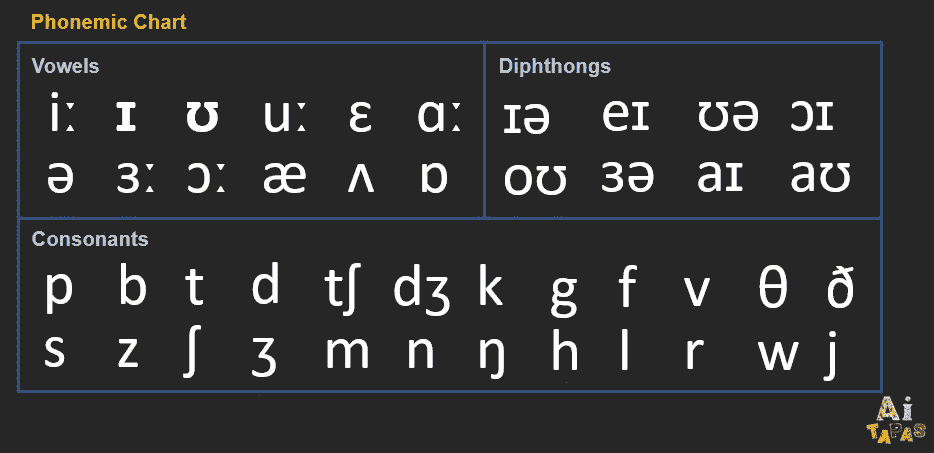
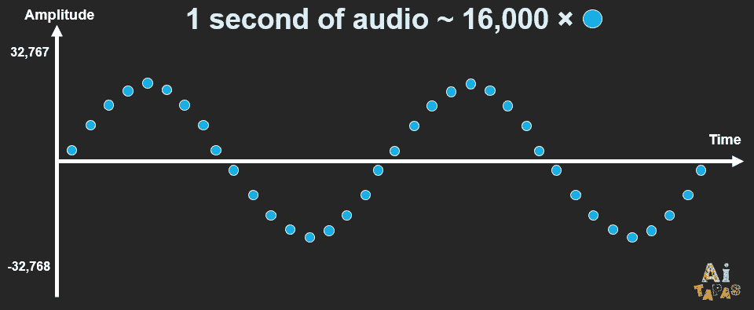
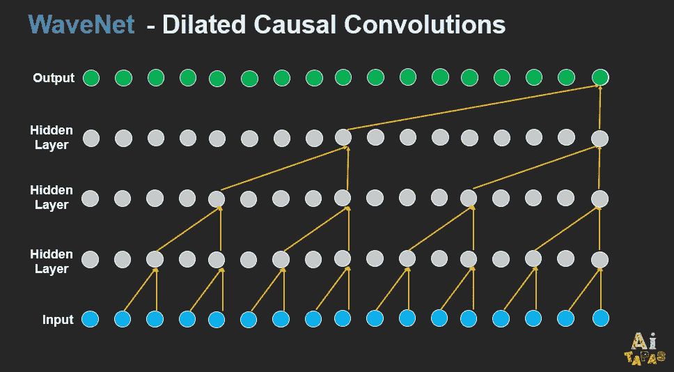
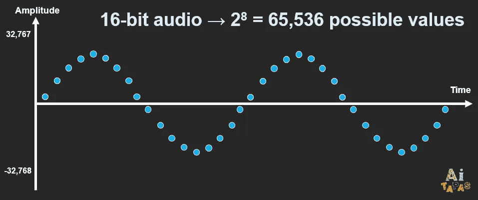
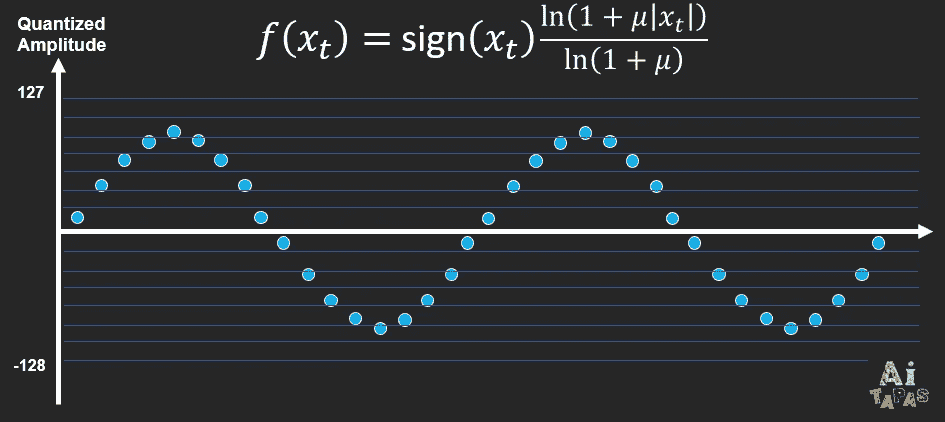
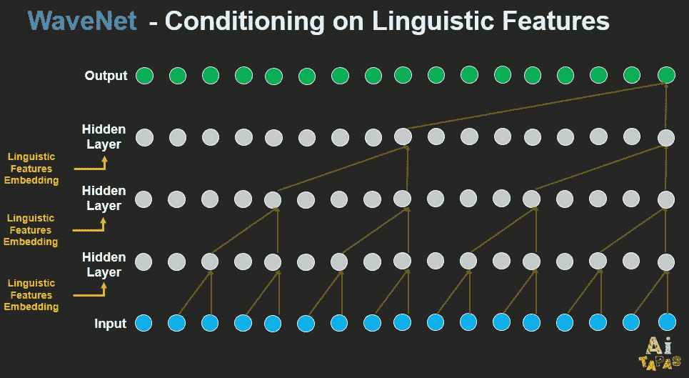
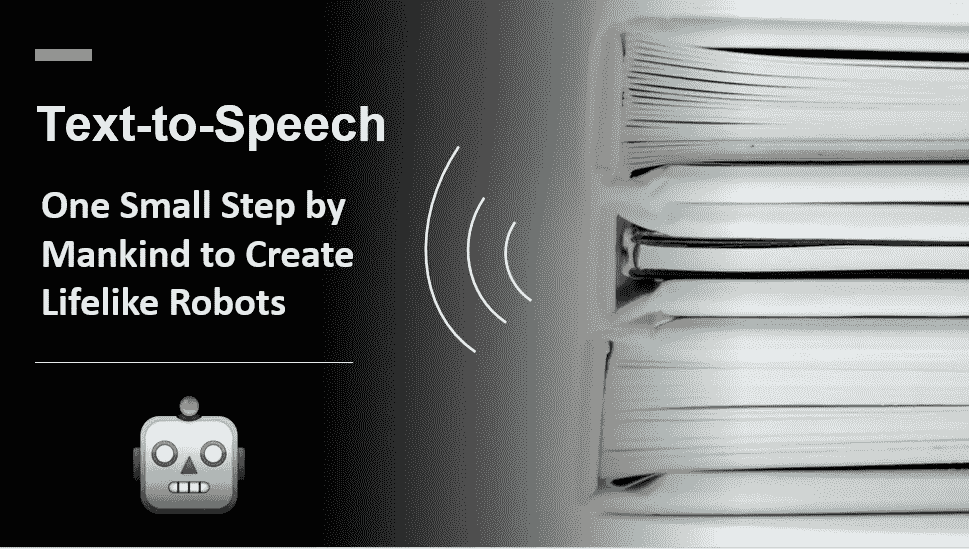

# 文本到语音:人类创造逼真机器人的一小步

> 原文：<https://towardsdatascience.com/text-to-speech-one-small-step-by-mankind-to-create-lifelike-robots-54e19f843b21?source=collection_archive---------13----------------------->

## 虽然机器人不会很快完全复制一个人，但语音合成确实已经走了很长的路

作者提供的视频

*注意:如果你更喜欢看视频，请随意播放相同内容的上述视频。*

虽然自 Kratzenstein 的元音器官能够发出五个元音以来，语音合成已经取得了很大进展，但将文本转换为听起来自然的语音却是另一个层次的挑战。

深度学习的最新发展为我们提供了应对挑战的新方法，在本文中，我们将简要介绍深度学习时代之前的主流文本到语音方法，然后探索 WaveNet 等模型，Google 的文本到语音 API 服务现在正在使用这些模型进行逼真的语音合成。

# 拼接文本到语音转换

如果你停下来想一想如何实现文本到语音的转换，你可能会想出一种与拼接方法非常相似的方法。

在拼接的文本到语音转换中，文本被分解成更小的单元，例如音素，然后这些单元的相应记录被组合以形成完整的语音。

在英语中，大约有 44 个音素，如下表所示。

作者图片

举个例子，单词“hello”有拼音文字`həˈloʊ`，表示由四个音组成:`h`、`ə`、`l`、`oʊ`。我们使用音频编辑器将四种独立的声音组合在一起，您可以播放下面的录音来聆听输出。这当然是我们连接声音的原始尝试，只是为了说明这个想法，专业制作的连接语音听起来肯定更好。

## *单个音素录音*

## “你好”的连接音素

因此，不难想象，如果我们可以保存一个单词及其相应语音脚本的字典，我们就可以只用 44 个音素记录来执行文本到语音的转换。事实上，有[字母到声音的规则](https://ieeexplore.ieee.org/document/1162873?reload=true&arnumber=1162873)可以高度准确地将任何单词翻译成它的音素，而不需要保存一个大的字典数据库。因此，即使你从未见过单词“ [covfefe](https://www.bbc.com/news/world-us-canada-40104063) ”，你还是会设法把它读出来。

然而，虽然我们在技术上解决了文本到语音的转换，但语音输出远非自然。使用我们前面描述的方法，单词“right”在句子“你还好吗？”中听起来是一样的和“你是对的。”。也许，我们可以通过添加语调转录和相应的录音来改进，这样就有了一个“正确”，根据上下文以更高或更低的音高结束。但是你可以很容易地想象出很多其他的场景，在这些场景中“正确”听起来会有所不同。因此，大量的变化使得拼接方法难以操作。

# WaveNet

2016 年 9 月，DeepMind 推出了 WaveNet，这是一种可以生成音频波形的深度学习模型。这种开创性的方法产生了听起来更自然的语音，用美国英语和普通话进行的盲测显示 WaveNet [优于谷歌最好的文本到语音转换系统](https://deepmind.com/blog/article/wavenet-generative-model-raw-audio)。

我们来听一个 WaveNet 的样本。

目前，谷歌的文本到语音转换 API 由 WaveNet 提供支持，你可以在[谷歌云的网站](https://cloud.google.com/text-to-speech#section-2)上亲自体验。

为了理解 WaveNet 是如何实现突破的，让我们看看该模型的三个主要特征。有关 WaveNet 的架构等完整细节，请参考[的原始论文](https://arxiv.org/abs/1609.03499)。

## 扩张的因果回旋

在数字音频中，声波表示为时间序列，y 轴表示振幅(或音频音量)，每秒钟的语音记录通常包含至少 16，000 个样本点。

作者图片

声波作为时间序列的性质也意味着每个样本都依赖于过去的样本。因此，挑战之一是模型必须考虑大量以前的样本。

为了克服这一挑战，DeepMind 提出了使用扩张因果卷积，这也是其主要的独特特征。本质上，原始音频样本点以如下所示的模式通过模型，只有过去的样本用于预测当前输出。对于那些了解卷积的人来说，这种模式类似于步长为 2 的卷积。并且通过将扩展的卷积堆叠成若干层，网络可以在保持计算效率的同时具有大的感受野。

作者图片

## 目标输出的非线性量化

原始音频通常存储为一系列 16 位整数值。这意味着有 2⁸ = 65，536 个可能值，幅度范围从-32，768 到 32，767。因此，语音模型必须输出这 65，536 个值中的一个值。

作者图片

也许你会想，30，000 的振幅听起来和 29，999 有什么不同？事实上，对于正常人的耳朵来说，这两个值听起来没有什么不同。因此，65，536 个可能值只会对模型训练造成不必要的负担。

因此，WaveNet 对目标输出进行非线性量化。换句话说，根据一个公式(如下所示)，65，536 个值被分组到更少数量的箱中。这将把唯一值的数量减少到 256 个量化值，使模型更易于管理。

作者图片

## 语言特征制约

在模型训练期间，语言特征嵌入也被馈送到每一层，以便模型可以学习如何从文本产生语音。这些嵌入本质上是语言特征的数字表示，如音素或重音符号。

作者图片

*注:上图是模型的简化表示。有关全部细节(例如，具有门控激活单元和跳过连接的剩余块)，请参考* [*原文*](https://arxiv.org/abs/1609.03499) *。*

# 其他深度学习模型

自从 WaveNet 发布以来，在 WaveNet 研究的基础上又有了其他改进的模型。其中包括 Tacotron2 和 Glow-TTS，我们希望在以后的文章中介绍它们。

通过使用 Mozilla 的 GitHub repositor y，我们可以很容易地实现这些模型。首先，请随意使用用户友好的 Colab 笔记本。

通过上面的插图，我们希望你现在能够有一种感觉，类似人类的语言是如何从文本中产生的。虽然机器人不会很快完全复制一个人，但语音合成确实已经走了很长的路。

感谢阅读，我希望这篇文章是有用的:)也请随时评论您可能有的任何问题或建议。

# 参考

 [## WaveNet:原始音频的生成模型

### 本文介绍了 WaveNet，一种用于生成原始音频波形的深度神经网络。该模型完全…

arxiv.org](https://arxiv.org/abs/1609.03499)  [## 文本到语音(TTS) -快速概述:Kishore Prahallad:免费下载，借用，和流…

### remove-circle Internet Archive 的浏览器内视频播放器需要启用 JavaScript。您的浏览器似乎…

archive.org](https://archive.org/details/Text-to-speechtts-AQuickOverview)  [## 互动音位图:英语的 44 种声音和符号

### 欢迎来到我们的互动音位图表区。我们制作了两个版本，这样每个人都可以练习和学习 44…

cambridgeenglishonline.com](http://cambridgeenglishonline.com/interactive_phonemic_chart/)