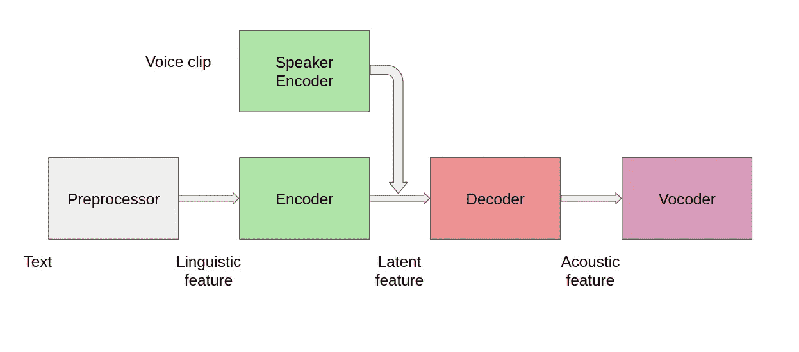

# 用于多说话者设置的文本到语音系统

> 原文：<https://towardsdatascience.com/text-to-speech-system-for-multi-speaker-setting-35e83f84e669?source=collection_archive---------21----------------------->

## 给定一个文本和一些关于说话者的信息，将文本转换成说话者声音的音频

塞尔吉奥·卡普齐马蒂在 [Unsplash](https://unsplash.com?utm_source=medium&utm_medium=referral) 上拍摄的照片

如果你能发出你最喜欢的名人的声音，你想做什么？

我肯定会让碧昂斯唱一首我写的歌，但为了她也为了我，这首歌只会给我听…

在我开始之前，让我清楚地定义这个博客的目标。给定所需说话者(比如说碧昂斯)的文本和一些语音剪辑，我希望我的人工智能输出一个音频剪辑，碧昂斯正在朗读我输入到该代码中的文本。所以本质上，这和我们之前看到的的文本到语音(TTS)问题是一样的，但是增加了一个限制，以特定说话者的声音输出语音。

在这篇博客中，我分享了两种可以完成我们任务的方法，最后我会比较这两种方法。

重温一下本博客中使用的一些基本术语:

我用这个术语来指说话者的身份。

语音:语音可以互换称为音频。当我们提到这些术语时，我们并不是专门针对一个发言者。

TTS 系统的数据集:它由文本和相应的语音组成。

单个说话者数据集:它包含单个说话者声音中的所有音频剪辑。数据集中的文本到语音映射对应于单个说话者。

多说话者数据集:它包含多说话者声音中的音频剪辑。数据集中的文本到语音映射对应于多个说话者。对于每一段文本，每个说话者都有一个音频剪辑，这种情况可能会发生，也可能不会发生。

> 要了解更多关于使用深度学习进行语音处理的基本术语，请参考[这篇](/all-you-need-to-know-to-start-speech-processing-with-deep-learning-102c916edf62)博客。

# 方法 1

假设我在单个说话人数据集上训练了一个 TTS 系统(如上面链接的[博客](/text-to-speech-explained-from-basic-498119aa38b5))。假设数据集在我的声音里。在这种情况下，在推理过程中，TTS 系统将为任何输入文本生成相应的 my voice 语音。现在我有了一些想要的演讲者(碧昂斯)的语音剪辑，并且我已经手动注释了每个剪辑的文本(更像一首歌)。为了生成她的声音，我需要做的就是用新的小碧昂斯数据集微调(重新训练)可用的 TTS 系统。这将如何完成我们的任务？

*   微调将使我们以前的模型更适合产生碧昂斯的声音。
*   训练 TTS 模型本质上涉及两个任务:1)学习如何将文本转换成音频内容，2)学习我们需要生成的音频的风格，即语音将在其中生成。当我们重新训练模型时，我们将只关注第二部分，模型将尝试学习一种新的风格，而第一部分不会有太多变化。

我们将需要多少声音剪辑来微调模型以适应碧昂斯的声音？—剪辑越多越好。但是，如果有一个可以轻松适应新数据集的模型，肯定会更有用，就像这篇[论文](https://arxiv.org/pdf/2103.00993v1.pdf)中的那样。

# 方法 2

现在我们来谈谈如果我们有一个多说话者数据集(其中一个说话者是碧昂斯)该怎么办。在这种情况下，除了文本和演讲，我们还需要一些关于演讲者的信息。该信息将使模型能够以特定说话者的声音为固定长度的文本生成音频。

TTS 系统(图片作者提供)

要了解预处理器、编码器、解码器和声码器的重要性和工作方式，请参考这里的。这里重要的附加部分是说话人编码器，它将说话人的语音剪辑作为输入，并生成表示说话人身份的嵌入(称为说话人嵌入)。扬声器嵌入和来自编码器的嵌入被合并并传递到解码器，解码器的输出被进一步传递到声码器。

我们期望来自声码器的音频输出具有类似于说话者的语音，我们将该说话者的语音剪辑作为输入传递给说话者编码器。所以在推断的时候，我们会把碧昂斯的语音片段(期望的说话者的语音片段)传递给说话者编码器，我们会在她(他们)的语音中得到结果音频。

唷，这似乎很简单！

这里需要注意的是，我们肯定希望说话者编码器生成说话者嵌入，使得两个说话者的嵌入相距很远，从而该模型不会混淆两个声音。我不会详细说明我们如何实现这一点，因为在这里，我们更关注于生成不同声音的语音，而不是扬声器编码器的训练。

做[检查这个](https://google.github.io/tacotron/publications/speaker_adaptation/)来听一些用这种方法产生的音频样本。

# 两种方法的比较

*   方法 1 是少数镜头自适应的，即，它将需要期望的说话者的不止一个语音剪辑，并且我们将不得不重新训练该模型。相比之下，方法 2 是零镜头自适应的，也就是说，它只需要所需说话者的一个语音剪辑，我们不需要任何额外的训练。
*   与标准 TTS 系统相比，方法 1 在模型结构上没有任何变化，而在方法 2 中，在模型中引入了说话人编码器。
*   方法 1 仅在训练期间我们有单个说话人数据集时适用，而方法 2 仅适用于多说话人数据集。

我希望这篇博客能帮助你学习如何使用文本到语音系统生成多人的声音。敬请关注这些令人兴奋的新话题，让自己保持最新状态！

*成为* [*介质会员*](https://medium.com/@AnveeNaik/membership) *解锁并阅读介质上的许多其他故事。关注我们的*[*Medium*](https://medium.com/@AnveeNaik)*，阅读更多此类博文*。