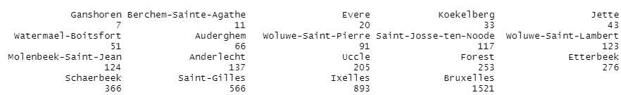
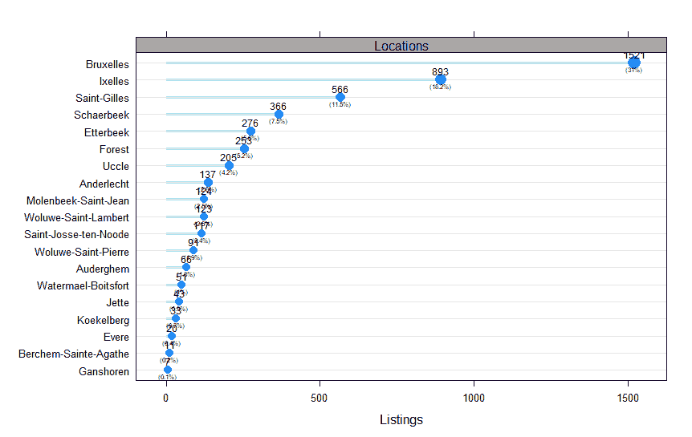
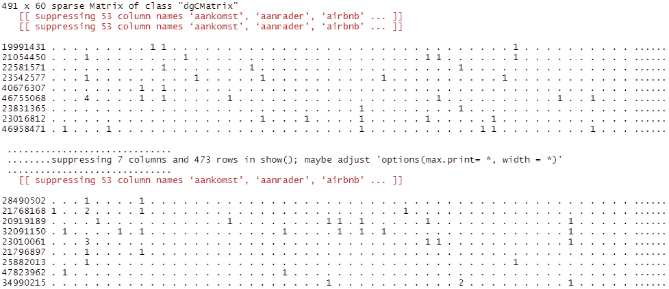
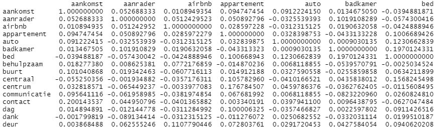
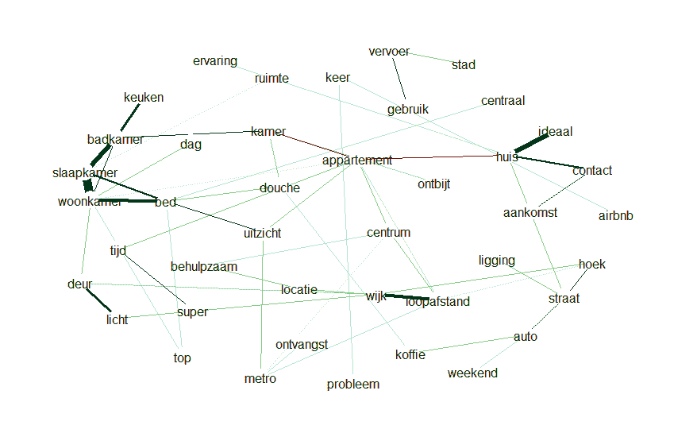
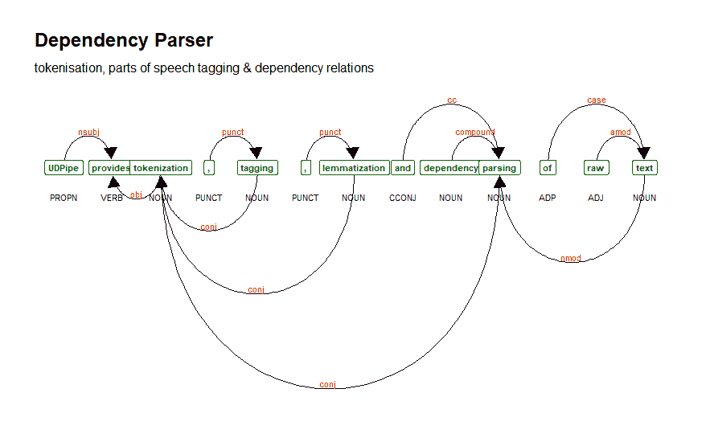
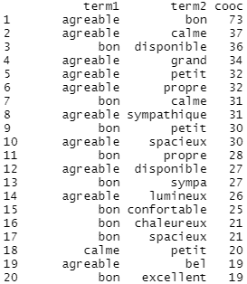
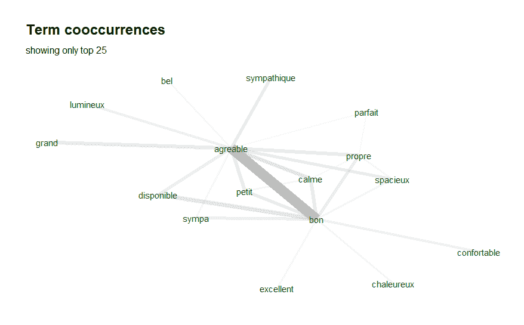

# TextPlot:用于可视化文本数据的 R 库

> 原文：<https://towardsdatascience.com/textplot-r-library-for-visualizing-text-data-a8f1740a032d?source=collection_archive---------14----------------------->

## 只需一个函数就能让你的文本数据可视化


奥马尔·弗洛雷斯在 [Unsplash](https://unsplash.com/s/photos/network?utm_source=unsplash&utm_medium=referral&utm_content=creditCopyText) 上拍摄的照片

# 动机

数据可视化是数据科学中的一项基本任务。我们可以从数据可视化中获得洞察力，因此它可以支持我们对问题的决策。

文本数据是很多人分析最多的数据之一。它也是最复杂的数据之一，因为我们必须花费大量时间对数据进行预处理，包括标记文本、删除无意义的术语、创建文档术语矩阵等。

可视化数据(如文本)有时与预处理数据一样复杂。谢天谢地，有一个库可以帮助我们可视化文本数据。它叫做 TextPlot。

[TextPlot](https://github.com/bnosac/textplot) 是一个用 R 编程语言实现的库。TextPlot 可以可视化很多东西，例如，词频图、词相关图、依存解析等等。

在本文中，我将向您展示如何使用 TextPlot 库通过 r 可视化文本数据。

# 履行

## 安装和导入库

在我们使用这个库之前，我们需要安装这些库并将它们加载到我们的环境中。这是这样做的脚本，

```
install.packages("textplot")
install.packages('udpipe')
install.packages('igraph')
install.packages('ggraph')
install.packages('concaveman')
install.packages('BTM')
install.packages('glasso')
install.packages('qgraph')
install.packages('graph')library(ggraph)
library(concaveman)
library(ggplot2)
library(BTM)
library(textplot)
library(udpipe)
library(igraph)
library(graph)
library(Rgraphviz)
```

## 词频条形图

这个库的第一个可视化功能是词频条形图。对于输入，它需要一个包含单词及其频率的表。让我们先运行这段代码，看看它看起来怎么样，

```
data(brussels_listings, package = 'udpipe')
x <- table(brussels_listings$neighbourhood)
x <- sort(x)
x
```

这里是输入的预览图，



要创建词频条形图，需要运行 textplot 库中的 textplot_bar 函数。下面是命令的样子，

```
textplot_bar(x, panel = "Locations", col.panel = "darkgrey", xlab = "Listings", cextext = 0.75, addpct = TRUE, cexpct = 0.5)
```

这是图表的样子，



从上面可以看到，x 轴代表字数，y 轴代表单词本身。此外，每个单词都有一些信息，比如单词的数量和百分比。

## 单词相似度图表

您可以创建的另一个可视化工具是单词相似度图表。这个图表将把单词之间的相似性用图形表示出来。

文档术语矩阵(DTM)将用作输入。DTM 是一种文本表示，其中每行代表一个文档，每列代表单词，每个单元格代表单词在文档中的出现频率。

要创建一个 DTM，您可以使用如下文本图中命令，

```
data(brussels_reviews_anno, package = 'udpipe')
x <- subset(brussels_reviews_anno, xpos %in% "NN" & language %in% "nl" & !is.na(lemma))
x <- document_term_frequencies(x, document = "doc_id", term = "lemma")
dtm <- document_term_matrix(x)
dtm <- dtm_remove_lowfreq(dtm, maxterms = 60)
dtm
```

这是矩阵的样子，



创建 DTM 后，下一步是通过计算每个单词的相关性来创建相关性矩阵。为此，我们可以使用 dtm_cor 函数，该函数将 dtm 作为参数。下面是命令的样子，

```
m <- dtm_cor(dtm)
```

这是相关矩阵的预览图，



现在你可以创建单词相关图了。为此，我们可以使用 textplot_correlation_glasso 函数来生成图表。

除了给出输入之外，我们还将 exclude_zero 参数设置为 true，因此它不会显示零相关的单词。下面是这个函数的样子，

```
textplot_correlation_glasso(m, exclude_zero = TRUE)
```

这是结果，



从上面可以看出，随着线条变粗，相关性也变大。例如，您可以看到单词“badkamer”、“slaapkamer”和“woonkamer”比图表中的任何单词都更有关联。这些单词来自荷兰语，它们有相同的单词“kamer”。意思是房间。

## 依存句法分析

我想向你们展示的另一个可视化是依赖解析。依存解析是一种查看单词之间相互依存以及单词之间如何关联的方法。

让我们把这句话作为输入。

```
sentence <- “UDPipe provides tokenization, tagging, lemmatization and dependency parsing of raw text”
```

为了检索依存解析，我们需要对句子进行标记，并为每个单词分配词性(POS)标签。幸运的是，这个过程已经由 udpipe 库中的 udpipe 函数完成了。命令看起来像这样，

```
x <- udpipe(sentence, "english")
```

之后，我们将使用 textplot 库中的 textplot_dependencyparser 函数生成依赖解析。命令看起来像这样，

```
textplot_dependencyparser(x)
```

这是可视化的样子，



正如你在上面看到的，图表显示了单词下面的 POS 标签和画出单词之间关系的箭头。

## 词共现图

我想给你们看的最后一个图像是单词共现图。这个图表显示了单词对的集合以及这些单词对出现的频率。

我们可以使用一个名为 textplot_cooccurrence 的函数来可视化这个图表。现在我们先来看数据。我们将使用与上面相同的数据。

利用这些数据，我们创建了一个共现数据框，其中每一行都包含单词对以及它们出现的数量。该共现数据框将用作 textplot_cooccurrence 函数的输入。

数据的代码看起来像这样，

```
data(brussels_reviews_anno, package = 'udpipe')
x <- subset(brussels_reviews_anno, xpos %in% "JJ" & language %in% "fr")
x <- cooccurrence(x, group = "doc_id", term = "lemma")
```

这是数据的样子，



在我们得到正确的输入之后，现在我们可以创建图表了。我们将只选取 25 个最常见的单词对。下面是执行该操作的命令，

```
textplot_cooccurrence(x, top_n = 25, subtitle = "showing only top 25")
```

这是可视化，



如你所见,“agreable”和“bon”是数据中出现最多的词对。

# 结束语

恭喜你！现在您已经学会了如何在 r 中使用 text plot。我希望您可以在您的数据科学管道中使用这个库来解决您的数据可视化问题，尤其是在文本数据上。

如果你想看更多我写的东西，你可以在 medium 上关注我。此外，如果您有任何问题或想与我交谈，您可以通过 [LinkedIn](https://www.linkedin.com/in/alghaniirfan/) 与我联系。

谢谢你看我的文章！