# 使用 Python 的 Matplotlib 实现文本、字体和注释

> 原文：<https://towardsdatascience.com/texts-fonts-and-annotations-with-pythons-matplotlib-dfbdea19fc57?source=collection_archive---------13----------------------->

## 何时以及如何在数据可视化中使用文本

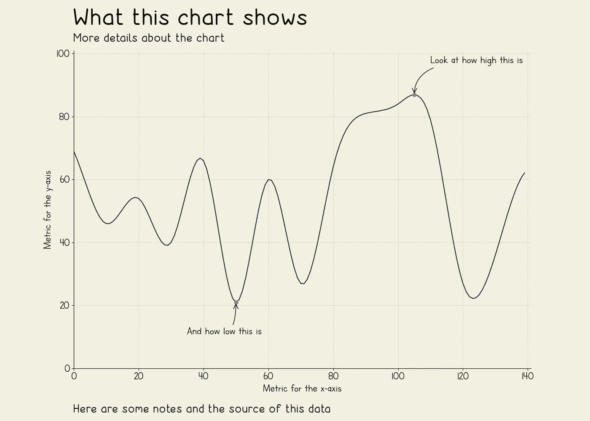

随机折线图—图片由作者提供

数据可视化完全是为了降低复杂性；我们使用图形表示来使困难的概念和见解更容易理解。

标题、副标题、注释、注解和标签在这个过程中起着重要的作用。他们引导我们的观众通过我们试图讲述的故事，就像一个叙述者。

在本文中，我们将探索标题、副标题和标签的功能，了解如何向图表添加注释，以及如何在 Matplotlib 中使用自定义字体。

## 标题、副标题、题注和标签

让我们从一个简单的折线图开始。

```
import matplotlib.pyplot as plt# data
spam = [263.12, 302.99, 291.23, 320.68, 312.17, 316.39, 
        347.73, 344.66, 291.67, 242.42, 210.54, 140.56]date = ['Jan', 'Feb', 'Mar', 'Apr', 'May', 'Jun', 
        'Jul', 'Aug', 'Sep', 'Oct', 'Nov', 'Dec']fig, ax = plt.subplots(1, figsize=(11,6))plt.plot(date, spam, color='#C62C1D', lw=2.5)
plt.ylim(0,400)# remove spines
ax.spines['right'].set_visible(False)
ax.spines['top'].set_visible(False)# grid
ax.set_axisbelow(True)
ax.yaxis.grid(color='gray', linestyle='dashed', alpha=0.3)
ax.xaxis.grid(color='gray', linestyle='dashed', alpha=0.3)
```

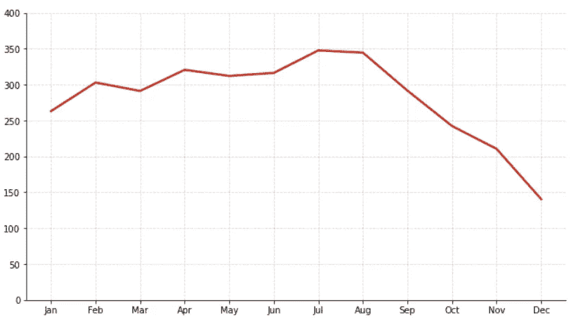

折线图—作者提供的图片

如果没有文字，这个图表是没有用的。不难理解一个标题或一些文本对解释可视化的重要性。难的是怎么做才合适。

没有任何规则规定什么应该写在哪里。你可以找到一些松散的指导方针，其中大部分都有特定的目的。

例如，在写标题时，有些人会建议它应该包含关于数据和可视化的整体信息，没有洞察力或太多的细节。其他人会有不同的方法，他们会在标题上准确地告诉你你会从图表中得到什么。

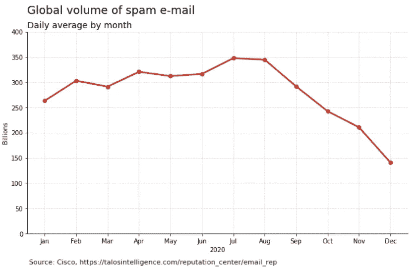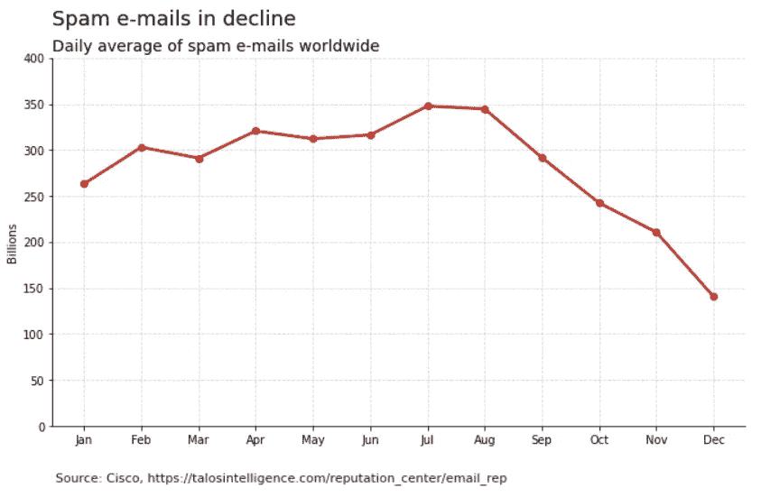

标题内容—作者图片

一些标题示例:

*   洞察如题:[商业内幕](https://static.businessinsider.com/image/5b85bdda0ce5f51d008b5b4b-1200.jpg)、 [MSNBC](https://www.nbcnews.com/business/economy/unemployment-claims-state-see-how-covid-19-has-destroyed-job-n1183686)
*   关键词/题目如题:[性质](https://www.nature.com/articles/d41586-019-03305-w)
*   解说如题:[经济学家](https://www.economist.com/graphic-detail/2021/01/15/ireland-has-one-of-the-worlds-highest-covid-19-infection-rates)，[经济学家](https://www.economist.com/graphic-detail/2021/01/12/how-donald-trump-evolved-into-a-prolific-angry-twitter-user)
*   描述性标题: [MSNBC](https://www.nbcnews.com/business/travel/december-air-travel-delays-n1105071) ， [CNN](https://www.cnn.com/2021/01/19/health/us-coronavirus-tuesday/index.html)

不管为什么或如何。用来告知我们的观众图表内容的元素几乎是相同的。

我们需要一个**标题**，它是字体最大的文本，通常放在图表的顶部。

字幕不是必需的，但非常有用。它们用较小的字体放在标题下面，非常通用。他们可以描述图表，突出显示一些信息，或添加细节，如地点、方式或时间。

**标题**可以显示关于我们的数据源、注释或任何其他相关信息的信息。

**轴标签**在我们的轴上的信息不明确时是必需的。日期、年份或类别通常相对容易理解，可能不需要标签。

```
fig, ax = plt.subplots(1, figsize=(11,6))plt.plot(date, spam, color='#C62C1D', lw=2.5, marker='o')
plt.ylim(0,400)# remove spines
ax.spines['right'].set_visible(False)
ax.spines['top'].set_visible(False)# grid
ax.set_axisbelow(True)
ax.yaxis.grid(color='gray', linestyle='dashed', alpha=0.3)
ax.xaxis.grid(color='gray', linestyle='dashed', alpha=0.3)# TITLE
plt.suptitle('Global volume of spam e-mail', x=0.125, y=0.98, ha='left', fontsize=18)
# SUBTITLE
plt.title('Daily average by month', loc='left', fontsize=14)
# AXIS LABELS
plt.ylabel('Billions')
plt.xlabel('2020')
# CAPTION
plt.text(-0.5, -60, 'Source: Cisco, [https://talosintelligence.com/reputation_center/email_rep'](https://talosintelligence.com/reputation_center/email_rep'), ha='left', fontsize = 11, alpha=0.9)plt.show()
```

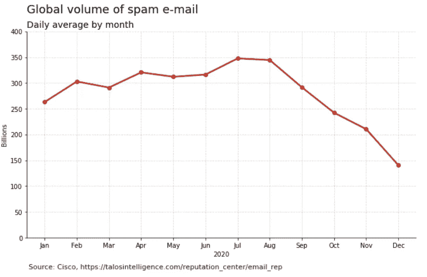

带文本的图表—作者提供的图像

Matplotlib 没有针对每个文本元素的方法，但这并不是我们不能处理的。

如果只需要标题，可以使用`.title()`功能。这将使用更大的字体将文本放置在图表的顶部，然后您可以使用参数来更改其位置、大小、颜色等。

当我们需要一个副标题时，事情就变得更复杂了。我的首选方法是使用`.suptitle()`作为标题，`.title()`作为副标题，`.text()`作为标题。

Suptitle 是人物的标题——每个人物只能有一个标题，所以这种方法不适用于支线剧情。

默认情况下，suptitle 绘制在顶部中心，与标题不同，没有简单的方法将其放置在图表的左侧或右侧。

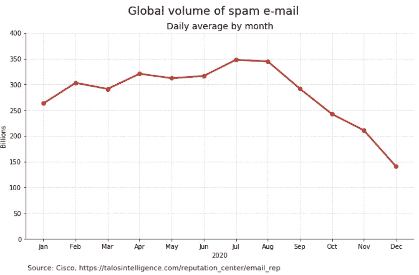

居中标题—作者的图像

我喜欢使用`.suptitle()`,因为代码感觉更有条理。

但是如果你不想让你的头衔在中间，用`.suptitle()`或者`.text()`也没什么区别。你必须手动调整位置，并用这两个选项计算出 X 和 Y 坐标。

## 释文

我们已经介绍了图表的一些主要文本组件，应该能够恰当地描述其中的内容。

现在我们来看一个用文本突出显示可视化部分的优秀解决方案。

注释相当直观。我们指着图表的一部分，对我们的观众说些什么。它可能是与分析相关的细节、重要的见解，甚至是对图表中缺失数据的提醒。

让我们试着给条形图添加一些注释。

```
# data
x = ['R0', 'R1', 'R2', 'R3', 'R4', 'R5', 'R6']
y = [4, 15, 474, 13, 70, 96, 11]# figure and axis
fig, ax = plt.subplots(1, figsize=(16,8), facecolor='#CECECE')
ax.set_facecolor('#CECECE')# bars
plt.bar(x, y, zorder=1, color='#1D4DC6')**# arrow and box for annotations
arrowprops = dict(arrowstyle="wedge,tail_width=0.5", alpha=0.7, color='w')
bbox=dict(boxstyle="round", alpha=0.7, color='w')****# annotations
plt.annotate('R2-D2\nSeries', 
             xy=(2, 250), size=13, color = 'w',
             ha='center', va="center")****plt.annotate('Faster\nProcessing', 
             xy=(3, 13),
             xytext=(1, 50), 
             textcoords='offset points',
             size=13, 
             ha='center', va="center",
             bbox=bbox,
             arrowprops=arrowprops)****plt.annotate('Cheaper', 
             xy=(5, 96),
             xytext=(1, 50), 
             textcoords='offset points',
             size=13, 
             ha='center', va="center",
             bbox=bbox,
             arrowprops=arrowprops)**# remove spines
ax.spines['right'].set_visible(False)
ax.spines['top'].set_visible(False)# grid
ax.set_axisbelow(True)
ax.yaxis.grid(color='white', linestyle='dashed', alpha=0.8)# title, labels, and caption
plt.title('Astromech droids popularity', pad=30, loc='left', fontsize = 24, color='#4B4B4B')
plt.ylabel('Appearances')
plt.xlabel('Series')src = 'Source: [https://starwars.fandom.com/wiki/R-series'](https://starwars.fandom.com/wiki/R-series')
plt.text(-0.75, -40, src, ha='left', fontsize = 10, alpha=0.9)plt.ylim(0,500)
plt.show()
```

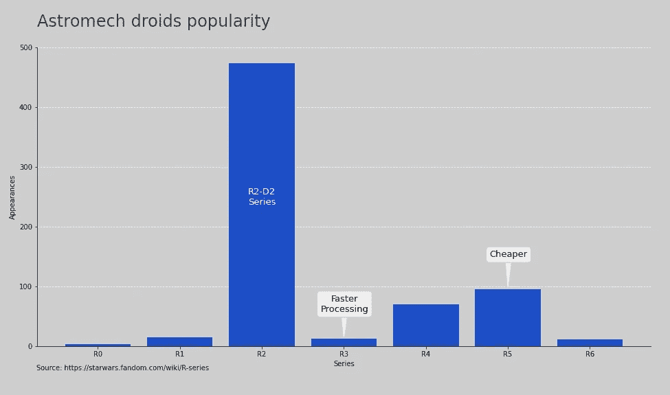

带注释的条形图—作者提供的图片

它们也可以与其他元素相结合，以产生更大的影响。

例如，颜色通常伴随着图例。但是如果我们用颜色挑出一个条或者一条线，用注解来描述而不是图例，影响就大得多了。

```
def get_y(seed):
    np.random.seed(seed)
    y = [np.random.randint(15, 85) for i in range(20)]
    inter = interpolate.interp1d(np.arange(0,20), y, kind = 'cubic')
    return inter(np.arange(1, 15, 0.1))y = get_y(23)
ys = [get_y(3), get_y(5), get_y(8), get_y(13)]# figure and axis
fig, ax = plt.subplots(1, figsize=(14,10), facecolor='#F3F0E0')
ax.set_facecolor('#F3F0E0')**# annotation arrow
arrowprops = dict(arrowstyle="->", connectionstyle="angle3,angleA=0,angleB=-90")
max_idx = np.argmax(y, axis=0)
plt.annotate('This line is special', 
             xy=(max_idx, max(y)), 
             xytext=(max_idx+5, max(y)+10), 
             arrowprops=arrowprops,
             size = 12)****# annotation text
line_y = np.quantile(y, 0.75)
plt.plot([line_y]*len(y), linestyle='--', 
         color='#FB5A14', alpha=0.8)****plt.annotate('This value is important', xy=(2, line_y), 
             size=12, ha='left', va="bottom")
# plots
for i in ys:
    plt.plot(i, color='#888888', alpha=0.3)****plt.plot(y, color='#16264c')**# limits
plt.xlim(0,141)
plt.ylim(0,101)# remove spines
ax.spines['right'].set_visible(False)
ax.spines['top'].set_visible(False)plt.title('Meaningful title', pad=15, loc='left', 
          fontsize = 26, alpha=0.9)# ticks
plt.xticks(fontsize = 14)
plt.yticks(fontsize = 14)plt.savefig('mychart.png', facecolor='#F3F0E0', dpi=100)
```

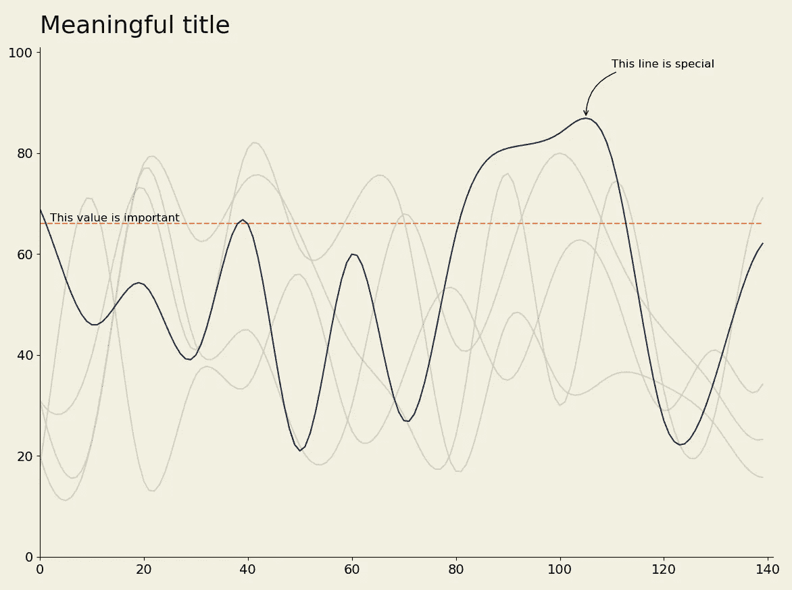

带注释的折线图—图片由作者提供

太好了。我们将观众的注意力引向一条特定的线，并且仍然有其他线作为比较。我们也可以在那里找到信息，而不必四处寻找传说。

## 字体

它可能看起来不重要，而且 Matplotlib 的默认字体无论如何都没有错，那么为什么需要更改它呢？

嗯，一个原因可能是为了符合你报告的其他内容。为出版物预定义字体系列、字号和颜色是很常见的。

这种一致性可以使你的报告更专业，甚至更容易阅读。

```
# data
spam = [263.12, 302.99, 291.23, 320.68, 312.17, 316.39, 347.73, 344.66, 291.67, 242.42, 210.54, 140.56]
date = ['Jan', 'Feb', 'Mar', 'Apr', 'May', 'Jun', 'Jul', 'Aug', 'Sep', 'Oct', 'Nov', 'Dec']**# font from OS
hfont = {'fontname':'Arial'}**#plot
fig, ax = plt.subplots(1, figsize=(11,6))
plt.plot(date, spam, color='#C62C1D', lw=2.5, marker='o')
plt.ylim(0,400)# remove spines
ax.spines['right'].set_visible(False)
ax.spines['top'].set_visible(False)# grid
ax.set_axisbelow(True)
ax.yaxis.grid(color='gray', linestyle='dashed', alpha=0.3)
ax.xaxis.grid(color='gray', linestyle='dashed', alpha=0.3)# Title, subtitle, axis labels, and caption
plt.suptitle('Spam e-mails in decline', x=0.125, y=0.98, 
             ha='left', fontsize=18, ****hfont**)
plt.title("Daily average of spam e-mails worldwide", 
          loc='left', fontsize=14, ****hfont**)
plt.ylabel('Billions', ****hfont**)src = 'Source: Cisco, [https://talosintelligence.com/reputation_center/email_rep'](https://talosintelligence.com/reputation_center/email_rep')
plt.text(-0.5, -60, src, ha='left', fontsize = 11, 
         alpha=0.9, ****hfont**)# ticks
plt.xticks(****hfont**)
plt.yticks(****hfont**)plt.show()
```

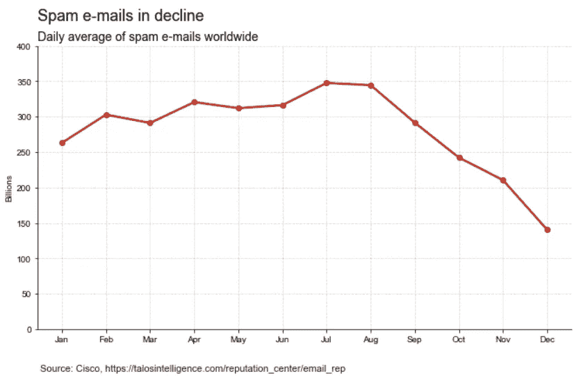

Arial 字体—作者图片

使用不同字体的另一个原因是为了传达一个主题或一种特定的风格。例如，一些品牌有与之相关的独特字体，如果这是我们 viz 的主题，这些字体可以增加我们的视觉美感。

```
**# font
font_path = "fonts/Mandalore.ttf"
prop = fm.FontProperties(fname=font_path)**# data
x = ['R0', 'R1', 'R2', 'R3', 'R4', 'R5', 'R6']
y = [4, 15, 474, 13, 70, 96, 11]# figure and axis
fig, ax = plt.subplots(1, figsize=(16,8), facecolor='#CECECE')
ax.set_facecolor('#CECECE')# bars
plt.bar(x, y, zorder=1, color='#1D4DC6')# arrow and box for annotations
arrowprops = dict(arrowstyle="wedge,tail_width=0.5", alpha=0.7, color='w')
bbox=dict(boxstyle="round", alpha=0.7, color='w')# annotations
plt.annotate('R2-D2\nSeries', 
             xy=(2, 250), size=18, color = 'w',
             ha='center', va="center",
             **fontproperties=prop**)plt.annotate('Faster\nProcessing', 
             xy=(3, 13),
             xytext=(1, 50), 
             textcoords='offset points',
             size=18, 
             ha='center', va="center",
             bbox=bbox,
             arrowprops=arrowprops,
             **fontproperties=prop**)plt.annotate('Cheaper', 
             xy=(5, 96),
             xytext=(1, 50), 
             textcoords='offset points',
             size=18, 
             ha='center', va="center",
             bbox=bbox,
             arrowprops=arrowprops,
             **fontproperties=prop**)# remove spines
ax.spines['right'].set_visible(False)
ax.spines['top'].set_visible(False)# grid
ax.set_axisbelow(True)
ax.yaxis.grid(color='white', linestyle='dashed', alpha=0.8)# title, labels, and caption
plt.title('Astromech droids popularity', **fontproperties=prop**,
          pad=30, loc='left', fontsize = 28, color='#4B4B4B')
plt.ylabel('Appearances')
plt.xlabel('Series')
src = 'Source: [https://starwars.fandom.com/wiki/R-series'](https://starwars.fandom.com/wiki/R-series')
plt.text(-0.75, -40, src, ha='left', fontsize = 10, alpha=0.9)plt.ylim(0,500)
plt.savefig('astromech.png', facecolor='#CECECE')
```

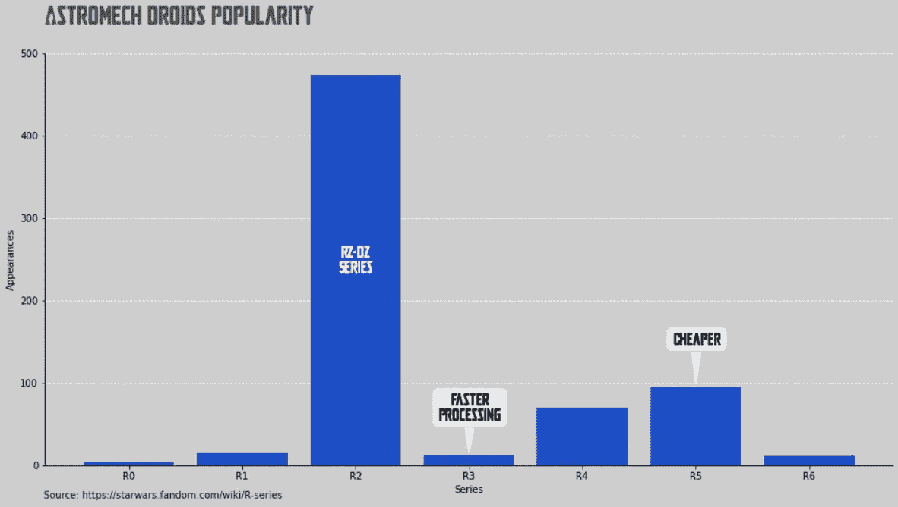

曼达洛字体——作者图片

有很多关于字体设计的研究，让我们的视觉更具可读性总是好的。

谷歌有一个关于这个主题的非常有信息的页面，还有一篇蒂芙尼法国的很棒的[文章，关于如何为你的数据可视化选择字体。](https://medium.com/nightingale/choosing-a-font-for-your-data-visualization-2ed37afea637)

可读性是改变字体的一个很好的理由。

```
# font
font_path = "fonts/NotoSans-Regular.ttf"
prop = fm.FontProperties(fname=font_path)def get_y(seed):
    np.random.seed(seed)
    y = [np.random.randint(15, 85) for i in range(20)]
    inter = interpolate.interp1d(np.arange(0,20), y, kind = 'cubic')
    return inter(np.arange(1, 15, 0.1))y = get_y(23)
ys = [get_y(3), get_y(5), get_y(8), get_y(13)]# figure and axis
fig, ax = plt.subplots(1, figsize=(14,10), facecolor='#F3F0E0')
ax.set_facecolor('#F3F0E0')# annotation arrow
arrowprops = dict(arrowstyle="->", connectionstyle="angle3,angleA=0,angleB=-90")
max_idx = np.argmax(y, axis=0)
plt.annotate('This line is special', 
             xy=(max_idx, max(y)), 
             xytext=(max_idx+5, max(y)+10), 
             arrowprops=arrowprops,
             fontproperties=prop,
             size = 12)# plots
for i in ys:
    plt.plot(i, color='#888888', alpha=0.3)plt.plot(y, color='#16264c')# limits
plt.xlim(0,141)
plt.ylim(0,101)# remove spines
ax.spines['right'].set_visible(False)
ax.spines['top'].set_visible(False)# title and axis labels
plt.title('Noto Sans', fontproperties=prop,
          pad=15, loc='left', fontsize = 26, alpha=0.9)
plt.xlabel('Gazillions', fontproperties=prop)
plt.ylabel('Zillions', fontproperties=prop)# ticks
plt.xticks(fontsize = 14)
plt.yticks(fontsize = 14)plt.savefig('mychart.png', facecolor='#F3F0E0', dpi=100)
```

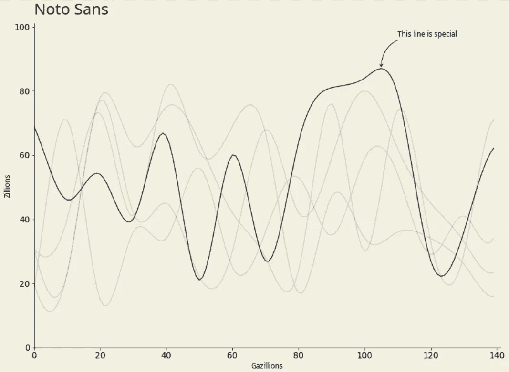

Noto Sans 字体—作者图片

太好了！我们研究了文本在数据可视化中的大多数应用，描述了 viz，添加了细节，突出了重要的部分，使其更具可读性或影响力。

感谢阅读，我希望你喜欢我的文章。

【fonts.google.com】字体来自:
；
[dafont.com](https://www.dafont.com/)；